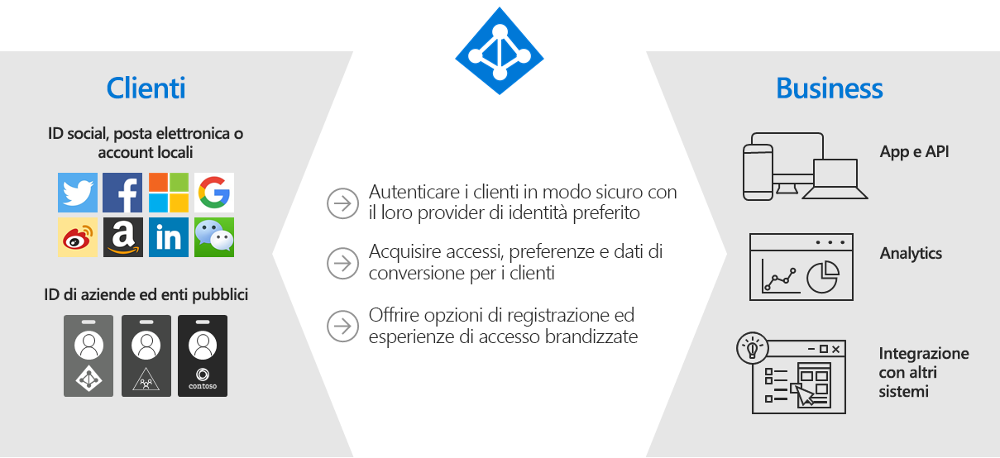
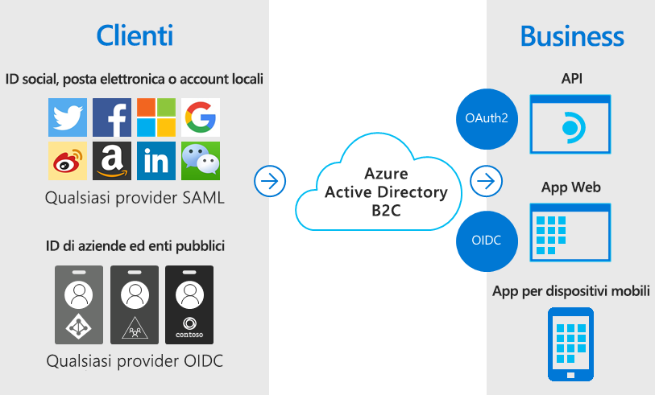
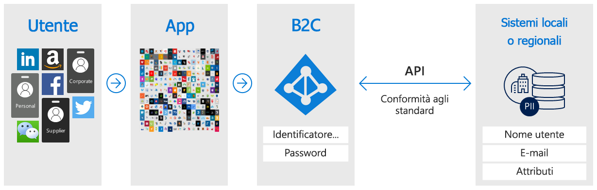
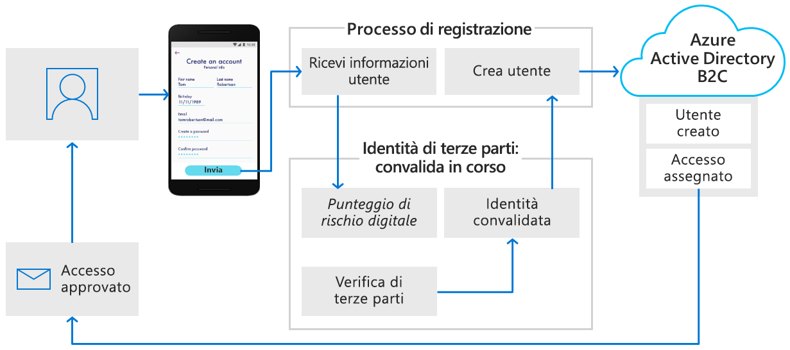
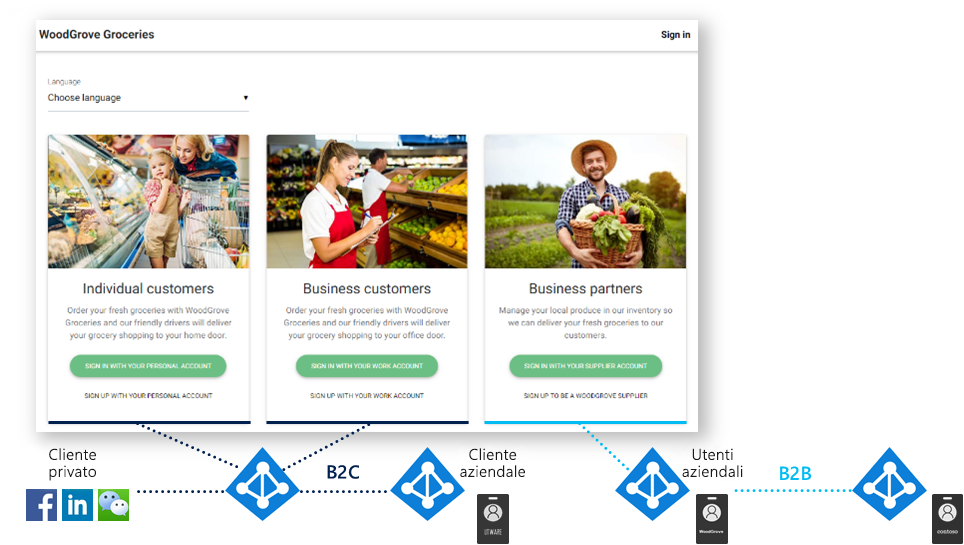

# Informazioni su Azure Active Directory B2C

Azure Active Directory B2C fornisce identità Business-to-Customer (B2C) come servizio. I clienti usano le identità di account di social network, aziendali o locali che preferiscono per ottenere l'accesso Single Sign-On alle applicazioni e alle API.

Azure Active Directory B2C (Azure AD B2C) è una soluzione di gestione delle identità e degli accessi degli utenti in grado di supportare milioni di utenti e miliardi di autenticazioni al giorno. Si occupa degli aspetti di scalabilità e sicurezza della piattaforma di autenticazione, monitorando e gestendo automaticamente le minacce, ad esempio gli attacchi di tipo Denial of Service, password spraying o di forza bruta.

## Soluzione di gestione delle identità personalizzata

Azure AD B2C è una soluzione di autenticazione white-label. È possibile personalizzare l'intera esperienza utente con il proprio marchio, in modo che sia completamente uniforme con le applicazioni Web e per dispositivi mobili.

È possibile personalizzare ogni pagina visualizzata da Azure AD B2C quando gli utenti si iscrivono, effettuano l'accesso e modificano le informazioni sul profilo, oltre a personalizzare il codice HTML, CSS e JavaScript nei percorsi utente, in modo che l'esperienza di Azure AD B2C appaia come una parte nativa dell'applicazione.

## Accesso Single Sign-On con un'identità fornita dall'utente

Azure AD B2C usa protocolli di autenticazione standard, tra cui OpenID Connect, OAuth 2.0 e SAML. Si integra con la maggior parte delle applicazioni moderne e del software COTS.

Fungendo da autorità di autenticazione centrale per le applicazioni Web, le app per dispositivi mobili e le API, Azure AD B2C consente di creare una soluzione di Single Sign-On (SSO) per tutte, centralizzando la raccolta di informazioni sul profilo utente e sulle preferenze e acquisendo analisi dettagliate sul comportamento di accesso e la conversione dell'iscrizione.

## Integrazione con archivi utente esterni

Azure AD B2C fornisce una directory che può contenere 100 attributi personalizzati per utente. Tuttavia, è anche possibile integrarla con sistemi esterni. Ad esempio, si può usare Azure AD B2C per l'autenticazione, ma delegare a un database CRM (Customer Relationship Management) o di gestione della fedeltà dei clienti esterno come origine attendibile dei dati dei clienti.

Un altro scenario di archivio utenti esterno consiste nell'affidare ad Azure AD B2C la gestione dell'autenticazione per l'applicazione, integrandolo però con un sistema esterno che archivia il profilo utente o i dati personali. Lo scopo può essere ad esempio quello di soddisfare i requisiti di residenza dei dati come i criteri di archiviazione di dati locali o di singole aree geografiche.

Azure AD B2C può semplificare la raccolta delle informazioni dell'utente durante la registrazione o la modifica del profilo e il successivo trasferimento dei dati al sistema esterno. Quindi, durante le autenticazioni future, Azure AD B2C può recuperare i dati dal sistema esterno e, se necessario, includerli come parte della risposta del token di autenticazione inviato all'applicazione.

## Profilatura progressiva

Un'altra opzione per il percorso utente include la profilatura progressiva. Questa opzione consente ai clienti di completare rapidamente la prima transazione raccogliendo una quantità minima di informazioni, per poi raccogliere gradualmente altri dati del profilo dal cliente durante gli accessi futuri.

## Verifica e correzione di identità di terze parti

Usare Azure AD B2C per facilitare la verifica e la correzione delle identità raccogliendo i dati degli utenti, quindi passandoli a un sistema di terze parti per eseguire la convalida, il punteggio di attendibilità e l'approvazione per la creazione di account utente.

Queste sono solo alcune delle operazioni che è possibile eseguire con Azure AD B2C come piattaforma di gestione delle identità Business-to-Customer. Le sezioni seguenti di questa panoramica illustrano in dettaglio un'applicazione demo che usa Azure AD B2C. È anche possibile passare direttamente a una [panoramica tecnica di Azure AD B2C](technical-overview.md) più approfondita.

## Esempio: WoodGrove Groceries

[WoodGrove Groceries][woodgrove] è un'applicazione Web live creata da Microsoft per illustrare diverse funzionalità di Azure AD B2C. Le sezioni seguenti descrivono alcune delle opzioni di autenticazione fornite da Azure AD B2C al sito Web WoodGrove.

### Panoramica dell'azienda

WoodGrove è un negozio di alimentari online che vende sia a clienti privati che ad aziende. I clienti aziendali acquistano generi alimentari per conto della propria società o delle aziende che gestiscono.

### Opzioni di accesso

WoodGrove Groceries offre diverse opzioni di accesso in base al rapporto che i clienti hanno con il negozio:

* I clienti **privati** possono iscriversi o accedere con account personali, ad esempio con un provider di identità di social network o un indirizzo di posta elettronica e una password.
* I clienti **aziendali** possono iscriversi o accedere con le proprie credenziali aziendali.
* I **partner** e i fornitori sono singole persone che forniscono al negozio di alimentari i prodotti da vendere. L'identità del partner viene fornita da [Azure Active Directory B2B](../active-directory/b2b/what-is-b2b.md).

### Autenticare i clienti privati

Quando un cliente seleziona **Sign in with your personal account** (Accedi con l'account personale), viene reindirizzato a una pagina di accesso personalizzata ospitata da Azure AD B2C. Nell'immagine seguente è possibile vedere che l'interfaccia utente è stata personalizzata in modo da ottenere un aspetto analogo al sito Web di WoodGrove Groceries. Ai clienti di WoodGrove non dovrebbe essere trasparente che l'esperienza di autenticazione è ospitata e protetta da Azure AD B2C.

WoodGrove consente ai clienti di iscriversi e accedere usando i propri account Google, Facebook o Microsoft come provider di identità. I clienti possono anche iscriversi usando il proprio indirizzo di posta elettronica e una password per creare un *account locale*.

Quando un cliente seleziona **Sign in with your personal account** (Accedi con l'account personale) e quindi **Sign up now** (Iscriviti ora), viene visualizzata una pagina di iscrizione personalizzata.

Dopo che il cliente ha immesso un indirizzo di posta elettronica e ha selezionato **Send verification code** (Invia codice di verifica), Azure AD B2C gli invia il codice. Dopo aver immesso il codice, occorre selezionare **Verify code** (Verifica codice), quindi immettere le altre informazioni nel modulo, oltre ad accettare le condizioni per l'utilizzo.

Facendo clic sul pulsante **Create** (Crea), Azure AD B2C reindirizza l'utente al sito Web di WoodGrove Groceries. Al momento del reindirizzamento, Azure AD B2C passa un token di autenticazione OpenID Connect all'applicazione Web WoodGrove. L'utente è ora connesso e pronto per usare l'applicazione, con il nome visualizzato nell'angolo in alto a destra per indicare che ha eseguito l'accesso.

### Autenticare i clienti aziendali

Quando un cliente seleziona una delle opzioni in **Business Customers** (Clienti aziendali), il sito Web di WoodGrove Groceries richiama un criterio di Azure AD B2C diverso rispetto a quello per i clienti privati.

Questo criterio offre all'utente la possibilità di usare le proprie credenziali aziendali per l'iscrizione e l'accesso. Nell'esempio dell'app WoodGrove viene chiesto agli utenti di accedere con un account Office 365 o Azure AD. Questo criterio usa un'[applicazione di Azure AD multi-tenant](../active-directory/develop/howto-convert-app-to-be-multi-tenant.md) e l'endpoint di Azure AD `/common` per federare Azure AD B2C con qualsiasi cliente di Office 365 nel mondo.

### Autenticare i partner

Il collegamento **Sign in with your supplier account** (Accedi con l'account fornitore) usa la funzionalità di collaborazione di Azure Active Directory B2B. Azure AD B2B è un set di funzionalità di Azure Active Directory per la gestione delle identità dei partner. Queste identità possono essere federate da Azure Active Directory per l'accesso alle applicazioni protette da Azure AD B2C.

Per altre informazioni su Azure AD B2B, vedere [Che cos'è l'accesso utente guest in Azure Active Directory B2B?](../active-directory/b2b/what-is-b2b.md).

<!-- UNCOMMENT WHEN REPO IS UPDATED WITH LATEST DEMO CODE
### Sample code

If you'd like to jump right into the code to see how the WoodGrove Groceries application is built, you can find the repository on GitHub:

[Azure-Samples/active-directory-external-identities-woodgrove-demo][woodgrove-repo] (GitHub)
-->

## Passaggi successivi

Dopo aver acquisito una panoramica di Azure AD B2C e di alcuni degli scenari in cui può essere utile, è il momento di approfondirne le funzionalità e gli aspetti tecnici.

> [!div class="nextstepaction"]
> [Panoramica tecnica di Azure AD B2C >](technical-overview.md)

<!-- LINKS - External -->
[woodgrove]: https://aka.ms/ciamdemo
[woodgrove-repo]: https://github.com/Azure-Samples/active-directory-external-identities-woodgrove-demo
