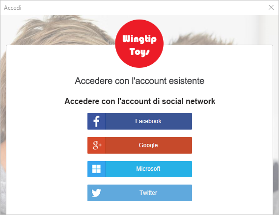
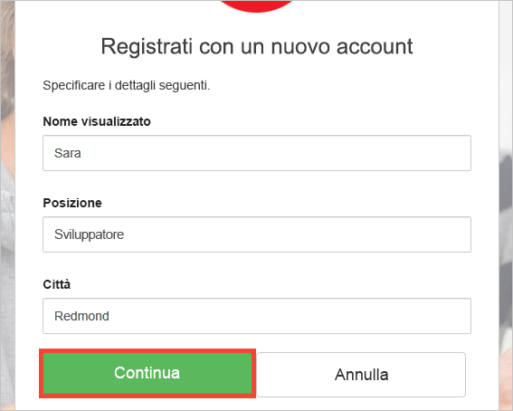
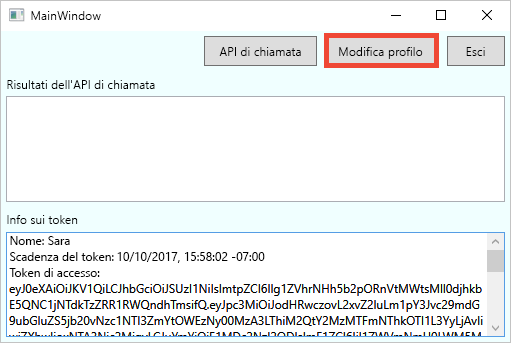
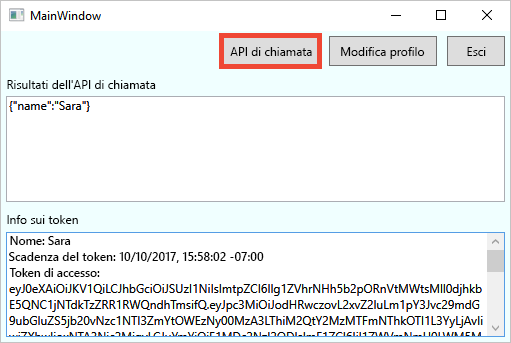

# Eseguire il test drive di un'applicazione desktop configurata con Azure AD B2C

Azure Active Directory B2C consente la gestione delle identità del cloud per garantire la protezione costante dell'applicazione, delle attività aziendali e dei clienti.  Questa guida introduttiva usa un'app desktop di Windows Presentation Foundation (WPF) di esempio per illustrare:

* L'uso del criterio **Iscrizione o accesso** per creare o accedere con un provider di identità basato su social network o un account locale tramite un indirizzo di posta elettronica. 
* La **chiamata a un'API** per recuperare il nome visualizzato da una risorsa protetta di Azure AD B2C.

## prerequisiti

* Installare [Visual Studio 2017](https://www.visualstudio.com/downloads/) con i carichi di lavoro seguenti:
    - **Sviluppo di applicazioni desktop .NET**

* Un account di social networking di Facebook, Google, Microsoft o Twitter. Se non si ha un account di social networking, è necessario un indirizzo di posta elettronica valido.

[!INCLUDE [quickstarts-free-trial-note](../../includes/quickstarts-free-trial-note.md)]

## Scaricare l'esempio

[Scaricare o clonare l'applicazione di esempio](https://github.com/Azure-Samples/active-directory-b2c-dotnet-desktop) da GitHub.

## Eseguire l'app in Visual Studio

Nella cartella del progetto dell'applicazione di esempio aprire la soluzione `active-directory-b2c-wpf.sln` in Visual Studio. 

Selezionare **Debug > Avvia debug** per compilare ed eseguire l'applicazione. 

## Creare un account

Fare clic su **Accedi** per avviare il flusso di lavoro **Iscrizione o accesso**. Quando si crea un account, è possibile usare un account esistente di un provider di identità basato su social network o un account di posta elettronica.

### Iscriversi usando un provider di identità basato su social network

Per iscriversi usando un provider di identità basato su social network, fare clic sul pulsante del provider di identità che si vuole usare. Se si preferisce usare un indirizzo di posta elettronica, passare alla sezione [Iscriversi usando un indirizzo di posta elettronica](#sign-up-using-an-email-address).

Per leggere le informazioni dell'account di social networking, è necessario eseguire l'autenticazione (accesso) tramite le credenziali di tale account e autorizzare l'applicazione. Dopo la concessione dell'accesso, l'applicazione può recuperare le informazioni sul profilo dall'account, ad esempio il nome e la città dell'utente. 

I dettagli del nuovo profilo dell'account sono già popolati con informazioni derivate dall'account di social networking. Modificare i dettagli, se si vuole, e fare clic su **Continua**.

È stato creato un nuovo account utente di Azure AD B2C che usa un provider di identità. Dopo l'accesso, il token di accesso viene visualizzato nella casella di testo *Token info* (Informazioni token). Il token di accesso viene usato quando si accede alla risorsa API.

Passaggio successivo: sezione [Modificare il profilo](#edit-your-profile).

### Iscriversi usando un indirizzo di posta elettronica

Se si sceglie di non usare un account di social networking per l'autenticazione, è possibile creare un account utente di Azure AD B2C usando un indirizzo di posta elettronica valido. Un account utente locale di Azure AD B2C usa Azure Active Directory come provider di identità. Per usare l'indirizzo di posta elettronica, fare clic sul collegamento **Non si ha un account? Iscriversi adesso**.

Immettere un indirizzo di posta elettronica valido e fare clic su **Invia codice di verifica**. Per ricevere il codice di verifica da Azure AD B2C, è necessario un indirizzo di posta elettronica valido.

Immettere il codice di verifica ricevuto nel messaggio di posta elettronica e fare clic su **Verifica codice**.

Aggiungere le informazioni sul profilo e fare clic su **Crea**.

È stato creato un nuovo account utente locale di Azure AD B2C. Dopo l'accesso, il token di accesso viene visualizzato nella casella di testo *Token info* (Informazioni token). Il token di accesso viene usato quando si accede alla risorsa API.

## Modificare il profilo

Azure Active Directory B2C offre funzionalità che consentono agli utenti di aggiornare il profilo. Fare clic su **Modifica profilo** per modificare il profilo creato.

Scegliere il provider di identità associato all'account creato. Se ad esempio per la creazione dell'account si è usato Twitter come provider di identità, scegliere Twitter per modificare i dettagli del profilo associato.

Modificare il **Nome visualizzato** o la **Città**. 

Nella casella di testo *Token info* (Informazioni token) viene visualizzato un nuovo token di accesso. Se si vogliono verificare le modifiche al profilo, copiare e incollare il token di accesso nel decodificatore di token https://jwt.ms.

## Accedere a una risorsa

Fare clic su **Call API** (Chiama API) per inviare una richiesta alla risorsa protetta di Azure AD B2C https://fabrikamb2chello.azurewebsites.net/hello. 

L'applicazione include il token di accesso visualizzato nella casella di testo *Token info* (Informazioni token) nella richiesta. L'API restituisce il nome visualizzato contenuto nel token di accesso.

## Passaggi successivi

Il passaggio successivo consiste nel creare un tenant di Azure AD B2C e nel configurare l'esempio per l'esecuzione con il tenant. 

> [!div class="nextstepaction"]
> [Creare un tenant di Azure Active Directory B2C nel portale di Azure](active-directory-b2c-get-started.md)
