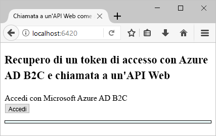
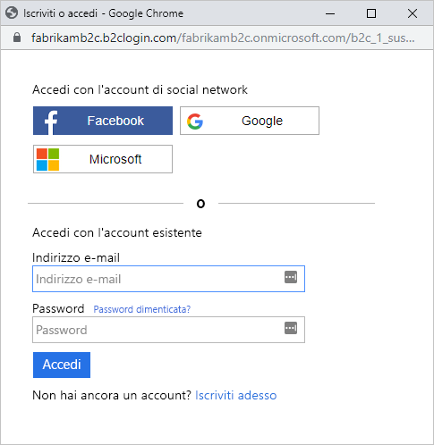
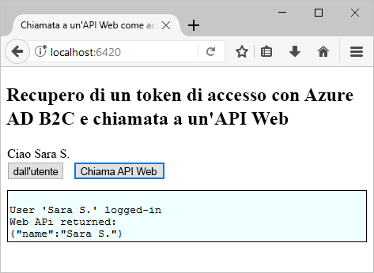

# <a name="test-drive-a-single-page-application-configured-with-azure-ad-b2c"></a>Eseguire il test drive di un'applicazione a singola pagina configurata con Azure AD B2C

## <a name="about-this-sample"></a>Informazioni sull'esempio

Azure Active Directory B2C consente la gestione delle identità del cloud per garantire la protezione costante dell'applicazione, delle attività aziendali e dei clienti.  Questa guida introduttiva usa un'applicazione a singola pagina di esempio per illustrare:

* L'uso del criterio **Iscrizione o accesso** per creare o accedere con un provider di identità basato su social network o un account locale tramite un indirizzo di posta elettronica. 
* La **chiamata a un'API** per recuperare il nome visualizzato da una risorsa protetta di Azure AD B2C.

## <a name="prerequisites"></a>prerequisiti

* Installare [Visual Studio 2017](https://www.visualstudio.com/downloads/) con i carichi di lavoro seguenti:
    - **Sviluppo Web e ASP.NET**

* Installare [Node.js](https://nodejs.org/en/download/)

* Un account di social networking di Facebook, Google, Microsoft o Twitter. Se non si ha un account di social networking, è necessario un indirizzo di posta elettronica valido.

[!INCLUDE [quickstarts-free-trial-note](../../includes/quickstarts-free-trial-note.md)]

## <a name="download-the-sample"></a>Scaricare l'esempio

[Scaricare o clonare l'applicazione di esempio](https://github.com/Azure-Samples/active-directory-b2c-javascript-msal-singlepageapp) da GitHub.

## <a name="run-the-sample-application"></a>Eseguire l'applicazione di esempio

Per eseguire l'esempio dal prompt dei comandi di Node.js: 

```
cd active-directory-b2c-javascript-msal-singlepageapp
npm install && npm update
node server.js
```

La finestra della console mostra il numero di porta per l'applicazione Web in esecuzione nel computer.

```
Listening on port 6420...
```

Aprire `http://localhost:6420` in un Web browser per accedere all'applicazione Web.




## <a name="create-an-account"></a>Creare un account

Fare clic su **Accedi** per avviare il flusso di lavoro **Iscrizione o accesso** di Azure AD B2C. Quando si crea un account, è possibile usare un account esistente di un provider di identità basato su social network o un account di posta elettronica.

### <a name="sign-up-using-a-social-identity-provider"></a>Iscriversi usando un provider di identità basato su social network

Per iscriversi usando un provider di identità basato su social network, fare clic sul pulsante del provider di identità che si vuole usare. Se si preferisce usare un indirizzo di posta elettronica, passare alla sezione [Iscriversi usando un indirizzo di posta elettronica](#sign-up-using-an-email-address).



Per leggere le informazioni dell'account di social networking, è necessario eseguire l'autenticazione (accesso) tramite le credenziali di tale account e autorizzare l'applicazione. Dopo la concessione dell'accesso, l'applicazione può recuperare le informazioni sul profilo dall'account, ad esempio il nome e la città dell'utente. 


I dettagli del nuovo profilo dell'account sono già popolati con informazioni derivate dall'account di social networking. 


Aggiornare i campi Nome visualizzato, Posizione e Città e fare clic su **Continua**.  I valori immessi vengono usati per il profilo dell'account utente di Azure AD B2C.

È stato creato un nuovo account utente di Azure AD B2C che usa un provider di identità. 

Passaggio successivo: sezione [Chiamare una risorsa](#call-a-resource).

### <a name="sign-up-using-an-email-address"></a>Iscriversi usando un indirizzo di posta elettronica

Se si sceglie di non usare un account di social networking per l'autenticazione, è possibile creare un account utente di Azure AD B2C usando un indirizzo di posta elettronica valido. Un account utente locale di Azure AD B2C usa Azure Active Directory come provider di identità. Per usare l'indirizzo di posta elettronica, fare clic sul collegamento **Non si ha un account? Iscriversi adesso**.


Immettere un indirizzo di posta elettronica valido e fare clic su **Invia codice di verifica**. Per ricevere il codice di verifica da Azure AD B2C, è necessario un indirizzo di posta elettronica valido. 

Immettere il codice di verifica ricevuto nel messaggio di posta elettronica e fare clic su **Verifica codice**.

Aggiungere le informazioni sul profilo e fare clic su **Crea**.


È stato creato un nuovo account utente locale di Azure AD B2C.

## <a name="call-a-resource"></a>Chiamare una risorsa

Dopo l'accesso è possibile fare clic sul pulsante **Call Web API** (Chiama API Web) per ottenere il nome visualizzato dalla chiamata API Web come oggetto JSON. 



## <a name="next-steps"></a>Passaggi successivi

Il passaggio successivo consiste nel creare un tenant di Azure AD B2C e nel configurare l'esempio per l'esecuzione con il tenant. 

> [!div class="nextstepaction"]
> [Creare un tenant di Azure Active Directory B2C nel portale di Azure](active-directory-b2c-get-started.md)