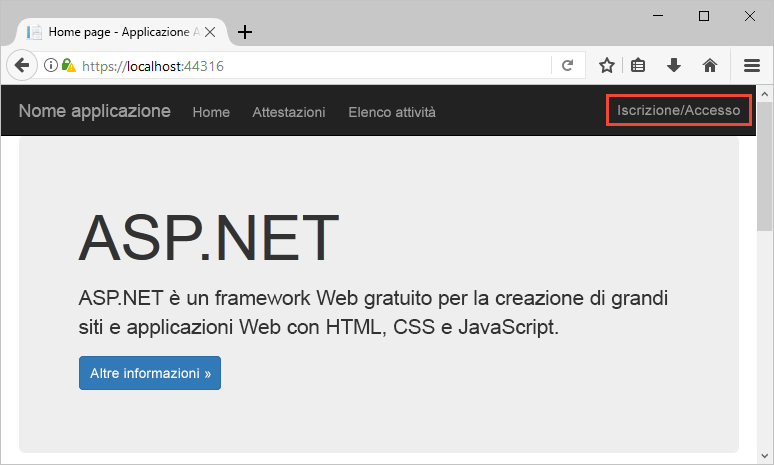
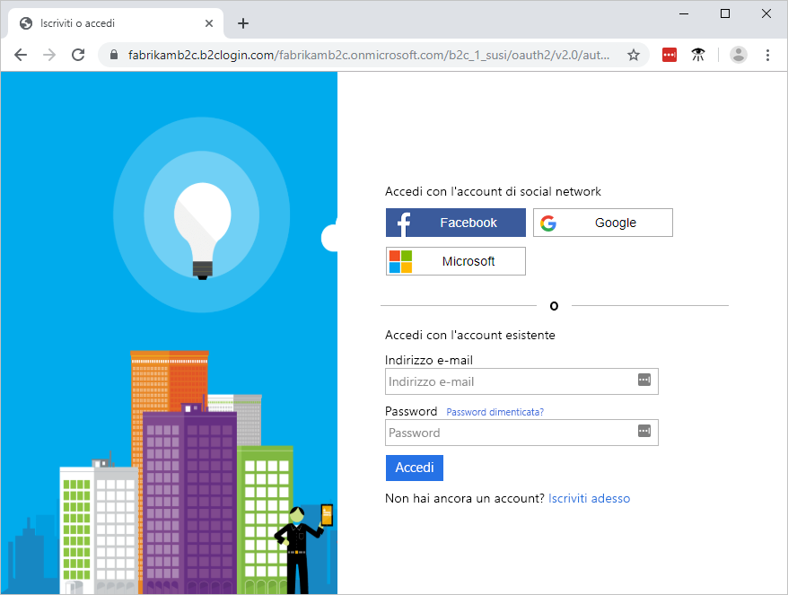
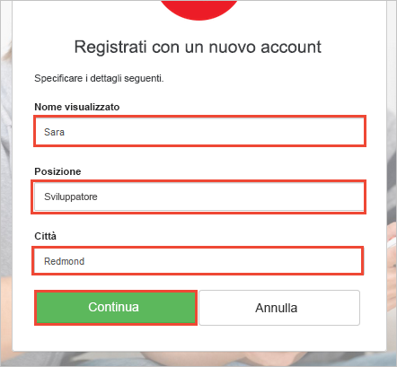
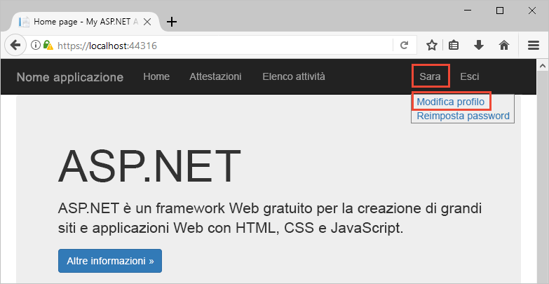
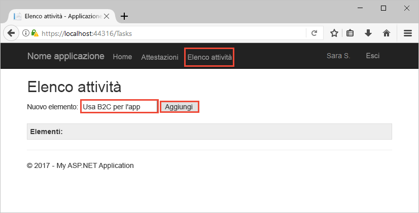

# Eseguire il test drive di un'app Web abilitata per Azure AD B2C

Azure Active Directory B2C consente la gestione delle identità del cloud per garantire la protezione costante dell'applicazione, delle attività aziendali e dei clienti. Questa guida introduttiva usa un'app di elenco attività di esempio per illustrare:

> [!div class="checklist"]
> * Come accedere da una pagina di accesso personalizzata.
> * Come accedere usando un provider di identità basato su social network.
> * Come creare e gestire l'account e il profilo utente di Azure AD B2C.
> * Come chiamare un'API Web protetta da Azure AD B2C.

## Prerequisiti

* [Visual Studio 2017](https://www.visualstudio.com/downloads/) con il carico di lavoro **Sviluppo ASP.NET e Web**. 
* Un account di social networking di Facebook, Google, Microsoft o Twitter.

[!INCLUDE [quickstarts-free-trial-note](../../includes/quickstarts-free-trial-note.md)]

## Scaricare l'esempio

[Scaricare o clonare l'applicazione di esempio](https://github.com/Azure-Samples/active-directory-b2c-dotnet-webapp-and-webapi) da GitHub.

## Eseguire l'app in Visual Studio

Nella cartella del progetto dell'applicazione di esempio aprire la soluzione `B2C-WebAPI-DotNet.sln` in Visual Studio. 

La soluzione è un'applicazione elenco attività di esempio costituita da due progetti:

* **TaskWebApp**: applicazione Web di ASP.NET MVC in cui l'utente può gestire gli elementi elenco attività.  
* **TaskService**: back-end di un'API Web ASP.NET che gestisce le operazioni eseguite sugli elementi elenco attività dell'utente. L'app Web chiama l'API Web e visualizza i risultati.

Per questa guida introduttiva è necessario eseguire entrambi i progetti `TaskWebApp` e `TaskService` contemporaneamente. 

1. Nel menu di Visual Studio scegliere **Progetti > Imposta progetti di avvio**. 
2. Selezionare il pulsante di opzione **Progetti di avvio multipli**.
3. Modificare il valore di **Azione** in entrambi i progetti in **Avvia**. Fare clic su **OK**.

Selezionare **Debug > Avvia debug** per compilare ed eseguire entrambe le applicazioni. Ogni applicazione viene visualizzata in una scheda del browser separata:

`https://localhost:44316/`: questa pagina è l'applicazione Web ASP.NET. Nella guida introduttiva si interagisce direttamente con l'applicazione.
`https://localhost:44332/`: questa pagina è l'API Web chiamata dall'applicazione Web ASP.NET.

## Creare un account

Fare clic sul collegamento **Sign up / Sign in** (Iscrizione/Accesso) nell'applicazione Web ASP.NET per avviare il flusso di lavoro**Iscrizione o accesso**. Quando si crea un account, è possibile usare un account esistente di un provider di identità basato su social network o un account di posta elettronica. Per questa guida introduttiva, usare un account di provider di identità basato su social network, ovvero un account di Facebook, Google, Microsoft o Twitter.

### Iscriversi usando un provider di identità basato su social network

Per iscriversi usando un provider di identità basato su social network, fare clic sul pulsante del provider di identità che si vuole usare. 

Per leggere le informazioni dell'account di social networking, è necessario eseguire l'autenticazione (accesso) tramite le credenziali di tale account e autorizzare l'applicazione. Dopo la concessione dell'accesso, l'applicazione può recuperare le informazioni sul profilo dall'account, ad esempio il nome e la città dell'utente. 

Completare il processo di accesso per il provider di identità. Se ad esempio si è scelto Twitter, immettere le credenziali di Twitter e fare clic su **Sign in** (Accedi).

I dettagli del nuovo profilo dell'account di Azure AD B2C sono già popolati con informazioni derivate dall'account di social networking.

Aggiornare i campi Nome visualizzato, Posizione e Città e fare clic su **Continua**.  I valori immessi vengono usati per il profilo dell'account utente di Azure AD B2C.

Sono state completate queste operazioni:

> [!div class="checklist"]
> * Autenticazione tramite un provider di identità.
> * Creazione di un account utente di Azure AD B2C. 

## Modificare il profilo

Azure Active Directory B2C offre funzionalità che consentono agli utenti di aggiornare il profilo. Sulla barra dei menu dell'applicazione Web fare clic sul nome del profilo e selezionare **Modifica profilo** per modificare il profilo creato.

Modificare **Nome visualizzato** e **Città**.  Fare clic su **Continua** per aggiornare il profilo.

Si noti che il nome visualizzato nella parte superiore destra della pagina risulta aggiornato. 

## Accedere a una risorsa API Web protetta

Fare clic su **Elenco attività** per immettere e modificare gli elementi elenco attività. L'applicazione Web ASP.NET include un token di accesso nella richiesta alla risorsa API Web per ottenere l'autorizzazione per l'esecuzione di operazioni sugli elementi elenco attività dell'utente. 

Immettere il testo nella casella di testo **Nuovo elemento**. Fare clic su **Aggiungi** per chiamare l'API Web protetta di Azure AD B2C che aggiunge un elemento elenco attività.

È stato usato l'account utente di Azure AD B2C per eseguire una chiamata autorizzata a un'API Web protetta di Azure AD B2C.

## Passaggi successivi

L'esempio presentato in questa guida introduttiva può essere usato per provare altri scenari di Azure AD B2C, tra cui:

* Creazione di un nuovo account locale tramite un indirizzo di posta elettronica.
* Reimpostazione della password dell'account locale.

Se si è pronti ad approfondire la procedura di creazione del tenant di Azure AD B2C e a configurare l'esempio per l'esecuzione con il proprio tenant, provare l'esercitazione seguente.

> [!div class="nextstepaction"]
> [Creare un'app Web ASP.NET con criteri di iscrizione, accesso, modifica del profilo e reimpostazione della password di Azure Active Directory B2C](active-directory-b2c-devquickstarts-web-dotnet-susi.md)