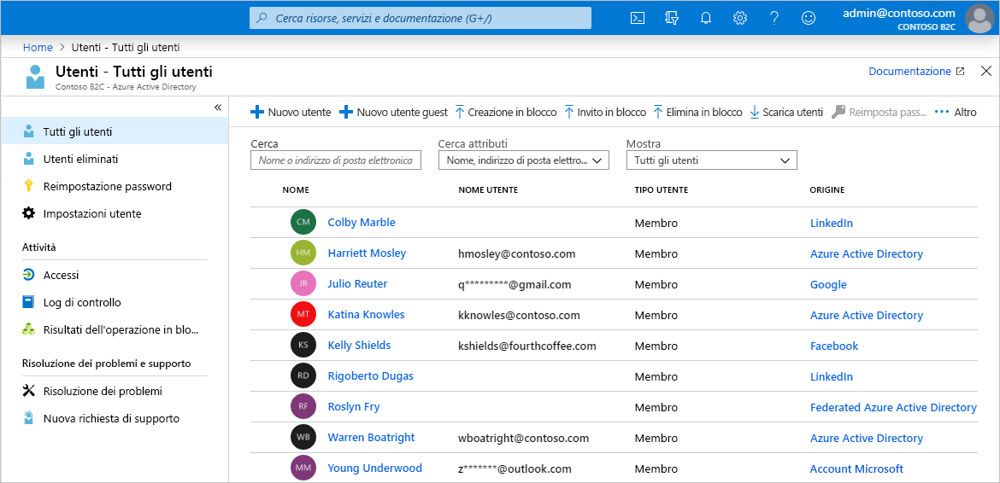
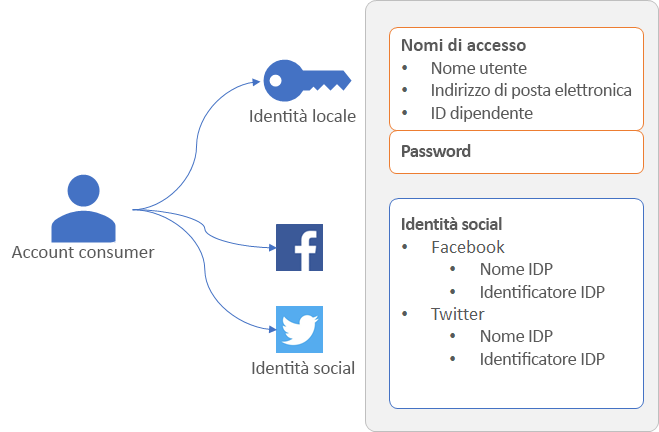
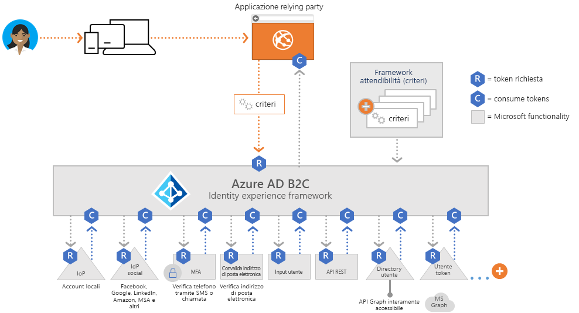
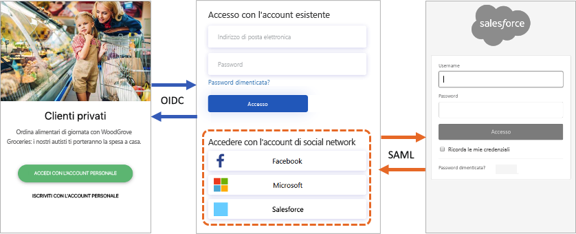
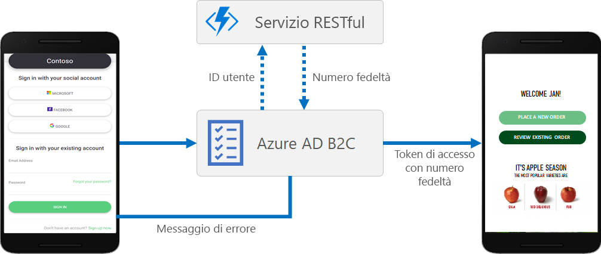
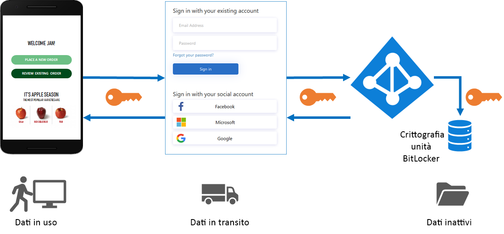
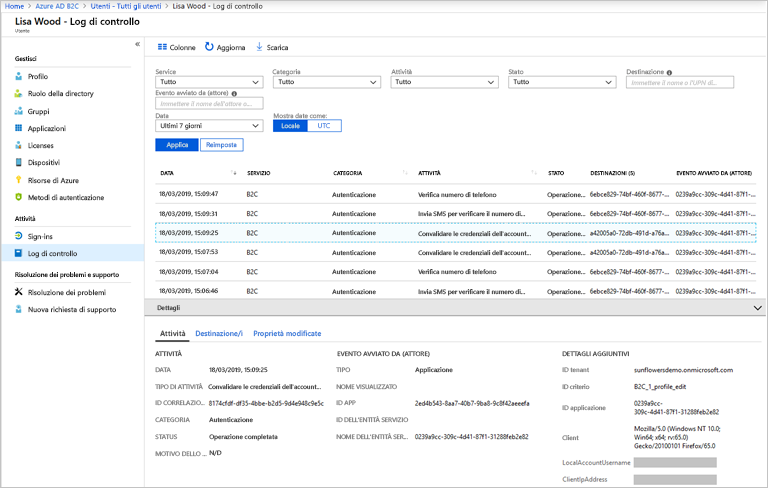

# Panoramica degli aspetti tecnici e delle funzionalità di Azure Active Directory B2C

Complemento dell'articolo [Informazioni su Azure Active Directory B2C](active-directory-b2c-overview.md), questo articolo fornisce un'introduzione più approfondita del servizio. Illustra le risorse principali usate nel servizio, le funzionalità e il modo in cui consentono di offrire un'esperienza di gestione delle identità completamente personalizzata agli utenti delle applicazioni.

## Tenant di Azure AD B2C

In Azure Active Directory B2C (Azure AD B2C) un *tenant* rappresenta l'organizzazione ed è una directory di utenti. Ogni tenant di Azure AD B2C è distinto e separato dagli altri tenant di Azure AD B2C. Un tenant di Azure AD B2C è diverso da un tenant di Azure Active Directory, che potrebbe essere già disponibile.

Le risorse principali usate in un tenant di Azure AD B2C sono:

* **Directory**: la *directory* è la posizione in cui Azure AD B2C archivia le credenziali e i dati di profilo degli utenti, oltre alle registrazioni delle applicazioni.
* **Registrazioni delle applicazioni**: le applicazioni Web, per dispositivi mobili e native devono essere registrate con Azure AD B2C per abilitare la gestione delle identità. Occorre registrare anche tutte le API che si vuole proteggere con Azure AD B2C.
* **Flussi utente** e **criteri personalizzati**: esperienze di identità predefinite (flussi utente) e completamente personalizzabili (criteri personalizzati) per le applicazioni.
  * Usare i *flussi utente* per eseguire rapidamente la configurazione e abilitare attività comuni di gestione delle identità, ad esempio iscrizione, accesso e modifica del profilo.
  * Usare i *criteri personalizzati* per abilitare le esperienze utente non solo per le attività comuni di gestione delle identità, ma anche per la creazione di un supporto per flussi di lavoro di identità complessi specifici per l'organizzazione, i clienti, i dipendenti, i partner e i cittadini.
* **Provider di identità**: impostazioni di federazione per:
  * Provider di identità *basati su social network*, come Facebook, LinkedIn o Twitter, che si vuole supportare nelle applicazioni.
  * Provider di identità *esterni* che supportano protocolli di identità standard come OAuth 2.0, OpenID Connect e altri.
  * Account *locali* che consentono agli utenti di iscriversi e accedere con un nome utente (o un indirizzo di posta elettronica o un altro ID) e una password.
* **Chiavi**: aggiungere e gestire chiavi di crittografia per la firma e la convalida dei token.

Un tenant di Azure AD B2C è la prima risorsa che è necessario creare per iniziare a usare Azure AD B2C. Per le procedure, vedere [Esercitazione: Creare un tenant di Azure Active Directory B2C](tutorial-create-tenant.md).

## Account in Azure AD B2C

Azure AD B2C definisce diversi tipi di account utente. Azure Active Directory, Azure Active Directory B2B e Azure Active Directory B2C condividono i tipi di account seguenti.

* **Account aziendale**: gli utenti con account aziendali possono gestire le risorse di un tenant e, se hanno un ruolo di amministratore, possono anche gestire i tenant. Gli utenti con account aziendali possono creare nuovi account consumer, reimpostare le password, bloccare/sbloccare gli account e impostare le autorizzazioni o assegnare un account a un gruppo di sicurezza.
* **Account guest**: utenti esterni che vengono invitati nel tenant come guest. Uno scenario tipico per questo tipo di invito al tenant di Azure AD B2C è quello in cui è necessario condividere le responsabilità di amministrazione.
* **Account consumer**: gli account consumer sono gli account creati nella directory Azure AD B2C quando gli utenti completano il percorso di iscrizione in un'applicazione registrata nel tenant.

 *Figura: directory Utenti in un tenant di Azure AD B2C nel portale di Azure*

### Account consumer

Con un *account consumer* gli utenti possono accedere alle applicazioni protette con Azure AD B2C. Gli utenti con account consumer non possono però accedere alle risorse di Azure, come il portale di Azure.

Un account consumer può essere associato a questi tipi di identità:

* Identità **locale**, con nome utente e password archiviati localmente nella directory Azure AD B2C. Queste identità sono spesso dette "account locali".
* Identità di **social network** o **aziendali**, in cui l'identità dell'utente è gestita da un provider di identità federato come Facebook, Microsoft, AD FS o Salesforce.

Un utente con un account consumer può accedere con più identità, ad esempio nome utente, indirizzo di posta elettronica, ID dipendente, codice fiscale e altro. Un singolo account può avere più identità, sia locali che sociali.

 *Figura: un singolo account consumer con più identità in Azure AD B2C*

Azure AD B2C consente di gestire gli attributi comuni dei profili degli account consumer, come il nome visualizzato, il cognome, il nome, la città e altri. È anche possibile estendere lo schema di Azure AD per archiviare informazioni aggiuntive sugli utenti, come il paese o la residenza, la lingua preferita e le preferenze, ad esempio se vogliono sottoscrivere una newsletter o abilitare l'autenticazione a più fattori.

Per altre informazioni sui tipi di account utente in Azure AD B2C, vedere [Panoramica degli account utente in Azure Active Directory B2C](user-overview.md).

## Provider di identità esterni

È possibile configurare Azure AD B2C per consentire agli utenti di accedere all'applicazione con credenziali ottenute da provider di identità di social network o aziendali. Azure AD B2C supporta provider di identità esterni come Facebook, account Microsoft, Google, Twitter e qualsiasi provider di identità che supporta i protocolli OAuth 1.0, OAuth 2.0, OpenID Connect, SAML o WS-Federation.

Con la federazione dei provider di identità esterni è possibile offrire agli utenti la possibilità di accedere con i propri account social o aziendali senza dover creare un nuovo account solo per l'applicazione.

Nella pagina di iscrizione o accesso Azure AD B2C presenta un elenco di provider di identità esterni tra cui l'utente può scegliere per eseguire l'accesso. Dopo aver selezionato uno dei provider di identità esterni, l'utente viene reindirizzato al sito Web del provider selezionato per completare il processo di accesso. Dopo l'accesso, l'utente viene reindirizzato di nuovo ad Azure AD B2C per l'autenticazione dell'account nell'applicazione.

Per informazioni su come aggiungere provider di identità in Azure AD B2C, vedere [Esercitazione: Aggiungere provider di identità alle applicazioni in Azure Active Directory B2C](tutorial-add-identity-providers.md).

## Esperienze di identità: flussi utente o criteri personalizzati

Il framework di criteri estendibile di Azure AD B2C è il suo principale punto di forza. I criteri descrivono le esperienze di identità degli utenti, ad esempio iscrizione, accesso e modifica del profilo.

Azure AD B2C offre due percorsi principali che è possibile seguire per fornire queste esperienze di identità: i flussi utente e i criteri personalizzati.

* I **flussi utente** sono criteri predefiniti configurabili che permettono di creare esperienze di iscrizione, accesso e modifica dei criteri in pochi minuti.

* I **criteri personalizzati** consentono di creare percorsi utente personalizzati per scenari di esperienza di identità complessi.

Sia i flussi utente che i criteri personalizzati sono basati sulla piattaforma *Identity Experience Framework*, il motore di orchestrazione dei criteri di Azure AD B2C.

### Flusso utente

Per consentire di configurare rapidamente le attività più comuni di gestione delle identità, il portale di Azure include diversi criteri predefiniti e configurabili detti *flussi utente*.

È possibile configurare impostazioni di flusso utente come queste per controllare i comportamenti dell'esperienza di identità nelle applicazioni:

* Tipi di account usati per l'accesso, ad esempio account di social network, come Facebook, o account locali che usano un indirizzo di posta elettronica e una password per accedere
* Attributi da raccogliere dall'utente, ad esempio nome, codice postale o paese di residenza
* Azure Multi-Factor Authentication (MFA)
* Personalizzazione dell'interfaccia utente
* Set di attestazioni in un token che l'applicazione riceve dopo che l'utente ha completato il flusso utente
* Gestione delle sessioni
* ...e altri.

Gli scenari di identità più comuni per la maggior parte delle applicazioni per dispositivi mobili, Web e a pagina singola possono essere definiti e implementati efficacemente con i flussi utente. È consigliabile usare i flussi utente predefiniti tranne che per gli scenari di percorso utente complessi che richiedono tutta la flessibilità dei criteri personalizzati.

Pe altre informazioni sui flussi utente, vedere [Flussi utente in Azure Active Directory B2C](active-directory-b2c-reference-policies.md).

### Criteri personalizzati

I criteri personalizzati consentono l'accesso a tutte le funzionalità del motore di orchestrazione Identity Experience Framework. Con i criteri personalizzati è possibile sfruttare questo motore per creare quasi tutte le esperienze di autenticazione, registrazione utente o modifica del profilo immaginabili.

Identity Experience Framework offre la possibilità di creare percorsi utente con qualsiasi combinazione di passaggi. Ad esempio:

* Federazione con altri provider di identità
* Richieste di autenticazione a più fattori proprietarie e di terze parti
* Raccolta dell'input utente
* Integrazione con sistemi esterni tramite la comunicazione con le API REST

Ogni percorso utente di questo tipo è definito da un criterio ed è possibile creare tutti i criteri necessari per offrire la migliore esperienza utente per l'organizzazione.

Un criterio personalizzato è definito da diversi file XML che fanno riferimento l'uno all'altro in una catena gerarchica. Gli elementi XML definiscono lo schema delle attestazioni, le trasformazioni delle attestazioni, le definizioni di contenuto, i provider di attestazioni, i profili tecnici, i passaggi di orchestrazione dei percorsi utente e altri aspetti dell'esperienza di identità.

La potente flessibilità dei criteri personalizzati è più appropriata quando è necessario creare scenari di identità complessi. Gli sviluppatori che configurano criteri personalizzati devono definire dettagliatamente le relazioni attendibili in modo da includere gli endpoint dei metadati e le definizioni di scambio per le attestazioni esatte e configurare i segreti, le chiavi e i certificati necessari per ogni provider di identità.

Per altre informazioni sui criteri personalizzati, vedere [Criteri personalizzati in Azure Active Directory B2C](active-directory-b2c-overview-custom.md).

## Protocolli e token

Per i percorsi utente, Azure AD B2C supporta i [protocolli OpenID Connect e OAuth 2.0](active-directory-b2c-reference-protocols.md). Nell'implementazione di OpenID Connect in Azure AD B2C, l'applicazione avvia il percorso utente inviando richieste di autenticazione ad Azure AD B2C.

Il risultato di una richiesta ad Azure AD B2C è un token di sicurezza, ad esempio [un token ID o un token di accesso](active-directory-b2c-reference-tokens.md). Questo token di sicurezza definisce l'identità dell'utente. I token vengono ricevuti da endpoint di Azure AD B2C come l'endpoint `/token` o `/authorize`. Con questi token è possibile accedere alle attestazioni utilizzabili per convalidare un'identità e consentire l'accesso a risorse sicure.

Per le identità esterne, Azure AD B2C supporta la federazione con qualsiasi provider di identità OAuth 1.0, OAuth 2.0, OpenID Connect, SAML e WS-Fed.

Questo diagramma illustra come Azure AD B2C può comunicare usando diversi protocolli all'interno dello stesso flusso di autenticazione:

1. L'applicazione relying party avvia una richiesta di autorizzazione ad Azure AD B2C mediante OpenID Connect.
1. Quando un utente dell'applicazione sceglie di accedere usando un provider di identità esterno che usa il protocollo SAML, Azure AD B2C richiama il protocollo SAML per comunicare con tale provider di identità.
1. Dopo che l'utente ha completato l'operazione di accesso con il provider di identità esterno, Azure AD B2C restituisce il token all'applicazione relying party usando OpenID Connect.

## Integrazione di applicazioni

Quando un utente vuole accedere all'applicazione, sia che si tratti di un'applicazione Web, per dispositivi mobili, desktop o a pagina singola, l'applicazione avvia una richiesta di autorizzazione a un endpoint fornito da un flusso utente o da un criterio personalizzato. Il flusso utente o il criterio personalizzato definisce e controlla l'esperienza dell'utente. Al termine di un flusso utente, ad esempio il flusso di *iscrizione o accesso*, Azure AD B2C genera un token, quindi reindirizza l'utente all'applicazione.

Più applicazioni possono usare lo stesso flusso utente o lo stesso criterio personalizzato. Una singola applicazione può usare più flussi utente o criteri personalizzati.

Ad esempio, per accedere a un'applicazione, l'applicazione usa il flusso utente di *iscrizione o accesso*. Dopo aver eseguito l'accesso, l'utente potrebbe voler modificare il profilo, quindi l'applicazione avvia un'altra richiesta di autorizzazione, questa volta usando il flusso utente di *modifica del profilo*.

## Esperienza utente semplice

In Azure AD B2C è possibile creare le esperienze di identità degli utenti in modo che le pagine visualizzate abbiano un aspetto coerente con quello del marchio aziendale. Si ottiene il controllo quasi completo dei contenuti HTML e CSS presentati agli utenti quando procedono lungo i percorsi di identità dell'applicazione. Grazie a questa flessibilità è possibile mantenere la coerenza visiva e del marchio tra l'applicazione e Azure AD B2C.

Per informazioni sulla personalizzazione dell'interfaccia utente, vedere [Informazioni sulla personalizzazione dell'interfaccia utente in Azure Active Directory B2C](customize-ui-overview.md)

## Localizzazione

La personalizzazione della lingua in Active Directory B2C consente di modificare la lingua del percorso utente in base alle esigenze dei clienti. Microsoft fornisce le traduzioni per 36 lingue, ma è anche possibile inserire le proprie traduzioni per qualsiasi lingua. Anche se l'esperienza è disponibile per una sola lingua, è possibile personalizzare qualsiasi testo nelle pagine.

Per informazioni sul funzionamento della localizzazione, vedere [Personalizzazione della lingua in Azure AD B2C](active-directory-b2c-reference-language-customization.md).

## Aggiungere la propria logica di business

Se si sceglie di usare criteri personalizzati, è possibile integrarli con un'API RESTful in un percorso utente per aggiungere la propria logica di business al percorso. Azure AD B2C, ad esempio, può scambiare dati con un servizio RESTful per:

* Visualizzare messaggi di errore descrittivi personalizzati.
* Convalidare l'input dell'utente per evitare che dati in formato non corretto vengano resi permanenti nella directory utenti. Ad esempio, è possibile modificare i dati immessi dall'utente, correggendo la lettera iniziale del nome da minuscola a maiuscola, tra le altre cose.
* Arricchire i dati utente eseguendo un'integrazione più approfondita con le applicazioni line-of-business aziendali.
* Usando chiamate RESTful è possibile inviare notifiche push, aggiornare i database aziendali, eseguire un processo di migrazione utente, gestire le autorizzazioni, controllare i database e altro ancora.

I programmi fedeltà sono un altro scenario abilitato dal supporto di Azure AD B2C per chiamare le API REST. Ad esempio, il servizio RESTful può ricevere l'indirizzo di posta elettronica di un utente, eseguire query sul database del cliente e restituire il numero del programma fedeltà dell'utente ad Azure AD B2C. I dati restituiti possono essere archiviati nell'account di directory dell'utente in Azure AD B2C, quindi essere ulteriormente valutati nei passaggi successivi del criterio o essere inclusi nel token di accesso.

È possibile aggiungere una chiamata API REST in qualsiasi passaggio del percorso utente definito da un criterio personalizzato. Ad esempio, è possibile chiamare un'API REST:

* Durante l'accesso, subito prima che Azure AD B2C convalidi le credenziali
* Subito dopo l'accesso
* Prima che Azure AD B2C crei un nuovo account nella directory
* Dopo che Azure AD B2C ha creato un nuovo account nella directory
* Prima che Azure AD B2C rilasci un token di accesso

Per informazioni su come usare i criteri personalizzati per l'integrazione di API RESTful in Azure AD B2C, vedere [Integrare scambi di attestazioni API REST nel percorso utente di Azure AD B2C come convalida dell'input utente](active-directory-b2c-custom-rest-api-netfw.md).

## Proteggere le identità dei clienti

Azure AD B2C è conforme ai criteri di sicurezza e privacy e ad altri impegni descritti nel [Centro protezione di Microsoft Azure](https://www.microsoft.com/trustcenter/cloudservices/azure).

Le sessioni sono modellate come dati crittografati, con la chiave di decrittografia nota solo al servizio token di sicurezza di Azure AD B2C. Viene usato un algoritmo di crittografia avanzata, AES-192. Tutti i percorsi di comunicazione sono protetti con TLS a livello di riservatezza e integrità. Il servizio token di sicurezza usa un certificato di convalida estesa (EV) per TLS. In generale, il servizio token di sicurezza attenua gli attacchi di tipo cross-site scripting (XSS) non eseguendo il rendering di input non attendibile.

### Accesso ai dati utente

I tenant di Azure AD B2C condividono molte caratteristiche con i tenant aziendali di Azure Active Directory usati per dipendenti e partner. Gli aspetti condivisi includono meccanismi per la visualizzazione dei ruoli amministrativi, l'assegnazione di ruoli e il controllo delle attività.

È possibile assegnare ruoli per controllare gli utenti che possono eseguire determinate azioni amministrative in Azure AD B2C, tra cui:

* Creare e gestire tutti gli aspetti dei flussi utente
* Creare e gestire lo schema dell'attributo disponibile per tutti i flussi utente
* Configurare i provider di identità da usare nella federazione diretta
* Creare e gestire criteri di framework attendibilità in Identity Experience Framework (criteri personalizzati)
* Gestire i segreti per la federazione e la crittografia in Identity Experience Framework (criteri personalizzati)

Per altre informazioni sui ruoli di Azure AD, incluso il supporto dei ruoli di amministrazione di Azure AD B2C, vedere [Autorizzazioni del ruolo di amministratore in Azure Active Directory](../active-directory/users-groups-roles/directory-assign-admin-roles.md).

### Multi-Factor Authentication (MFA)

L'autenticazione a più fattori (MFA) di Azure Active Directory B2C consente di proteggere l'accesso ai dati e alle applicazioni, garantendo al tempo stesso la semplicità di utilizzo. Offre un ulteriore livello di sicurezza richiedendo una seconda forma di autenticazione, oltre a un'autenticazione avanzata tramite una varietà di metodi di autenticazione intuitivi. Gli utenti possono o meno ricevere una richiesta di autenticazione MFA in base alle decisioni di configurazione prese da un amministratore.

Per informazioni su come abilitare MFA nei flussi utente, vedere [Abilitare l'autenticazione a più fattori in Azure Active Directory B2C](active-directory-b2c-reference-mfa.md).

### Blocco account intelligente

Per impedire i tentativi di individuazione delle password tramite attacchi di forza bruta, Azure AD B2C usa una strategia sofisticata per bloccare gli account in base all'indirizzo IP della richiesta, alle password immesse e a diversi altri fattori. La durata del blocco viene aumentata automaticamente in base al rischio e al numero di tentativi.

Per altre informazioni sulla gestione delle impostazioni di protezione delle password, vedere [Gestire le minacce alle risorse e ai dati in Azure Active Directory B2C](active-directory-b2c-reference-threat-management.md).

### Complessità password

Durante l'iscrizione o la reimpostazione della password, gli utenti devono specificare una password che soddisfi le regole di complessità. Per impostazione predefinita, Azure AD B2C applica un criterio di password complessa. Fornisce anche le opzioni di configurazione per specificare i requisiti di complessità delle password usate dagli utenti.

È possibile configurare i requisiti di complessità delle password sia nei [flussi utente](active-directory-b2c-reference-password-complexity.md) che nei [criteri personalizzati](active-directory-b2c-reference-password-complexity-custom.md).

## Controllo e log

Azure AD B2C genera log di controllo contenenti informazioni sulle attività relative ad accesso amministrativo, token rilasciati e risorse. È possibile usare questi log di controllo per comprendere le attività della piattaforma e diagnosticare i problemi. Le voci del log di controllo sono disponibili subito dopo l'esecuzione dell'attività che ha generato l'evento.

In un log di controllo, disponibile per il tenant di Azure AD B2C o per un utente specifico, è possibile trovare informazioni come:

* Attività relative all'autorizzazione di un utente ad accedere alle risorse B2C (ad esempio, un amministratore che accede a un elenco di criteri B2C)
* Attività relative agli attributi della directory recuperati quando un amministratore esegue l'accesso usando il portale di Azure
* Operazioni di creazione, lettura, aggiornamento ed eliminazione (CRUD) sulle applicazioni B2C
* Operazioni CRUD sulle chiavi archiviate in un contenitore di chiavi B2C
* Operazioni CRUD sulle risorse B2C (ad esempio, criteri e provider di identità)
* Convalida delle credenziali utente e rilascio dei token

Per altre informazioni sui log di controllo, vedere [Accesso ai log di controllo di Azure AD B2C](active-directory-b2c-reference-audit-logs.md).

### Informazioni dettagliate sull'utilizzo

Azure AD B2C consente di scoprire quando le persone effettuano l'iscrizione o l'accesso all'app Web, dove si trovano e quali browser e sistemi operativi usano. Integrando Azure Application Insights in Azure AD B2C usando criteri personalizzati, è possibile ottenere informazioni dettagliate sul modo in cui gli utenti effettuano l'iscrizione, accedono, reimpostano la password o modificano il profilo. Con queste informazioni è possibile prendere decisioni basate sui dati sui cicli di sviluppo successivi.

Per altre informazioni sull'analisi di utilizzo, vedere [Tenere traccia del comportamento degli utenti in Azure Active Directory B2C usando Application Insights](active-directory-b2c-custom-guide-eventlogger-appins.md).

## Passaggi successivi

Ora che si è acquisita una panoramica approfondita delle funzionalità e degli aspetti tecnici di Azure Active Directory B2C, iniziare a usare il servizio creando un tenant B2C:

> [!div class="nextstepaction"]
> [Esercitazione: Creare un tenant di Azure Active Directory B2C >](tutorial-create-tenant.md)