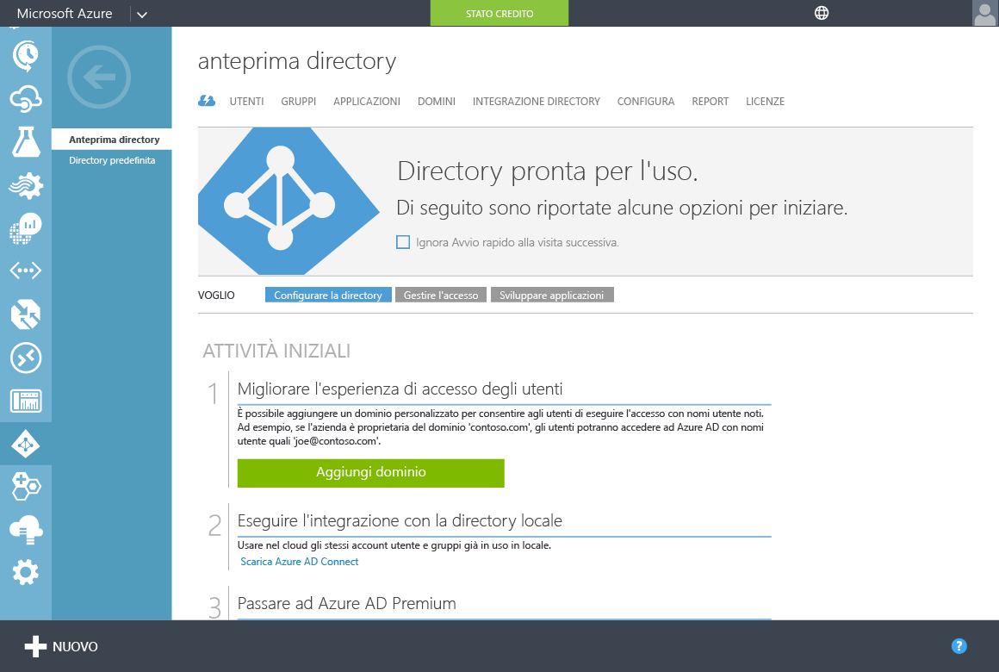
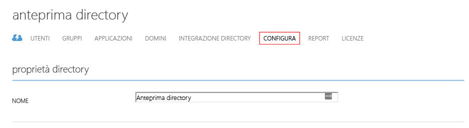

<properties
	pageTitle="Configurare l'accesso LDAP sicuro (LDAPS) in Servizi di dominio Azure AD | Microsoft Azure"
	description="Configurare l'accesso LDAP sicuro (LDAPS) per un dominio gestito di Servizi di dominio Azure AD"
	services="active-directory-ds"
	documentationCenter=""
	authors="mahesh-unnikrishnan"
	manager="stevenpo"
	editor="curtand"/>

<tags
	ms.service="active-directory-ds"
	ms.workload="identity"
	ms.tgt_pltfrm="na"
	ms.devlang="na"
	ms.topic="article"
	ms.date="05/20/2016"
	ms.author="maheshu"/>

# Configurare l'accesso LDAP sicuro (LDAPS) per un dominio gestito di Servizi di dominio Azure AD
Questo articolo illustra come abilitare l'accesso LDAPS (Secure Lightweight Directory Access Protocol) per il dominio gestito di Servizi di dominio Azure AD. L'accesso LDAP sicuro è noto anche come LDAP (Lightweight Directory Access Protocol) su SSL (Secure Sockets Layer) / TLS (Transport Layer Security).

## Prima di iniziare
Per eseguire le attività elencate in questo articolo, è necessario:

1. Una **sottoscrizione di Azure** valida.

2. Una **directory di Azure AD** sincronizzata con una directory locale o con una directory solo cloud.

3. I **Servizi di dominio Azure AD** devono essere abilitati per la directory di Azure AD. Se non è stato fatto, eseguire tutte le attività descritte nella [guida introduttiva](./active-directory-ds-getting-started.md).

4. Un **certificato da usare per abilitare l'accesso LDAP sicuro**.
    - È **consigliabile** ottenere un certificato dalla CA dell'organizzazione o da un'autorità di certificazione pubblica. Si tratta di un'opzione di configurazione molto più sicura.
	- In alternativa, è anche possibile scegliere di [creare un certificato autofirmato](#task-1---obtain-a-certificate-for-secure-ldap), come illustrato più avanti in questo articolo.

 

### Requisiti per il certificato LDAP sicuro
Acquisire un certificato valido in base alle linee guida riportate di seguito prima di abilitare l'accesso LDAP sicuro. Se si prova ad abilitare l'accesso LDAP sicuro per il dominio gestito con un certificato non valido o non corretto, si verificano errori.

1. **Autorità emittente attendibile**: il certificato deve essere emesso da un'autorità ritenuta attendibile dai computer che devono connettersi al dominio tramite accesso LDAP sicuro. Può trattarsi dell'autorità di certificazione dell'organizzazione o di un'autorità di certificazione pubblica ritenuta attendibile da tali computer.

2. **Durata**: il certificato deve essere valido almeno per i 3-6 mesi successivi. Questo garantisce che l'accesso LDAP sicuro al dominio gestito non venga interrotto allo scadere del certificato.

3. **Nome soggetto**: il nome del soggetto nel certificato deve includere un carattere jolly per il dominio gestito. Ad esempio, se il dominio è denominato "contoso100.com", il nome del soggetto nel certificato deve essere "*.contoso100.com". Anche il nome soggetto alternativo, ovvero il nome DNS, deve essere impostato su questo nome con carattere jolly.

3. **Utilizzo chiavi**: il certificato deve essere configurato per l'uso nelle firme digitali e nella crittografia a chiave.

4. **Scopo del certificato**: il certificato deve essere valido per l'autenticazione server SSL.

 

## Attività 1: Ottenere un certificato per l'accesso LDAP sicuro
La prima attività consiste nell'ottenere un certificato da usare per l'accesso LDAP sicuro al dominio gestito. Sono disponibili due opzioni:

- Ottenere un certificato dalla CA dell'organizzazione o da un'autorità di certificazione pubblica.

- Creare un certificato autofirmato.

### Opzione A (scelta consigliata): ottenere un certificato LDAP sicuro da un'autorità di certificazione
Se l'organizzazione distribuisce un'infrastruttura a chiave pubblica (PKI) aziendale, è necessario ottenere un certificato dall'autorità di certificazione (CA) aziendale dell'organizzazione. Se l'organizzazione ottiene i certificati da un'autorità di certificazione pubblica, è necessario ottenere il certificato LDAP sicuro dall'autorità di certificazione pubblica.

Quando si richiede un certificato, assicurarsi di rispettare i requisiti descritti nella sezione [Requisiti per il certificato LDAP sicuro](#requirements-for-the-secure-ldap-certificate).

Si noti che i computer client che devono connettersi al dominio gestito tramite l'accesso LDAP sicuro devono considerare attendibile l'autorità emittente del certificato LDAPS.

### Opzione B: creare un certificato autofirmato per l'accesso LDAP sicuro
È possibile scegliere di creare un certificato autofirmato per l'accesso LDAP sicuro se:

- i certificati dell'organizzazione non vengono emessi da un'autorità di certificazione aziendale oppure
- non si prevede di usare un certificato emesso da un'autorità di certificazione pubblica.

**Creare un certificato autofirmato con PowerShell**

Per creare un nuovo certificato autofirmato in un computer Windows, aprire una nuova finestra di PowerShell come **amministratore** e digitare i comandi seguenti.

    $lifetime=Get-Date

    New-SelfSignedCertificate -Subject *.contoso100.com -NotAfter $lifetime.AddDays(365) -KeyUsage DigitalSignature, KeyEncipherment -Type SSLServerAuthentication -DnsName *.contoso100.com

Nell'esempio precedente, sostituire "contoso100.com" con il nome di dominio DNS del dominio gestito di Servizi di dominio Azure AD.

Il certificato autofirmato appena creato viene inserito nell'archivio certificati del computer locale.

## Attività 2: Esportare il certificato LDAP sicuro in un file PFX
Prima di iniziare questa attività, assicurarsi di aver ottenuto il certificato LDAP sicuro dall'autorità di certificazione dell'azienda o da un'autorità di certificazione pubblica oppure di aver creato un certificato autofirmato.

Per esportare il certificato LDAPS in un file PFX, seguire questa procedura.

1. Premere il pulsante **Start** e digitare **E** per visualizzare la finestra di dialogo **Esegui**. Digitare **mmc** e fare clic su **OK**.

    

2. Nel prompt di **Controllo dell'account utente** fare clic su **Sì** per avviare Microsoft Management Console (MMC) come amministratore.

3. Scegliere **Aggiungi/Rimuovi snap-in...** dal menu **File**

    

4. Nella finestra di dialogo **Aggiungi o rimuovi snap-in** selezionare lo snap-in **Certificati** e fare clic sul pulsante **Aggiungi >**.

    

5. Nella procedura di **snap-in certificati** guidata selezionare **Account del computer** e quindi fare clic su **Avanti**.

    

6. Nella pagina **Seleziona computer** selezionare **Computer locale (il computer su cui è in esecuzione questa console)** e fare clic su **Fine**.

    

7. Nella finestra di dialogo **Aggiungi o rimuovi snap-in ** fare clic su **OK** per aggiungere lo snap-in certificati a MMC.

    

8. Nella finestra di MMC selezionare **Radice console **. Verrà visualizzato lo snap-in certificati caricato. Selezionare **Certificati (computer locale)** per espandere. Selezionare il nodo **Personale** per espanderlo, poi selezionare il nodo **Certificati**.

    

9. Come mostrato nella figura precedente, verrà visualizzato il certificato autofirmato appena creato. È possibile esaminare le proprietà del certificato per assicurarsi che l'identificazione personale corrisponda a quella indicata nelle finestre di PowerShell al momento della creazione del certificato.

10. Selezionare il certificato autofirmato e **fare clic con il pulsante destro del mouse**. Selezionare **Tutte le attività** dal menu di scelta rapida e quindi **Esporta...**.

    

11. Nell'**esportazione guidata dei certificati** fare clic su **Avanti**.

    

12. Nella pagina **Esportazione della chiave privata con il certificato** selezionare **Sì, esporta la chiave privata ** e quindi fare clic su **Avanti**.

    

    > [AZURE.WARNING] È NECESSARIO esportare la chiave privata insieme al certificato. Se si abilita l'accesso LDAP sicuro per il dominio gestito specificando un file PFX che non contiene la chiave privata per il certificato, l'operazione avrà esito negativo.

13. Nella pagina **Formato file di esportazione** **Scambio di informazioni personali - PKCS #12 (*.PFX)** come formato di file per il certificato esportato.

    

	> [AZURE.NOTE] È supportato solo il formato di file PFX. Non esportare il certificato nel formato di file CER.

14. Nella pagina **Sicurezza** selezionare l'opzione **Password** e digitare una password per proteggere il file con estensione pfx. Prendere nota della password perché sarà necessaria nell'attività successiva. Fare clic su **Avanti ** per continuare.

    

	> [AZURE.NOTE] Prendere nota della password. Sarà necessaria per i passaggi descritti nell'[Attività 3: Abilitare l'accesso LDAP sicuro per il dominio gestito](#task-3---enable-secure-ldap-for-the-managed-domain).

15. Nella pagina **File da esportare** specificare il nome del file e il percorso in cui esportare il certificato.

    

16. Nella pagina successiva fare clic su **Fine** per esportare il certificato in un file con estensione pfx. Al termine dell'esportazione del certificato verrà visualizzata una finestra di dialogo di conferma.

    

## Attività 3: Abilitare l'accesso LDAP sicuro per il dominio gestito
Seguire questa procedura di configurazione per abilitare l'accesso LDAP sicuro.

1. Passare al **[portale di Azure classico](https://manage.windowsazure.com)**.

2. Selezionare il nodo **Active Directory** nel riquadro sinistro.

3. Selezionare la directory di Azure AD, detta anche "tenant", per cui sono stati abilitati i Servizi di dominio Azure AD.

    

4. Fare clic sulla scheda **Configura**.

    

5. Scorrere fino alla sezione **Servizi di dominio**. Viene visualizzata l'opzione **Accesso LDAP sicuro (LDAPS)**, come illustrato nella schermata seguente.

    

6. Fare clic sul pulsante **Configura certificato...** per visualizzare la finestra di dialogo **Configura certificato per accesso LDAP sicuro**.

    

7. Fare clic sull'icona cartella sotto **File PFX con certificato** per specificare il file PFX contenente il certificato da usare per l'accesso LDAP sicuro al dominio gestito. Immettere anche la password specificata durante l'esportazione del certificato nel file PFX. Al termine, fare clic sul pulsante Fine nella parte inferiore.

    

8. La sezione **Servizi di dominio** della scheda **Configura** verrà disattivata e rimarrà **In sospeso...** per alcuni minuti. Durante questo periodo, viene verificata l'accuratezza del certificato LDAPS e viene configurato l'accesso LDAP sicuro per il dominio gestito.

    

    > [AZURE.NOTE] Per abilitare l'accesso LDAP sicuro per il dominio gestito saranno necessari circa 10-15 minuti. Se il certificato LDAP sicuro fornito non corrisponde ai criteri richiesti, ad esempio se il nome di dominio non è corretto, il certificato è scaduto o sta per scadere e così via, l'accesso LDAP sicuro non viene abilitato per la directory e viene visualizzato un errore.

9. Il messaggio **In sospeso...** scomparirà non appena l'accesso LDAP sicuro per il dominio gestito sarà abilitato. Verrà visualizzata l'identificazione personale del certificato visualizzato.

    

 

## Attività 4: Abilitare l'accesso LDAP sicuro su Internet
**Attività facoltativa**: ignorare questa attività se non si intende accedere al dominio gestito usando l'accesso LDAP sicuro tramite Internet.

Prima di iniziare questa attività, assicurarsi di aver completato la procedura descritta nell'[attività 3](#task-3---enable-secure-ldap-for-the-managed-domain).

1. Nella sezione **Servizi di dominio** della pagina **Configura** viene visualizzata l'opzione **Abilita accesso LDAP sicuro tramite Internet**. Il valore predefinito di questa impostazione è **No**, perché l'accesso LDAP sicuro al dominio gestito tramite Internet è disabilitato per impostazione predefinita.

    

2. Impostare **Abilita accesso LDAP sicuro tramite Internet** su **Sì**. Fare clic sul pulsante **Salva** nel riquadro inferiore. 

3. La sezione **Servizi di dominio** della scheda **Configura** verrà disattivata e rimarrà **In sospeso...** per alcuni minuti. Durante questo periodo, viene abilitato l'accesso LDAP sicuro tramite Internet al dominio gestito.

    

    > [AZURE.NOTE] Per abilitare l'accesso LDAP sicuro tramite Internet al dominio gestito sono necessari circa 10 minuti.

4. Il messaggio **In sospeso...** scomparirà non appena l'accesso LDAP sicuro al dominio gestito tramite Internet sarà abilitato. Nel campo **Indirizzo IP esterno per l'accesso LDAPS** viene visualizzato l'indirizzo IP esterno che può essere usato per accedere alla directory tramite accesso LDAP sicuro.

    

 

## Attività 5: Configurare il server DNS per l'accesso al dominio gestito da Internet
**Attività facoltativa**: ignorare questa attività se non si intende accedere al dominio gestito usando l'accesso LDAP sicuro tramite Internet.

Prima di iniziare questa attività, assicurarsi di aver completato la procedura descritta nell'[attività 4](#task-4---enable-secure-ldap-access-over-the-internet).

Dopo aver attivato l'accesso LDAP sicuro tramite Internet al dominio gestito, è necessario aggiornare il server DNS in modo che i computer client possano trovare il dominio gestito. Al termine dell'attività 4, nel campo **Indirizzo IP esterno per l'accesso LDAPS** della scheda **Configura** viene visualizzato un indirizzo IP esterno.

Configurare il provider DNS esterno in modo che il nome DNS del dominio gestito, ad esempio "contoso100.com", punti a questo indirizzo IP esterno. Nell'esempio è necessario creare la voce DNS seguente:

    contoso100.com  -> 52.165.38.113

La procedura è terminata ed è possibile connettersi al dominio gestito usando l'accesso LDAP sicuro tramite Internet.

> [AZURE.WARNING] Tenere presente che i computer client devono considerare attendibile l'autorità emittente del certificato LDAPS per potersi connettere al dominio gestito tramite LDAPS. Un'autorità di certificazione aziendale o un'autorità di certificazione pubblicamente attendibile sono considerate attendibili dai computer client. Se si usa un certificato autofirmato è necessario installare la parte pubblica del certificato autofirmato, esportandolo senza la chiave privata, nell'archivio certificati attendibili del computer client.

 

## Contenuti correlati

- [Amministrare un dominio gestito di Servizi di dominio Azure AD](active-directory-ds-admin-guide-administer-domain.md)

<!---HONumber=AcomDC_0525_2016-->