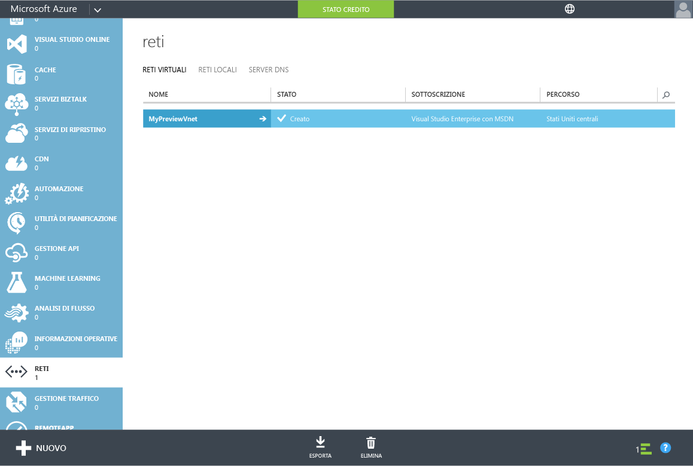
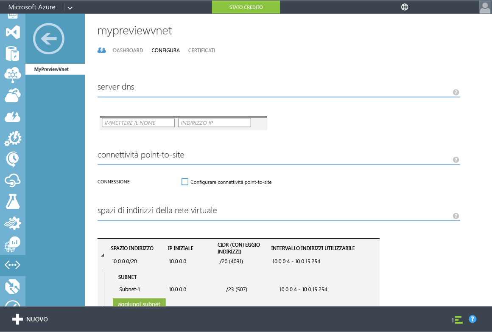
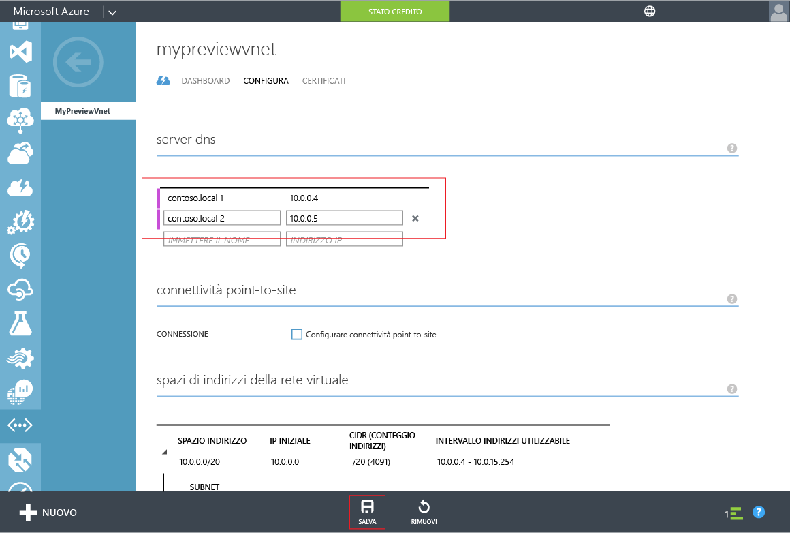

<properties
	pageTitle="Anteprima di Servizi di dominio Azure Active Directory: Introduzione | Microsoft Azure"
	description="Introduzione a Servizi di dominio Azure Active Directory"
	services="active-directory-ds"
	documentationCenter=""
	authors="mahesh-unnikrishnan"
	manager="udayh"
	editor="inhenk"/>

<tags
	ms.service="active-directory-ds"
	ms.workload="identity"
	ms.tgt_pltfrm="na"
	ms.devlang="na"
	ms.topic="article"
	ms.date="10/12/2015"
	ms.author="mahesh-unnikrishnan"/>

# Servizi di dominio Azure AD *(anteprima)* - Introduzione

## Passaggio 4: Aggiornare le impostazioni DNS per la rete virtuale di Azure
Dopo aver correttamente abilitato Servizi di dominio Azure AD per la directory, il passaggio successivo consiste nell'assicurarsi che i computer all'interno della rete virtuale possano connettersi e usare questi servizi. A tale scopo, sarà necessario aggiornare le impostazioni del server DNS per la rete virtuale in modo che punti agli indirizzi IP in cui è disponibile Servizi di dominio Azure AD nella rete virtuale.

> [AZURE.NOTE]Prendere nota degli indirizzi IP per Servizi di dominio Azure AD visualizzati nella scheda **Configura** della directory, dopo avere abilitato Servizi di dominio Azure AD per la directory.

Eseguire i passaggi di configurazione seguenti per aggiornare l'impostazione del server DNS per la rete virtuale in cui è stato abilitato Servizi di dominio Azure AD.

1. Accedere al **portale di gestione di Azure** ([https://manage.windowsazure.com](https://manage.windowsazure.com)).
2. Selezionare il nodo **Reti** nel riquadro sinistro.

    

3. Nella scheda **Reti virtuali** selezionare la rete virtuale in cui è abilitato Servizi di dominio Azure AD per visualizzarne le proprietà.
4. Fare clic sulla scheda **Configura**.

    

5. Nella sezione **Server DNS** immettere gli indirizzi IP di Servizi di dominio Azure AD.
6. Assicurarsi di immettere entrambi gli indirizzi IP visualizzati nella sezione **Servizi di dominio** della scheda **Configura** della directory.
7. Fare clic su **Salva** nel riquadro attività nella parte inferiore della pagina per salvare le impostazioni del server DNS per la rete virtuale.

   

> [AZURE.NOTE]Dopo l'aggiornamento delle impostazioni del server DNS per la rete virtuale, l'aggiornamento della configurazione DNS per le reti virtuali nella rete potrebbe richiedere del tempo. Se una macchina virtuale non è in grado di connettersi al dominio, è possibile scaricare la cache DNS (ad esempio con ipconfig /flushdns) nella macchina virtuale, per forzare un aggiornamento delle impostazioni DNS nella macchina virtuale.

---
[**Passaggio successivo - Abilitare la sincronizzazione password in Servizi di dominio Azure AD.**](active-directory-ds-getting-started-password-sync.md)

<!---HONumber=Oct15_HO3-->