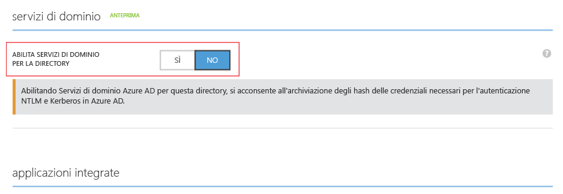
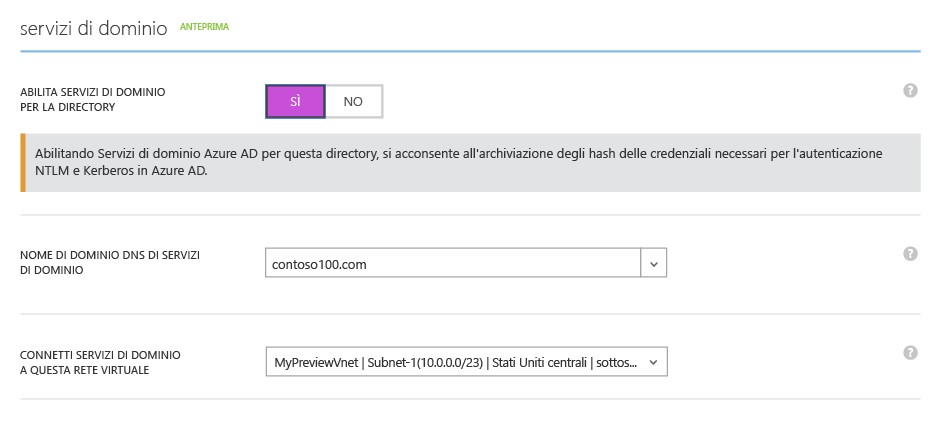
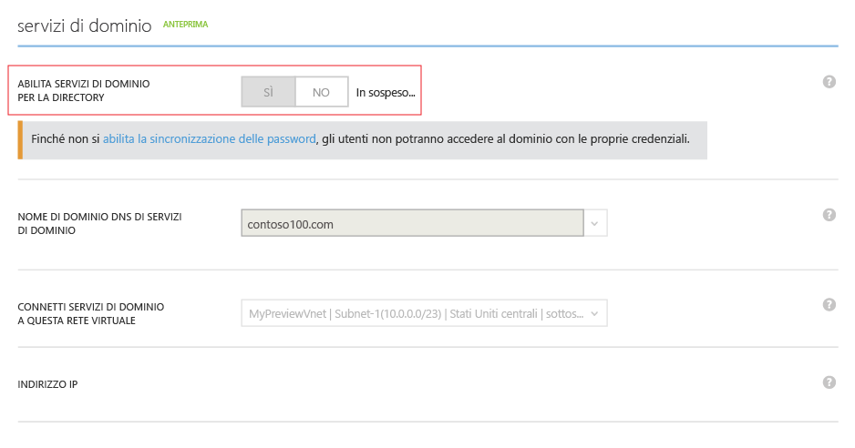
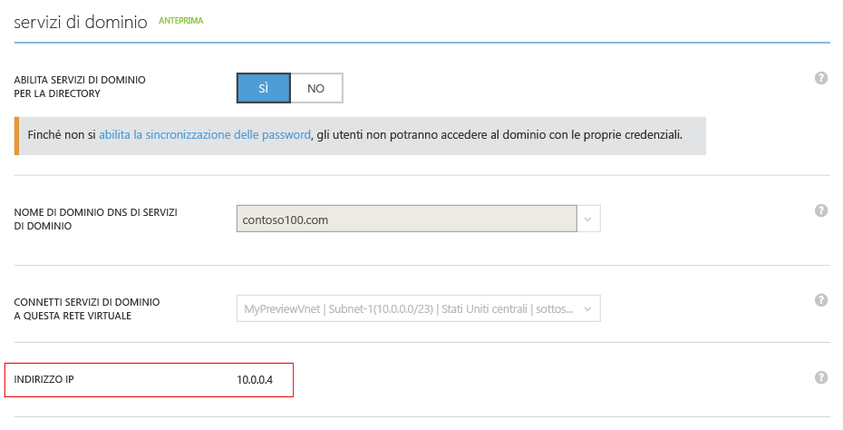
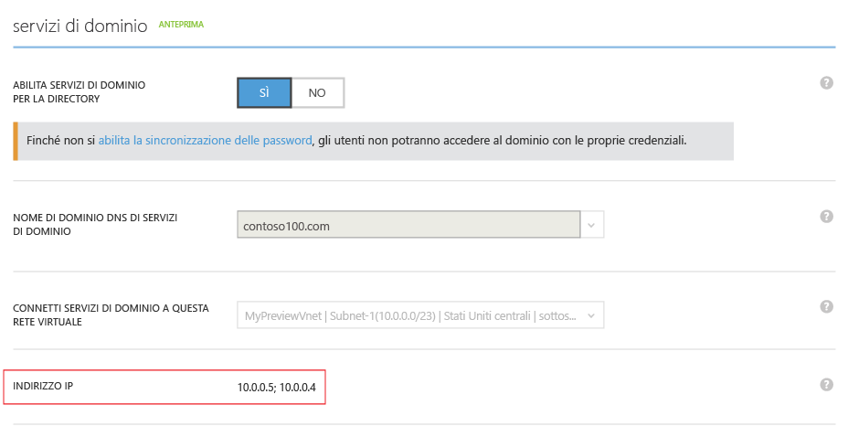

<properties
	pageTitle="Anteprima di Servizi di dominio Azure Active Directory: Introduzione | Microsoft Azure"
	description="Introduzione a Servizi di dominio Azure Active Directory"
	services="active-directory-ds"
	documentationCenter=""
	authors="mahesh-unnikrishnan"
	manager="udayh"
	editor="inhenk"/>

<tags
	ms.service="active-directory-ds"
	ms.workload="identity"
	ms.tgt_pltfrm="na"
	ms.devlang="na"
	ms.topic="article"
	ms.date="10/16/2015"
	ms.author="maheshu"/>

# Servizi di dominio Azure AD *(anteprima)* - Introduzione

## Passaggio 3: Abilitare Servizi di dominio Azure AD
In questo passaggio è possibile abilitare Servizi di dominio Azure AD per la directory. Eseguire i passaggi di configurazione seguenti per abilitare Servizi di dominio Azure AD per la directory.

1. Accedere al **portale di gestione di Azure** ([https://manage.windowsazure.com](https://manage.windowsazure.com)).
2. Selezionare il nodo **Active Directory** nel riquadro sinistro.
3. Selezionare il tenant di Azure AD (directory) per il quale si desidera abilitare Servizi di dominio Azure AD.

    

4. Fare clic sulla scheda **Configura**.

    

5. Scorrere fino alla sezione **servizi di dominio**.

    

6. Impostare l'opzione **Abilita Servizi di dominio per la directory** su **Sì**. Nella pagina verranno visualizzate altre opzioni di configurazione per Servizi di dominio Azure AD.

    

    > [AZURE.NOTE]Quando si abilita Servizi di dominio Azure AD per il tenant, Azure AD genererà e archivierà gli hash delle credenziali Kerberos e NTLM necessari per l'autenticazione degli utenti.

7. Specificare il **Nome di dominio DNS di Servizi di dominio**.
   - Il nome di dominio predefinito della directory (ad esempio, un nome che termina con il suffisso di dominio **. onmicrosoft.com**) verrà selezionato per impostazione predefinita.
   - Nell'elenco sono contenuti tutti i domini che sono stati configurati per la directory di Azure AD, inclusi i domini verificati e non verificati configurati nella scheda 'Domini'.
   - Inoltre, è anche possibile aggiungere, digitandolo, un nome di dominio personalizzato all'elenco.

     >[AZURE.WARNING]Assicurarsi che il prefisso del dominio del nome di dominio specificato (es. 'contoso' nel nome di dominio 'contoso.local') sia inferiore a 15 caratteri. Non è possibile creare un dominio servizi di dominio di Azure AD con un prefisso di dominio con più di 15 caratteri.

8. Il passaggio successivo consiste nel selezionare una rete virtuale in cui si desidera rendere disponibile Servizi di dominio Azure AD. Selezionare la rete virtuale appena creata nell'elenco a discesa **Connetti Servizi di dominio a questa rete virtuale**.
   - Assicurarsi che la rete virtuale specificata appartenga a un'area di Azure supportata da servizi di dominio di Azure AD.
   - Fare riferimento alla [pagina delle aree](active-directory-ds-regions.md) per visualizzare l'elenco di aree di Azure supportate.

9. Dopo aver selezionato le opzioni precedenti, fare clic su **Salva** nel riquadro attività nella parte inferiore della pagina per abilitare Servizi di dominio Azure AD.
10. Nella pagina verrà visualizzato lo stato 'In sospeso...' durante l'abilitazione di Servizi di dominio Azure AD per la directory.

    

    > [AZURE.NOTE]Servizi di dominio Azure AD garantisce un'elevata disponibilità per il dominio gestito. Al momento dell'abilitazione di Servizi di dominio Azure AD per il dominio, è possibile notare che vengono visualizzati uno alla volta gli indirizzi IP per cui è disponibile Servizi di dominio nella rete virtuale. Il secondo indirizzo IP verrà visualizzato dopo breve tempo, non appena il servizio abilita la disponibilità elevata per il dominio. Al termine della configurazione e attivazione della disponibilità elevata per il dominio, nella sezione **Servizi di dominio** della scheda **Configura** dovrebbero comparire due indirizzi IP.

11. Dopo circa 20-30 minuti, il primo indirizzo IP in cui è disponibile Servizi di dominio nella rete virtuale verrà visualizzato nel campo **Indirizzo IP** nella pagina **Configura**.

    

12. Quando la disponibilità elevata è operativa per il dominio, nella pagina saranno visualizzati due indirizzi IP. Questi sono gli indirizzi IP in cui sarà disponibile Servizi di dominio Azure AD nella rete virtuale selezionata. Prendere nota di questi indirizzi IP in modo da poter aggiornare le impostazioni DNS per la rete virtuale. Questo passaggio consente alle macchine virtuali nella rete virtuale di connettersi al dominio per operazioni quali l'aggiunta al dominio.

    

> [AZURE.NOTE]A seconda delle dimensioni della directory di Azure AD (numero di utenti, gruppi e così via), sarà richiesto del tempo prima che il contenuto della directory diventi disponibile in Servizi di dominio Azure AD. Questo processo di sincronizzazione avviene in background. Per directory di grandi dimensioni con decine di migliaia di oggetti, possono essere necessari anche un paio di giorni affinché tutti gli utenti, le appartenenze ai gruppi e le credenziali vengano sincronizzati e siano disponibili in Servizi di dominio Azure AD.

---
[**Passaggio successivo - Aggiornare le impostazioni DNS per la rete virtuale di Azure.**](active-directory-ds-getting-started-dns.md)

<!---HONumber=Oct15_HO4-->