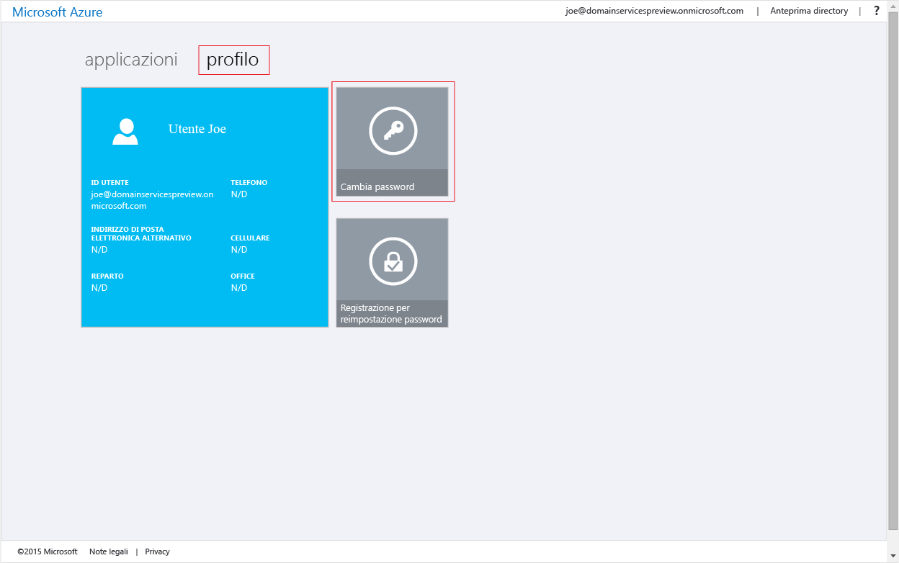
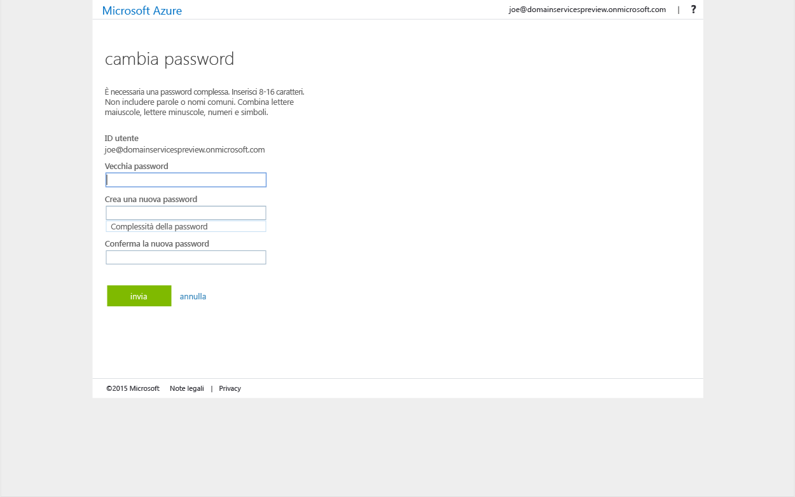

<properties
	pageTitle="Anteprima di Servizi di dominio Azure Active Directory: Introduzione | Microsoft Azure"
	description="Introduzione a Servizi di dominio Azure Active Directory"
	services="active-directory-ds"
	documentationCenter=""
	authors="mahesh-unnikrishnan"
	manager="udayh"
	editor="curtand"/>

<tags
	ms.service="active-directory-ds"
	ms.workload="identity"
	ms.tgt_pltfrm="na"
	ms.devlang="na"
	ms.topic="article"
	ms.date="11/09/2015"
	ms.author="maheshu"/>

# Servizi di dominio Azure AD *(anteprima)* - Introduzione

## Passaggio 5: Abilitare la sincronizzazione password
Dopo aver abilitato Servizi di dominio Azure AD per il tenant di Azure AD, il passaggio successivo prevede di abilitare la sincronizzazione delle password. Ciò consente agli utenti di accedere al dominio usando le credenziali aziendali.

I passaggi sono diversi a seconda che l'organizzazione sia un tenant di Azure AD basato solo sul cloud o sia impostata per la sincronizzazione con la directory locale tramite Azure AD Connect.

### Tenant solo cloud - Abilitare la generazione di hash di credenziali NTLM e Kerberos in Azure AD
Se l'organizzazione è un tenant di Azure AD solo cloud, gli utenti che devono usare Servizi di dominio Azure AD dovranno modificare le loro password. Questa operazione attiva la generazione in Azure AD degli hash delle credenziali richiesti da Servizi di dominio Azure AD per l'autenticazione Kerberos e NTLM. È possibile impostare come scadute le password per tutti gli utenti nel tenant che dovranno usare Servizi di dominio Azure AD oppure richiedere a tali utenti di cambiare le loro password.

Ecco le istruzioni che è necessario fornire agli utenti per modificare le password:

1. Passare alla pagina del pannello di accesso di Azure AD per l'organizzazione. In genere è disponibile all'indirizzo [http://myapps.microsoft.com](http://myapps.microsoft.com).
2. Selezionare la scheda **Profilo** in questa pagina.
3. Fare clic sul riquadro **Cambia password** in questa pagina per avviare una modifica della password.

    

4. Verrà visualizzata la pagina **Cambia password**. Gli utenti possono immettere la password esistente (precedente) e continuare con la modifica della password.

    

Dopo la modifica, la nuova password sarà utilizzabile in Servizi di dominio Azure AD dopo breve tempo. Dopo alcuni minuti, gli utenti possono accedere ai computer aggiunti al dominio gestito mediante la propria password appena modificata.


### Tenant sincronizzati - Abilita la sincronizzazione di hash di credenziali NTLM e Kerberos in Azure AD
Se il tenant di Azure AD per l'organizzazione è impostato per la sincronizzazione con la directory locale tramite Azure AD Connect, sarà necessario configurare Azure AD Connect per sincronizzare gli hash delle credenziali necessari per l'autenticazione NTLM e Kerberos. Questi hash non sono sincronizzati con Azure AD per impostazione predefinita e la procedura seguente consentirà di abilitare la sincronizzazione degli hash nel tenant di Azure AD.

#### Installare o aggiornare Azure AD Connect

Sarà necessario installare l’ultima versione consigliata a livello generale di Azure AD Connect in un computer aggiunto a un dominio. Se si dispone di un'istanza esistente del programma di installazione di Azure AD Connect, sarà necessario aggiornarla per usare la build disponibile a livello generale di Azure AD Connect. Accertarsi di utilizzare la versione corrente di Azure AD Connect, al fine di evitare i problemi/bug noti.

**[Scaricare Azure AD Connect](http://www.microsoft.com/download/details.aspx?id=47594)**

Versione minima consigliata: **1.0.9125** - pubblicata il 3 novembre 2015.

  >[AZURE.WARNING]L'installazione dell’ultima versione consigliata di Azure AD Connect è NECESSARIA per abilitare le credenziali di password legacy (obbligatorio per l'autenticazione NTLM e Kerberos) da sincronizzare nel tenant di Azure AD. Questa funzionalità non è disponibile nelle versioni precedenti di Azure AD Connect o con lo strumento DirSync legacy.

NOTA: non è più necessario creare la chiave del registro 'EnableWindowsLegacyCredentialsSync' con la versione più recente di Azure AD Connect (ad esempio 1.0.9125 e versioni successive).

Le istruzioni per l'installazione di Azure AD Connect sono disponibili nell'articolo [Introduzione ad Azure AD Connect](../active-directory/active-directory-aadconnect.md).


#### Forzare la sincronizzazione password in Azure AD

Per forzare la sincronizzazione password completa e abilitare la sincronizzazione degli hash delle password per tutti gli utenti (inclusi gli hash delle credenziali necessari per l'autenticazione NTLM o Kerberos) nel tenant di Azure AD, eseguire lo script di PowerShell seguente in ogni foresta di Active Directory.

```
$adConnector = "<CASE SENSITIVE AD CONNECTOR NAME>"  
$azureadConnector = "<CASE SENSITIVE AZURE AD CONNECTOR NAME>"  
Import-Module adsync  
$c = Get-ADSyncConnector -Name $adConnector  
$p = New-Object Microsoft.IdentityManagement.PowerShell.ObjectModel.ConfigurationParameter "Microsoft.Synchronize.ForceFullPasswordSync", String, ConnectorGlobal, $null, $null, $null
$p.Value = 1  
$c.GlobalParameters.Remove($p.Name)  
$c.GlobalParameters.Add($p)  
$c = Add-ADSyncConnector -Connector $c  
Set-ADSyncAADPasswordSyncConfiguration -SourceConnector $adConnector -TargetConnector $azureadConnector -Enable $false   
Set-ADSyncAADPasswordSyncConfiguration -SourceConnector $adConnector -TargetConnector $azureadConnector -Enable $true  
```

A seconda delle dimensioni della directory (numero di utenti, gruppi e così via), la sincronizzazione delle credenziali in Azure AD richiederà del tempo. Le password saranno utilizzabili nel dominio gestito dei servizi di dominio Azure Active Directory non appena le hash di credenziali saranno sincronizzate con Azure.

<!---HONumber=Nov15_HO3-->