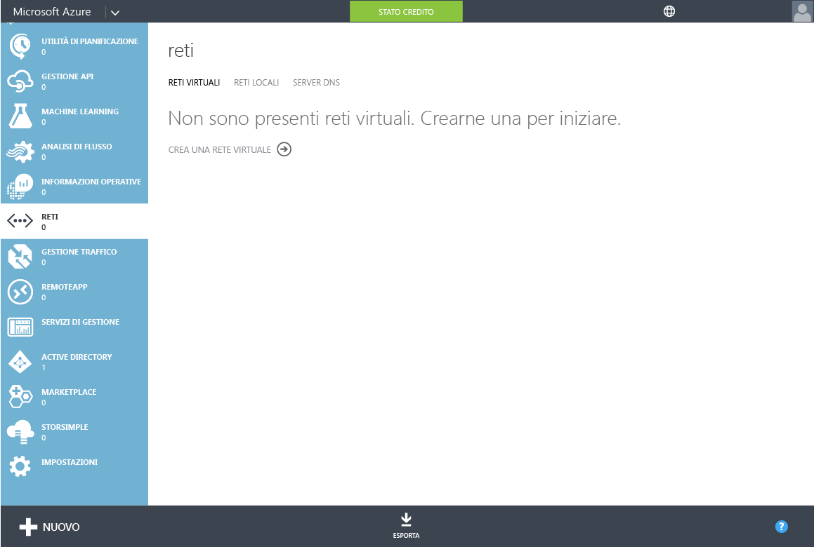
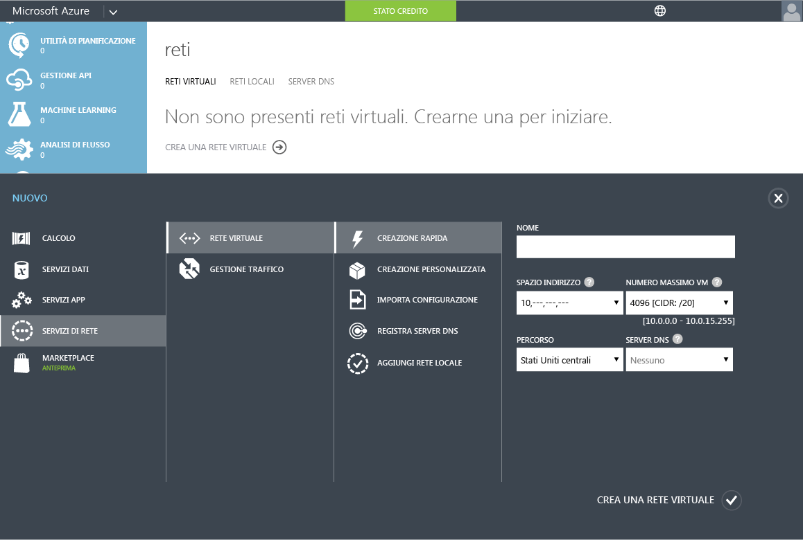
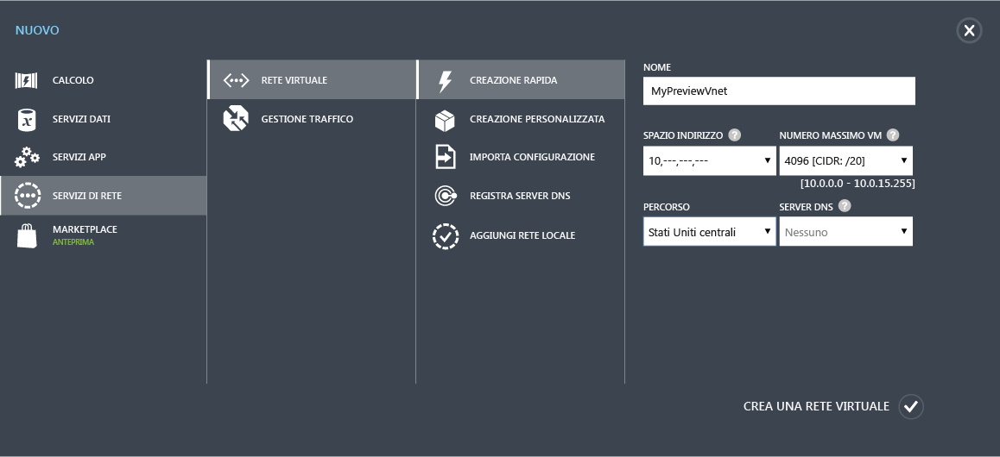
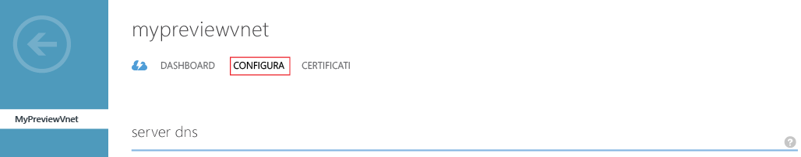
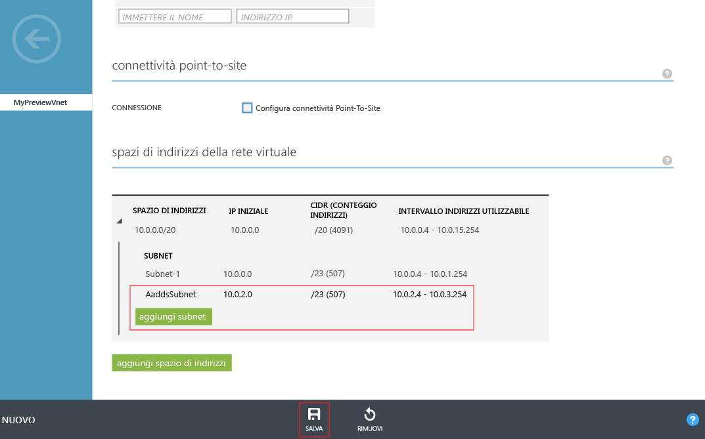

# Creare o selezionare una rete virtuale per Azure Active Directory Domain Services

## Prima di iniziare
Fare riferimento a [Considerazioni sulla rete per Azure Active Directory Domain Services](active-directory-ds-networking.md).

## Attività 2: Creare una rete virtuale di Azure
L'attività di configurazione successiva consiste nel creare una rete virtuale di Azure e la relativa subnet. Abilitare Azure Active Directory Domain Services in questa subnet all'interno della rete virtuale. Se si dispone di una rete virtuale esistente che si preferisce usare è possibile ignorare questo passaggio.

> [!NOTE]
> Assicurarsi che la rete virtuale di Azure che si crea o si sceglie di usare con Azure Active Directory Domain Services appartenga a un'area di Azure supportata da Azure Active Directory Domain Services. Per conoscere le aree di Azure in cui è disponibile Azure Active Directory Domain Services, vedere i [servizi di Azure per area](https://azure.microsoft.com/regions/#services/).
>
>Prendere nota del nome della rete virtuale per assicurarsi di selezionare la rete virtuale corretta al momento dell'abilitazione di Azure Active Directory Domain Services in un passaggio di configurazione successivo.

Per creare una rete virtuale di Azure in cui si desidera abilitare Azure Active Directory Domain Services, seguire queste istruzioni di configurazione:

1. Passare al [portale di Azure classico](https://manage.windowsazure.com).
2. Nel riquadro sinistro selezionare **Reti**.

      
    Si apre la finestra **Reti virtuali**.
3. Fare clic su **Nuovo** nel riquadro attività nella parte inferiore della finestra.

    
4. Fare clic su **Servizi di rete**, quindi selezionare **Rete virtuale**.

    
5. Fare clic su **Creazione rapida** per creare una rete virtuale.

6. Specificare un **Nome** per la virtuale di rete e provare a eseguire le operazioni seguenti:
    * Si può scegliere di configurare i campi **Spazio indirizzo** o **Numero massimo VM** per la rete.
    * Per il momento è possibile confermare l'impostazione **Nessuno** per **Server DNS**. È possibile aggiornare l'impostazione dopo l'abilitazione di Azure Active Directory Domain Services.
7. Selezionare un'area di Azure supportata nell'elenco a discesa **Località**.  
    Per conoscere le aree di Azure in cui è disponibile Azure Active Directory Domain Services, vedere i [servizi di Azure per area](https://azure.microsoft.com/regions/#services/).
8. Per creare la rete virtuale, fare clic sul pulsante **Crea rete virtuale**.

    
9. Dopo aver creato la rete virtuale, selezionarle il nome delle rete virtuale e fare clic sulla scheda **Configura**.

    
10. Negli **spazi di indirizzi della rete virtuale**, fare clic su **Aggiungi subnet**, quindi specificare una subnet con il nome **AaddsSubnet**.

    

11. Fare clic su **Salva** per creare la subnet.

## Passaggio successivo
[Attività 3: Abilitare Azure Active Directory Domain Services](active-directory-ds-getting-started-enableaadds.md)

