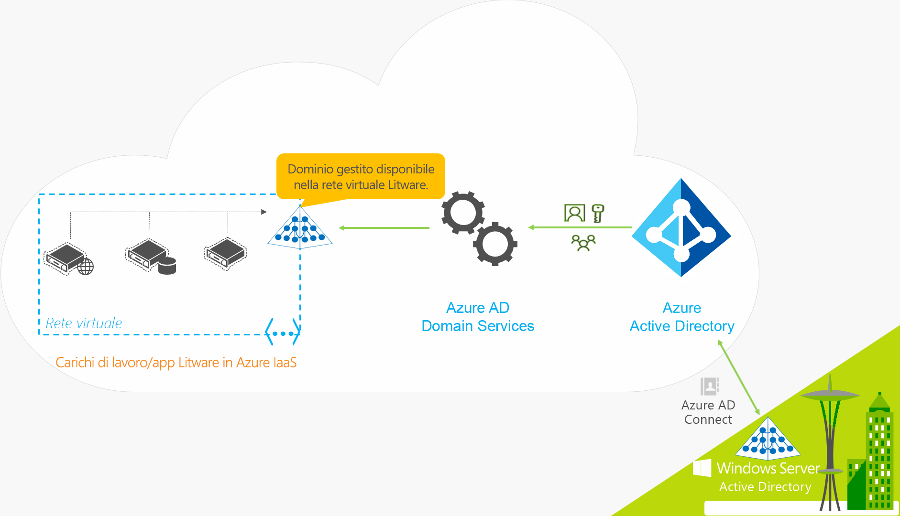
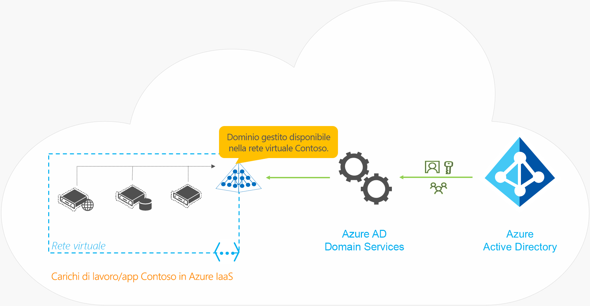

# Che cos'è Azure Active Directory Domain Services?

Azure Active Directory Domain Services (Azure AD DS) offre servizi di dominio gestiti, come l'aggiunta a un dominio, Criteri di gruppo, Lightweight Directory Access Protocol (LDAP) e l'autenticazione Kerberos/NTLM, completamente compatibili con Windows Server Active Directory. È possibile usare questi servizi di dominio senza dover distribuire, gestire e applicare patch ai controller di dominio nel cloud. Azure Active Directory Domain Services si integra con il tenant di Azure AD esistente, consentendo così agli utenti di eseguire l'accesso usando le proprie credenziali già configurate. È anche possibile usare i gruppi e gli account utente esistenti per proteggere l'accesso alle risorse e garantire così un trasferimento in modalità lift-and-shift delle risorse locali in Azure.

Azure Active Directory Domain Services replica le informazioni relative alle identità da Azure AD e quindi funziona con i tenant di Azure AD che esistono solo al livello del cloud o che sono sincronizzati con un ambiente di Active Directory Domain Services locale. Lo stesso set di funzionalità di Azure Active Directory Domain Services è disponibile per entrambi gli ambienti.

* Se è già presente un ambiente di Active Directory Domain Services locale, è possibile sincronizzare le informazioni degli account utente per fornire agli utenti un'identità coerente.
* Per gli ambienti solo cloud, non è necessario un ambiente di Active Directory Domain Services locale tradizionale per usare i servizi di gestione delle identità centralizzati di Azure Active Directory Domain Services.

Il video seguente offre una panoramica del modo in cui Azure Active Directory Domain Services si integra con le applicazioni e i carichi di lavoro per offrire servizi di gestione delle identità nel cloud:

 

>[!VIDEO https://www.youtube.com/embed/T1Nd9APNceQ]

## Modi comuni per fornire soluzioni di gestione delle identità nel cloud

Quando si esegue la migrazione dei carichi di lavoro esistenti nel cloud, le applicazioni compatibili con directory possono usare LDAP per l'accesso in lettura o scrittura a una directory di Active Directory Domain Services locale. Le applicazioni in esecuzione in Windows Server vengono in genere distribuite in macchine virtuali (VM) aggiunte a un dominio e possono quindi essere gestite in modo sicuro tramite Criteri di gruppo. Per autenticare gli utenti finali, le applicazioni possono anche basarsi sull'autenticazione integrata di Windows, ad esempio l'autenticazione Kerberos o NTLM.

Gli amministratori IT usano spesso una delle soluzioni seguenti per fornire un servizio di gestione delle identità alle applicazioni che vengono eseguite in Azure:

* Configurare una connessione VPN da sito a sito tra i carichi di lavoro in esecuzione in Azure e l'ambiente di Active Directory Domain Services locale.
* Creare controller di dominio di replica usando macchine virtuali di Azure per estendere il dominio o la foresta di Active Directory Domain Services.
* Distribuire un ambiente di Active Directory Domain Services autonomo in Azure usando controller di dominio in esecuzione in macchine virtuali di Azure.

Con queste soluzioni, le connessioni VPN alla directory locale rendono le applicazioni vulnerabili a errori o interruzioni di rete temporanee. Se si distribuiscono controller di dominio usando macchine virtuali in Azure, le macchine virtuali del team IT devono eseguire le attività di gestione, protezione, applicazione di patch, monitoraggio, backup e risoluzione dei problemi.

Azure Active Directory Domain Services offre alternative alla necessità di creare connessioni VPN a un ambiente di Active Directory Domain Services locale o di eseguire e gestire macchine virtuali in Azure per fornire servizi di gestione delle identità. Come servizio gestito, Azure Active Directory Domain Services riduce la complessità che comporta la creazione di una soluzione di gestione delle identità integrata per ambienti ibridi e solo cloud.

## Funzionalità e vantaggi di Azure Active Directory Domain Services

Per fornire servizi di gestione delle identità ad applicazioni e macchine virtuali nel cloud, Azure Active Directory Domain Services è completamente compatibile con un ambiente di Active Directory Domain Services tradizionale per operazioni come l'aggiunta a un dominio, LDAP sicuro (LDAPS), la gestione di Criteri di gruppo e DNS e il supporto per la lettura e il binding LDAP. Il supporto per la scrittura LDAP è disponibile per gli oggetti creati nel dominio gestito di Azure Active Directory Domain Services, ma non per le risorse sincronizzate da Azure AD. Le funzionalità di Azure Active Directory Domain Services descritte di seguito semplificano le operazioni di distribuzione e gestione:

* **Esperienza di distribuzione semplificata:** Azure Active Directory Domain Services viene abilitato per il tenant di Azure AD tramite una singola procedura guidata nel portale di Azure.
* **Integrazione con Azure AD:** gli account utente, le appartenenze ai gruppi e le credenziali sono automaticamente disponibili dal tenant di Azure AD. I nuovi utenti, i gruppi o le modifiche relative agli attributi dal tenant di Azure AD o dall'ambiente di Active Directory Domain Services locale vengono sincronizzati automaticamente in Azure Active Directory Domain Services.
    * Gli account in directory esterne collegate all'istanza di Azure AD non sono disponibili in Azure Active Directory Domain Services. Le credenziali non sono disponibili per tali directory esterne e quindi non possono essere sincronizzate in un dominio gestito di Azure Active Directory Domain Services.
* **Usare le credenziali e/o le password aziendali:** le password degli utenti nel tenant di Azure AD sono uguali in Azure Active Directory Domain Services. Gli utenti possono usare le credenziali aziendali per aggiungere macchine virtuali al dominio, accedere in modo interattivo o tramite desktop remoto e autenticarsi nel dominio gestito di Azure Active Directory Domain Services.
* **Autenticazione NTLM e Kerberos:** con il supporto per l'autenticazione NTLM e Kerberos, è possibile distribuire applicazioni basate sull'autenticazione integrata di Windows.
* **Disponibilità elevata:** Azure Active Directory Domain Services include più controller di dominio, che garantiscono la disponibilità elevata per il dominio gestito, con conseguenti vantaggi in termini di tempo di attività del servizio e resilienza agli errori.
    * Nelle aree in cui sono supportate le [zone di disponibilità di Azure][availability-zones], questi controller di dominio vengono distribuiti anche tra le zone per una maggiore resilienza. 

Alcuni aspetti chiave di un dominio gestito di Azure Active Directory Domain Services includono:

* Il dominio gestito di Azure Active Directory Domain Services è un dominio autonomo. Non è un'estensione di un dominio locale.
* Il team IT non deve gestire, applicare patch o monitorare i controller di dominio per questo dominio gestito.

Per gli ambienti ibridi che eseguono Active Directory Domain Services in locale, non è necessario gestire la replica di Active Directory nel dominio gestito di Azure Active Directory Domain Services. Gli account utente, le appartenenze ai gruppi e le credenziali della directory locale vengono sincronizzati in Azure AD tramite [Azure AD Connect][azure-ad-connect]. Gli account utente, le appartenenze ai gruppi e le credenziali sono automaticamente disponibili all'interno del dominio gestito di Azure Active Directory Domain Services.

## Come funziona Azure Active Directory Domain Services?

Per fornire servizi di gestione delle identità, Azure crea un'istanza di Active Directory Domain Services disponibile in una rete virtuale scelta dall'utente. Dietro le quinte, e senza la necessità di operazioni di gestione, protezione o aggiornamento, la ridondanza viene fornita tramite una coppia di controller di dominio Windows Server.

Il dominio gestito di Azure Active Directory Domain Services è configurato in modo da eseguire una sincronizzazione unidirezionale da Azure AD per consentire l'accesso a un set centrale di utenti, gruppi e credenziali. È possibile creare risorse direttamente nel dominio gestito di Azure Active Directory Domain Services, ma queste non vengono sincronizzate con Azure AD. Le applicazioni, i servizi e le macchine virtuali in Azure che si connettono a questa rete virtuale possono quindi usare le funzionalità comuni di Active Directory Domain Services, come l'aggiunta a un dominio, Criteri di gruppo, LDAP e l'autenticazione Kerberos/NTLM.

In un ambiente ibrido con un ambiente di Active Directory Domain Services locale, le informazioni sulle identità vengono sincronizzate con Azure AD tramite [Azure AD Connect][azure-ad-connect].

Per vedere Azure Active Directory Domain Services in azione, è possibile esaminare questi due esempi:

* [Azure Active Directory Domain Services per le organizzazioni ibride](#azure-ad-ds-for-hybrid-organizations)
* [Azure Active Directory Domain Services per le organizzazioni solo cloud](#azure-ad-ds-for-cloud-only-organizations)

### Azure Active Directory Domain Services per le organizzazioni ibride

Molte organizzazioni eseguono un'infrastruttura ibrida che include i carichi di lavoro di applicazioni cloud e locali. Le applicazioni legacy di cui è stata eseguita la migrazione in Azure nell'ambito di una strategia di trasferimento in modalità lift-and-shift possono usare le connessioni LDAP tradizionali per fornire informazioni sulle identità. Per supportare questa infrastruttura ibrida, è possibile sincronizzare le informazioni sulle identità da un ambiente di Active Directory Domain Services locale a un tenant di Azure AD. Azure Active Directory Domain Services fornisce quindi a queste applicazioni legacy in Azure un'origine di identità, senza che sia necessario configurare e gestire la connettività delle applicazioni in servizi di directory locali.

Di seguito è riportato un esempio di Litware Corporation, un'organizzazione ibrida che esegue risorse in locale e in Azure:

* I carichi di lavoro di server e applicazioni che richiedono servizi di dominio sono distribuiti in una rete virtuale in Azure.
    * Tra queste applicazioni possono essere incluse le applicazioni legacy di cui è stata eseguita la migrazione in Azure come parte di una strategia di trasferimento in modalità lift-and-shift.
* Per sincronizzare le informazioni relative alle identità della directory locale con il tenant di Azure AD, Litware Corporation distribuisce [Azure AD Connect][azure-ad-connect].
    * Le informazioni sulle identità che vengono sincronizzate includono gli account utente e le appartenenze ai gruppi.
* Il team IT di Litware abilita Azure Active Directory Domain Services per il tenant di Azure AD in questa rete virtuale o in una con peering.
* Le applicazioni e le macchine virtuali distribuite all'interno della rete virtuale di Azure possono quindi usare le funzionalità di Azure Active Directory Domain Services come l'aggiunta a un dominio, la lettura e il binding LDAP, l'autenticazione NTLM e Kerberos e Criteri di gruppo.

> [!IMPORTANT]
> Azure AD Connect deve essere installato e configurato solo per la sincronizzazione con gli ambienti Active Directory Domain Services locali. Non è supportata l'installazione di Azure AD Connect in un dominio gestito di Azure Active Directory Domain Services per sincronizzare gli oggetti con Azure AD.

### Azure Active Directory Domain Services per le organizzazioni solo cloud

Un tenant di Azure AD solo cloud non ha un'origine di identità locale. Gli account utente e le appartenenze ai gruppi, ad esempio, vengono creati e gestiti direttamente in Azure AD.

Si esaminerà ora un esempio per Contoso, un'organizzazione solo cloud che usa solo Azure AD per le identità. Tutte le identità degli utenti, le relative credenziali e le appartenenze ai gruppi vengono create e gestite in Azure AD. Non esiste alcuna configurazione aggiuntiva di Azure AD Connect per sincronizzare le informazioni sulle identità da una directory locale.

* I carichi di lavoro di server e applicazioni che richiedono servizi di dominio sono distribuiti in una rete virtuale in Azure.
* Il team IT di Contoso abilita Azure Active Directory Domain Services per il tenant di Azure AD in questa rete virtuale o in una con peering.
* Le applicazioni e le macchine virtuali distribuite all'interno della rete virtuale di Azure possono quindi usare le funzionalità di Azure Active Directory Domain Services come l'aggiunta a un dominio, la lettura e il binding LDAP, l'autenticazione NTLM e Kerberos e Criteri di gruppo.

## Passaggi successivi

Per altre informazioni sul confronto tra Azure Active Directory Domain Services e altre soluzioni di gestione delle identità e sulla modalità di funzionamento della sincronizzazione, vedere gli articoli seguenti:

* [Confrontare Azure AD DS con Azure AD, Active Directory Domain Services in macchine virtuali di Azure e Active Directory Domain Services in locale][compare]
* [Informazioni sulla sincronizzazione di Azure Active Directory Domain Services con la directory di Azure AD][synchronization]

Per iniziare, [creare un dominio gestito di Azure Active Directory Domain Services usando il portale di Azure][tutorial-create].

<!-- INTERNAL LINKS -->
[compare]: compare-identity-solutions.md
[synchronization]: synchronization.md
[tutorial-create]: tutorial-create-instance.md
[azure-ad-connect]: ../active-directory/hybrid/whatis-azure-ad-connect.md
[password-hash-sync]: ../active-directory/hybrid/how-to-connect-password-hash-synchronization.md
[availability-zones]: ../availability-zones/az-overview.md
