<properties
	pageTitle="Active Directory Federation Services in Azure | Microsoft Azure"
	description="Questo documento illustra come distribuire AD FS in Azure per ottenere una disponibilità elevata."
    keywords="introduzione ad AD FS, Azure, panoramica di Azure AD Connect, AD FS in Azure, iaas, AD FS"
	services="active-directory"
	documentationCenter=""
	authors="anandyadavmsft"
	manager="femila"
	editor=""/>

<tags
	ms.service="active-directory"
	ms.workload="identity"
	ms.tgt_pltfrm="na"
	ms.devlang="na"
	ms.topic="get-started-article"
	ms.date="07/13/2016"
	ms.author="anandy;billmath"/>

# Distribuzione di AD FS in Azure 

AD FS offre funzionalità di federazione delle identità e Single Sign-On (SSO) Web protette e semplificate. La federazione con Azure AD o O365 consente agli utenti di eseguire l'autenticazione con credenziali locali e accedere a tutte le risorse nel cloud. Di conseguenza, diventa importante la presenza di un'infrastruttura AD FS a disponibilità elevata per garantire l'accesso alle risorse sia in locale sia nel cloud. La distribuzione di AD FS in Azure consente di raggiungere facilmente la disponibilità elevata necessaria. Distribuire AD FS in Azure offre diverse vantaggi. Di seguito ne sono elencati alcuni.

* **Disponibilità elevata**: gli avanzati set di disponibilità di Azure assicurano un'infrastruttura a disponibilità elevata.
* **Scalabilità semplificata**: se sono necessarie prestazioni superiori, è possibile eseguire facilmente la migrazione a computer più potenti con pochi clic in Azure.
* **Ridondanza tra diverse aree geografiche**: la ridondanza geografica di Azure assicura la disponibilità elevata dell'infrastruttura a livello globale.
* **Facilità di gestione**: le opzioni di gestione estremamente semplificate del portale di Azure consentono di gestire l'infrastruttura con la massima facilità.

## Principi di progettazione

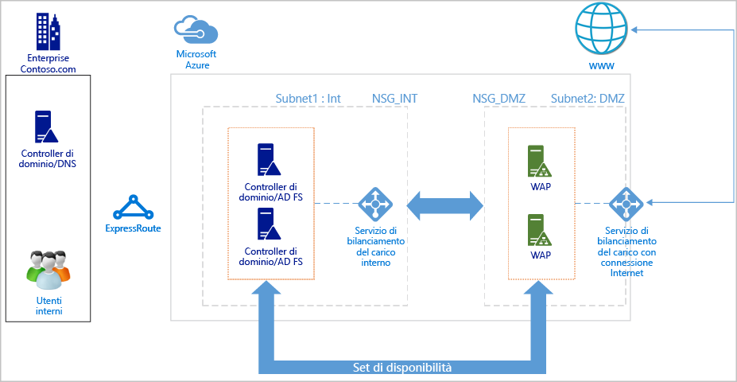

Il diagramma riportato sopra illustra la topologia di base consigliata come punto di partenza per la distribuzione di un'infrastruttura AD FS in Azure. Di seguito sono elencati i principi alla base dei vari componenti della topologia.

* **Controller di dominio/server AD FS**: se il numero di utenti è inferiore a 1.000, è sufficiente installare il ruolo AD FS nei controller di dominio. Se si vuole evitare qualsiasi impatto sulle prestazioni dei controller di dominio o sono presenti più di 1.000 utenti, distribuire AD FS su server separati.
* **Server WAP**: è necessario per distribuire server proxy applicazione Web in modo che gli utenti possano raggiungere AD FS anche quando si trovano all'esterno della rete aziendale.
* **Rete perimetrale**: i server proxy applicazione Web verranno inseriti nella rete perimetrale e tra la rete perimetrale e la subnet interna sarà consentito SOLO l'accesso TCP/443.
* **Servizi di bilanciamento del carico**: per garantire la disponibilità elevata dei server proxy applicazione Web e AD FS è consigliabile usare un servizio di bilanciamento del carico interno per i server AD FS e Azure Load Balancer per i server proxy applicazione Web.
* **Set di disponibilità**: per implementare la ridondanza nella distribuzione di AD FS, è consigliabile raggruppare due o più macchine virtuali in un set disponibilità per carichi di lavoro simili. Questa configurazione assicura che durante un evento di manutenzione pianificata o non pianificata sia disponibile almeno una macchina virtuale.
* **Account di archiviazione**: è consigliabile avere due account di archiviazione. Un singolo account di archiviazione può determinare un singolo punto di guasto e causare l'indisponibilità della distribuzione nell'improbabile scenario in cui l'account di archiviazione diventi inattivo. Con due account di archiviazione è possibile associare un account di archiviazione per ogni linea di guasto.
* **Separazione delle reti**: i server proxy applicazione Web verranno distribuiti in una rete perimetrale separata. È possibile dividere una rete virtuale in due subnet e quindi distribuire i server proxy applicazione Web in una subnet isolata. È sufficiente configurare le impostazioni dei gruppi di sicurezza di rete per ogni subnet e consentire solo la comunicazione necessaria tra le due subnet. Altri dettagli sono riportati di seguito per i singoli scenari di distribuzione.

##Passaggi per la distribuzione di AD FS in Azure

I passaggi indicati in questa sezione offrono una guida per distribuire l'infrastruttura AD FS illustrata di seguito in Azure.

### 1\. Distribuire la rete

Come indicato in precedenza, è possibile creare due subnet in una singola rete virtuale oppure creare due reti virtuali completamente diverse. Questo articolo è incentrato sulla distribuzione di una singola rete virtuale e sulla relativa divisione in due subnet. È attualmente un approccio più semplice perché due reti virtuali separate richiederebbero un gateway da rete virtuale a rete virtuale per le comunicazioni.

**1.1 Creare una rete virtuale**

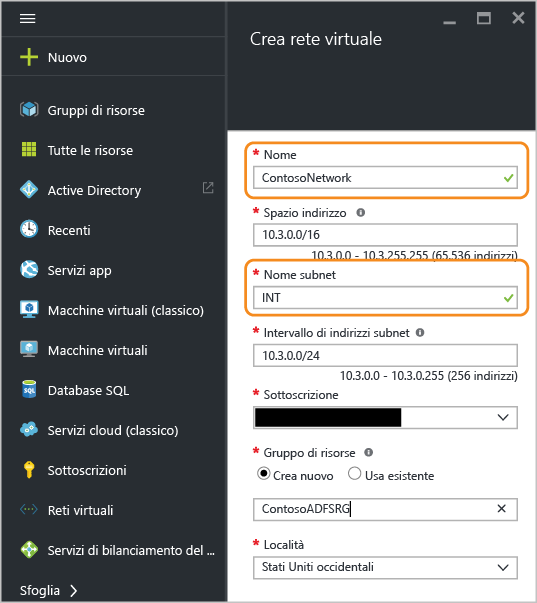
	
Nel portale di Azure selezionare la rete virtuale. È possibile distribuire immediatamente la rete virtuale e una subnet con un solo clic. Viene definita anche la subnet INT, che è pronta per l'aggiunta di VM. Il passaggio successivo consiste nell'aggiungere un'altra subnet (denominata "DMZ") alla rete. Per creare la subnet DMZ, è sufficiente:

* Selezionare la rete appena creata
* Nelle proprietà selezionare Subnet
* Nel pannello Subnet fare clic sul pulsante di aggiunta
* Specificare il nome della subnet e le informazioni relative allo spazio indirizzi per creare la subnet

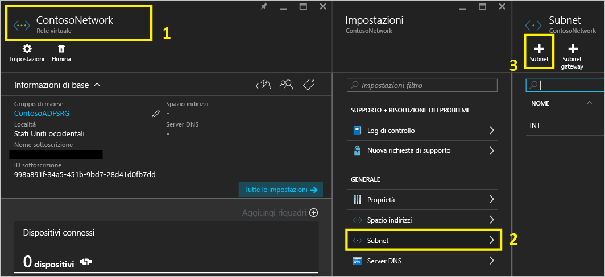

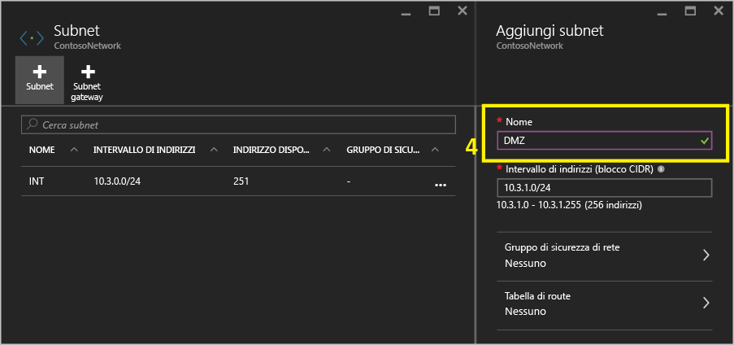

**1.2. Creare i gruppi di sicurezza di rete**

Un gruppo di sicurezza di rete (NSG) contiene un elenco di regole dell'elenco di controllo di accesso (ACL) che consentono o rifiutano il traffico di rete alle istanze di VM in una rete virtuale. I gruppi di sicurezza di rete possono essere associati a subnet o singole istanze VM in una subnet. Quando un gruppo di sicurezza di rete viene associato a una subnet, le regole ACL si applicano a tutte le istanze di VM in tale subnet. Ai fini di questa guida, verranno creati due gruppi di sicurezza di rete, uno per una rete interna e uno per una rete perimetrale, denominati rispettivamente NSG\_INT e NSG\_DMZ.

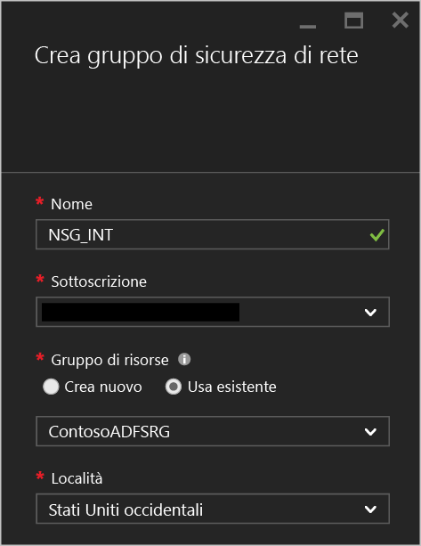

Al termine della creazione del gruppo di sicurezza di rete, esisteranno 0 regole in ingresso e 0 in uscita. Dopo che i ruoli nei rispettivi server sono installati e funzionanti, è possibile definire le regole in ingresso e in uscita in base al livello di sicurezza desiderato.

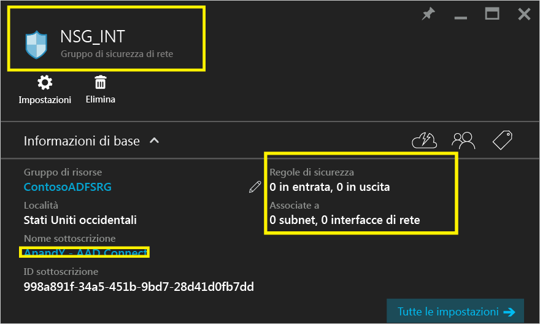

Al termine della creazione dei gruppi di sicurezza di rete, associare NSG\_INT alla subnet INT e NSG\_DMZ alla subnet DMZ. Di seguito è riportato uno screenshot di esempio:

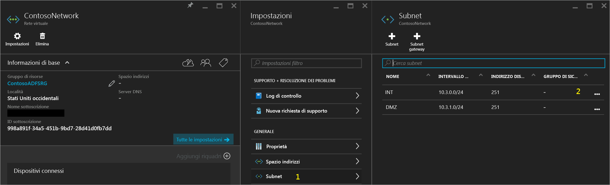

* Fare clic su Subnet per aprire il pannello delle subnet
* Selezionare la subnet da associare al gruppo di sicurezza di rete

Al termine della configurazione, il pannello Subnet avrà l'aspetto seguente:

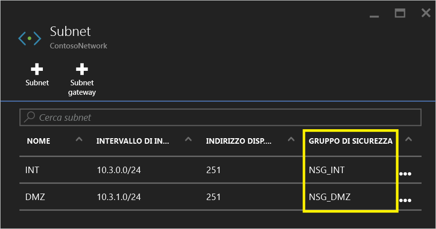

**1.3. Creare una connessione all'ambiente locale**

Per distribuire il controller di dominio in Azure sarà necessaria una connessione all'ambiente locale. Azure offre varie opzioni di connettività per connettere l'infrastruttura locale all'infrastruttura di Azure.

* Da punto a sito
* Da sito a sito di rete virtuale
* ExpressRoute

È consigliabile usare ExpressRoute. ExpressRoute consente di creare connessioni private tra i data center di Azure e l'infrastruttura disponibile localmente o in un ambiente con percorso condiviso. Le connessioni ExpressRoute non sfruttano la rete Internet pubblica. Queste connessioni offrono maggiore affidabilità, velocità più elevate, latenze minori e sicurezza superiore rispetto alle tipiche connessioni tramite Internet. Nonostante sia consigliabile usare ExpressRoute, si può scegliere qualsiasi metodo di connessione sia più adatto per l'organizzazione. Per altre informazioni su ExpressRoute e sulle varie opzioni di connettività con ExpressRoute, vedere [Panoramica tecnica relativa a ExpressRoute](https://aka.ms/Azure/ExpressRoute).

### 2\. Creare gli account di archiviazione

Per mantenere una disponibilità elevata e non dipendere da un singolo account di archiviazione, è possibile creare due account di archiviazione. Dividere i computer di ogni set di disponibilità in due gruppi e assegnare quindi a ogni gruppo un account di archiviazione separato. Tenere presente che viene fatturato solo l'utilizzo effettivo della risorsa di archiviazione.

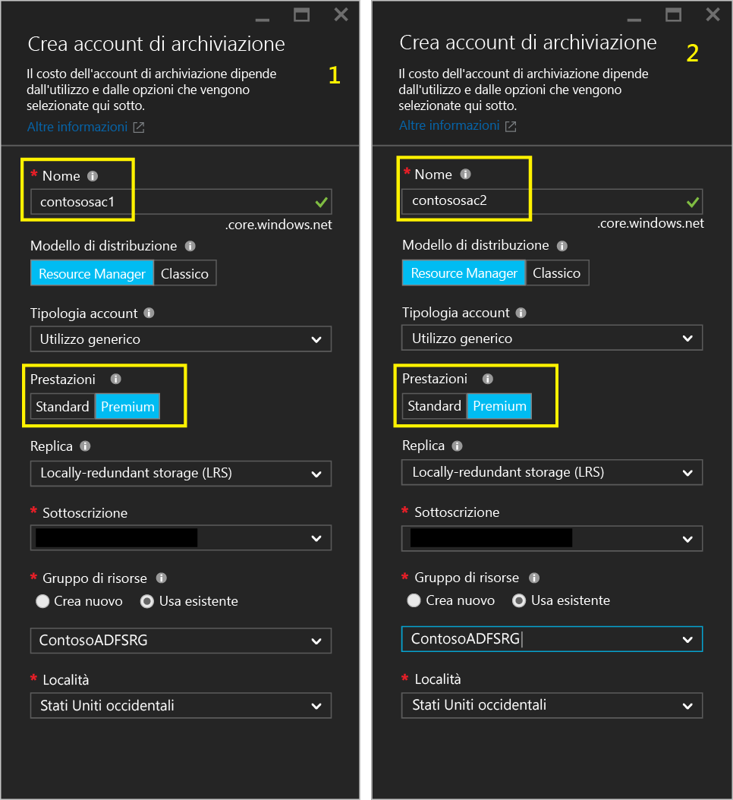

### 3\. Creare set di disponibilità

Per ogni ruolo (controller di dominio/AD FS e WAP), creare set di disponibilità contenenti almeno 2 computer ognuno. Sarà così possibile ottenere una disponibilità più elevata per ogni ruolo. Durante la creazione dei set di disponibilità, è essenziale stabilire quanto segue.
* **Domini di errore**: le macchine virtuali nello stesso dominio di errore condividono la stessa alimentazione e lo stesso commutatore di rete fisico. È consigliabile usare almeno 2 domini di errore. Ai fini di questa distribuzione può essere mantenuto il valore predefinito di 3.
* **Domini di aggiornamento**: i computer appartenenti allo stesso dominio di aggiornamento vengono riavviati insieme nel corso di un aggiornamento. È opportuno avere almeno 2 domini di aggiornamento. Ai fini di questa distribuzione può essere mantenuto il valore predefinito di 5.

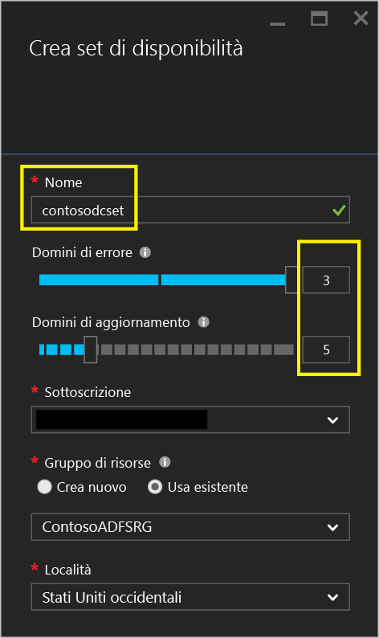

Creare i set di disponibilità seguenti

| Set di disponibilità | Ruolo | Domini di errore | Domini di aggiornamento |
|:----------------:|:----:|:-----------:|:-----------|
| contosodcset | Controller di dominio/AD FS | 3 | 5 |
| contosowapset | WAP | 3 | 5 |

### 4\. Distribuire le macchine virtuali
Il passaggio successivo consiste nel distribuire le macchine virtuali che ospiteranno i diversi ruoli nell'infrastruttura. In ogni set di disponibilità è consigliato un minimo di due computer. Creare sei macchine virtuali per la distribuzione di base.

| Machine | Ruolo | Subnet | Set di disponibilità | Account di archiviazione | Indirizzo IP |
|:-----:|:-----:|:-----:|:-----:|:-----:|:-----:|
|contosodc1|Controller di dominio/AD FS|INT|contosodcset|contososac1|Static|
|contosodc2|Controller di dominio/AD FS|INT|contosodcset|contososac2|Static|
|contosowap1|WAP|DMZ|contosowapset|contososac1|Static|
|contosowap2|WAP|DMZ|contosowapset|contososac2|Static|

Come è possibile osservare, non sono stati specificati gruppi di sicurezza di rete. Ciò è dovuto al fatto che Azure consente di usare un gruppo di sicurezza di rete a livello di subnet. È quindi possibile controllare il traffico di rete dei computer con il singolo gruppo di sicurezza di rete associato alla subnet o alla scheda di interfaccia di rete. Per altre informazioni, vedere [Che cos'è un gruppo di sicurezza di rete](https://aka.ms/Azure/NSG). Se si gestisce il DNS, è consigliabile usare un indirizzo IP statico. È possibile usare il DNS di Azure e nei record DNS per il dominio fare invece riferimento ai nuovi computer con i relativi FQDN di Azure. Al termine della distribuzione, il riquadro relativo alle macchine virtuali avrà l'aspetto seguente:

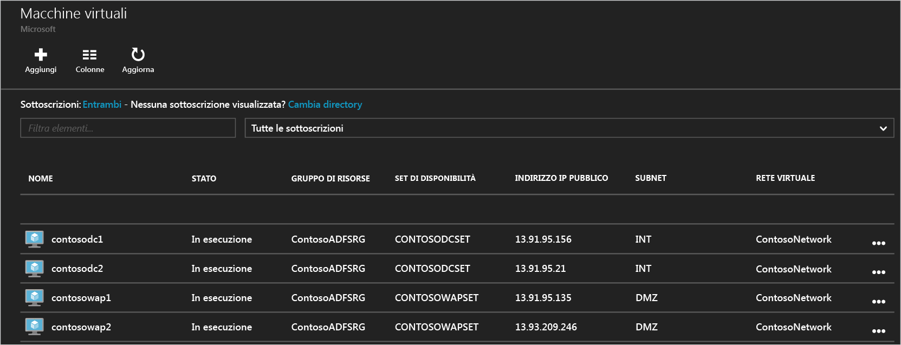

### 5\. Configurare controller di dominio e server AD FS
 Per autenticare qualsiasi richiesta in ingresso, AD FS dovrà contattare il controller di dominio. Per evitare il costoso trasferimento da Azure al controller di dominio locale per l'autenticazione, è consigliabile distribuire una replica del controller di dominio in Azure. Per ottenere una disponibilità elevata, è consigliabile creare un set di disponibilità con almeno 2 controller di dominio.

|Controller di dominio|Ruolo|Account di archiviazione|
|:-----:|:-----:|:-----:|
|contosodc1|Replica|contososac1|
|contosodc2|Replica|contososac2|

* Innalzare i due server al livello di controller di dominio di replica con DNS
* Configurare i server AD FS installando il ruolo AD FS con Server Manager

###6\. Distribuire il servizio di bilanciamento del carico interno

**6.1. Creare il servizio di bilanciamento del carico interno**

Per distribuire un servizio di bilanciamento del carico interno, selezionare Servizi di bilanciamento del carico nel portale di Azure e fare clic su Aggiungi (+).
>[AZURE.NOTE] Se **Servizi di bilanciamento del carico** non è visibile nel menu, fare clic su **Esplora** in basso a sinistra nel portale e scorrere fino a visualizzare **Servizi di bilanciamento del carico**. Fare quindi clic sulla stella gialla per aggiungere la voce al menu. Selezionare l'icona di nuovo servizio di bilanciamento del carico per aprire il pannello e iniziare la relativa configurazione.

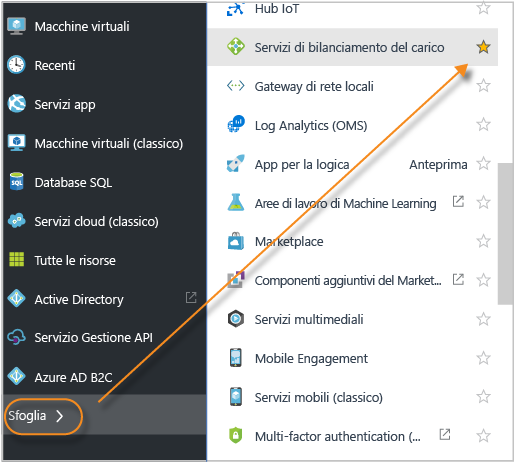

* **Nome**: assegnare qualsiasi nome idoneo al servizio di bilanciamento del carico
* **Schema**: poiché il servizio di bilanciamento del carico verrà inserito a monte dei server AD FS e verrà usato SOLO per le connessioni della rete interna, selezionare "Interno"
* **Rete virtuale**: scegliere la rete virtuale in cui viene distribuito AD FS
* **Subnet**: scegliere la subnet interna
* **Assegnazione indirizzo IP**: Dinamico

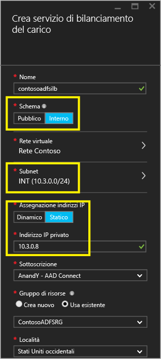
 
Dopo che si è fatto clic su Crea, il servizio di bilanciamento del carico interno viene distribuito e dovrebbe essere visualizzato nell'elenco dei servizi di bilanciamento del carico:

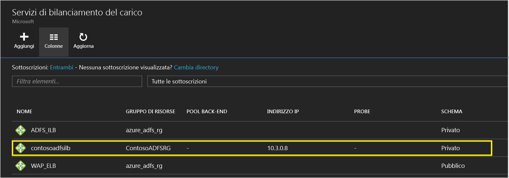
 
Il passaggio successivo consiste nel configurare il pool back-end e il probe del back-end.

**6.2. Configurare il pool back-end del servizio di bilanciamento del carico interno**

Selezionare il servizio di bilanciamento del carico interno appena creato nel pannello Servizi di bilanciamento del carico. Verrà aperto il pannello delle impostazioni.
1.	Selezionare i pool back-end nel pannello delle impostazioni
2.	Nel pannello Aggiungi pool back-end fare clic su Aggiungi una macchina virtuale
3.	Verrà visualizzato un pannello in cui è possibile scegliere un set di disponibilità
4.	Scegliere il set di disponibilità AD FS

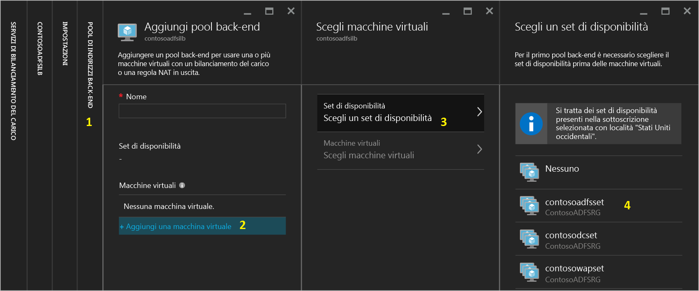
 
**6.3. Configurare il probe**

Nel pannello Impostazioni del servizio di bilanciamento del carico interno selezionare Probe.
1.	Fare clic su Aggiungi
2.	Specificare i dettagli del probe a. **Nome**: nome del probe b. **Protocollo**: TCP c. **Porta**: 443 (HTTPS) d. **Intervallo**: 5 (valore predefinito). È l'intervallo con cui il servizio di bilanciamento del carico interno eseguirà il probe dei computer del pool back-end e. **Soglia di non integrità**: 2 (valore predefinito). È la soglia di errori di probe consecutivi in seguito ai quali il servizio di bilanciamento del carico interno dichiarerà che un computer del pool back-end non risponde e interromperà l'invio di traffico a tale computer.

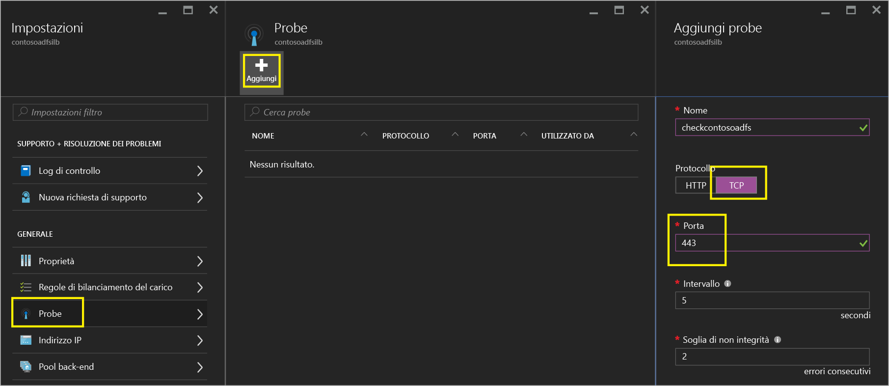
 
**6.4. Creare le regole di bilanciamento del carico**

Per bilanciare efficacemente il traffico, il servizio di bilanciamento del carico interno dovrà essere configurato con regole di bilanciamento del carico. Per creare una regola di bilanciamento del carico:
1.	Selezionare Regole di bilanciamento del carico nel pannello Impostazioni del servizio di bilanciamento del carico interno
2.	Fare clic su Aggiungi nel pannello Regole di bilanciamento del carico
3.	Nel pannello Aggiungi regola di bilanciamento del carico a. **Nome**: specificare un nome per la regola b. **Protocollo**: selezionare TCP c. **Porta**: 443 d. **Porta back-end**: 443 e. **Pool back-end**: selezionare il pool creato in precedenza per il cluster AD FS f. **Probe**: selezionare il probe creato in precedenza per i server AD FS

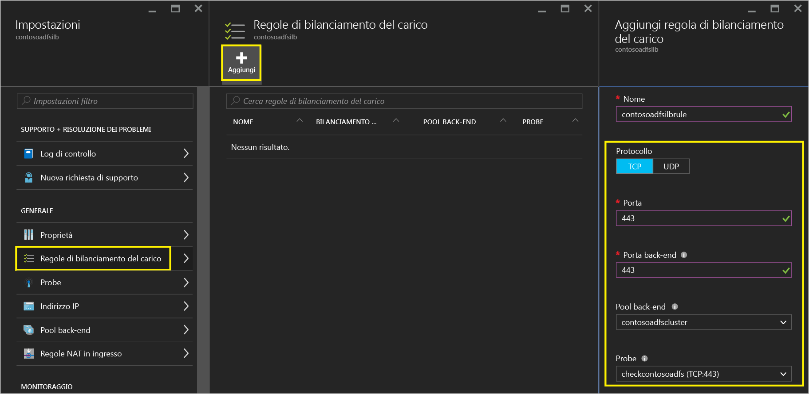

**6.5. Aggiornare il DNS con il servizio di bilanciamento del carico interno**

Passare al server DNS e creare un CNAME per il servizio di bilanciamento del carico interno. Il CNAME dovrà essere creato per il servizio federativo con indirizzo IP che punta all'indirizzo IP del servizio di bilanciamento del carico interno. Se l'indirizzo DIP del servizio di bilanciamento del carico interno è 10.3.0.8 e il servizio federativo installato è fs.contoso.com, ad esempio, creare un CNAME per fs.contoso.com che punta a 10.3.0.8. In questo modo, tutta la comunicazione relativa a fs.contoso.com raggiungerà il servizio di bilanciamento del carico interno e verrà indirizzata correttamente.

###7\. Configurare il server proxy applicazione Web

**7.1. Configurare i server proxy applicazione Web per raggiungere i server AD FS**

Affinché i server proxy applicazione Web possano raggiungere i server AD FS controllati dal servizio di bilanciamento del carico interno, creare un record per il servizio di bilanciamento del carico interno in %systemroot%\\system32\\drivers\\etc\\hosts. Si noti che il nome distinto dovrà essere il nome del servizio federativo, ad esempio fs.contoso.com, e la voce dell'indirizzo IP dovrà essere quella dell'indirizzo IP del servizio di bilanciamento del carico interno (10.3.0.8 nell'esempio).

**7.2. Installare il ruolo Proxy applicazione Web**

Dopo aver verificato che i server proxy applicazione Web possano raggiungere i server AD FS controllati dal servizio di bilanciamento del carico interno, è possibile installare i server proxy applicazione Web. I server proxy applicazione Web non vengono aggiunti al dominio. Installare i ruoli Proxy applicazione Web nei due server proxy applicazione Web selezionando il ruolo Accesso remoto. Server Manager consentirà di completare l'installazione di WAP. Per altre informazioni sulla distribuzione di WAP, vedere [Installare e configurare il server del proxy dell'applicazione Web](https://technet.microsoft.com/library/dn383662.aspx).

###8\. Distribuire il servizio di bilanciamento del carico con connessione Internet (pubblico)

**8.1. Creare il servizio di bilanciamento del carico con connessione Internet (pubblico)**
 
Nel portale di Azure selezionare Servizi di bilanciamento del carico e quindi fare clic su Aggiungi. Nel pannello Crea servizio di bilanciamento del carico immettere le informazioni seguenti.
1. **Nome**: nome del servizio di bilanciamento del carico
2. **Schema**: Pubblico. Questa opzione indica ad Azure che il servizio di bilanciamento del carico dovrà avere un indirizzo pubblico
3. **Indirizzo IP**: creare un nuovo indirizzo IP (dinamico)

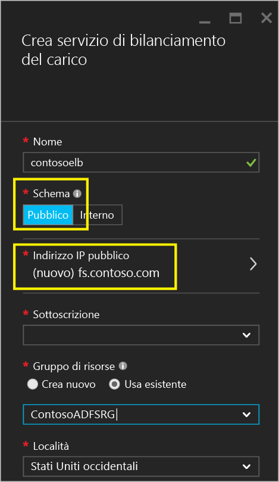

Al termine della distribuzione, il servizio di bilanciamento del carico verrà visualizzato nell'elenco Servizi di bilanciamento del carico.

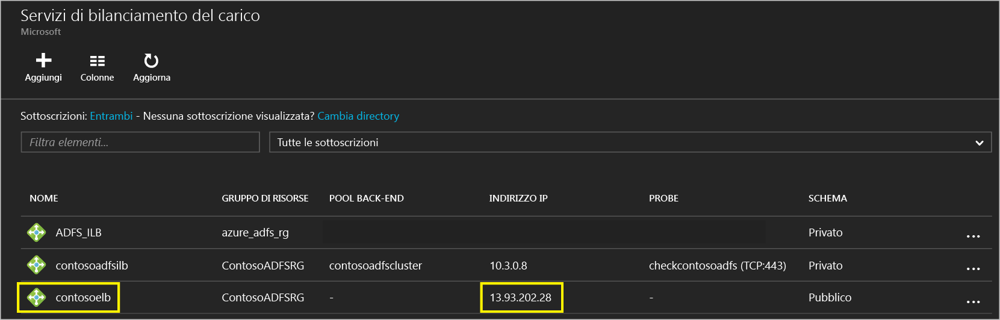
 
**8.2. Assegnare un'etichetta DNS all'IP pubblico**

Fare clic sulla voce del servizio di bilanciamento del carico appena creato nel pannello Servizi di bilanciamento del carico per visualizzare il pannello per la configurazione. Per configurare l'etichetta DNS per l'IP pubblico, seguire questa procedura:
1.	Fare clic sull'indirizzo IP pubblico. Verrà aperto il pannello per l'IP pubblico e le relative impostazioni
2.	Fare clic su Configurazione
3.	Specificare un'etichetta DNS, che diventerà l'etichetta DNS pubblica accessibile da qualsiasi posizione, ad esempio contosofs.westus.cloudapp.azure.com. È possibile aggiungere una voce nel DNS esterno per il servizio federativo (come fs.contoso.com) che verrà risolta nell'etichetta DNS del servizio di bilanciamento del carico esterno (contosofs.westus.cloudapp.azure.com).

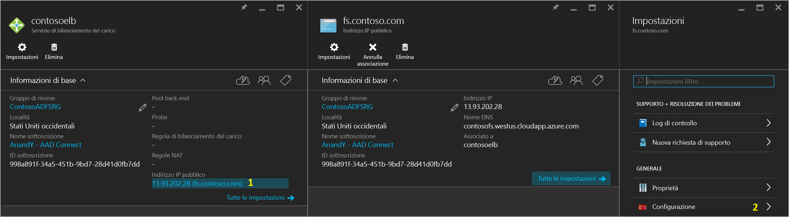

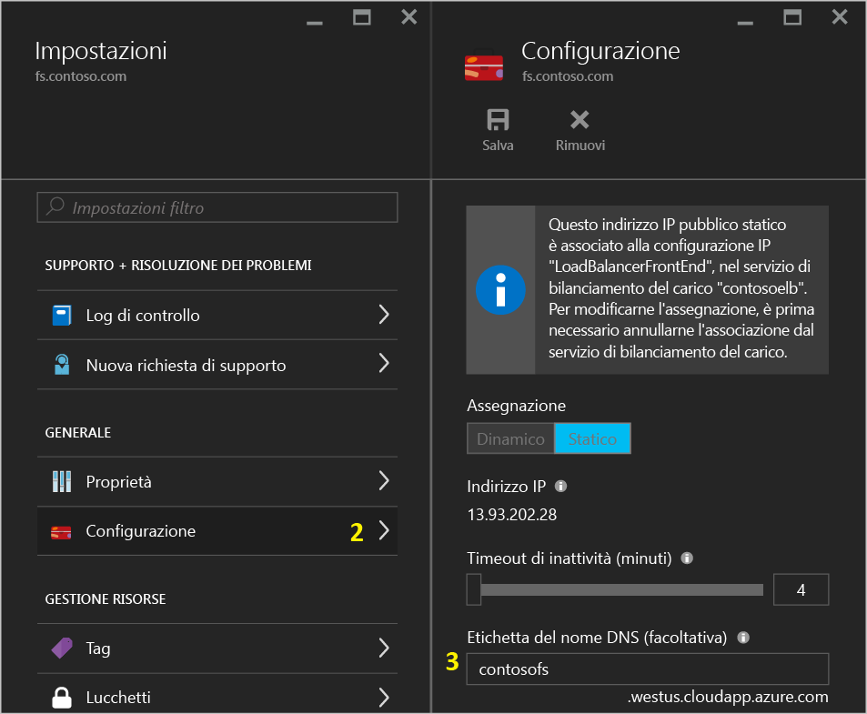

**8.3. Configurare il pool back-end per il servizio di bilanciamento del carico con connessione Internet (pubblico)**

Seguire la stessa procedura indicata per la creazione del servizio di bilanciamento del carico interno per configurare il pool back-end per il servizio di bilanciamento del carico con connessione Internet (pubblico) come set di disponibilità per i server WAP, ad esempio contosowapset.

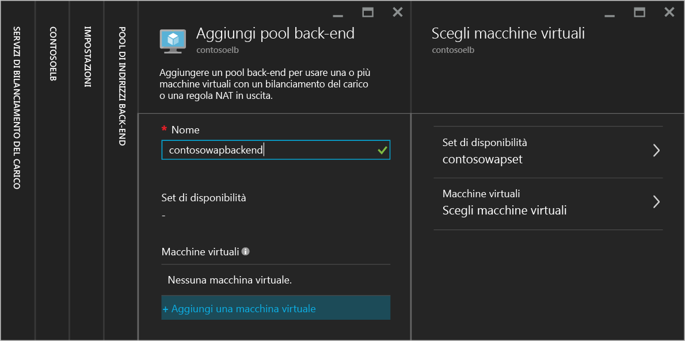
 
**8.4. Configurare il probe**

Seguire la stessa procedura indicata per la configurazione del servizio di bilanciamento del carico interno per configurare il probe per il pool back-end dei server WAP.

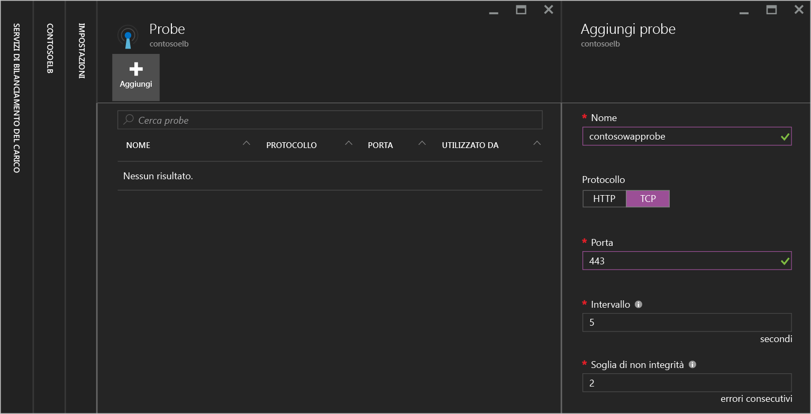
 
**8.5. Creare regole di bilanciamento del carico**

Seguire la stessa procedura indicata per il servizio di bilanciamento del carico interno per configurare la regola di bilanciamento del carico per la porta TCP 443.

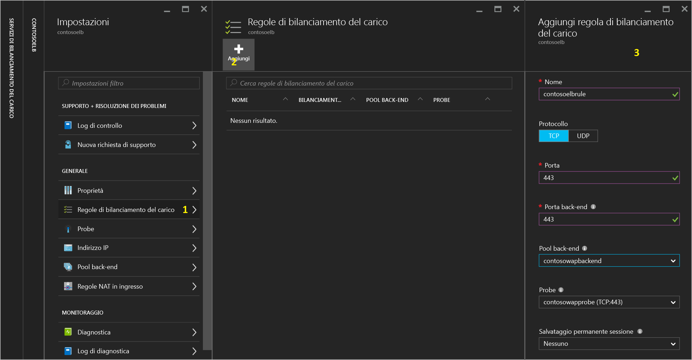
 
###9\. Proteggere la rete

**9.1. Proteggere la subnet interna**

In generale, per proteggere efficacemente la subnet interna sono necessarie le regole seguenti, nell'ordine indicato di seguito.

|Regola|Descrizione|Flusso|
|:----|:----|:------:|
|AllowHTTPSFromDMZ| Consente la comunicazione HTTPS dalla rete perimetrale | In ingresso |
|DenyAllFromDMZ| Questa regola blocca tutto il traffico dalla rete perimetrale alla subnet interna. La regola AllowHTTPSFromDMZ garantisce il passaggio della comunicazione HTTPS e qualsiasi altro tipo di comunicazione viene bloccato da questa regola | In ingresso |
|DenyInternetOutbound| Nessun accesso a Internet | In uscita |

[commento]: <> (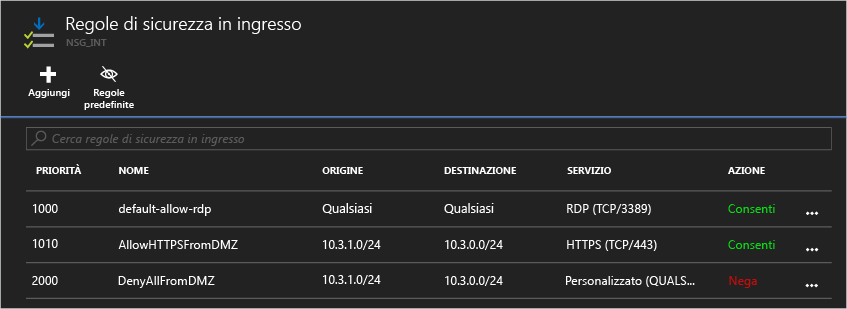) [commento]: <> (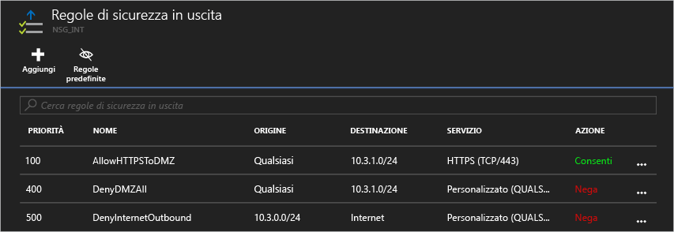)
 
**9.2. Proteggere la subnet perimetrale**

|Regola|Descrizione|Flusso|
|:----|:----|:------:|
|AllowHttpsFromVirtualNetwork| Consente il traffico HTTPS dalla rete virtuale | In ingresso |
|AllowHTTPSInternet| Consente il traffico HTTPS da Internet alla rete perimetrale | In ingresso|
|DenyingressexceptHTTPS| Blocca tutto il traffico non HTTPS da Internet | In ingresso |
|DenyOutToInternet|	Tutto il traffico non HTTPS verso Internet viene bloccato | In uscita |

[commento]: <> (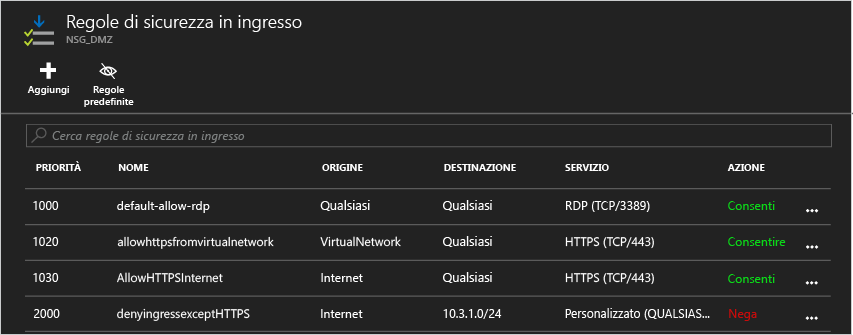) [commento]: <> (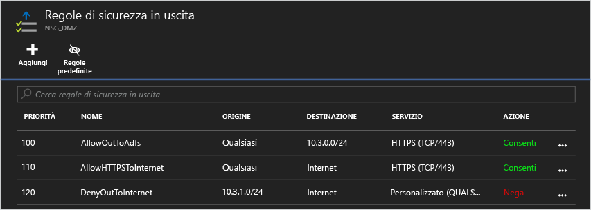)

>[AZURE.NOTE] Se è necessaria l'autenticazione del certificato utente client (autenticazione clientTLS con i certificati utente X509), AD FS richiede l'abilitazione della porta TCP 49443 per l'accesso in ingresso.

###10\. Testare l'accesso ad AD FS

Il modo più semplice per testare AD FS consiste nell'usare la pagina IdpInitiatedSignon.aspx. A tale scopo, è necessario abilitare IdpInitiatedSignOn nelle proprietà di AD FS. Per verificare l'installazione di AD FS, seguire questa procedura.
1.	Eseguire con PowerShell il cmdlet di seguito nel server AD FS per impostare l'abilitazione: Set-AdfsProperties -EnableIdPInitiatedSignonPage $true
2.	Da qualsiasi computer esterno accedere a https://adfs.thecloudadvocate.com/adfs/ls/IdpInitiatedSignon.aspx
3.	La pagina di AD FS dovrebbe essere visualizzata come segue:

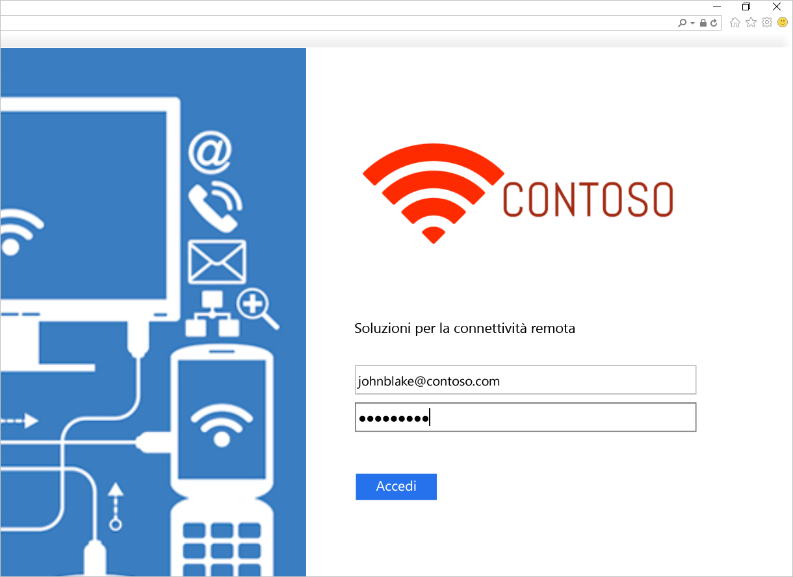

Dopo l'accesso, verrà visualizzato un messaggio di completamento dell'operazione come illustrato di seguito:

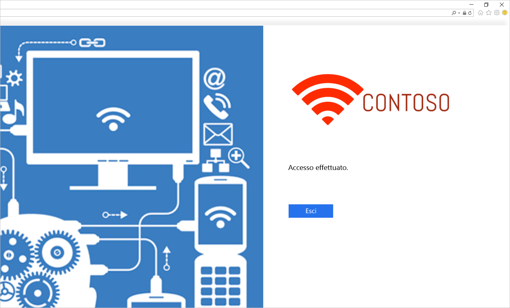

## Risorse aggiuntive
* [SET DI DISPONIBILITÀ](https://aka.ms/Azure/Availability)
* [Servizio di bilanciamento del carico di Azure](https://aka.ms/Azure/ILB)
* [Servizio di bilanciamento del carico interno](https://aka.ms/Azure/ILB/Internal)
* [Servizio di bilanciamento del carico con connessione Internet](https://aka.ms/Azure/ILB/Internet)
* [Account di archiviazione](https://aka.ms/Azure/Storage)
* [Reti virtuali di Azure](https://aka.ms/Azure/VNet)
* [Collegamenti relativi ad AD FS e proxy applicazione Web](http://aka.ms/ADFSLinks)

## Passaggi successivi

* [Integrazione delle identità locali con Azure Active Directory](active-directory-aadconnect.md)
* [Configurazione e gestione di AD FS con Azure AD Connect](active-directory-aadconnectfed-whatis.md)

<!---HONumber=AcomDC_0727_2016-->