<properties
   pageTitle="Microsoft Azure AD Connect - Eseguire l'aggiornamento dallo strumento Microsoft Azure AD Sync (DirSync) | Microsoft Azure"
   description="Informazioni su come eseguire l'aggiornamento da DirSync ad Azure AD Connect. Questo articolo descrive i passaggi necessari per aggiornare lo strumento Microsoft Azure AD Sync (DirSync) ad Azure AD Connect."
   services="active-directory"
   documentationCenter=""
   authors="andkjell"
   manager="stevenpo"
   editor=""/>

<tags
   ms.service="active-directory"
   ms.workload="identity"
   ms.tgt_pltfrm="na"
   ms.devlang="na"
   ms.topic="article"
   ms.date="10/26/2015"
   ms.author="shoatman;billmath"/>

# Aggiornamento dello strumento di sincronizzazione di Microsoft Azure Active Directory (DirSync) ad Azure Active Directory Connect (Azure AD Connect)

La documentazione seguente semplifica l'aggiornamento dell'installazione di DirSync esistente ad Azure AD Connect.

## Documentazione correlata
Se non è stata letta la documentazione in [Integrazione delle identità locali con Azure Active Directory](active-directory-aadconnect.md), la tabella seguente fornisce collegamenti ad argomenti correlati. È necessario consultare i primi due argomenti in grassetto prima di iniziare l'aggiornamento da DirSync.

| Argomento | |
| --------- | --------- |
| **Scaricare Azure AD Connect** | [Scaricare Azure AD Connect](http://go.microsoft.com/fwlink/?LinkId=615771) |
| **Hardware e prerequisiti** | [Azure AD Connect: Hardware e prerequisiti](active-directory-aadconnect-prerequisites.md) |
| **Account usati per l'installazione** | [Altre informazioni sugli account e le autorizzazioni di Azure AD Connect](active-directory-aadconnect-accounts-permissions.md) |

## Eseguire l'aggiornamento da DirSync
In base alla distribuzione corrente di DirSync sono disponibili diverse opzioni di aggiornamento. Se il tempo di aggiornamento previsto è inferiore a 3 ore, è consigliabile eseguire un aggiornamento sul posto. Se il tempo di aggiornamento previsto è superiore a 3 ore, è consigliabile eseguire una distribuzione parallela in un altro server. Se si dispone di più di 50.000 oggetti, per eseguire l'aggiornamento saranno necessarie più di 3 ore.

| Scenario | |
| ---- | ---- |
| [Aggiornamento sul posto](#in-place-upgrade) | Opzione preferita se l'aggiornamento richiede meno di 3 ore. |
| [Distribuzione parallela](#parallel-deployment) | Opzione preferita se l'aggiornamento richiede più di 3 ore. |

>[AZURE.NOTE]Quando si prevede di eseguire l'aggiornamento da DirSync ad Azure AD Connect, non disinstallare DirSync manualmente prima dell'aggiornamento. Azure AD Connect leggerà ed eseguirà la migrazione della configurazione da DirSync e lo disinstallerà dopo aver esaminato il server.

**Aggiornamento sul posto**

Il tempo previsto per completare l'aggiornamento viene visualizzato nella procedura guidata. Questa stima è basata sul presupposto che per completare l'aggiornamento di un database con 50.000 oggetti (utenti, contatti e gruppi) saranno necessarie 3 ore. Azure AD Connect analizzerà le impostazioni correnti di DirSync e consiglierà un aggiornamento sul posto se il numero di oggetti del database risulta essere inferiore a 50.000. Se si decide di continuare, le impostazioni correnti verranno applicate automaticamente durante l'aggiornamento e il server riprenderà la sincronizzazione attiva.

Se si desidera eseguire una migrazione della configurazione e una distribuzione parallela è possibile ignorare l'indicazione di eseguire l'aggiornamento sul posto. È ad esempio possibile aggiornare l'hardware e il sistema operativo. Per altre informazioni, vedere la sezione [Distribuzione parallela](#parallel-deployment).

**Distribuzione parallela**

È consigliabile eseguire una distribuzione parallela se si dispone di più di 50.000 oggetti. In questo modo, si eviteranno eventuali ritardi operativi agli utenti. L'installazione di Azure AD Connect tenterà di stimare i tempi di inattività per l'aggiornamento, ma se l'aggiornamento di DirSync è già stato eseguito in passato, l'esperienza personale costituirà l'indicazione migliore.

### Configurazioni supportate di DirSync da aggiornare
DirSync supporta le modifiche di configurazione seguenti che verranno aggiornate:

- Filtro unità organizzativa e dominio
- ID alternativo (UPN)
- Sincronizzazione password e impostazioni ibride di Exchange
- Impostazioni di Azure AD e di foresta/dominio

Non è possibile aggiornare le modifiche seguenti. Se è stata apportata una di queste modifiche, l'aggiornamento verrà bloccato.

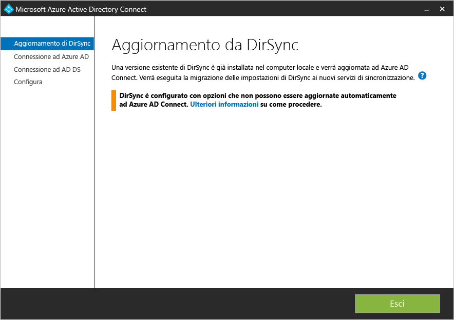

In questi casi si consiglia di installare un nuovo server Azure AD Connect in [modalità di gestione temporanea](active-directory-aadconnectsync-operations.md#staging-mode) e verificare la configurazione precedente di DirSync e quella nuova di Azure AD Connect. Riapplicare le modifiche utilizzando la configurazione personalizzata, come descritto in [configurazione personalizzata della sincronizzazione di Azure ADConnect](active-directory-aadconnectsync-whatis.md).

- Modifiche non supportate di DirSync, ad esempio attributi rimossi e uso di una DLL di estensione personalizzata
- Opzioni di filtro basate sugli attributi dell'utente

Le password usate da DirSync per gli account di servizio non possono essere recuperate e non verranno migrate. Tali password verranno reimpostate durante l'aggiornamento.

### Passaggi generali per l'aggiornamento da DirSync ad Azure AD Connect

1. Avvio di Azure AD Connect
2. Analisi della configurazione di DirSync corrente
3. Raccolta della password amministratore globale di Azure AD
4. Raccolta delle credenziali per un account amministratore dell'organizzazione (usato solo durante l'installazione di Azure AD Connect)
5. Installazione di Azure AD Connect
    * Disinstallare DirSync
	* Installare Azure AD Connect
	* Avviare facoltativamente la sincronizzazione

Nei casi seguenti sono necessari altri passaggi:

* Si usa attualmente una versione completa di SQL Server, locale o remota
* Nell'ambito si trovano più di 50.000 oggetti per la sincronizzazione

## Aggiornamento sul posto

1. Avviare il programma di installazione di Azure AD Connect (MSI).
2. Leggere e accettare le condizioni di licenza e l'informativa sulla privacy. 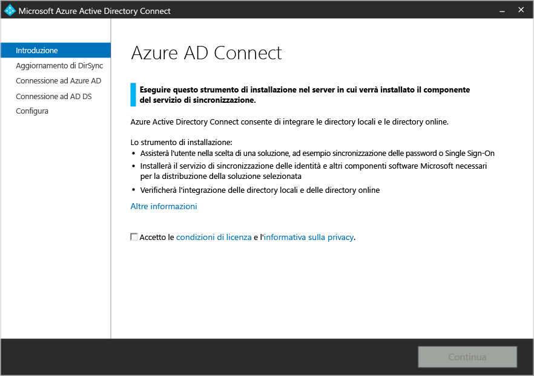
3. Fare clic su Avanti per avviare l'analisi dell'installazione di DirSync esistente. 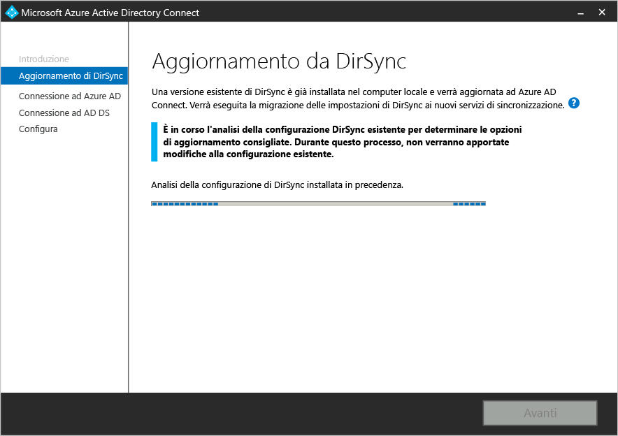
4. Al termine dell'analisi, vengono visualizzati alcuni consigli su come procedere.  
    - Se si usa SQL Server Express e sono disponibili meno di 50.000 oggetti, viene visualizzata la schermata seguente: 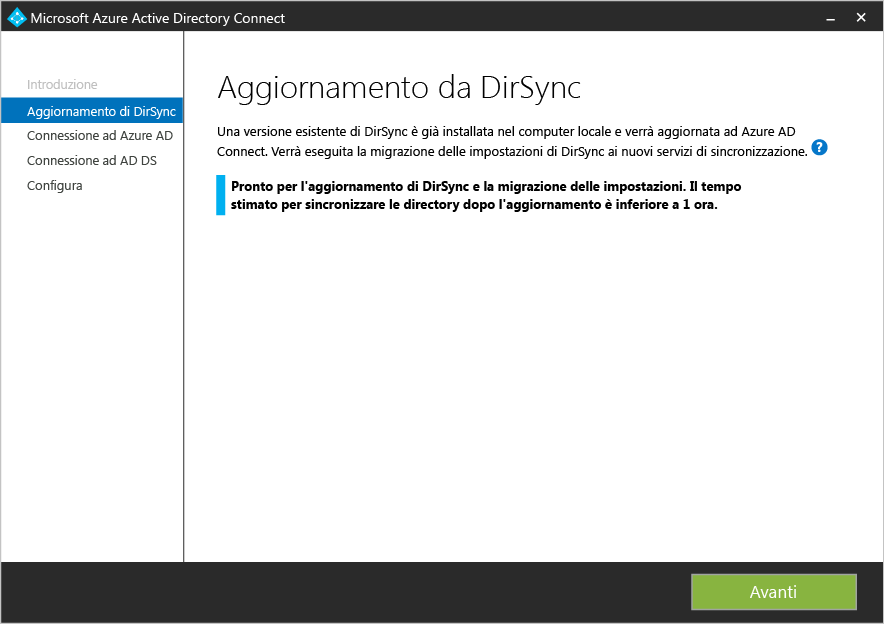
    - Se si usa una versione completa di SQL Server per DirSync verrà invece visualizzata questa pagina: 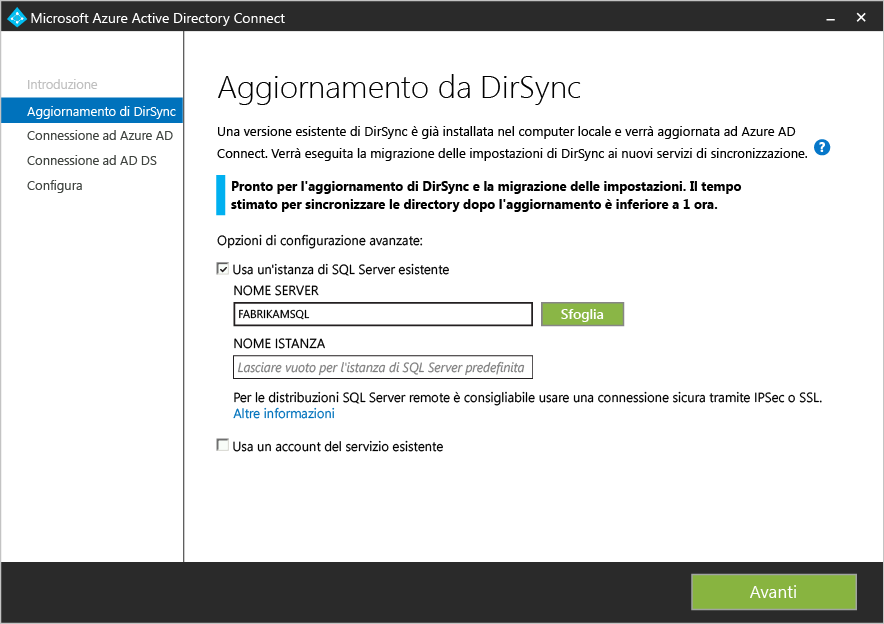  Vengono visualizzate le informazioni riguardanti il server di database SQL Server esistente usato da DirSync. Se necessario, apportare le modifiche appropriate. Fare clic su **Avanti** per continuare l'installazione.
    - Se sono disponibili più di 50.000 oggetti, verrà invece visualizzata questa schermata: 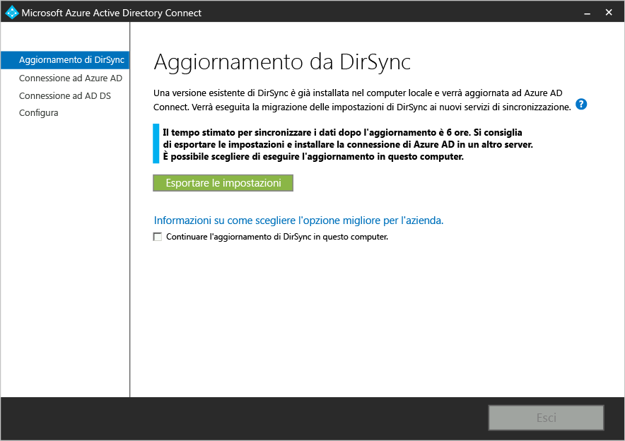  Per continuare con un aggiornamento sul posto, fare clic sulla casella di controllo accanto al messaggio **Continua ad aggiornare DirSync in questo computer**. Per eseguire invece una [distribuzione parallela](#parallel-deployment), esportare le impostazioni di configurazione di DirSync e spostarle nel nuovo server.
5. Fornire la password per l'account attualmente usato per la connessione ad Azure AD. Deve essere l'account attualmente usato da DirSync. 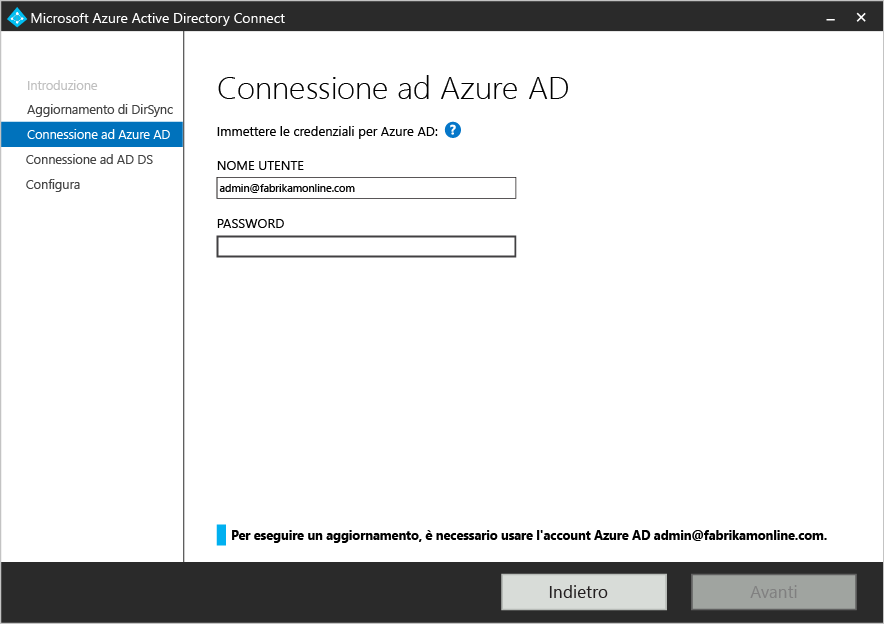
6. Fornire un account amministratore dell'organizzazione per Active Directory. 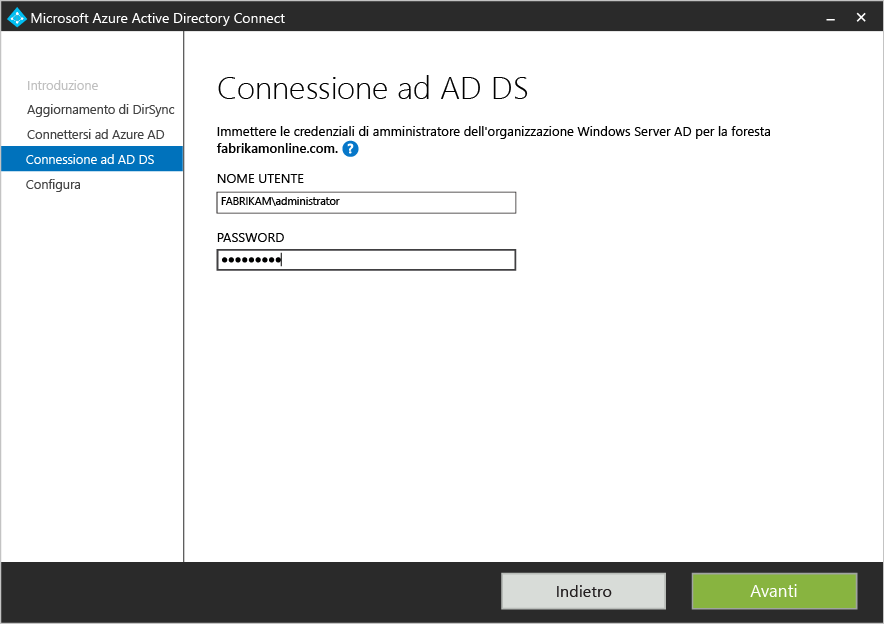
7. È ora possibile procedere alla configurazione. Quando si fa clic su **Aggiorna**, DirSync viene disinstallato e Azure AD Connect viene configurato e viene avviata la sincronizzazione. 

## Distribuzione parallela

### Esportare la configurazione di DirSync
**Distribuzione parallela con più di 50.000 oggetti**

Se sono presenti più di 50.000 oggetti, l'installazione di Azure AD Connect consiglia una distribuzione parallela.

Verrà visualizzata una schermata simile alla seguente:

Se si vuole procedere con la distribuzione parallela, è necessario eseguire le operazioni seguenti:

- Fare clic sul pulsante **Esporta impostazioni**. Quando si installa Azure AD Connect in un server separato, queste impostazioni vengono importate per eseguire la migrazione di tutte le impostazioni dall'installazione di DirSync corrente alla nuova installazione di Azure AD Connect.

Una volta esportate le impostazioni, è possibile chiudere la procedura guidata di Azure AD Connect nel server DirSync. Continuare con il passaggio successivo, per [installare Azure AD Connect in un server separato](#installation-of-azure-ad-connect-on-separate-server).

**Distribuzione parallela con meno di 50.000 oggetti**

Se sono presenti meno di 50.000 oggetti ma si desidera comunque eseguire una distribuzione parallela, seguire questa procedura:

1. Eseguire il programma di installazione di Azure AD Connect (MSI).
2. Quando viene visualizzata la schermata **Azure AD Connect**, chiudere l'installazione facendo clic su "X" nell'angolo superiore destro della finestra.
3. Aprire un prompt dei comandi.
4. Dall'installazione locale di Azure AD Connect (percorso predefinito: C:\\Programmi\\Microsoft Azure Active Directory Connect) eseguire il comando seguente: `AzureADConnect.exe /ForceExport`.
5. Fare clic sul pulsante **Esporta impostazioni**. Quando si installa Azure AD Connect in un server separato, queste impostazioni vengono importate per eseguire la migrazione di tutte le impostazioni dall'installazione di DirSync corrente alla nuova installazione di Azure AD Connect.

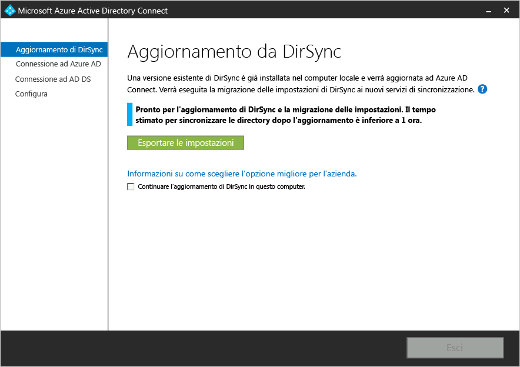

Una volta esportate le impostazioni, è possibile chiudere la procedura guidata di Azure AD Connect nel server DirSync. Continuare con il passaggio successivo, per [installare Azure AD Connect in un server separato](#installation-of-azure-ad-connect-on-separate-server).

### Installare Azure AD Connect in un server separato

Quando si installa Azure AD Connect in un nuovo server, il programma di installazione presuppone di dover eseguire un'installazione pulita di Azure AD Connect. Poiché si desidera usare la configurazione di DirSync, è necessario eseguire alcuni passaggi aggiuntivi:

1. Eseguire il programma di installazione di Azure AD Connect (MSI).
2. Quando viene visualizzata la schermata **Azure AD Connect**, chiudere l'installazione facendo clic su "X" nell'angolo superiore destro della finestra.
3. Aprire un prompt dei comandi.
4. Dall'installazione locale di Azure AD Connect (percorso predefinito: C:\\Programmi\\Microsoft Azure Active Directory Connect) eseguire il comando seguente: `AzureADConnect.exe /migrate`. Viene avviata l'installazione guidata di Azure AD Connect e viene visualizzata la schermata seguente: 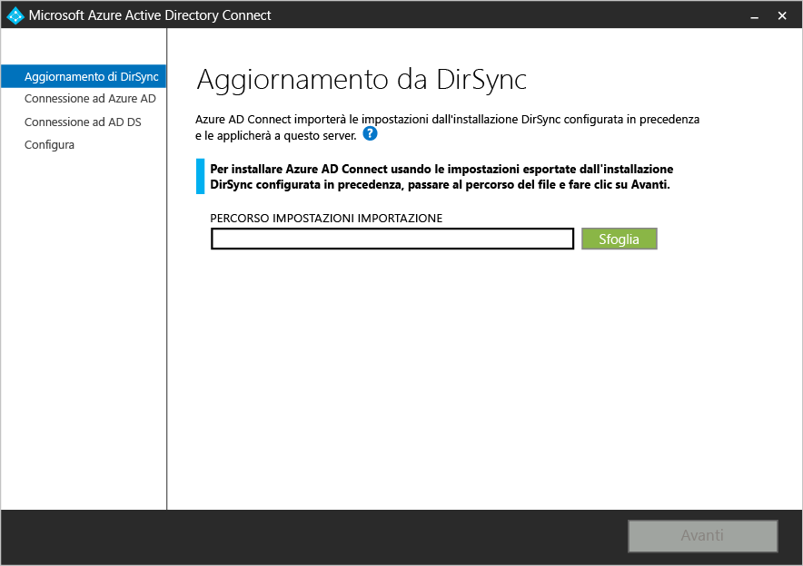
5. Selezionare il file di impostazioni esportato dall'installazione di DirSync.
6. Configurare tutte le opzioni avanzate, tra cui:
    - Un percorso di installazione personalizzato per Azure AD Connect.
	- Un'istanza esistente di SQL Server (per impostazione predefinita, Azure AD Connect installa SQL Server 2012 Express). Non usare la stessa istanza di database come server DirSync.
	- Un account di servizio usato per connettersi a SQL Server (se il database di SQL Server è remoto, deve essere un account di servizio del dominio). Queste opzioni possono essere visualizzate in questa schermata: 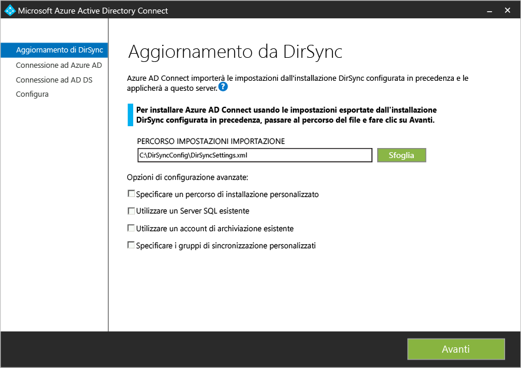
7. Fare clic su **Avanti**.
8. Nella pagina **Pronto per la configurazione** lasciare selezionata l'opzione **Avvia il processo di sincronizzazione non appena viene completata la configurazione**. Il server sarà in [modalità di gestione temporanea](active-directory-aadconnectsync-operations.md#staging-mode) in modo che le modifiche non verranno esportate in Azure AD in questo momento.
9. Fare clic su **Installa**.

>[AZURE.NOTE]Verrà avviata la sincronizzazione tra Windows Server Active Directory e Azure Active Directory, ma non verranno esportate modifiche in Azure AD. Le modifiche possono essere esportare attivamente da un solo strumento di sincronizzazione alla volta. Questa procedura viene definita [modalità di gestione temporanea](active-directory-aadconnectsync-operations.md#staging-mode).

### Verificare che Azure AD Connect sia pronto per avviare la sincronizzazione

Per verificare se Azure AD Connect sia pronto o meno a continuare al posto di DirSync, è necessario aprire **Synchronization Service Manager** nel gruppo **Azure AD Connect** dal menu di avvio.

All'interno dell'applicazione sarà necessario visualizzare la scheda **Operazioni**. In questa scheda verificare che le operazioni seguenti siano state completate:

- Importazione in AD Connector
- Importazione in Azure AD Connector
- Sincronizzazione completa in AD Connector
- Sincronizzazione completa in Azure AD Connector

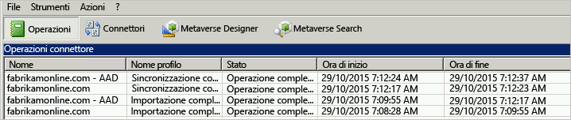

Esaminare il risultato di tali operazioni e assicurarsi che non siano presenti errori.

Se si desidera visualizzare e controllare le modifiche che verranno esportate in Azure AD, leggere come verificare la configurazione in [modalità di gestione temporanea](active-directory-aadconnectsync-operations.md#staging-mode). Apportare le modifiche di configurazione necessarie fino a quando non si verificano eventi imprevisti.

Se dopo aver completato queste 4 operazioni, non sono presenti errori e si è soddisfatti delle modifiche che stanno per essere esportate, si è pronti per disinstallare DirSync e abilitare la sincronizzazione di Azure AD Connect. Completare i due passaggi successivi per completare la migrazione.

### Disinstallare DirSync (vecchio server)

- In **Programmi e funzionalità** individuare **Strumento di sincronizzazione di Microsoft Azure Active Directory**
- Disinstallare **Strumento di sincronizzazione di Microsoft Azure Active Directory**
- Si noti che la disinstallazione potrebbe richiedere fino a 15 minuti.

Se DirSync è disinstallato, non sono presenti server attivi per l'esportazione in Azure AD. Il passaggio successivo deve essere completato prima che tutte le modifiche in Active Directory locale continuino a essere sincronizzate con Azure AD.

### Abilitare Azure AD Connect (nuovo server)
Al termine dell'installazione, la riapertura di Azure AD Connect consentirà di apportare ulteriori modifiche alla configurazione. Avviare **Azure AD Connect** dal menu start o dal collegamento sul desktop. Assicurarsi di non eseguire nuovamente l'installazione di MSI.

Dovrebbe essere visualizzata la seguente schermata:

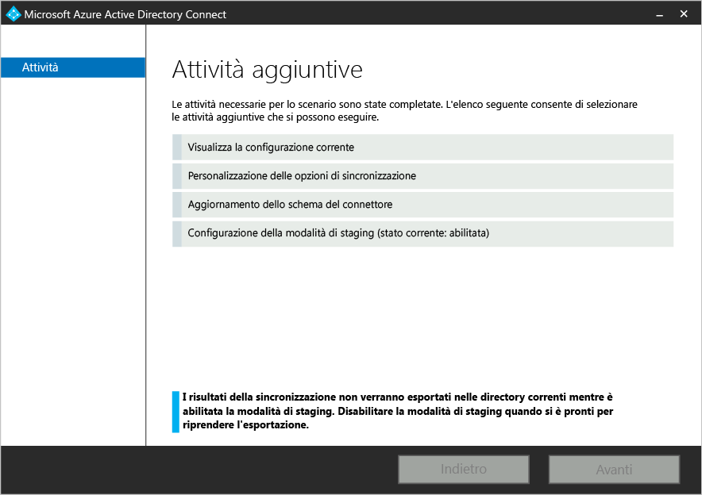

- Selezionare **Configurazione della modalità di gestione temporanea**.
- Disattivare la gestione temporanea deselezionando la casella di controllo **Modalità di gestione temporanea abilitata**.

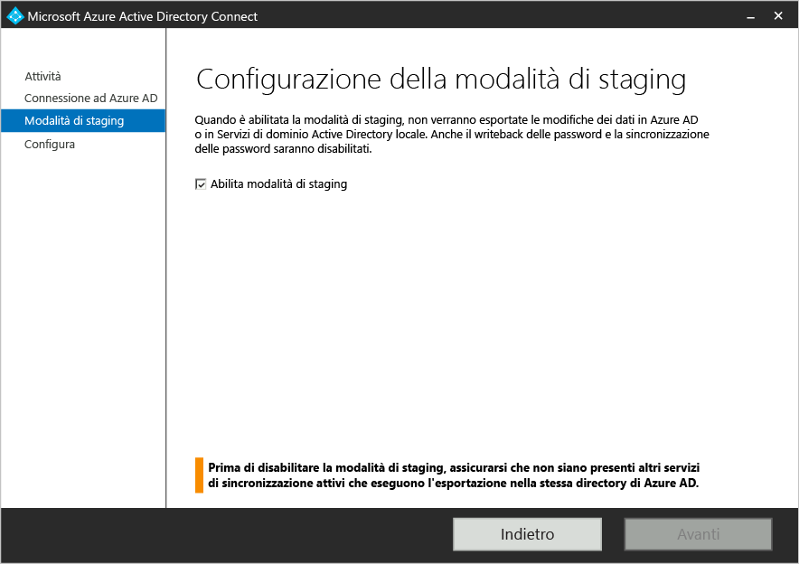

- Fare clic sul pulsante **Avanti**.
- Nella pagina di conferma, fare clic sul pulsante **Installa**.

Azure AD Connect è ora il server attivo.

## Passaggi successivi
Dopo aver installato Azure AD Connect è possibile [verificare l'installazione e assegnare le licenze](active-directory-aadconnect-whats-next.md).

Altre informazioni su [Integrazione delle identità locali con Azure Active Directory](active-directory-aadconnect.md).

<!---HONumber=Nov15_HO2-->