<properties
	pageTitle="Azure AD Connect: Installazione personalizzata | Microsoft Azure"
	description="Questo documento descrive le opzioni di installazione personalizzata per Azure AD Connect. Usare queste istruzioni per installare Active Directory con Azure AD Connect."
	services="active-directory"
    keywords="che cos'è Azure AD Connect, installare Active Directory, componenti richiesti per Azure AD"
	documentationCenter=""
	authors="billmath"
	manager="stevenpo"
	editor="curtand"/>

<tags
	ms.service="active-directory"  
	ms.workload="identity"
	ms.tgt_pltfrm="na"
	ms.devlang="na"
	ms.topic="get-started-article"
	ms.date="03/04/2016"
	ms.author="billmath;andkjell"/>

# Installazione personalizzata di Azure AD Connect
La documentazione seguente fornisce informazioni sull'uso dell'opzione di installazione personalizzata per Azure AD Connect. È possibile usare questa opzione se si dispone di ulteriori opzioni di configurazione o se si necessita di funzionalità facoltative non incluse nell'installazione rapida.

## Documentazione correlata
Se non è stata letta la documentazione in [Integrazione delle identità locali con Azure Active Directory](active-directory-aadconnect.md), la tabella seguente fornisce collegamenti ad argomenti correlati. È necessario consultare i primi tre argomenti in grassetto prima di iniziare l'installazione.

| Argomento | |
| --------- | --------- |
| **Scaricare Azure AD Connect** | [Scaricare Azure AD Connect](http://go.microsoft.com/fwlink/?LinkId=615771) |
| **Hardware e prerequisiti** | [Azure AD Connect: Hardware e prerequisiti](active-directory-aadconnect-prerequisites.md#hardware-requirements-for-azure-ad-connect) |
| **Account usati per l'installazione** | [Autorizzazioni e account di Azure AD Connect](active-directory-aadconnect-accounts-permissions.md) |
| Eseguire l'installazione mediante le impostazioni rapide | [Installazione rapida di Azure AD Connect](active-directory-aadconnect-get-started-express.md) |
| Eseguire l'aggiornamento da DirSync | [Aggiornamento dallo strumento di sincronizzazione di Azure AD (DirSync)](active-directory-aadconnect-dirsync-upgrade-get-started.md) |
| Dopo l'installazione | [Verificare l'installazione e assegnare le licenze](active-directory-aadconnect-whats-next.md) |

## Installare i componenti necessari
Durante l'installazione dei servizi di sincronizzazione, è possibile lasciare deselezionata l'opzione di configurazione facoltativa perché Azure AD Connect esegua la configurazione in modo automatico. Sono incluse la configurazione di un'istanza di SQL Server 2012 Express LocalDB, la creazione dei gruppi appropriati e l'assegnazione delle rispettive autorizzazioni. Se si desidera modificare le impostazioni predefinite, è possibile usare la tabella seguente per informazioni sulle opzioni di configurazione facoltative disponibili.

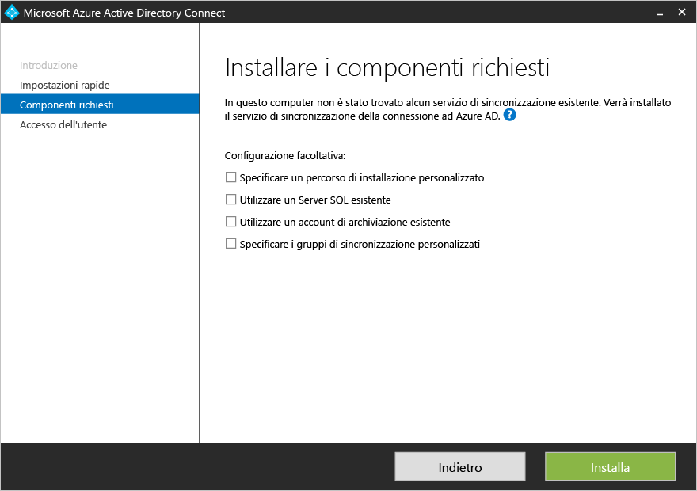

| Configurazione facoltativa | Descrizione |
| ------------- | ------------- |
| Usare un server SQL esistente | Permette di specificare il nome di SQL Server e il nome dell'istanza. Scegliere questa opzione se si dispone già di un server di database che si desidera usare. Se in SQL Server l'esplorazione non è abilitata ed è necessario specificare un numero di porta nella casella **Nome istanza**, immettere il nome dell'istanza seguito da una virgola e dal numero di porta. |
| Usare un account di servizio esistente | Per impostazione predefinita, Azure AD Connect crea un account di servizio locale che verrà usato dai servizi di sincronizzazione. La password viene generata automaticamente e non è nota alla persona che installa Azure AD Connect. Se si usa un server SQL remoto o un proxy che richiede l'autenticazione, è necessario avere un account di servizio nel dominio e conoscere la password. In questi casi, immettere l'account di servizio da usare. Assicurarsi che l'utente che esegue l'installazione sia un'associazione di sicurezza in SQL, in modo che sia possibile creare un accesso per l'account del servizio. Vedere [Autorizzazioni e account di Azure AD Connect](active-directory-aadconnect-accounts-permissions.md#custom-settings-installation) |
| Specificare i gruppi di sincronizzazione personalizzati | Per impostazione predefinita, Azure AD Connect crea quattro gruppi locali nel server quando vengono installati i servizi di sincronizzazione. I gruppi sono: gruppo Administrators, gruppo Operators, gruppo Browse e Gruppo Password Reset. Se si vuole specificare gruppi personalizzati, è possibile farlo qui. I gruppi devono essere locali sul server e non possono trovarsi nel dominio. |

## Accesso utente
Dopo aver installato i componenti necessari, viene richiesto di specificare il metodo Single Sign-On che verrà usato dagli utenti. La tabella seguente fornisce una breve descrizione delle opzioni disponibili. Per una descrizione completa dei metodi di accesso, vedere [Accesso utente](active-directory-aadconnect-user-signin.md).

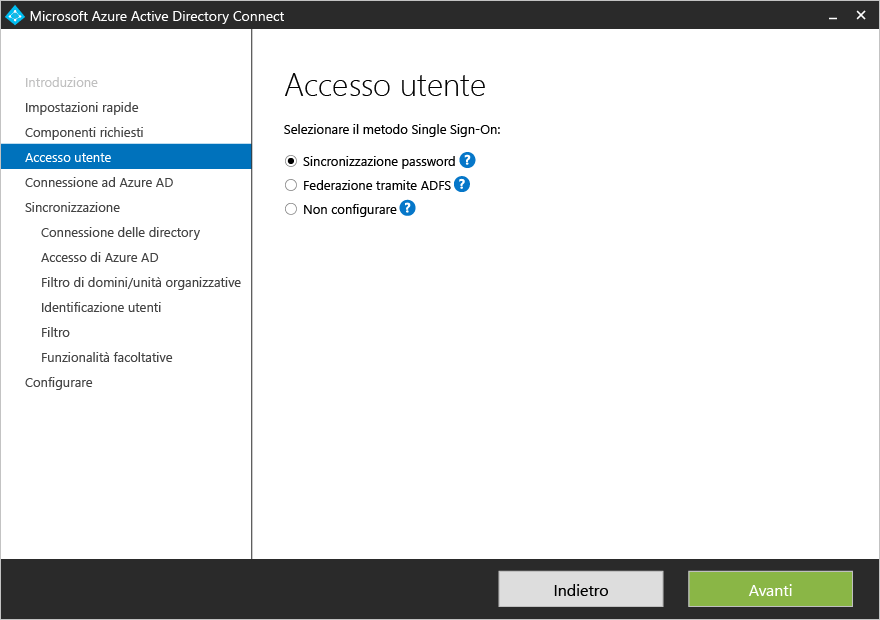

Opzione Single Sign-On | Descrizione
------------- | ------------- |
Sincronizzazione delle password |Gli utenti saranno in grado di accedere ai servizi cloud di Microsoft, ad esempio Office 365, Dynamics CRM e Windows InTune con la stessa password che usano per accedere alla rete locale. La password dell'utente viene sincronizzata con Azure tramite un hash della password e l'autenticazione ha luogo nel cloud. Per altre informazioni, vedere [Sincronizzazione delle password](active-directory-aadconnectsync-implement-password-synchronization.md).
Federazione con ADFS|Gli utenti saranno in grado di accedere ai servizi cloud di Microsoft, ad esempio Office 365, Dynamics CRM e Windows InTune con la stessa password che usano per accedere alla rete locale. Gli utenti vengono reindirizzati all'istanza di AD FS locale per l'accesso e l'autenticazione viene eseguita in locale.
Non configurare| Nessuna funzionalità verrà installata e configurata. Scegliere questa opzione se si dispone già di un server federativo di terze parti o di un'altra soluzione esistente installata.

## Connessione ad Azure AD
Nella schermata Connessione ad Azure AD, immettere un account di amministratore globale e una password. Se è stato selezionato **Federazione tramite ADFS** nella pagina precedente, assicurarsi di non accedere con un account in un dominio che si intende abilitare per la federazione. Si consiglia di usare un account nel dominio **onmicrosoft.com** predefinito, fornito con la directory di Azure AD.

Questo account viene usato solo per creare un account di servizio in Azure AD e al termine della procedura guidata non viene più usato. 

Se per l'account amministratore globale è abilitata l'autenticazione MFA, è necessario fornire nuovamente la password nella finestra popup di accesso e completare la richiesta di autenticazione MFA, ad esempio fornendo un codice di verifica. 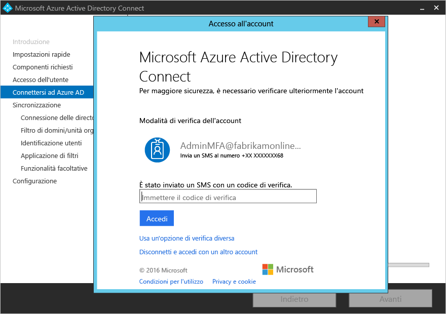

Per l'account amministratore globale può essere abilitato anche [Privileged Identity Management](active-directory-privileged-identity-management-getting-started.md).

Se viene visualizzato un errore e si hanno problemi relativi alla connettività, vedere [Risolvere i problemi di connettività](active-directory-aadconnect-troubleshoot-connectivity.md).

## Pagine della sezione di sincronizzazione

### Connessione delle directory
Per connettersi a Servizi di dominio di Active Directory, Azure AD Connect richiede le credenziali di un account con autorizzazioni sufficienti. Questo account può essere un account utente normale, perché richiede solo autorizzazioni di lettura predefinite. Tuttavia, a seconda dello scenario, potrebbero essere necessarie autorizzazioni aggiuntive. Per altre informazioni, vedere [Autorizzazioni e account di Azure AD Connect](active-directory-aadconnect-accounts-permissions.md#create-the-ad-ds-account).

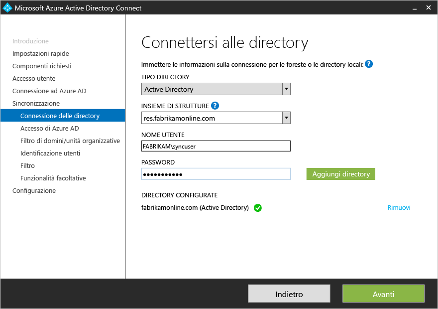

### Filtro unità organizzativa e dominio
Per impostazione predefinita verranno sincronizzati tutti i domini e le unità organizzative. Per escludere alcuni domini o unità organizzative dalla sincronizzazione con Azure AD, è possibile deselezionarli. 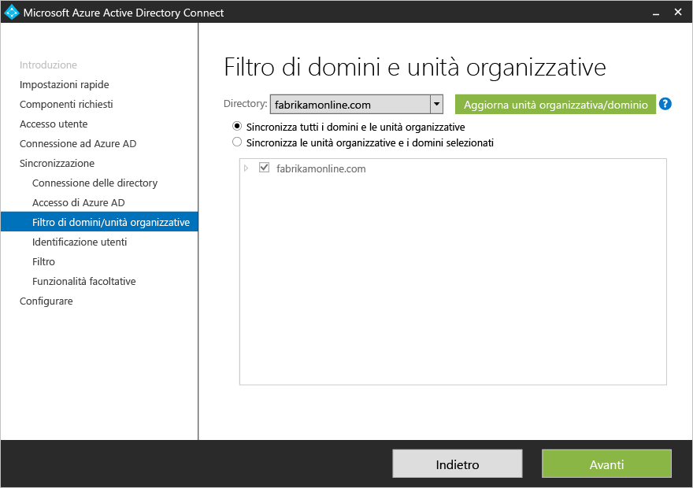 In questa pagina della procedura guidata viene configurato il filtro basato su dominio, come documentato nella sezione [Filtro basato su dominio](active-directory-aadconnectsync-configure-filtering.md#domain-based-filtering).

Alcuni domini potrebbero non essere raggiungibili a causa di restrizioni del firewall. Questi domini verranno deselezionati per impostazione predefinita e verrà visualizzato un avviso. 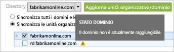 In tal caso, assicurarsi che i domini siano effettivamente non raggiungibili e che si tratti di un comportamento previsto.

### Identificazione univoca degli utenti
La corrispondenza tra la funzionalità delle foreste consente di definire la modalità di rappresentazione degli utenti delle foreste AD DS in Azure AD. Un utente può essere rappresentato solo una volta in tutte le foreste oppure disporre di una combinazione di account abilitati e disabilitati.

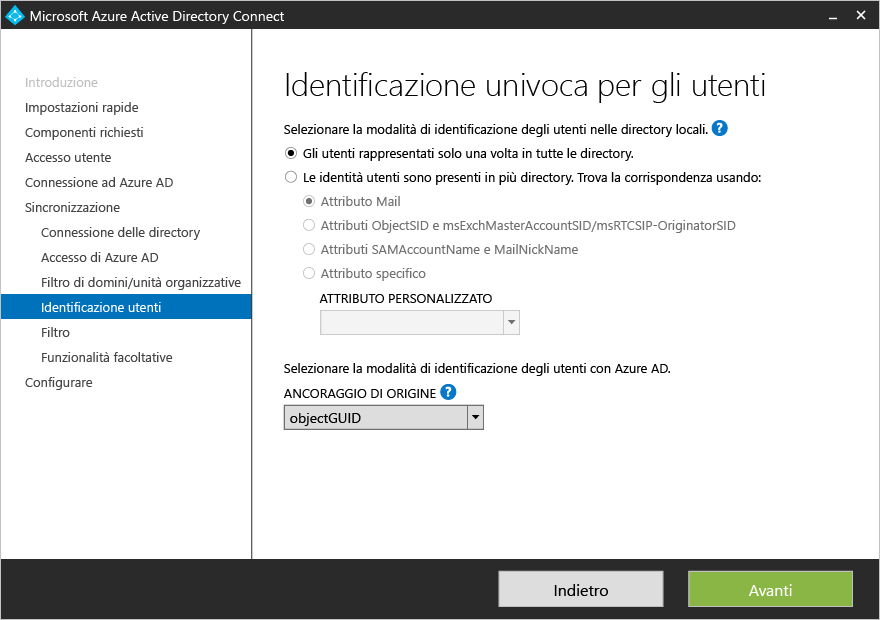

Impostazione | Descrizione
------------- | ------------- |
[Gli utenti vengono rappresentati solo una volta nel numero totale delle foreste](active-directory-aadconnect-topologies.md#multiple-forests-separate-topologies) | Tutti gli utenti vengono creati come oggetti singoli in Azure AD.  Gli oggetti non vengono uniti nel metaverse.
[Attributo di posta](active-directory-aadconnect-topologies.md#multiple-forests-full-mesh-with-optional-galsync) | Questa opzione unisce utenti e contatti se l'attributo di posta ha lo stesso valore in foreste diverse. Si consiglia di usare questa opzione se i contatti sono stati creati mediante GALSync.
[ObjectSID e msExchangeMasterAccountSID/ msRTCSIP-OriginatorSid](active-directory-aadconnect-topologies.md#multiple-forests-account-resource-forest)|Questa opzione unisce un utente abilitato in una foresta di account a un utente disabilitato in una foresta di risorse di Exchange. Questa opzione è anche nota come cassetta postale collegata in Exchange. Questa opzione può essere utilizzata anche se si utilizza solo Lync, ed Exchange non è presente nella foresta delle risorse.
sAMAccountName e MailNickName|Questa opzione crea un join degli attributi in cui si prevede la possibilità di trovare l'ID di accesso dell'utente.
Attributo specifico|Questa opzione consente di selezionare un attributo personale. **Limitazione:** assicurarsi di selezionare un attributo già presente nel metaverse. Se si sceglie un attributo personalizzato, non incluso nel metaverse, non sarà possibile completare la procedura guidata.

- **sourceAnchor**: l’attributo sourceAnchor non può essere modificato per la durata di un oggetto utente. È la chiave primaria che collega l'utente locale con l'utente in Azure AD. Poiché l'attributo non può essere modificato, è necessario pianificare un attributo valido da usare. objectGUID è un candidato valido. Questo attributo non cambia, a meno che l'account utente viene spostato tra foreste o domini. In un ambiente a più foreste, nel quale è possibile spostare account tra foreste, è necessario usare un altro attributo, ad esempio un attributo con il valore employeeID. Gli attributi da evitare sono quelli che cambiano se una persona si sposa o cambia le assegnazioni. Non è possibile usare gli attributi con un segno @, pertanto non è possibile usare indirizzi di posta elettronica e userPrincipalName. Inoltre, per l'attributo si applica la distinzione tra maiuscole e minuscole, per cui, se si sposta un oggetto tra foreste, accertarsi di mantenere la distinzione tra maiuscole e minuscole. Per gli attributi binari il valore è con codifica base64, ma per altri tipi di attributo rimane nello stato non codificato. Negli scenari di federazione e in alcune interfacce di Azure AD questo attributo è noto anche come immutableID. In [Concetti relativi alla progettazione](active-directory-aadconnect-design-concepts.md#sourceAnchor) sono disponibili altre informazioni su sourceAnchor.

- **UserPrincipalName**: l'attributo userPrincipalName verrà usato dagli utenti per l'accesso ad Azure AD e Office 365. I domini utilizzati, noti anche come suffisso UPN, devono essere verificati in Azure AD prima che gli utenti vengano sincronizzati. Si consiglia di mantenere l'attributo userPrincipalName predefinito. Se questo attributo non è instradabile e non può essere verificato, è possibile selezionarne un altro, ad esempio posta elettronica, come attributo contenente l'ID di accesso. Questo attributo è noto come **ID alternativo**. Il valore dell'attributo ID alternativo deve essere conforme allo standard RFC822. È possibile usare un ID alternativo sia con una soluzione di accesso Single Sign-On tramite password che Single Sign-On federativo.

>[AZURE.WARNING] L'uso di un ID alternativo non è compatibile con tutti i carichi di lavoro di Office 365. Per altre informazioni, vedere [Configurazione dell'ID di accesso alternativo](https://technet.microsoft.com/library/dn659436.aspx).

### Filtro di sincronizzazione basato sui gruppi
Il filtro sulla funzionalità dei gruppi consente di eseguire una piccola distribuzione pilota in cui deve essere creato solo un piccolo subset di oggetti in Azure AD e Office 365. Per usare questa funzionalità, creare un gruppo nell'istanza di Active Directory locale e aggiungere gli utenti e i gruppi da sincronizzare con Azure AD come membri diretti. In un secondo momento, è possibile aggiungere utenti a questo gruppo e rimuoverli per gestire l'elenco di oggetti che devono essere presenti in Azure AD. Tutti gli oggetti che si desidera sincronizzare devono essere membri diretti del gruppo, compresi gli utenti, i gruppi, i contatti e i computer o dispositivi. L'appartenenza al gruppo nidificato non verrà risolta; un membro del gruppo includerà solo il gruppo stesso e non i relativi membri.

Per usare questa funzionalità, nel percorso personalizzato verrà visualizzata questa pagina: 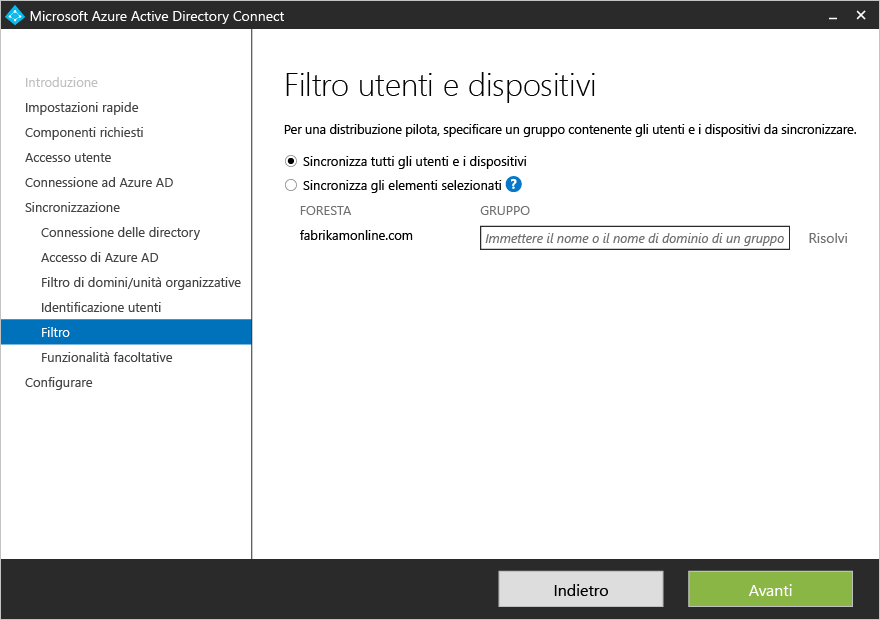

>[AZURE.WARNING] Questa funzionalità è destinata solo a una distribuzione pilota e non deve essere usata in una distribuzione di produzione completa.

In un ambiente di distribuzione della produzione completo è difficile mantenere un singolo gruppo con tutti gli oggetti da sincronizzare. È invece necessario usare uno dei metodi descritti in [Configurare il filtro](active-directory-aadconnectsync-configure-filtering.md).

### Funzionalità facoltative
Questa schermata consente di selezionare le funzionalità facoltative per gli scenari specifici. Di seguito sono riportate brevi spiegazioni di ognuna delle singole funzionalità.

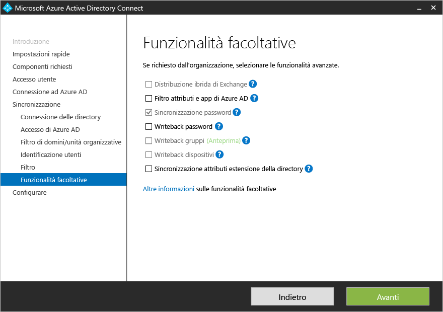

> [AZURE.WARNING] Se attualmente è attivo DirSync o Azure AD Sync, non attivare nessuna delle funzionalità di writeback in Azure AD Connect.

Funzionalità facoltative | Descrizione
-------------------    | ------------- |
Distribuzione ibrida di Exchange |La funzionalità Distribuzione ibrida di Exchange permette la coesistenza delle cassette postali di Exchange sia in locale che in Office 365 grazie alla risincronizzazione di un set di [attributi](active-directory-aadconnectsync-attributes-synchronized.md#exchange-hybrid-writeback) specifico da Azure AD nella directory locale.
Filtro attributi e app di Azure AD|Se si abilita questa opzione, il set di attributi sincronizzati può essere adattato a un set specifico in una pagina successiva della procedura guidata. In questo caso, vengono visualizzate due pagine di configurazione aggiuntive della procedura guidata. Per altre informazioni vedere la sezione [Filtro attributi e app di Azure AD](#azure-ad-app-and-attribute-filtering).
Sincronizzazione delle password | Se come soluzione di accesso è stata selezionata la federazione, questa opzione può essere abilitata. La sincronizzazione delle password può quindi essere usata come opzione di backup. Per altre informazioni, vedere [Sincronizzazione delle password](active-directory-aadconnectsync-implement-password-synchronization.md).
Writeback delle password|Se si abilita il writeback delle password, le modifiche delle password generate da Azure AD verranno riscritte nella directory locale. Per altre informazioni, vedere [Introduzione alla gestione delle password](active-directory-passwords-getting-started.md).
Writeback dei gruppi |Se si usa la funzionalità dei **gruppi di Office 365**, i gruppi potrebbero essere disponibili nell'istanza di Active Directory locale come gruppi di distribuzione. Questa opzione è disponibile solo se si dispone di Exchange in Active Directory locale. Per altre informazioni, vedere [Writeback dei gruppi](active-directory-aadconnect-feature-preview.md#group-writeback).
Writeback dei dispositivi | Consente di eseguire il writeback degli oggetti dispositivo in Azure AD in Active Directory locale per scenari di accesso condizionale. Per altre informazioni, vedere [Abilitazione del writeback dei dispositivi in Azure AD Connect](active-directory-aadconnect-feature-device-writeback.md).
Sincronizzazione attributi estensione della directory|Se si abilita questa opzione, gli attributi aggiuntivi specificati verranno sincronizzati in Azure AD. Per altre informazioni, vedere l'argomento relativo alle [estensioni della directory](active-directory-aadconnectsync-feature-directory-extensions.md).

### Filtro attributi e app di Azure AD
Se si desidera limitare gli attributi da sincronizzare con Azure AD, selezionare i servizi in uso. Se si configura questa pagina, è necessario selezionare in modo esplicito qualsiasi nuovo servizio ripetendo l'installazione guidata.

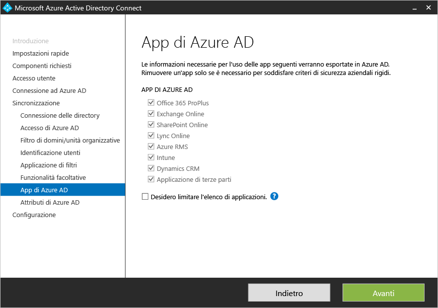

In base ai servizi selezionati nel passaggio precedente, questa pagina visualizzerà tutti gli attributi che verranno sincronizzati. Questo elenco è una combinazione di tutti i tipi di oggetti da sincronizzare. Se sono presenti alcuni attributi particolari che non è necessario sincronizzare, è possibile deselezionarli.

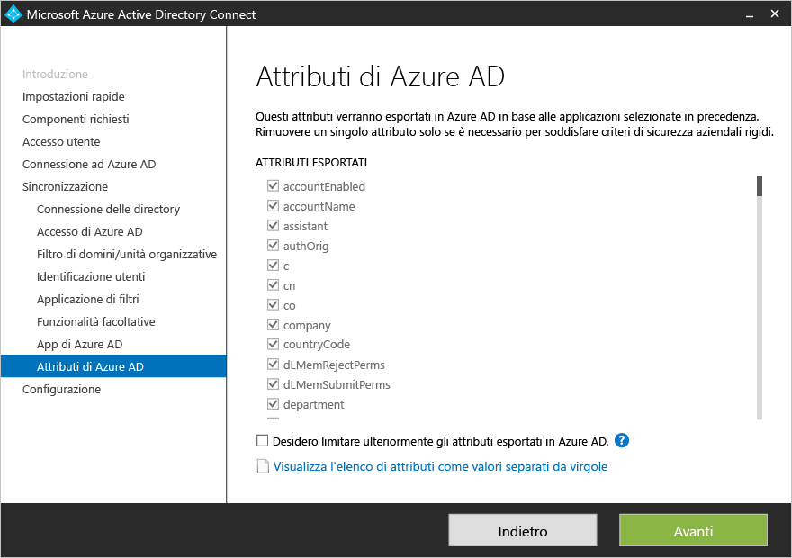

### Sincronizzazione attributi estensione della directory
Con le estensioni di directory è possibile estendere lo schema in Azure AD con attributi personalizzati aggiunti dall'organizzazione o altri attributi in Active Directory. Per usare questa funzionalità, selezionare **Sincronizzazione attributi estensione della directory** nella pagina **Funzionalità facoltative**. In tal modo, verrà visualizzata questa pagina che consente di selezionare gli attributi aggiuntivi.

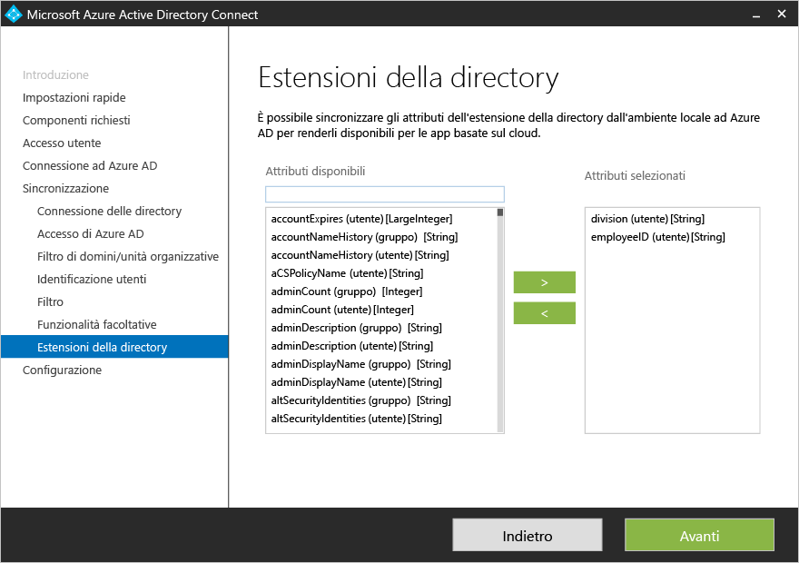

Per altre informazioni, vedere l'argomento relativo alle [estensioni della directory](active-directory-aadconnectsync-feature-directory-extensions.md).

## Configurazione della federazione con ADFS
Configurare ADFS con Azure AD Connect è semplice e richiede l'esecuzione di pochi passaggi. Prima della configurazione, è richiesto quanto indicato di seguito.

- Un server Windows Server 2012 R2 per il server federativo con la gestione remota abilitata
- Un server Windows Server 2012 R2 per il server Proxy applicazione Web con la gestione remota abilitata
- Un certificato SSL per il nome del servizio federativo che si intende usare, ad esempio sts.contoso.com

### Creare una nuova farm ADFS o usare una farm ADFS esistente
È possibile usare una farm ADFS esistente oppure scegliere di creare una nuova farm ADFS. Se si sceglie di crearne una nuova, è necessario fornire il certificato SSL. Se il certificato SSL è protetto da password, verrà richiesto di fornire la password.

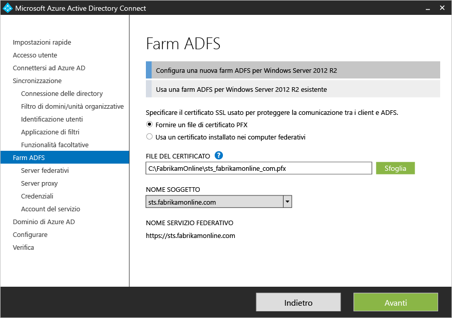

**Nota:** se si sceglie di usare una farm AD FS esistente, verranno ignorate alcune pagine e si verrà indirizzati direttamente alla schermata di configurazione di una relazione di trust tra AD FS e Azure AD.

### Specificare i server ADFS
Immettere qui i server specifici nei quali si desidera installare ADFS. È possibile aggiungere uno o più server in base alle esigenze di pianificazione della capacità. Questi server devono essere tutti uniti a un dominio di Active Directory prima di eseguire questa configurazione. Si consiglia di installare un singolo server AD FS per le distribuzioni pilota e di test e di distribuire server aggiuntivi aprendo nuovamente Azure AD Connect dopo l'installazione iniziale e distribuendo AD FS nei server aggiuntivi in base alle esigenze di ridimensionamento.

> [AZURE.NOTE] Assicurarsi che tutti i server vengano uniti a un dominio di Active Directory prima di eseguire questa configurazione.

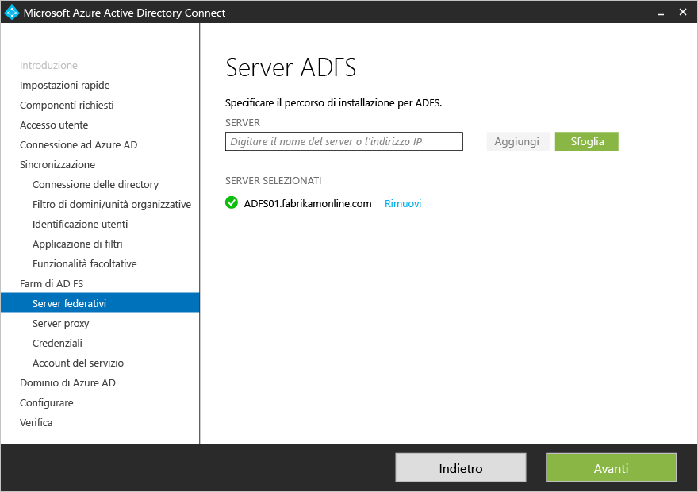

### Specificare i server Proxy applicazione Web
Immettere qui i server specifici che si desidera utilizzare come server Proxy applicazione Web. Il server Proxy applicazione Web viene distribuito nel DMZ (per la rete Extranet) e supporta le richieste di autenticazione dalla rete Extranet. È possibile aggiungere uno o più server in base alle esigenze di pianificazione della capacità. Si consiglia di installare un singolo server proxy applicazione Web per le distribuzioni pilota e di test e di distribuire server aggiuntivi aprendo nuovamente Azure AD Connect dopo l'installazione iniziale e distribuendo il proxy applicazione Web nei server aggiuntivi. In genere, è consigliabile disporre di un numero equivalente di server proxy per soddisfare l'autenticazione dalla Intranet.

> [AZURE.NOTE]
<li> Se l'account usato per installare Azure AD Connect non è un account amministratore locale nei server AD FS, verranno richieste le credenziali per un account con autorizzazioni sufficienti.</li>
<li> Verificare la connettività HTTP/HTTPS tra il server Azure AD Connect e il server proxy applicazione Web prima di configurare questo passaggio.</li>
<li> Verificare anche la connettività HTTP/HTTPS tra il server applicazioni Web e il server AD FS per consentire il passaggio delle richieste di autenticazione.</li>

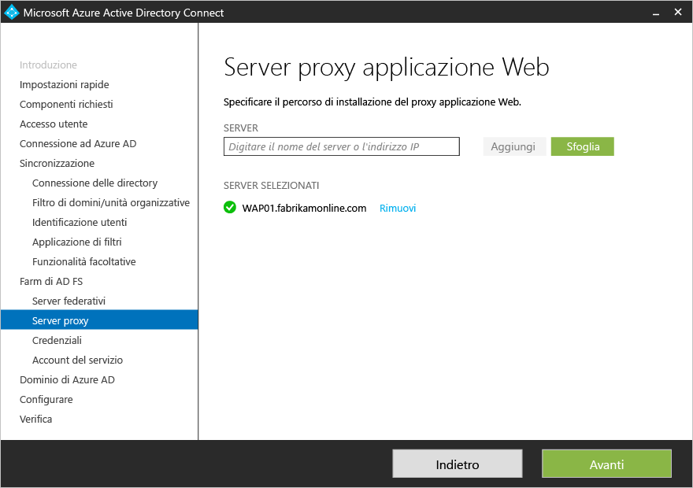

Verrà richiesto di immettere le credenziali in modo che il server applicazione Web possa stabilire una connessione protetta al server ADFS. Tali credenziali devono corrispondere a un amministratore locale sul server ADFS.

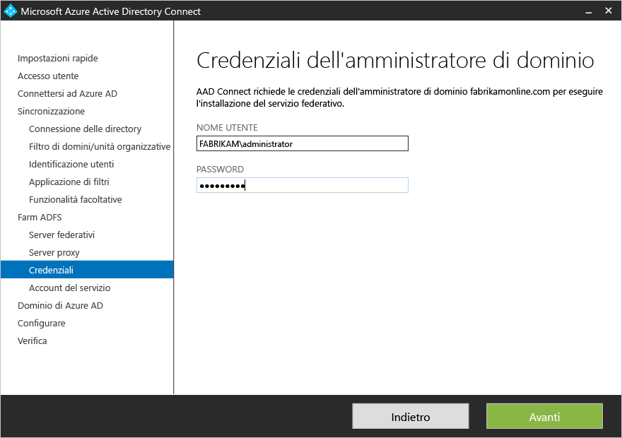

### Specificare l'account di servizio per il servizio ADFS
Il servizio ADFS richiede un account di servizio del dominio per autenticare gli utenti e cercare le informazioni utente in Active Directory. Supporta due tipi di account di servizio:

- **Account del servizio gestito di gruppo**: si tratta di un tipo di account di servizio introdotto in Servizi di dominio Active Directory con Windows Server 2012. Questo tipo di account fornisce servizi quali ADFS per utilizzare un singolo account senza la necessità di aggiornare la password dell'account a intervalli regolari. Utilizzare questa opzione se si dispone già di controller di dominio di Windows Server 2012 nel dominio a cui appartengono i server ADFS.
- **Account utente di dominio**: questo tipo di account richiederà di fornire una password e di aggiornarla regolarmente nel momento in cui cambia. Usare questo account solo quando non sono disponibili controller di dominio Windows Server 2012 nel dominio a cui appartengono i server AD FS.

Se è stato selezionato l'account del servizio gestito del gruppo e questa funzionalità non è mai stata usata in Active Directory, verranno richieste anche le credenziali di amministratore dell'organizzazione. Queste ultime verranno usate per avviare l'archivio chiavi e abilitare la funzionalità di Active Directory.

Azure AD Connect creerà automaticamente l’account del servizio gestito del gruppo se è stato effettuato l’accesso come amministratore di dominio.

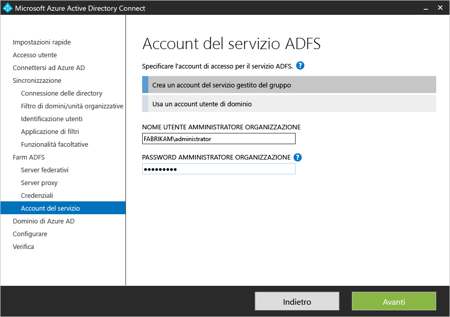

### Selezionare il dominio Azure AD di cui si desidera attuare la federazione
Questa configurazione viene utilizzata per impostare la relazione di federazione tra ADFS e Azure AD e configura ADFS in modo da rilasciare token di sicurezza per Azure AD, configurando Azure AD in modo da considerare attendibili i token da questa specifica istanza di ADFS. Questa pagina consente configurare un singolo dominio durante l'installazione iniziale. È possibile configurare domini aggiuntivi in qualsiasi momento aprendo nuovamente Azure AD Connect ed eseguendo questa attività.

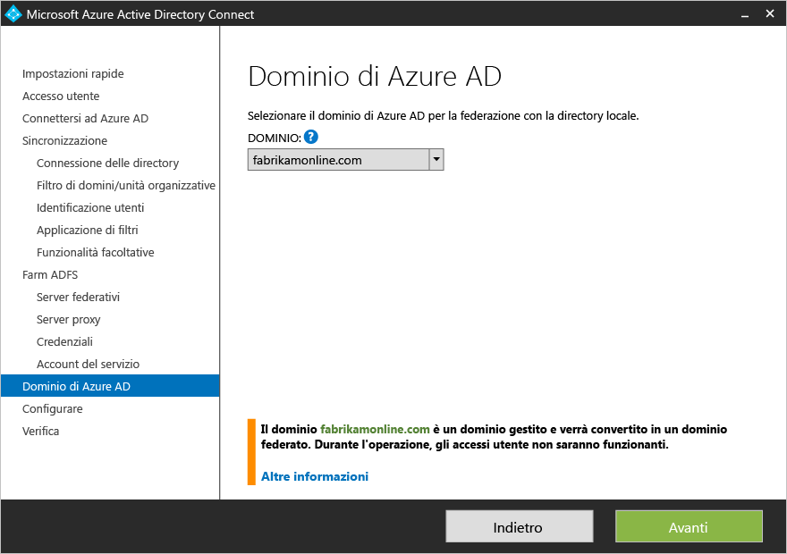

### Verificare il dominio di Azure AD selezionato per la federazione

Quando si seleziona il dominio per la federazione con la directory locale, Azure AD Connect fornisce le informazioni necessarie per verificare il dominio, se non è già verificato. Questa pagina fornisce i record DNS che è necessario creare presso il registrar, o nel punto in cui è ospitato il DNS, per completare una verifica del dominio. 

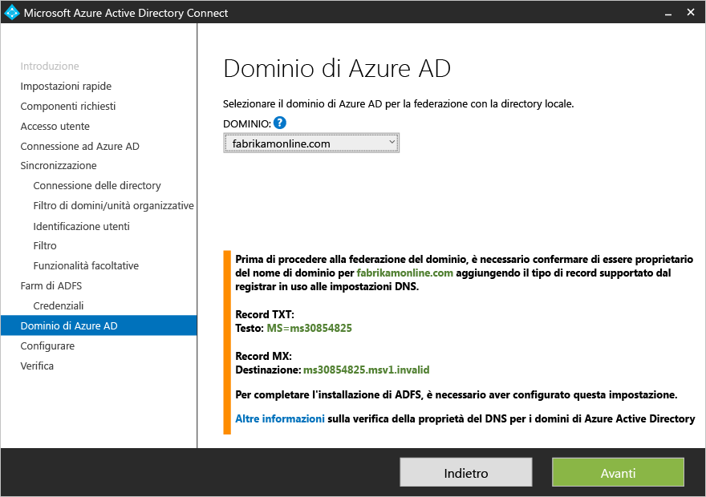

> [AZURE.NOTE] Azure AD Connect prova a verificare il dominio in fase di configurazione. Se la configurazione continua senza aggiungere i record DNS necessari in cui è ospitato il DNS del dominio, la procedura guidata non può completare la configurazione. 

## Configurare e verificare le pagine
In questa pagina verrà effettivamente eseguita la configurazione.

> [AZURE.NOTE]
Prima di continuare l'installazione, se è stata configurata la federazione, assicurarsi di aver configurato la [risoluzione dei nomi per i server federativi](active-directory-aadconnect-prerequisites.md#name-resolution-for-federation-servers).

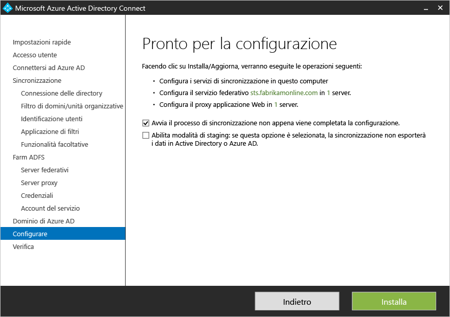

### Modalità di gestione temporanea
Con la modalità di gestione temporanea è possibile eseguire la configurazione di un nuovo server di sincronizzazione in parallelo con un server esistente. È supportata la presenza di un solo server di sincronizzazione che esegue l'esportazione in una directory nel cloud. Per spostarsi da un altro server, ad esempio da un server con DirSync, è possibile abilitare Azure AD Connect in modalità di staging. Quando viene abilitato, il motore di sincronizzazione importa e sincronizza i dati normalmente, ma non esegue alcuna esportazione ad Azure AD e disattiva la sincronizzazione e il writeback delle password.

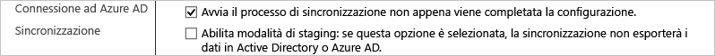

In modalità di gestione temporanea, è possibile apportare le modifiche necessarie al motore di sincronizzazione ed esaminare gli elementi da esportare. Durante la configurazione sembra essere corretta, eseguire nuovamente l'installazione guidata e disattivare la modalità di gestione temporanea. In questo modo sarà possibile esportare i dati in Azure AD. Assicurarsi di disabilitare l'altro server allo stesso tempo, in modo che soltanto un server esegua l’esportazione in modo attivo.

Per altre informazioni, vedere [Modalità di gestione temporanea](active-directory-aadconnectsync-operations.md#staging-mode).

### Verificare la configurazione della federazione
Azure AD Connect verificherà le impostazioni DNS automaticamente, facendo clic sul pulsante Verifica.

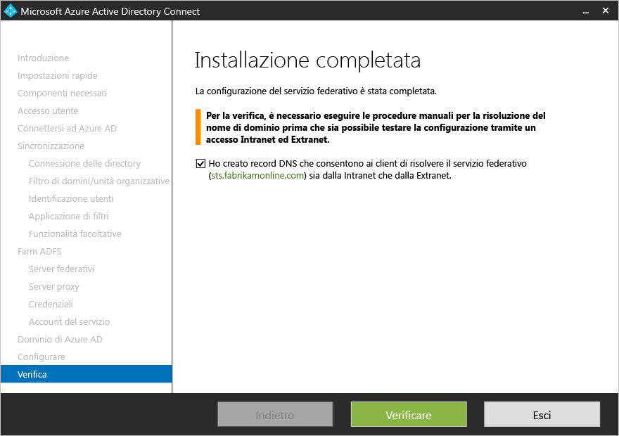

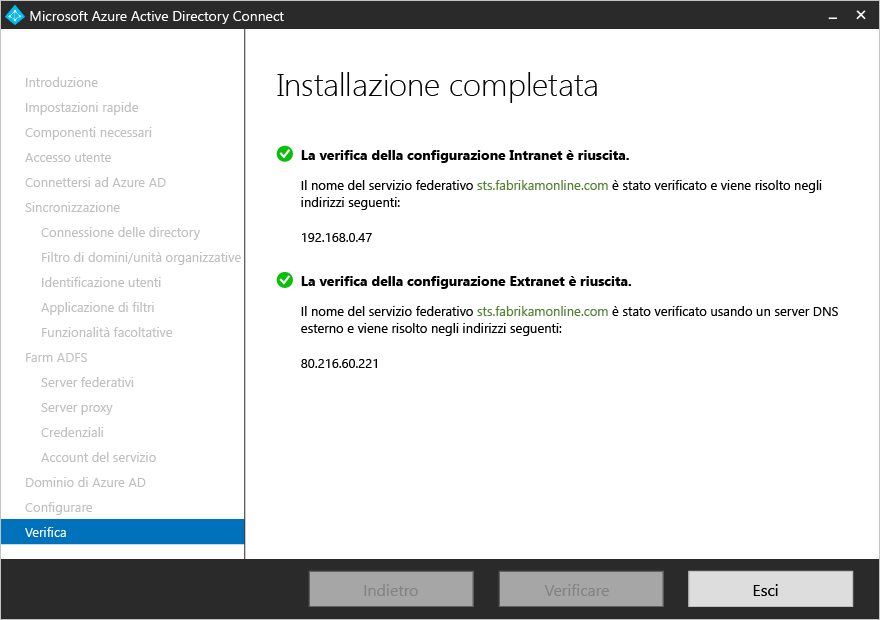

Inoltre, eseguire i passaggi di verifica seguenti:

- Convalidare l'accesso tramite browser da un computer aggiunto a un dominio da Internet Explorer, dalla rete Intranet: connettersi a https://myapps.microsoft.com e verificare l'accesso con l'account connesso. **Nota:** l'account amministratore di Servizi di dominio Active Directory predefinito non è sincronizzato e non può essere usato per la verifica.
- Convalidare l'accesso tramite browser da qualsiasi dispositivo dalla rete Extranet: connettersi a https://myapps.microsoft.com da un computer di casa o un dispositivo mobile e fornire l'ID di accesso e la password.
- Convalidare l'accesso rich client: connettersi a https://testconnectivity.microsoft.com, scegliere la scheda **Office 365** e quindi scegliere **Test di Single Sign-On in Office 365**.

## Passaggi successivi
Dopo il completamento dell'installazione, disconnettersi e accedere nuovamente a Windows prima di usare la Gestione del servizio di sincronizzazione o l’Editor della regola di sincronizzazione.

Dopo aver installato Azure AD Connect è possibile [verificare l'installazione e assegnare le licenze](active-directory-aadconnect-whats-next.md).

Altre informazioni su [Integrazione delle identità locali con Azure Active Directory](active-directory-aadconnect.md).

<!---HONumber=AcomDC_0309_2016-->