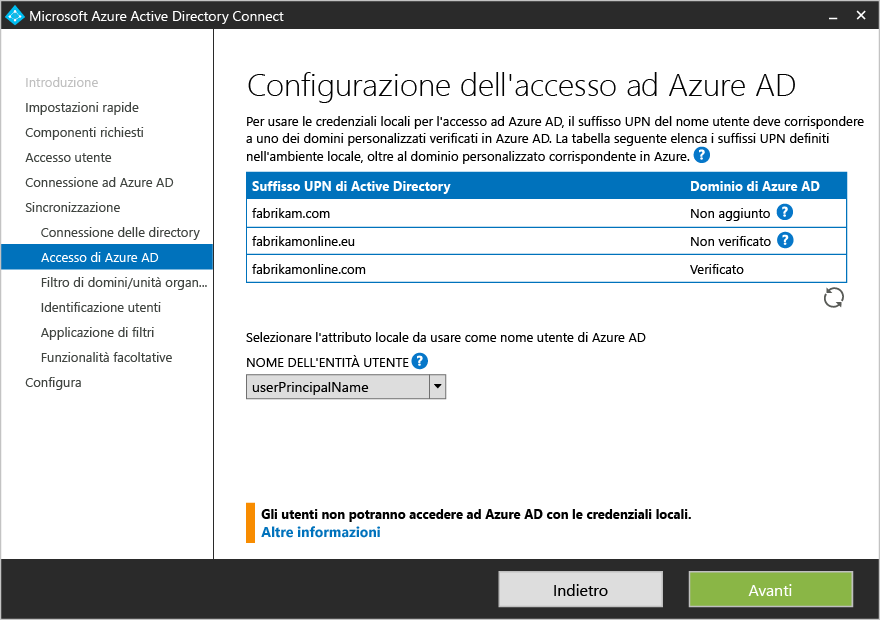

<properties
	pageTitle="Azure AD Connect: Installazione personalizzata | Microsoft Azure"
	description="Questo documento descrive le opzioni di installazione personalizzata per Azure AD Connect. Usare queste istruzioni per installare Active Directory con Azure AD Connect."
	services="active-directory"
    keywords="che cos'è Azure AD Connect, installare Active Directory, componenti richiesti per Azure AD"
	documentationCenter=""
	authors="andkjell"
	manager="stevenpo"
	editor="curtand"/>

<tags
	ms.service="active-directory"  
	ms.workload="identity"
	ms.tgt_pltfrm="na"
	ms.devlang="na"
	ms.topic="get-started-article"
	ms.date="06/27/2016"
	ms.author="billmath;andkjell"/>

# Installazione personalizzata di Azure AD Connect
**Impostazioni personalizzate** di Azure AD Connect viene usato quando sono necessarie altre opzioni per l'installazione. Viene usato se sono presenti più foreste o per configurare funzionalità facoltative non incluse nell'installazione rapida. Viene usato in tutti i casi in cui l'opzione di [**installazione rapida**](active-directory-aadconnect-get-started-express.md) non soddisfa la distribuzione o la topologia.

Prima di avviare l'installazione di Azure AD Connect, verificare di avere [scaricato Azure AD Connect](http://go.microsoft.com/fwlink/?LinkId=615771) e completare i passaggi obbligatori illustrati in [Azure AD Connect: hardware e prerequisiti](active-directory-aadconnect-prerequisites.md). Verificare anche che siano disponibili gli account obbligatori descritti in [Autorizzazioni e account di Azure AD Connect](active-directory-aadconnect-accounts-permissions.md).

Se le impostazioni personalizzate non corrispondono alla topologia, ad esempio per aggiornare DirSync, vedere la [documentazione correlata](#related-documentation) per altri scenari.

## Installazione di Impostazioni personalizzate di Azure AD Connect

### Impostazioni rapide
In questa pagina fare clic su **Personalizza** per avviare un'installazione di Impostazioni personalizzate.

### Installare i componenti necessari
Durante l'installazione dei servizi di sincronizzazione è possibile lasciare deselezionata l'opzione di configurazione facoltativa perché Azure AD Connect esegua la configurazione in modo automatico. Viene configurata un'istanza di SQL Server 2012 Express LocalDB, vengono creati i gruppi appropriati e vengono assegnate le autorizzazioni. Per cambiare le impostazioni predefinite, è possibile usare la tabella seguente per informazioni sulle opzioni di configurazione facoltative disponibili.

Configurazione facoltativa | Descrizione
------------- | -------------
Usare un server SQL esistente | Permette di specificare il nome di SQL Server e il nome dell'istanza. Scegliere questa opzione se si dispone già di un server di database che si desidera usare. Immettere il nome dell'istanza seguito da una virgola e dal numero della porta in **Nome istanza** se la funzionalità di esplorazione non è abilitata in SQL Server.
Usare un account di servizio esistente | Per impostazione predefinita, Azure AD Connect crea un account di servizio locale che verrà usato dai servizi di sincronizzazione. La password viene generata automaticamente e non è nota alla persona che installa Azure AD Connect. Se si usa un server SQL remoto o un proxy che richiede l'autenticazione, è necessario avere un account di servizio nel dominio e conoscere la password. In questi casi, immettere l'account di servizio da usare. Assicurarsi che l'utente che esegue l'installazione sia un'associazione di sicurezza in SQL, in modo che sia possibile creare un accesso per l'account del servizio. Vedere [Autorizzazioni e account di Azure AD Connect](active-directory-aadconnect-accounts-permissions.md#custom-settings-installation)
Specificare i gruppi di sincronizzazione personalizzati | Per impostazione predefinita, Azure AD Connect crea quattro gruppi locali nel server quando vengono installati i servizi di sincronizzazione. I gruppi sono: gruppo Administrators, gruppo Operators, gruppo Browse e Gruppo Password Reset. È possibile specificare qui i gruppi personalizzati. I gruppi devono essere locali sul server e non possono trovarsi nel dominio.

### Accesso utente
Dopo l'installazione dei componenti necessari, viene richiesta la selezione del metodo di accesso Single Sign-On degli utenti. La tabella seguente fornisce una breve descrizione delle opzioni disponibili. Per una descrizione completa dei metodi di accesso, vedere [Accesso utente](active-directory-aadconnect-user-signin.md).

Opzione Single Sign-On | Descrizione
------------- | -------------
Sincronizzazione delle password | Gli utenti possono accedere ai servizi cloud Microsoft, ad esempio Office 365, usando la stessa password specificata nella rete locale. Le password degli utenti vengono sincronizzate in Azure AD come hash della password e l'autenticazione viene eseguita sul cloud. Per altre informazioni, vedere [Sincronizzazione delle password](active-directory-aadconnectsync-implement-password-synchronization.md).
Federazione con ADFS | Gli utenti possono accedere ai servizi cloud Microsoft, ad esempio Office 365, usando la stessa password specificata nella rete locale. Gli utenti vengono reindirizzati alla rispettiva istanza locale di AD FS per l'accesso e l'autenticazione viene eseguita in locale.
Non configurare | Nessuna funzionalità verrà installata e configurata. Scegliere questa opzione se si dispone già di un server federativo di terze parti o di un'altra soluzione esistente installata.

### Connessione ad Azure AD
Nella schermata Connessione ad Azure AD, immettere un account di amministratore globale e una password. Se è stato selezionato **Federazione tramite AD FS** nella pagina precedente, non accedere con un account in un dominio che si intende abilitare per la federazione. Si consiglia di usare un account nel dominio **onmicrosoft.com** predefinito, fornito con la directory di Azure AD.

Questo account viene usato solo per creare un account di servizio in Azure AD e al termine della procedura guidata non viene più usato. 

Se per l'account amministratore globale è abilitata l'autenticazione MFA, è necessario fornire nuovamente la password nella finestra popup di accesso e completare la richiesta di autenticazione MFA. La richiesta può consistere nel fornire un codice di verifica o in una telefonata. 

Per l'account amministratore globale può essere abilitato anche [Privileged Identity Management](active-directory-privileged-identity-management-getting-started.md).

Se viene visualizzato un errore e si hanno problemi di connettività, vedere [Risolvere i problemi di connettività](active-directory-aadconnect-troubleshoot-connectivity.md).

## Pagine della sezione di sincronizzazione

### Connessione delle directory
Per connettersi a Servizi di dominio di Active Directory, Azure AD Connect richiede le credenziali di un account con autorizzazioni sufficienti. È possibile immettere la parte relativa al dominio in formato NetBios o FQDN, ad esempio FABRIKAM\\syncuser o fabrikam.com\\syncuser. Questo account può essere un account utente normale, perché richiede solo autorizzazioni di lettura predefinite. Tuttavia, a seconda dello scenario, potrebbero essere necessarie autorizzazioni aggiuntive. Per altre informazioni, vedere [Account e autorizzazioni di Azure AD Connect](active-directory-aadconnect-accounts-permissions.md#create-the-ad-ds-account).

### Configurazione dell'accesso ad Azure AD
Questa pagina consente di verificare i domini UPN presenti nell'istanza locale di Servizi di dominio Active Directory, già verificati in Azure AD. Questa pagina consente anche di configurare l'attributo da usare per userPrincipalName.

 Verificare qualsiasi dominio contrassegnato come **Non aggiunto** e **Non verificato**. Assicurarsi che i domini usati siano stati verificati in Azure AD. Fare clic sul simbolo Aggiorna dopo avere verificato tutti i domini. Per altre informazioni, vedere [Aggiungere e verificare il dominio](active-directory-add-domain.md).

**UserPrincipalName**: l'attributo userPrincipalName viene usato dagli utenti per l'accesso ad Azure AD e Office 365. I domini utilizzati, noti anche come suffisso UPN, devono essere verificati in Azure AD prima che gli utenti vengano sincronizzati. È consigliabile mantenere l'attributo predefinito userPrincipalName. Se questo attributo è non instradabile e non può essere verificato, è possibile selezionare un altro attributo, ad esempio email, come attributo che contiene l'ID di accesso. L'uso di un attributo diverso da userPrincipalName viene definito **ID alternativo**. Il valore dell'attributo ID alternativo deve essere conforme allo standard RFC822. È possibile usare un ID alternativo con la sincronizzazione password e la federazione.

>[AZURE.WARNING]
L'uso di un ID alternativo non è compatibile con tutti i carichi di lavoro di Office 365. Per altre informazioni, vedere [Configurazione dell'ID di accesso alternativo](https://technet.microsoft.com/library/dn659436.aspx).

### Filtro unità organizzativa e dominio
Per impostazione predefinita, vengono sincronizzati tutti i domini e le unità organizzative. Per escludere alcuni domini o unità organizzative dalla sincronizzazione con Azure AD, è possibile deselezionarli.  Questa pagina della procedura guidata configura i filtri basati sul dominio. Per altre informazioni, vedere [Filtri basati sul dominio](active-directory-aadconnectsync-configure-filtering.md#domain-based-filtering).

Alcuni domini potrebbero non essere raggiungibili a causa di restrizioni del firewall. Questi domini vengono deselezionati per impostazione predefinita e viene visualizzato un avviso.  Se viene visualizzato questo avviso, assicurarsi che i domini non siano effettivamente raggiungibili e che l'avviso sia previsto.

### Identificazione univoca degli utenti
La corrispondenza tra la funzionalità delle foreste consente di definire la modalità di rappresentazione degli utenti delle foreste AD DS in Azure AD. Un utente può essere rappresentato solo una volta in tutte le foreste oppure disporre di una combinazione di account abilitati e disabilitati. In alcune foreste è possibile che l'utente sia rappresentato anche come un contatto.

Impostazione | Descrizione
------------- | -------------
[Gli utenti vengono rappresentati solo una volta nel numero totale delle foreste](active-directory-aadconnect-topologies.md#multiple-forests-separate-topologies) | Tutti gli utenti vengono creati come singoli oggetti in Azure AD. Gli oggetti non vengono uniti nel metaverse.
[Attributo di posta](active-directory-aadconnect-topologies.md#multiple-forests-full-mesh-with-optional-galsync) | Questa opzione unisce utenti e contatti se l'attributo di posta ha lo stesso valore in foreste diverse. Usare questa opzione quando i contatti sono stati creati mediante GALSync.
[ObjectSID e msExchangeMasterAccountSID/ msRTCSIP-OriginatorSid](active-directory-aadconnect-topologies.md#multiple-forests-account-resource-forest) | Questa opzione unisce un utente abilitato in una foresta di account a un utente disabilitato in una foresta di risorse. In Exchange questa configurazione è definita cassetta postale collegata. Questa opzione può essere utilizzata anche se si utilizza solo Lync, ed Exchange non è presente nella foresta delle risorse.
sAMAccountName e MailNickName | Questa opzione crea un join degli attributi in cui si prevede la possibilità di trovare l'ID di accesso dell'utente.
Attributo specifico | Questa opzione consente di selezionare un attributo personale. **Limitazione:** verificare di avere selezionato un attributo già disponibile nel metaverse. Se si seleziona un attributo personalizzato, non disponibile nel metaverse, non sarà possibile completare la procedura guidata.

**Ancoraggio di origine**: l'attributo sourceAnchor non può essere modificato per l'intera durata di un oggetto utente. È la chiave primaria che collega l'utente locale con l'utente in Azure AD. Poiché l'attributo non può essere modificato, è necessario pianificare un attributo valido da usare. objectGUID è un candidato valido. Questo attributo non subisce modifiche, a meno che l'account utente non venga spostato tra foreste/domini. In un ambiente a più foreste, nel quale è possibile spostare account tra foreste, è necessario usare un altro attributo, ad esempio un attributo con il valore employeeID. Evitare gli attributi che subirebbero modifiche in caso di matrimonio o nuova assegnazione dell'utente. Non è possibile usare gli attributi con un segno @, pertanto non è possibile usare indirizzi di posta elettronica e userPrincipalName. L'attributo rispetta anche la distinzione tra maiuscole e minuscole. Quando si sposta un oggetto tra foreste, occorre quindi assicurarsi di mantenere tale distinzione. Gli attributo binari hanno una codifica di tipo base64, ma altri tipi di attributi mantengono lo stato non codificato. Negli scenari di federazione e in alcune interfacce di Azure AD questo attributo è noto anche come immutableID. In [Concetti relativi alla progettazione](active-directory-aadconnect-design-concepts.md#sourceAnchor) sono disponibili altre informazioni su sourceAnchor.

### Filtro di sincronizzazione basato sui gruppi
La funzionalità di filtro sui gruppi consente di sincronizzare solo un sottoinsieme ridotto di oggetti per un progetto pilota. Per usare questa funzionalità, creare un gruppo per questo scopo specifico nell'istanza locale di Active Directory. Aggiungere quindi utenti e gruppi da sincronizzare in Azure AD come membri diretti, In un secondo momento, è possibile aggiungere utenti a questo gruppo e rimuoverli per gestire l'elenco di oggetti che devono essere presenti in Azure AD. Tutti gli oggetti che si desidera sincronizzare devono essere membri diretti del gruppo, ad esempio utenti, gruppi, contatti e computer/dispositivi. L'appartenenza ai gruppi annidati non viene risolta. Quando si aggiunge un gruppo come membro, viene aggiunto solo il gruppo stesso, non i rispettivi membri.

>[AZURE.WARNING]
Questa funzionalità è destinata solo al supporto di una distribuzione pilota. Non usarla in una distribuzione di produzione completa.

In una distribuzione di produzione completa è difficile mantenere un singolo gruppo con tutti gli oggetti da sincronizzare. È invece necessario usare uno dei metodi descritti in [Configurare il filtro](active-directory-aadconnectsync-configure-filtering.md).

### Funzionalità facoltative
Questa schermata consente di selezionare le funzionalità facoltative per gli scenari specifici.

>[AZURE.WARNING]
Se attualmente è attivo DirSync o Azure AD Sync, non attivare nessuna delle funzionalità di writeback in Azure AD Connect.

Funzionalità facoltative | Descrizione
------------------- | -------------
Distribuzione ibrida di Exchange | La funzionalità Distribuzione ibrida di Exchange consente la coesistenza di cassette postali di Exchange in locale e in Office 365. Azure AD Connect sincronizza un set specifico di [attributi](active-directory-aadconnectsync-attributes-synchronized.md#exchange-hybrid-writeback) da Azure AD alla directory locale.
Filtro attributi e app di Azure AD | Se si abilita questa opzione, il set di attributi sincronizzati può essere adattato. Questa opzione aggiunge altre due pagine di configurazione alla procedura guidata. Per altre informazioni, vedere [Filtro attributi e app Azure AD](#azure-ad-app-and-attribute-filtering).
Sincronizzazione delle password | Se è stata selezionata la federazione come soluzione di accesso, è possibile abilitare questa opzione. La sincronizzazione delle password può quindi essere usata come opzione di backup. Per altre informazioni, vedere [Sincronizzazione delle password](active-directory-aadconnectsync-implement-password-synchronization.md).
Writeback password | Se si abilita il writeback delle password, le modifiche delle password generate da Azure AD vengono riscritte nella directory locale. Per altre informazioni, vedere [Introduzione alla gestione delle password](active-directory-passwords-getting-started.md).
Writeback dei gruppi | Se si usa la funzionalità **Office 365 Groups**, i gruppi possono essere rappresentati nell'istanza locale di Active Directory. Questa opzione è disponibile solo se si dispone di Exchange in Active Directory locale. Per altre informazioni, vedere [Writeback dei gruppi](active-directory-aadconnect-feature-preview.md#group-writeback).
Writeback dei dispositivi | Consente di eseguire il writeback degli oggetti dispositivo in Azure AD in Active Directory locale per scenari di accesso condizionale. Per altre informazioni, vedere [Abilitazione del writeback dei dispositivi in Azure AD Connect](active-directory-aadconnect-feature-device-writeback.md).
Sincronizzazione attributi estensione della directory | Se si abilita questa opzione, gli attributi specificati vengono sincronizzati in Azure AD. Per altre informazioni, vedere [Estensioni della directory](active-directory-aadconnectsync-feature-directory-extensions.md).

### Filtro attributi e app di Azure AD
Per limitare gli attributi da sincronizzare in Azure AD, selezionare prima di tutto i servizi usati. Se si modifica la configurazione in questa pagina, sarà necessario selezionare esplicitamente un nuovo servizio eseguendo di nuovo l'installazione guidata.

In base ai servizi selezionati nel passaggio precedente, questa pagina visualizza tutti gli attributi che vengono sincronizzati. Questo elenco è una combinazione di tutti i tipi di oggetti da sincronizzare. Se sono presenti alcuni attributi particolari che non è necessario sincronizzare, è possibile deselezionarli.

>[AZURE.WARNING]
La rimozione degli attributi può influire sulle funzionalità. Per procedure consigliate e indicazioni, vedere gli [attributi sincronizzati](active-directory-aadconnectsync-attributes-synchronized.md#attributes-to-synchronize).

### Sincronizzazione attributi estensione della directory
È possibile estendere lo schema in Azure AD con attributi personalizzati aggiunti dall'organizzazione o altri attributi in Active Directory. Per usare questa funzionalità, selezionare **Sincronizzazione attributi estensione della directory** nella pagina **Funzionalità facoltative**. È possibile selezionare altri attributi da sincronizzare in questa pagina.

Per altre informazioni, vedere [Estensioni della directory](active-directory-aadconnectsync-feature-directory-extensions.md).

## Configurazione della federazione con ADFS
Configurare ADFS con Azure AD Connect è semplice e richiede l'esecuzione di pochi passaggi. Prima della configurazione, sono necessari gli elementi seguenti.

- Un server Windows Server 2012 R2 per il server federativo con la gestione remota abilitata
- Un server Windows Server 2012 R2 per il server Proxy applicazione Web con la gestione remota abilitata
- Un certificato SSL per il nome del servizio federativo che si intende usare, ad esempio sts.contoso.com

### Prerequisiti di configurazione di AD FS
Per configurare la farm AD FS con Azure AD Connect, accertarsi che WinRM sia abilitata sui server remoti. Vedere anche i requisiti relativi alle porte elencati nella [Tabella 3: Azure AD Connect e server federativi/WAP](active-directory-aadconnect-ports.md#table-3---azure-ad-connect-and-federation-serverswap).

### Creare una nuova farm ADFS o usare una farm ADFS esistente
È possibile usare una farm ADFS esistente oppure scegliere di creare una nuova farm ADFS. Se si sceglie di crearne una nuova, è necessario fornire il certificato SSL. Se il certificato SSL è protetto da password, viene richiesta la password.

Se si sceglie di usare una farm AD FS esistente, si viene indirizzati direttamente alla schermata di configurazione della relazione di trust tra AD FS e Azure AD.

### Specificare i server ADFS
Immettere i server in cui si vuole installare AD FS. È possibile aggiungere uno o più server in base alle esigenze di pianificazione della capacità. Aggiungere tutti i server ad Active Directory prima di eseguire la configurazione. È consigliabile installare un singolo server AD FS per distribuzioni di test e pilota. Aggiungere e distribuire quindi altri server per soddisfare i requisiti di ridimensionamento, eseguendo di nuovo Azure AD Connect dopo la configurazione iniziale.

>[AZURE.NOTE]
Assicurarsi che tutti i server siano aggiunti a un dominio di AD prima di eseguire la configurazione.

### Specificare i server Proxy applicazione Web
Immettere i server da usare come server proxy applicazione Web. Il server Proxy applicazione Web viene distribuito nel DMZ (per la rete Extranet) e supporta le richieste di autenticazione dalla rete Extranet. È possibile aggiungere uno o più server in base alle esigenze di pianificazione della capacità. È consigliabile installare un singolo server proxy applicazione Web per distribuzioni di test e pilota. Aggiungere e distribuire quindi altri server per soddisfare i requisiti di ridimensionamento, eseguendo di nuovo Azure AD Connect dopo la configurazione iniziale. È consigliabile avere un numero equivalente di server proxy per soddisfare l'autenticazione dalla Intranet.

>[AZURE.NOTE]
<li> Se l'account usato non è un amministratore locale nei server AD FS, vengono richieste le credenziali di amministratore.</li>
<li> Verificare la connettività HTTP/HTTPS tra il server Azure AD Connect e il server proxy applicazione Web prima di eseguire questo passaggio.</li>
<li> Verificare la connettività HTTP/HTTPS tra il server applicazioni Web e il server AD FS per consentire il passaggio delle richieste di autenticazione.</li>

Viene richiesta l'immissione delle credenziali, in modo che il server applicazione Web possa stabilire una connessione protetta al server AD FS. Tali credenziali devono corrispondere a un amministratore locale sul server ADFS.

### Specificare l'account di servizio per il servizio ADFS
Il servizio ADFS richiede un account di servizio del dominio per autenticare gli utenti e cercare le informazioni utente in Active Directory. Supporta due tipi di account di servizio:

- **Account del servizio gestito del gruppo**: introdotto in Servizi di dominio Active Directory con Windows Server 2012. Questo tipo di account fornisce servizi, ad esempio AD FS, come singolo account, senza che sia necessario aggiornare regolarmente la password dell'account. Usare questa opzione se il dominio a cui appartengono i server AD FS include già controller di dominio di Windows Server 2012.
- **Account utente di dominio**: questo tipo di account richiede di fornire una password e di aggiornarla regolarmente in caso di modifica o di scadenza. Usare questa opzione solo se il dominio a cui appartengono i server AD FS non include controller di dominio di Windows Server 2012.

Se è stato selezionato l'account del servizio gestito del gruppo e questa funzionalità non è mai stata usata in Active Directory, vengono richieste anche le credenziali di amministratore dell'organizzazione. Queste credenziali vengono usate per avviare l'archivio chiavi e abilitare la funzionalità di Active Directory.

### Selezionare il dominio Azure AD di cui si desidera attuare la federazione
Questa configurazione viene utilizzata per impostare la relazione di federazione tra ADFS e Azure AD e configura ADFS in modo da rilasciare token di sicurezza per Azure AD, configurando Azure AD in modo da considerare attendibili i token da questa specifica istanza di ADFS. Questa pagina consente solo di configurare un singolo dominio nell'installazione iniziale. È possibile configurare altri domini in un secondo momento, eseguendo di nuovo Azure AD Connect.

### Verificare il dominio di Azure AD selezionato per la federazione
Quando si seleziona il dominio da federare, Azure AD Connect fornisce le informazioni necessarie per verificare un dominio non verificato. Per indicazioni su come usare queste informazioni, vedere [Aggiungere e verificare il dominio](active-directory-add-domain.md).

>[AZURE.NOTE]
Azure AD Connect prova a verificare il dominio in fase di configurazione. Se si continua la configurazione senza aggiungere i record DNS necessari, la procedura guidata non può completare la configurazione.

## Configurare e verificare le pagine
La configurazione viene eseguita in questa pagina.

>[AZURE.NOTE]
Se è stata configurata la federazione, prima di continuare l'installazione assicurarsi di avere configurato la [Risoluzione dei nomi per i server federativi](active-directory-aadconnect-prerequisites.md#name-resolution-for-federation-servers).

### Modalità di gestione temporanea
È possibile configurare un nuovo server di sincronizzazione in parallelo con la modalità di staging. È supportata la presenza di un solo server di sincronizzazione che esegue l'esportazione in una directory nel cloud. Per spostarsi da un altro server, ad esempio da un server con DirSync, è possibile abilitare Azure AD Connect in modalità di staging. Se è abilitato, il motore di sincronizzazione importa e sincronizza i dati come di consueto, ma non esporta alcun elemento in Azure AD o AD. Le funzionalità di sincronizzazione password e writeback delle password sono disabilitate nella modalità di staging.

In modalità di gestione temporanea, è possibile apportare le modifiche necessarie al motore di sincronizzazione ed esaminare gli elementi da esportare. Durante la configurazione sembra essere corretta, eseguire nuovamente l'installazione guidata e disattivare la modalità di gestione temporanea. I dati vengono ora esportati in Azure AD da questo server. Assicurarsi di disabilitare l'altro server allo stesso tempo, in modo che soltanto un server esegua l’esportazione in modo attivo.

Per altre informazioni, vedere [Modalità di staging](active-directory-aadconnectsync-operations.md#staging-mode).

### Verificare la configurazione della federazione
Azure AD Connect verifica automaticamente le impostazioni DNS quando si fa clic sul pulsante Verifica.

Inoltre, eseguire i passaggi di verifica seguenti:

- Assicurarsi che sia possibile accedere da un browser da un computer aggiunto a un dominio nella Intranet. Connettersi a https://myapps.microsoft.com e verificare l'accesso con l'account connesso. L'account amministratore di Servizi di dominio Active Directory non è sincronizzato e non può essere usato per la verifica.
- Assicurarsi che sia possibile accedere da un dispositivo dalla Extranet. In un computer di casa o in un dispositivo mobile connettersi a https://myapps.microsoft.com e fornire le credenziali.
- Convalidare l'accesso rich client. Connettersi a https://testconnectivity.microsoft.com, scegliere la scheda **Office 365** e chiudere la finestra **Test di Single Sign-On in Office 365**.

## Passaggi successivi
Dopo il completamento dell'installazione, disconnettersi e accedere nuovamente a Windows prima di usare la Gestione del servizio di sincronizzazione o l’Editor della regola di sincronizzazione.

Dopo aver installato Azure AD Connect è possibile [verificare l'installazione e assegnare le licenze](active-directory-aadconnect-whats-next.md).

Altre informazioni su queste funzionalità che sono state abilitate con l'installazione: [Impedire eliminazioni accidentali](active-directory-aadconnectsync-feature-prevent-accidental-deletes.md) e [Azure AD Connect Health](active-directory-aadconnect-health-sync.md).

Altre informazioni su questi argomenti comuni: [utilità di pianificazione e come attivare la sincronizzazione](active-directory-aadconnectsync-feature-scheduler.md).

Ulteriori informazioni su [Integrazione delle identità locali con Azure Active Directory](active-directory-aadconnect.md).

## Documentazione correlata

Argomento |  
--------- | ---------
Panoramica di Azure AD Connect | [Integrazione delle identità locali con Azure Active Directory](active-directory-aadconnect.md)
Eseguire l'installazione mediante le impostazioni rapide | [Installazione rapida di Azure AD Connect](active-directory-aadconnect-get-started-express.md)
Eseguire l'aggiornamento da DirSync | [Aggiornamento dallo strumento di sincronizzazione di Azure AD (DirSync)](active-directory-aadconnect-dirsync-upgrade-get-started.md)
Account usati per l'installazione | [Altre informazioni sugli account e le autorizzazioni di Azure AD Connect](active-directory-aadconnect-accounts-permissions.md)

<!---HONumber=AcomDC_0629_2016-->