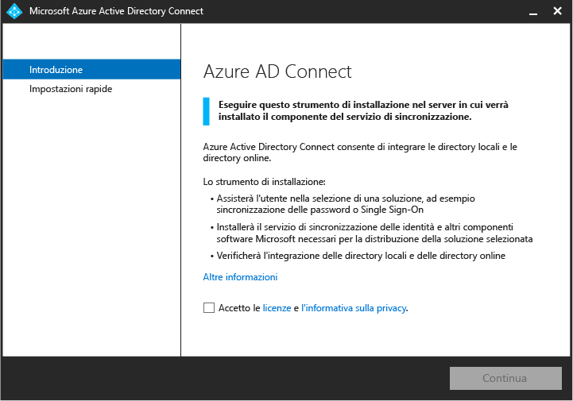

<properties
	pageTitle="Azure AD Connect: introduzione alle impostazioni rapide | Microsoft Azure"
	description="Informazioni su come scaricare, installare e configurare la procedura guidata per Azure AD Connect."
	services="active-directory"
	documentationCenter=""
	authors="billmath"
	manager="stevenpo"
	editor="curtand"/>

<tags
	ms.service="active-directory"
	ms.workload="identity"
	ms.tgt_pltfrm="na"
	ms.devlang="na"
	ms.topic="get-started-article"
	ms.date="03/22/2016"
	ms.author="billmath;andkjell"/>

# Introduzione alle impostazioni rapide per Azure AD Connect
La documentazione seguente contiene le informazioni necessarie per iniziare a usare Azure Active Directory Connect. In questa documentazione viene illustrato l'uso dell'installazione rapida di Azure AD Connect.

## Documentazione correlata
Se non è stata letta la documentazione in [Integrazione delle identità locali con Azure Active Directory](active-directory-aadconnect.md), la tabella seguente fornisce collegamenti ad argomenti correlati. È necessario consultare i primi due argomenti in grassetto prima di iniziare l'installazione.

| Argomento | |
| --------- | --------- |
| **Scaricare Azure AD Connect** | [Scaricare Azure AD Connect](http://go.microsoft.com/fwlink/?LinkId=615771) |
| **Hardware e prerequisiti** | [Azure AD Connect: Hardware e prerequisiti](active-directory-aadconnect-prerequisites.md) |
| Eseguire l'installazione con le impostazioni personalizzate | [Installazione personalizzata di Azure AD Connect](active-directory-aadconnect-get-started-custom.md) |
| Aggiornamento da DirSync | [Aggiornamento dallo strumento di sincronizzazione di Azure AD (DirSync)](active-directory-aadconnect-dirsync-upgrade-get-started.md) |
| Dopo l'installazione | [Verificare l'installazione e assegnare le licenze ](active-directory-aadconnect-whats-next.md) |
| Account usati per l'installazione | [Altre informazioni sugli account e le autorizzazioni di Azure AD Connect](active-directory-aadconnect-accounts-permissions.md) |

## Installazione rapida di Azure AD Connect
La selezione di Impostazioni rapide rappresenta l'opzione predefinita ed è uno degli scenari più comuni. In questo caso, Azure AD Connect distribuisce la sincronizzazione con l'opzione di sincronizzazione delle password. Questo scenario è possibile solo per una singola foresta e permette agli utenti di usare la propria password locale per accedere al cloud. Se si usa Impostazioni rapide, viene automaticamente avviata una sincronizzazione al termine dell'installazione (anche se è possibile scegliere di non avviarla). Questa opzione richiede solo pochi clic per estendere la directory locale nel cloud.

### Per installare Azure AD Connect utilizzando le impostazioni di rapide

1. Accedere al server in cui si vuole installare Azure AD Connect come amministratore locale. Deve essere il server da impostare come server di sincronizzazione.
2. Selezionare e fare doppio clic su AzureADConnect.msi.
3. Nella schermata iniziale, selezionare la casella che consente di accettare le condizioni di licenza e fare clic su **Continua**.
4. Nella schermata Impostazioni rapide fare clic su **Usa impostazioni rapide**. 
5. Nella schermata Connessione ad Azure AD immettere il nome utente e password di un amministratore globale di Azure per Azure AD. Fare clic su **Avanti**. Se viene visualizzato un errore e si hanno problemi relativi alla connettività, vedere [Risolvere i problemi di connettività](active-directory-aadconnect-troubleshoot-connectivity.md).
6. Nella schermata Connessione a Servizi di dominio di Active Directory immettere il nome utente e la password di un account amministratore dell'organizzazione. È possibile immettere la parte relativa al dominio in formato NetBios o FQDN, ad esempio FABRIKAM\\administrator o fabrikam.com\\administrator. Fare clic su **Avanti**. 
7. Nella schermata Pronto per la configurazione fare clic su **Installa**.
	- Nella pagina Pronto per la configurazione è possibile deselezionare la casella di controllo **Avviare il processo di sincronizzazione non appena viene completata la configurazione iniziale**. In tal caso, la procedura guidata configurerà la sincronizzazione ma lascerà disabilitata l'attività in modo che non venga eseguita fino a quando non la si abilita manualmente nell'Utilità di pianificazione. Dopo avere abilitato l'attività, la sincronizzazione verrà eseguita ogni 30 minuti.
	- È anche possibile scegliere di configurare i servizi di sincronizzazione per **Distribuzione ibrida di Exchange** selezionando la casella di controllo corrispondente. Se non si prevede di avere cassette postali di Exchange nel cloud o in locale, non è necessario selezionare questa opzione. 
8. Al termine dell'installazione, fare clic su **Esci**.
9. Al termine dell'installazione, disconnettersi e accedere nuovamente prima di usare Synchronization Service Manager o Synchronization Rules Editor.

Per un video sull'uso dell'Installazione rapida, vedere:

>[AZURE.VIDEO azure-active-directory-connect-express-settings]

## Passaggi successivi
Dopo aver installato Azure AD Connect è possibile [verificare l'installazione e assegnare le licenze](active-directory-aadconnect-whats-next.md).

Altre informazioni su [Integrazione delle identità locali con Azure Active Directory](active-directory-aadconnect.md).

<!---HONumber=AcomDC_0420_2016-->