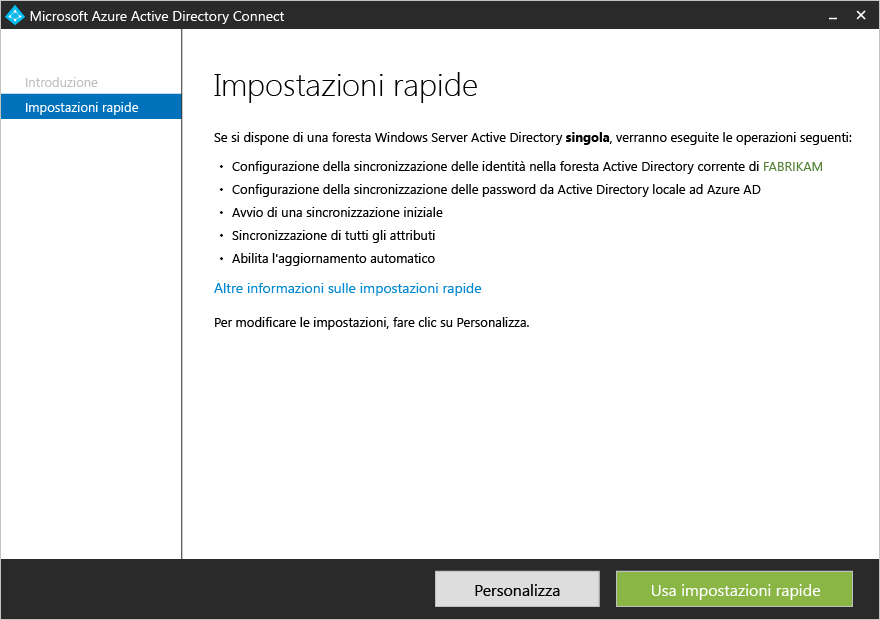
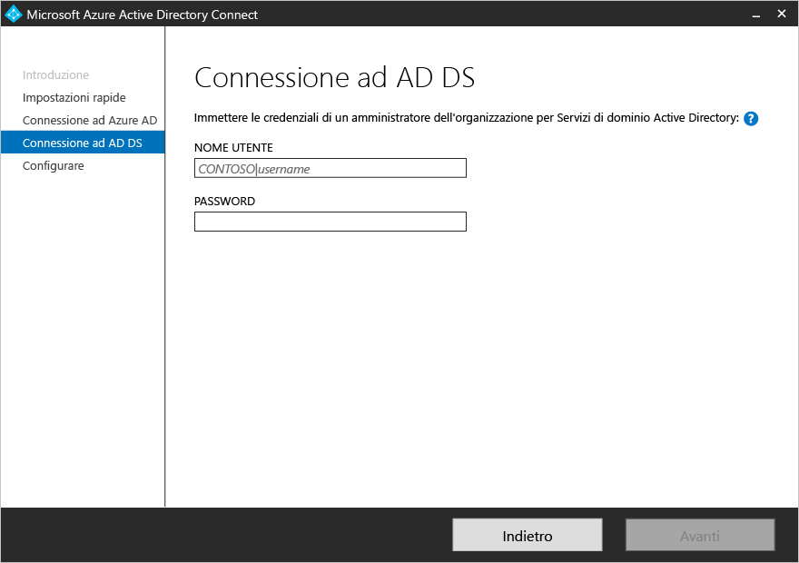
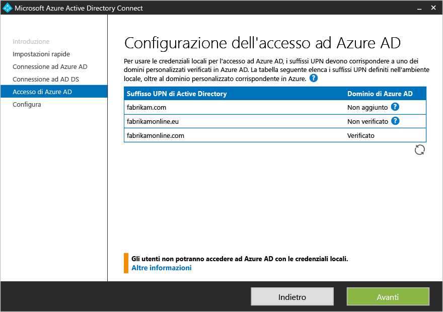
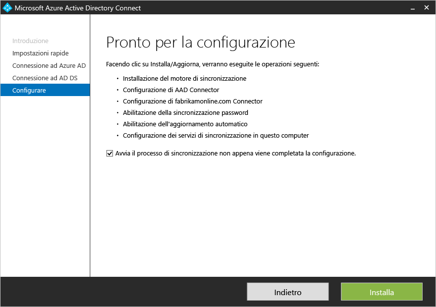

<properties
	pageTitle="Azure AD Connect: introduzione alle impostazioni rapide | Microsoft Azure"
	description="Informazioni su come scaricare, installare e configurare la procedura guidata per Azure AD Connect."
	services="active-directory"
	documentationCenter=""
	authors="andkjell"
	manager="femila"
	editor="curtand"/>

<tags
	ms.service="active-directory"
	ms.workload="identity"
	ms.tgt_pltfrm="na"
	ms.devlang="na"
	ms.topic="get-started-article"
	ms.date="09/13/2016"
	ms.author="billmath;andkjell"/>



# Introduzione alle impostazioni rapide per Azure AD Connect
**Impostazioni rapide** di Azure AD Connect viene usato quando è presente una topologia a singola foresta e si usa la [sincronizzazione password](active-directory-aadconnectsync-implement-password-synchronization.md) per l'autenticazione. **Impostazioni rapide** è l'opzione predefinita e viene usata nello scenario distribuito più comune. Questa opzione richiede solo pochi clic per estendere la directory locale nel cloud.

Prima di avviare l'installazione di Azure AD Connect, verificare di avere [scaricato Azure AD Connect](http://go.microsoft.com/fwlink/?LinkId=615771) e completare i passaggi obbligatori illustrati in [Azure AD Connect: hardware e prerequisiti](active-directory-aadconnect-prerequisites.md).

Se le impostazioni rapide non corrispondono alla topologia, vedere la [documentazione correlata](#related-documentation) per altri scenari.

## Installazione rapida di Azure AD Connect
È possibile visualizzare questi passaggi in azione nella sezione [Video](#videos).

1. Accedere come amministratore locale al server in cui si vuole installare Azure AD Connect. Questa operazione deve essere eseguita sul server da impostare come server di sincronizzazione.
2. Trovare il file **AzureADConnect.msi** e farvi doppio clic.
3. Nella schermata iniziale, selezionare la casella che consente di accettare le condizioni di licenza e fare clic su **Continua**.
4. Nella schermata Impostazioni rapide fare clic su **Usa impostazioni rapide**. 
5. Nella schermata Connessione ad Azure AD immettere il nome utente e la password di un amministratore globale per Azure AD. Fare clic su **Next**. Se viene visualizzato un errore e si hanno problemi di connettività, vedere [Risolvere i problemi di connettività con Azure AD Connect](active-directory-aadconnect-troubleshoot-connectivity.md).
6. Nella schermata Connessione a Servizi di dominio Active Directory immettere il nome utente e la password di un account amministratore dell'organizzazione. È possibile immettere la parte relativa al dominio in formato NetBios o FQDN, ad esempio FABRIKAM\\administrator o fabrikam.com\\administrator. Fare clic su **Avanti**. 
7. La pagina [**Configurazione dell'accesso ad Azure AD**](active-directory-aadconnect-user-signin.md#azure-ad-sign-in-configuration) viene visualizzata solo se non è stata completata la [verifica dei domini](active-directory-add-domain.md) nei [prerequisiti](active-directory-aadconnect-prerequisites.md).  Se viene visualizzata questa pagina, verificare ogni dominio contrassegnato come **Non aggiunto** e **Non verificato**. Assicurarsi che i domini usati siano stati verificati in Azure AD. Fare clic sul simbolo Aggiorna dopo avere verificato tutti i domini.
8. Nella schermata Pronto per la configurazione fare clic su **Installa**.
	- Nella pagina Pronte per la configurazione è possibile deselezionare la casella di controllo **Avviare il processo di sincronizzazione non appena viene completata la configurazione iniziale**. È necessario deselezionare questa casella di controllo per eseguire una configurazione aggiuntiva, ad esempio il [filtro](active-directory-aadconnectsync-configure-filtering.md). Se si deseleziona questa opzione, la procedura guidata configura la sincronizzazione ma lascia disabilitata l'utilità di pianificazione, che non viene eseguita finché non la si abilita manualmente [eseguendo di nuovo l'installazione guidata](active-directory-aadconnectsync-installation-wizard.md).
	- Se Exchange è presente nell'istanza locale di Active Directory, è disponibile anche un'opzione per abilitare la [**distribuzione ibrida di Exchange**](https://technet.microsoft.com/library/jj200581.aspx). Abilitare questa opzione se si prevede di avere cassette postali di Exchange contemporaneamente nel cloud e in locale. 
9. Al termine dell'installazione, fare clic su **Esci**.
10. Al termine dell'installazione, disconnettersi e accedere nuovamente prima di usare Synchronization Service Manager o Synchronization Rules Editor.

## Video

Per un video sull'uso dell'installazione rapida, vedere:

>[AZURE.VIDEO azure-active-directory-connect-express-settings]

## Passaggi successivi
Dopo aver installato Azure AD Connect è possibile [verificare l'installazione e assegnare le licenze](active-directory-aadconnect-whats-next.md).

Altre informazioni su queste funzionalità che sono state abilitate con l'installazione: [Aggiornamento automatico](active-directory-aadconnect-feature-automatic-upgrade.md), [Impedire eliminazioni accidentali](active-directory-aadconnectsync-feature-prevent-accidental-deletes.md) e [Azure AD Connect Health](active-directory-aadconnect-health-sync.md).

Altre informazioni su questi argomenti comuni: [utilità di pianificazione e come attivare la sincronizzazione](active-directory-aadconnectsync-feature-scheduler.md).

Altre informazioni su [Integrazione delle identità locali con Azure Active Directory](active-directory-aadconnect.md).

## Documentazione correlata

Argomento |  
--------- | ---------
Panoramica di Azure AD Connect | [Integrazione delle identità locali con Azure Active Directory](active-directory-aadconnect.md)
Eseguire l'installazione con le impostazioni personalizzate | [Installazione personalizzata di Azure AD Connect](active-directory-aadconnect-get-started-custom.md)
Aggiornamento da DirSync | [Aggiornamento dallo strumento di sincronizzazione di Azure AD (DirSync)](active-directory-aadconnect-dirsync-upgrade-get-started.md)
Account usati per l'installazione | [Altre informazioni sugli account e le autorizzazioni di Azure AD Connect](active-directory-aadconnect-accounts-permissions.md)

<!---HONumber=AcomDC_0914_2016-->