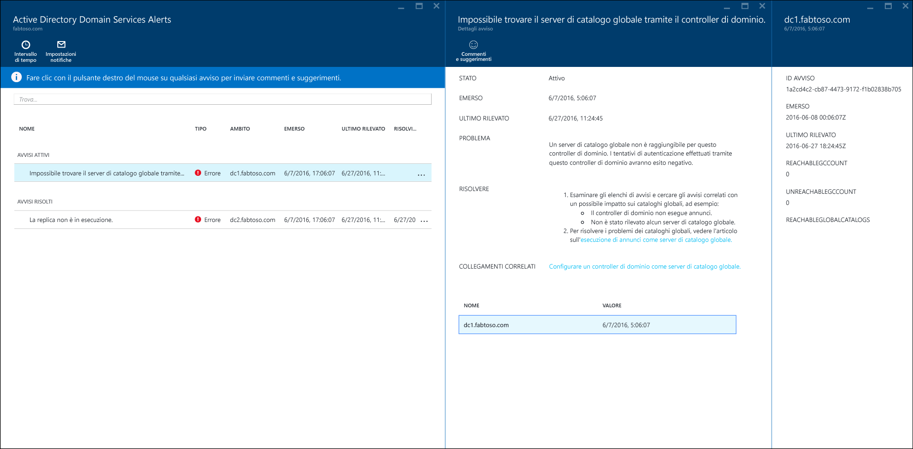
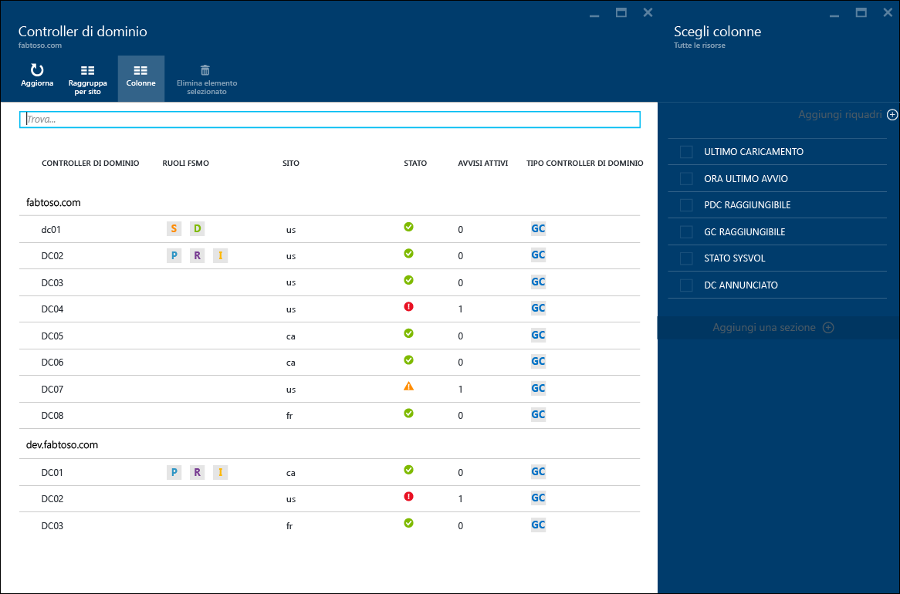
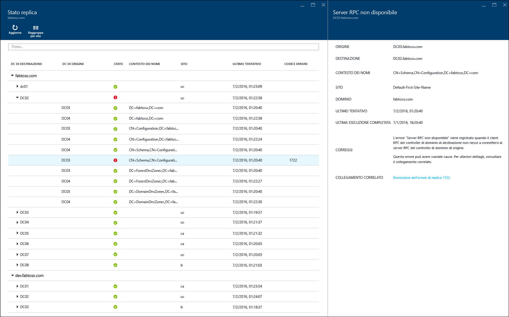
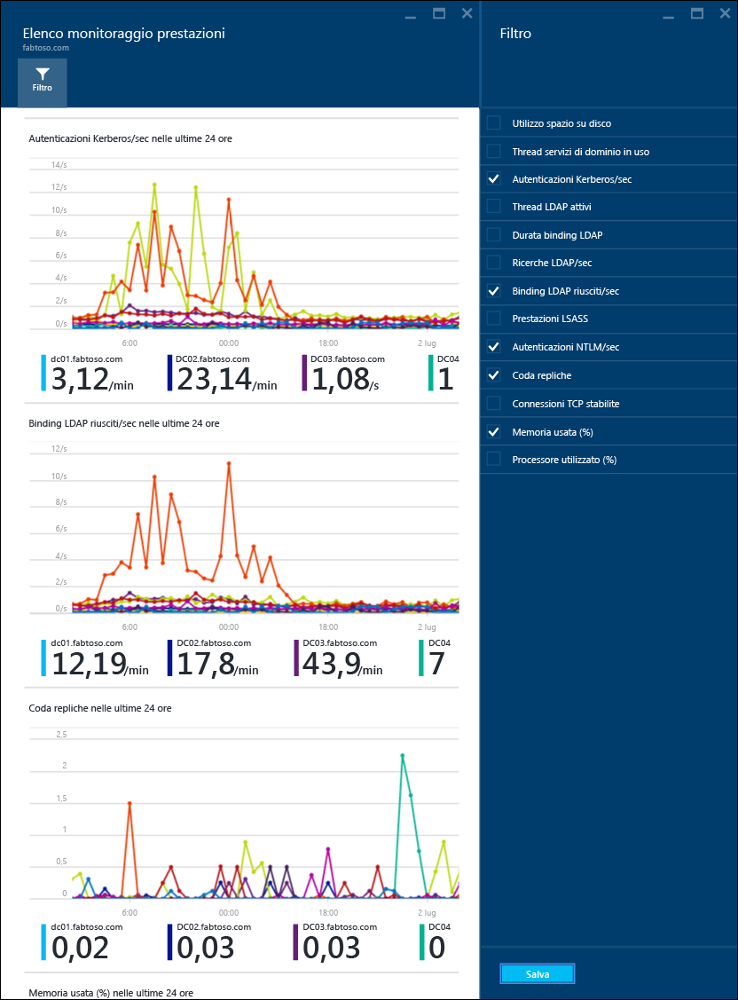

<properties
	pageTitle="Uso di Azure AD Connect Health con Servizi di dominio Active Directory | Microsoft Azure"
	description="Questa è la pagina di Azure AD Connect Health che descrive come monitorare Servizi di dominio Active Directory."
	services="active-directory"
	documentationCenter=""
	authors="arluca"
	manager="samueld"
	editor="curtand"/>

<tags
	ms.service="active-directory"
	ms.workload="identity"
	ms.tgt_pltfrm="na"
	ms.devlang="na"
	ms.topic="get-started-article"
	ms.date="07/14/2016"
	ms.author="arluca"/>

# Uso di Azure AD Connect Health con Servizi di dominio Active Directory
La documentazione seguente è specifica per il monitoraggio di Servizi di dominio Active Directory con Azure AD Connect Health. Include Servizi di dominio Active Directory installato in Windows Server 2008 R2, Windows Server 2012 e Windows Server 2012 R2.

Per informazioni sul monitoraggio di AD FS con Azure AD Connect Health, vedere [Uso di Azure AD Connect Health con AD FS](active-directory-aadconnect-health-adfs.md). Per informazioni sul monitoraggio di Azure Active Directory Connect (Sincronizzazione) con Azure AD Connect Health, vedere [Uso di Azure AD Connect Health per la sincronizzazione](active-directory-aadconnect-health-sync.md).

## Avvisi di Azure AD Connect Health per Servizi di dominio Active Directory
La sezione Avvisi di Azure AD Connect Health per Servizi di dominio Active Directory offre un elenco di avvisi attivi e risolti relativi ai controller di dominio. Selezionando un avviso attivo o risolto verrà visualizzato un nuovo pannello con altre informazioni, oltre ai passaggi per la risoluzione e a collegamenti alla documentazione di supporto. Ogni tipo di avviso può avere una o più istanze, che corrispondono a ogni controller di dominio interessato da quel particolare avviso. Nella parte inferiore del pannello degli avvisi è possibile selezionare un controller di dominio interessato per visualizzare un nuovo pannello con altri dettagli sull'istanza di avviso specifica.

L'abilitazione delle notifiche tramite posta elettronica per gli avvisi è disponibile all'interno di questo pannello, oltre alla modifica dell'intervallo di tempo nella visualizzazione. Espandendo l'intervallo di tempo sarà possibile visualizzare gli avvisi risolti precedenti.

## Controller di dominio
Questo dashboard offre una visualizzazione topologica dell'ambiente, oltre a metriche operative chiave e allo stato di integrità di ogni controller di dominio monitorato. Le metriche presentate consentono di identificare rapidamente eventuali controller di dominio che potrebbero richiedere altre indagini. Per impostazione predefinita viene visualizzato solo un subset di colonne. Facendo tuttavia clic sul comando delle colonne verrà visualizzato l'intero set di colonne disponibili. Selezionando le colonne di maggiore interesse, il dashboard diventa una postazione centralizzata per la semplice visualizzazione dell'integrità dell'ambiente di Servizi di dominio Active Directory.

I controller di dominio possono essere raggruppati in base al rispettivo dominio o sito; ciò è utile per comprendere la topologia dell'ambiente. Se infine si fa doppio clic sull'intestazione del pannello, il dashboard verrà ingrandito per occupare tutto lo spazio disponibile sullo schermo. Ciò può essere particolarmente utile quando si visualizzano più colonne.

## Stato replica
Questo dashboard offre una visualizzazione dello stato e della topologia della replica dei controller di domino monitorati. Viene indicato lo stato dell'ultimo tentativo di replica, insieme a documentazione utile per eventuali errori rilevati. Selezionando un controller di dominio con un errore verrà visualizzato un nuovo pannello con altre informazioni, oltre ai passaggi per la risoluzione e a collegamenti alla documentazione per la risoluzione dei problemi.

## Monitoraggio
Questa funzionalità offre tendenze grafiche dei diversi contatori delle prestazioni, con dati costantemente raccolti da ogni controller di dominio monitorato. Le prestazioni di un controller di dominio possono essere facilmente confrontate con quelle di tutti gli altri controller di dominio monitorati nella foresta. È inoltre possibile visualizzare più contatori delle prestazioni affiancati; ciò è utile durante la risoluzione dei problemi nell'ambiente.

Per impostazione predefinita sono selezionati quattro contatori delle prestazioni. È tuttavia possibile includerne altri facendo clic sul comando del filtro e selezionando o deselezionando qualsiasi contatore delle prestazioni. Se si fa clic sul grafico di un contatore delle prestazioni specifico verrà visualizzato un nuovo pannello, con i punti dati corrispondenti per ogni controller di dominio monitorato.

## Collegamenti correlati

* [Azure AD Connect Health](active-directory-aadconnect-health.md)
* [Installazione dell'agente di Azure AD Connect Health](active-directory-aadconnect-health-agent-install.md)
* [Operazioni di Azure AD Connect Health](active-directory-aadconnect-health-operations.md)
* [Uso di Azure AD Connect Health con AD FS](active-directory-aadconnect-health-adfs.md)
* [Uso di Azure AD Connect Health per la sincronizzazione](active-directory-aadconnect-health-sync.md)
* [Domande frequenti su Azure AD Connect Health](active-directory-aadconnect-health-faq.md)
* [Cronologia delle versioni di Azure AD Connect Health](active-directory-aadconnect-health-version-history.md)

<!---HONumber=AcomDC_0720_2016-->