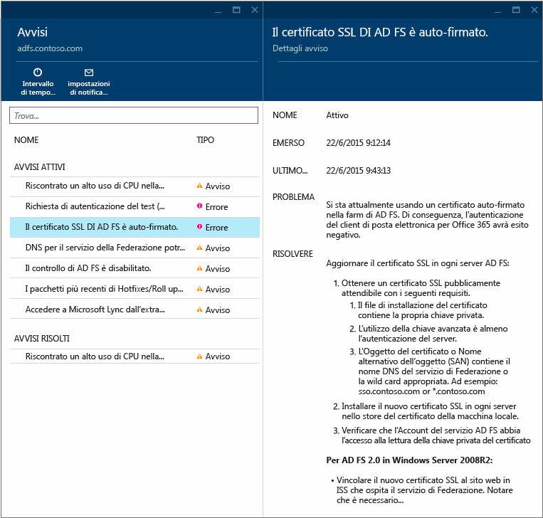
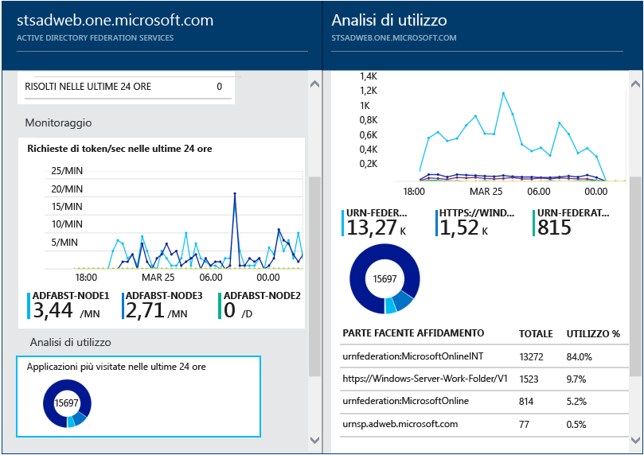
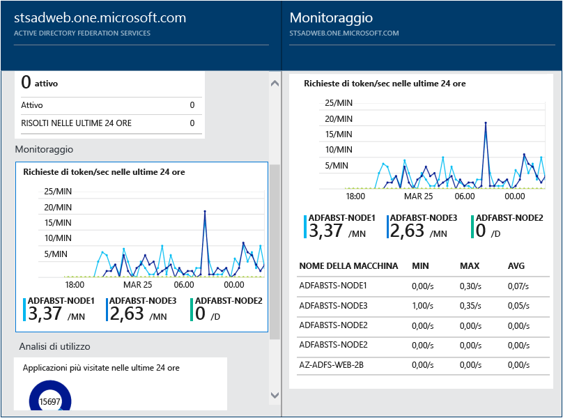
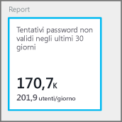
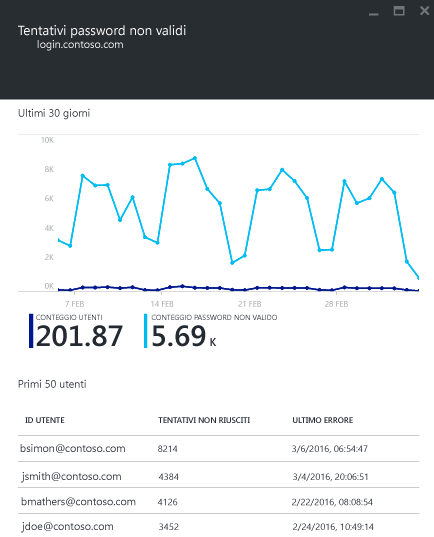

<properties
	pageTitle="Uso di Azure AD Connect Health con AD FS | Microsoft Azure"
	description="Questa è la pagina di Azure AD Connect Health che illustra come monitorare l'infrastruttura AD FS locale."
	services="active-directory"
	documentationCenter=""
	authors="karavar"
	manager="stevenpo"
	editor="karavar"/>

<tags
	ms.service="active-directory"
	ms.workload="identity"
	ms.tgt_pltfrm="na"
	ms.devlang="na"
	ms.topic="get-started-article"
	ms.date="07/14/2016"
	ms.author="vakarand"/>

# Uso di Azure AD Connect Health con AD FS
La documentazione seguente è specifica per il monitoraggio dell'infrastruttura AD FS con Azure AD Connect Health. Per informazioni sul monitoraggio di Azure Active Directory Connect (Sincronizzazione) con Azure AD Connect Health, vedere [Uso di Azure AD Connect Health per la sincronizzazione](active-directory-aadconnect-health-sync.md). Per informazioni sul monitoraggio di Servizi di dominio Active Directory con Azure AD Connect Health, vedere [Uso di Azure AD Connect Health con Servizi di dominio Active Directory](active-directory-aadconnect-health-adds.md).

## Avvisi per AD FS
La sezione degli avvisi di Azure AD Connect Health contiene l'elenco degli avvisi attivi. Ogni avviso include informazioni pertinenti, la procedura di risoluzione e collegamenti alla documentazione correlata. Selezionando un avviso attivo o risolto, verrà visualizzato un nuovo pannello con altre informazioni, oltre ai passaggi che è possibile eseguire per risolvere l'avviso e i collegamenti ad altri documenti. È anche possibile visualizzare dati storici sugli avvisi risolti in passato.

Selezionando un avviso, vengono fornite informazioni aggiuntive, nonché la procedura per risolvere l'avviso e collegamenti ad altra documentazione.

## Analisi di utilizzo per AD FS
Analisi di utilizzo di Azure AD Connect Health analizza il traffico di autenticazione dei server federativi. Selezionando la casella relativa all'analisi di utilizzo, verrà visualizzato il pannello corrispondente, che contiene le metriche e i raggruppamenti.

>[AZURE.NOTE] Per poter usare l'analisi di utilizzo con ADFS, è necessario verificare che il controllo di ADFS sia abilitato. Per altre informazioni, vedere [Abilitare il controllo per AD FS](active-directory-aadconnect-health-agent-install.md#enable-auditing-for-ad-fs).

Per selezionare altre metriche, specificare un intervallo di tempo o modificare il raggruppamento, è sufficiente fare clic con il pulsante destro del mouse sul pannello dell'analisi di utilizzo e scegliere Modifica grafico. È quindi possibile specificare l'intervallo di tempo, modificare o selezionare metriche e cambiare il raggruppamento. È possibile visualizzare la distribuzione del traffico di autenticazione in "metriche" diverse e raggruppare ogni metrica con i parametri di raggruppamento pertinenti descritti di seguito.

| Metrica | Raggruppa per | Cosa significa il raggruppamento e perché è utile? |
| ------ | -------- | -------------------------------------------- |
| Richieste totali: numero totale di richieste elaborate dal servizio federativo | Tutti | Visualizza il conteggio del numero totale di richieste senza raggruppamento. |
| | Applicazione | Questa opzione raggruppa le richieste totali in base alla relying party di destinazione. Questo raggruppamento è utile per conoscere la percentuale del traffico totale ricevuta da ogni applicazione. |
| | Server | Questa opzione raggruppa le richieste totali in base al server che ha elaborato la richiesta. Questo raggruppamento è utile per conoscere la distribuzione del carico del traffico totale. |
| | Aggiunta all'area di lavoro | Questa opzione raggruppa le richieste totali in base al fatto che provengano da dispositivi aggiunti all'area di lavoro (noti). Questo raggruppamento è utile per conoscere se le risorse sono accessibili con dispositivi sconosciuti all'infrastruttura di gestione delle identità. |
| | Metodo di autenticazione | Questa opzione raggruppa le richieste totali in base al metodo di autenticazione usato per l'autenticazione. Questo raggruppamento è utile per conoscere il metodo di autenticazione comune usato per l'autenticazione. Di seguito sono indicati i metodi di autenticazione possibili <ol> <li>Autenticazione integrata di Windows (Windows)</li> <li>Autenticazione basata su moduli (Forms)</li> <li>SSO (Single Sign-On)</li> <li>Autenticazione certificato X509 (certificato)</li>  Si noti che una richiesta viene considerata (Single Sign-On) se i server federativi ricevono la richiesta con un cookie SSO. In questi casi, se il cookie è valido, all'utente non viene chiesto di fornire le credenziali e ottiene l'accesso trasparente all'applicazione. Questo è normale se si dispone di più relying party protette dai server federativi. |
| | Percorso di rete | Questa opzione raggruppa le richieste totali in base al percorso di rete dell'utente. Può essere Intranet o Extranet. Questo raggruppamento è utile per conoscere la percentuale del traffico proveniente dalla Intranet e dalla Extranet. |
| Totale richieste non riuscite: numero totale di richieste non riuscite elaborate dal servizio federativo.   (Questa metrica è disponibile solo in AD FS per Windows Server 2012 R2)| Tipo di errore | Mostra il numero di errori in base ai tipi di errore predefiniti. Questo raggruppamento è utile per conoscere i tipi di errori comuni. <ul><li>Nome utente o password non corretta: errori causati da un nome utente o una password non corretta.</li> <li>"Blocco Extranet": errori causati dalle richieste ricevute da un utente per il quale è stato bloccato l'accesso alla Extranet </li><li> "Password scaduta": errori causati da utenti che effettuano l'accesso con una password scaduta.</li><li>"Account disabilitato": errori causati da utenti che effettuano l'accesso con un account disabilitato.</li><li>"Autenticazione dispositivo": errori causati da utenti che non riescono ad autenticarsi con Autenticazione dispositivo.</li><li>"Autenticazione certificato utente": errori causati da utenti che non riescono ad autenticarsi a causa di un certificato non valido.</li><li>"MFA": errori causati da utenti che non riescono ad autenticarsi con Multi-Factor Authentication.</li><li>"Altre credenziali": "Autorizzazione rilascio": errori causati da errori di autorizzazione.</li><li>"Delega rilascio": errori causati da errori di delega rilascio.</li><li>"Accettazione token": errori causati dal rifiuto da parte di AD FS del token di un provider di identità di terze parti.</li><li>"Protocollo": errore causati da errori del protocollo.</li><li>"Sconosciuto": tutti gli errori. Eventuali altri errori che non rientrano nelle categorie definite.</li> |
| | Server | Raggruppa gli errori in base al server. È utile per conoscere la distribuzione degli errori nei server. Una distribuzione non uniforme potrebbe indicare che un server è in uno stato difettoso. |
| | Percorso di rete | Raggruppa gli errori in base al percorso di rete delle richieste (Intranet ed Extranet). È utile per conoscere il tipo di richieste che hanno esito negativo. |
| | Applicazione | Raggruppa gli errori in base all'applicazione di destinazione (relying party). È utile per conoscere l'applicazione di destinazione che sta visualizzando il maggior numero di errori. |
| Conteggio utenti: numero medio di utenti univoci attivi nel sistema | Tutti | Fornisce un conteggio del numero medio di utenti che usano il servizio federativo nel periodo di tempo selezionato. Gli utenti non sono raggruppati.  La media dipenderà dal periodo di tempo selezionato. |
| | Applicazione | Raggruppa il numero medio di utenti in base all'applicazione di destinazione (relying party). È utile per conoscere quanti utenti stanno usando una determinata applicazione. |

## Monitoraggio delle prestazioni per AD FS
Il monitoraggio delle prestazioni di Azure AD Connect Health offre informazioni di monitoraggio sulle metriche. Selezionando la casella Monitoraggio, viene visualizzato un pannello che contiene informazioni dettagliate sulle metriche.

Selezionando l'opzione Filtro nella parte superiore del pannello, è possibile filtrare in base al server per visualizzare le metriche di un singolo server. Per modificare le metriche, è sufficiente fare clic con il pulsante destro del mouse sul grafico di monitoraggio sotto il pannello Monitoraggio e scegliere Modifica grafico. Dal nuovo pannello visualizzato è quindi possibile selezionare altre metriche nell'elenco a discesa e specificare un intervallo di tempo per cui visualizzare i dati delle prestazioni.

## Report per AD FS
Azure AD Connect Health fornisce report sulle attività e le prestazioni di AD FS. I report forniscono informazioni significative sulle attività dei server AD FS agli amministratori.

### Primi 50 utenti con accessi tramite nome utente/password non riusciti

Uno dei motivi più comuni per cui una richiesta di autenticazione può non riuscire in un server AD FS è l'uso di credenziali che non sono valide, vale a dire che il nome utente o la password non è valida. Questo si verifica normalmente in caso di password complesse, password dimenticate o errori di digitazione.

Esistono però altri motivi per cui un numero imprevisto di tali richieste può essere gestito dai server AD FS. Ad esempio, nel caso di un'applicazione che memorizza nella cache le credenziali dell'utente e queste scadono o nel caso di un utente malintenzionato che prova ad accedere all'account di un utente con una serie di password comuni.

Azure AD Connect Health per AD FS fornisce un report sui primi 50 utenti con tentativi di accesso non riusciti a causa di un nome utente o una password non valida. A tale scopo vengono elaborati gli eventi di controllo generati da tutti i server AD FS nelle farm.

All'interno del report è possibile accedere facilmente alle informazioni seguenti:

- Numero totale di richieste non riuscite con nome utente o password non valida negli ultimi 30 giorni.
- Numero medio di utenti che non sono riusciti ad accedere con un nome utente o una password non valida ogni giorno.

Facendo clic su questa parte si passa al pannello principale del report che fornisce dettagli aggiuntivi. Ad esempio, un grafico contenente informazioni sulle tendenze per stabilire una baseline relativa alle richieste con nome utente o password non valida e l'elenco dei primi 50 utenti con il numero di tentativi non riusciti.

Il grafico fornisce le informazioni seguenti:

- Numero totale di accessi non riusciti a causa di un nome utente o una password non valida ogni giorno.
- Numero totale di utenti univoci con accessi non riusciti ogni giorno.

Il report fornisce le informazioni seguenti:

| Elemento del report | Descrizione
| ------ | -------- |
|ID utente| Mostra l'ID utente che è stato usato. Si noti che il valore è quello digitato dall'utente. In alcuni casi viene visualizzato anche l'ID utente errato che è stato usato.|
|Tentativi non riusciti|Mostra il numero totale di tentativi non riusciti per l'ID utente specifico. La tabella è riportata in ordine decrescente a partire dal numero maggiore di tentativi non riusciti.|
|Ultimo errore|Mostra il timestamp del momento in cui si è verificato l'ultimo errore.

>[AZURE.NOTE] Il report viene aggiornato automaticamente ogni due ore con le nuove informazioni raccolte. Di conseguenza, i tentativi di accesso nelle ultime due ore potrebbero non essere inclusi nel report.

## Collegamenti correlati

* [Azure AD Connect Health](active-directory-aadconnect-health.md)
* [Installazione dell'agente di Azure AD Connect Health](active-directory-aadconnect-health-agent-install.md)
* [Operazioni di Azure AD Connect Health](active-directory-aadconnect-health-operations.md)
* [Uso di Azure AD Connect Health per la sincronizzazione](active-directory-aadconnect-health-sync.md)
* [Uso di Azure AD Connect Health con Servizi di dominio Active Directory](active-directory-aadconnect-health-adds.md)
* [Domande frequenti su Azure AD Connect Health](active-directory-aadconnect-health-faq.md)
* [Cronologia delle versioni di Azure AD Connect Health](active-directory-aadconnect-health-version-history.md)

<!-----HONumber=AcomDC_0720_2016-->