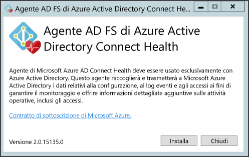
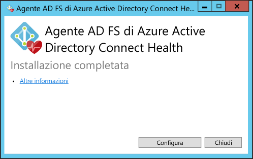
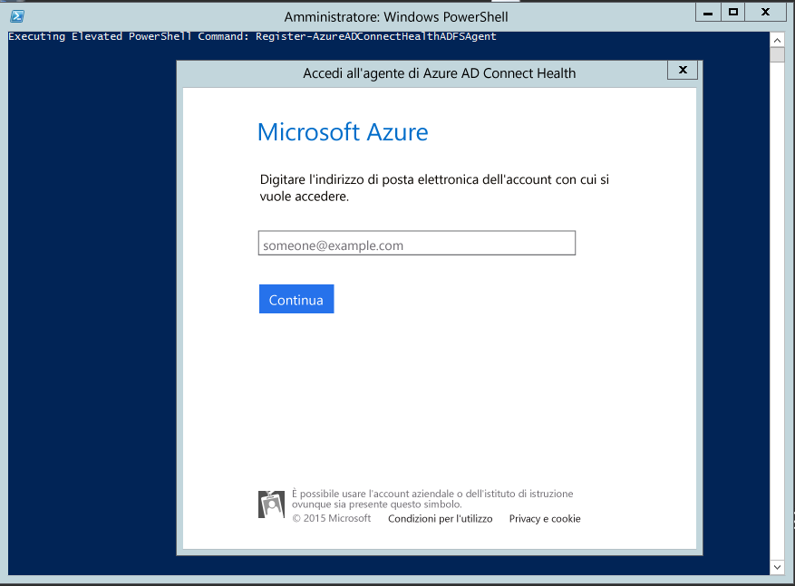
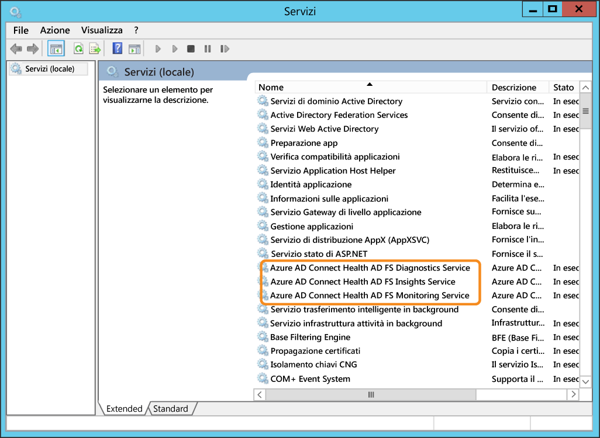

<properties 
	pageTitle="Installazione dell'agente di Azure AD Connect Health per AD FS | Microsoft Azure"
	description="Pagina di Azure AD Connect Health che illustra l'installazione dell'agente di Active Directory Federation Services (AD FS)."
	services="active-directory"
	documentationCenter=""
	authors="billmath"
	manager="stevenpo"
	editor="curtand"/>

<tags 
	ms.service="active-directory"
	ms.workload="identity"
	ms.tgt_pltfrm="na"
	ms.devlang="na"
	ms.topic="article"
	ms.date="08/14/2015"
	ms.author="billmath"/>

# Installazione dell'agente di Azure AD Connect Health per AD FS

Questo documento illustra le procedure per installare e configurare l'agente di Azure AD Connect Health per AD FS nei server.

>[AZURE.NOTE]Tenere presente che, prima di visualizzare i dati nell'istanza di Azure AD Connect Health, è necessario installare l'agente di Azure AD Connect Health nei server di destinazione. Assicurarsi di completare i requisiti elencati [qui](active-directory-aadconnect-health.md#requirements) prima di installare l'agente. È possibile scaricare l'agente da [qui](http://go.microsoft.com/fwlink/?LinkID=518973).

## Installazione dell'agente
Per avviare l'installazione dell'agente, fare doppio clic sul file EXE scaricato. Nella prima schermata fare clic su Installa.

Una volta completata l'installazione, fare clic su Configura ora.

Verrà avviato un prompt dei comandi seguito da codice PowerShell che eseguirà Register-AzureADConnectHealthADFSAgent. Verrà visualizzata la richiesta di accedere ad Azure. Procedere all'esecuzione dell'accesso.

Dopo l'accesso, PowerShell continuerà. Una volta completato, è possibile chiudere PowerShell. La configurazione è completa.

A questo punto, i servizi dovrebbero venire avviati automaticamente e l'agente monitorerà e raccoglierà i dati. Tenere presente che, se non sono stati soddisfatti tutti i prerequisiti descritti nelle sezioni precedenti, verranno visualizzati avvisi nella finestra di PowerShell. Assicurarsi di completare i requisiti elencati [qui](active-directory-aadconnect-health.md#requirements) prima di installare l'agente. La schermata seguente mostra un esempio di tali errori.

Per verificare che l'agente sia stato installato, aprire i servizi e cercare quanto segue. Questi servizi dovrebbero essere in esecuzione se la configurazione è stata completata. In caso contrario, non verranno avviati fino al completamento della configurazione.

- Azure AD Connect Health AD FS Diagnostics Service
- Azure AD Connect Health AD FS Insights Service
- Azure AD Connect Health AD FS Monitoring Service
 

## Installazione dell'agente in server Windows Server 2008 R2

Per i server Windows Server 2008 R2, eseguire le operazioni seguenti:

1. Assicurarsi che il server venga eseguito con il Service Pack 1 o versione successiva.
1. Disattivare la funzionalità Protezione avanzata di IE per l'installazione dell'agente:
1. Installare Windows PowerShell 4.0 in ognuno dei server prima di installare l'agente per l'integrità AD. Per installare Windows PowerShell 4.0:
 - Installare [Microsoft .NET Framework 4.5](https://www.microsoft.com/download/details.aspx?id=40779) usando il collegamento seguente per scaricare il programma di installazione offline.
 - Installare PowerShell ISE (da Funzionalità Windows)
 - Installare [Windows Management Framework 4.0.](https://www.microsoft.com/download/details.aspx?id=40855)
 - Installare Internet Explorer versione 10 o successiva nel server. Questa operazione è necessaria perché il Servizio integrità possa eseguire l'autenticazione usando le credenziali di amministratore di Azure.
1. Per altre informazioni sull'installazione di Windows PowerShell 4.0 in Windows Server 2008 R2, vedere l'articolo wiki [qui](http://social.technet.microsoft.com/wiki/contents/articles/20623.step-by-step-upgrading-the-powershell-version-4-on-2008-r2.aspx).

## Collegamenti correlati

* [Azure AD Connect Health](active-directory-aadconnect-health.md)
* [Operazioni di Azure AD Connect Health](active-directory-aadconnect-health-operations.md)
* [Uso di Azure AD Connect Health con AD FS](active-directory-aadconnect-health-adfs.md)
* [Domande frequenti su Azure AD Connect Health](active-directory-aadconnect-health-faq.md)

<!---HONumber=August15_HO9-->