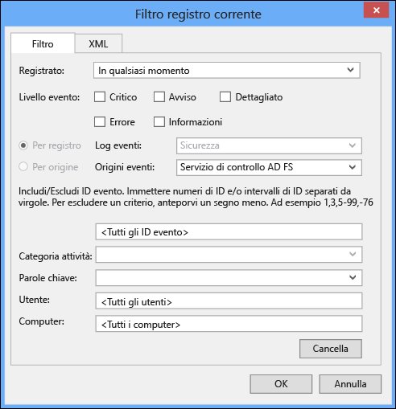
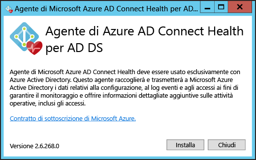
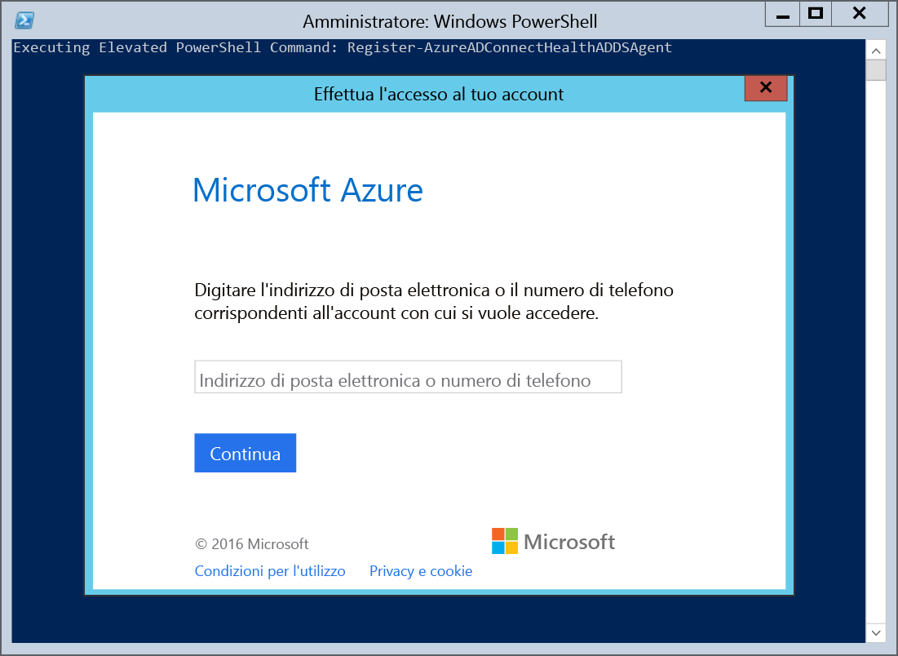
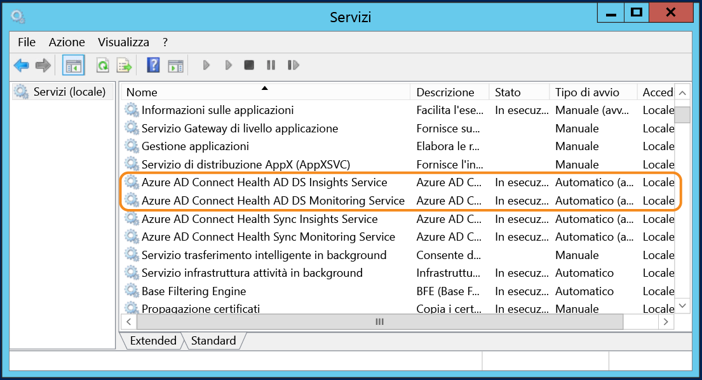

<properties
	pageTitle="Installazione dell'agente di Azure AD Connect Health per | Microsoft Azure"
	description="Si tratta della pagina di Azure AD Connect Health che descrive l'installazione dell'agente per ADFS e la sincronizzazione."
	services="active-directory"
	documentationCenter=""
	authors="karavar"
	manager="femila"
	editor="karavar"/>

<tags
	ms.service="active-directory"
	ms.workload="identity"
	ms.tgt_pltfrm="na"
	ms.devlang="na"
	ms.topic="get-started-article"
	ms.date="08/05/2016"
	ms.author="vakarand"/>

# Installazione dell'agente di Azure AD Connect Health

Questo documento illustra le procedure per installare e configurare l'agente di Azure AD Connect Health. Gli agenti sono disponibili per il download in [questa pagina](active-directory-aadconnect-health.md#download-and-install-azure-ad-connect-health-agent).

## 	Requisiti
La tabella seguente è un elenco di requisiti per l'uso di Azure AD Connect Health.

| Requisito | Descrizione|
| ----------- | ---------- |
|Azure AD Premium| Azure AD Connect Health è una funzionalità di Azure AD Premium e richiede una licenza di Azure AD Premium.   Per altre informazioni, vedere [Introduzione ad Azure Active Directory Premium](active-directory-get-started-premium.md).  Per ottenere una versione di valutazione gratuita valida 30 giorni, vedere la pagina relativa all'[avvio di una versione di valutazione gratuita di Azure](https://azure.microsoft.com/trial/get-started-active-directory/).|
|Per iniziare a usare Azure AD Connect Health, è necessario essere un amministratore globale dell'istanza di Azure AD.|Per impostazione predefinita, solo gli amministratori globali possono installare e configurare gli agenti per l'integrità per eseguire le operazioni iniziali, accedere al portale ed eseguire qualsiasi operazione in Azure AD Connect Health. Per altre informazioni, vedere [Amministrazione della directory di Azure AD](active-directory-administer.md).    Con il controllo degli accessi in base al ruolo è possibile consentire l'accesso ad Azure AD Connect Health ad altri utenti dell'organizzazione. Per altre informazioni, vedere [Gestire l'accesso con il controllo degli accessi in base al ruolo](active-directory-aadconnect-health-operations.md#manage-access-with-role-based-access-control).   **Importante:** l'account usato per l'installazione degli agenti deve essere un account aziendale o dell'istituto di istruzione e non può essere un account Microsoft. Per altre informazioni, vedere [Iscrizione ad Azure come organizzazione](sign-up-organization.md)
|L'agente di Azure AD Connect Health è installato in ogni server di destinazione| Per Azure AD Connect Health è necessario che nei server di destinazione sia installato un agente, che fornirà i dati visualizzati nel portale.   Ad esempio, per poter ottenere i dati sull'infrastruttura locale di AD FS, l'agente deve essere installato nei server AD FS, nei server proxy AD FS e nei server proxy applicazione Web. Analogamente, per poter ottenere i dati sull'infrastruttura locale di Servizi di dominio Active Directory, l'agente deve essere installato nei controller di dominio.   **Importante:** l'account usato per l'installazione degli agenti deve essere un account aziendale o dell'istituto di istruzione e non può essere un account Microsoft. Per altre informazioni, vedere [Iscrizione ad Azure come organizzazione](sign-up-organization.md)|
|Connettività in uscita agli endpoint di servizio di Azure|Durante l'installazione e la fase di esecuzione, l'agente richiede la connettività agli endpoint di servizio di Azure AD Connect Health elencati sotto. Se si blocca la connettività in uscita, verificare che gli indirizzi seguenti vengano aggiunti all'elenco degli indirizzi consentiti:   <li>&#42;.blob.core.windows.net </li><li>&#42;.queue.core.windows.net</li><li>adhsprodwus.servicebus.windows.net - Port: 5671 </li><li>https://management.azure.com </li><li>https://s1.adhybridhealth.azure.com/</li><li>https://policykeyservice.dc.ad.msft.net/</li><li>https://login.windows.net</li><li>https://login.microsoftonline.com</li><li>https://secure.aadcdn.microsoftonline-p.com</li> |
|Porte del firewall nel server che esegue l'agente.| Per consentire la comunicazione dell'agente con gli endpoint di servizio Azure AD Connect Health è necessario che le porte del firewall seguenti siano aperte.  <li>Porta TCP/UDP 443</li><li>Porta TCP/UDP 5671</li>
|Consentire i siti Web seguenti se è abilitata la funzionalità Protezione avanzata di IE|I siti Web seguenti devono essere consentiti se la funzionalità Sicurezza avanzata di Internet Explorer è abilitata nel server in cui verrà installato l'agente.  <li>https://login.microsoftonline.com</li><li>https://secure.aadcdn.microsoftonline-p.com</li><li>https://login.windows.net</li><li>Server federativo dell'organizzazione considerato attendibile da Azure Active Directory. Ad esempio: https://sts.contoso.com</li>

## Installare l'agente di Azure AD Connect Health per AD FS
Per avviare l'installazione dell'agente, fare doppio clic sul file EXE scaricato. Nella prima schermata fare clic su Installa.

Una volta completata l'installazione, fare clic su Configura ora.

Verrà avviato un prompt dei comandi seguito da codice PowerShell che eseguirà Register-AzureADConnectHealthADFSAgent. Verrà visualizzata la richiesta di accedere ad Azure. Eseguire l'accesso.

Dopo l'accesso, PowerShell continuerà. Una volta completato, è possibile chiudere PowerShell. La configurazione è completa.

A questo punto, i servizi dovrebbero venire avviati automaticamente e l'agente monitorerà e raccoglierà i dati. Tenere presente che, se non sono stati soddisfatti tutti i prerequisiti descritti nelle sezioni precedenti, verranno visualizzati avvisi nella finestra di PowerShell. Assicurarsi di completare i requisiti elencati [qui](active-directory-aadconnect-health-agent-install.md#requirements) prima di installare l'agente. Lo screenshot seguente illustra un esempio di tali errori.

Per verificare che l'agente sia stato installato, aprire i servizi e cercare quanto segue. Questi servizi dovrebbero essere in esecuzione se la configurazione è stata completata. In caso contrario, non verranno avviati fino al completamento della configurazione.

- Azure AD Connect Health AD FS Diagnostics Service
- Azure AD Connect Health AD FS Insights Service
- Azure AD Connect Health AD FS Monitoring Service

### Installazione dell'agente in server Windows Server 2008 R2

Per i server Windows Server 2008 R2, eseguire le operazioni seguenti:

1. Assicurarsi che il server venga eseguito con il Service Pack 1 o versione successiva.
1. Disattivare la funzionalità Protezione avanzata di IE per l'installazione dell'agente:
1. Installare Windows PowerShell 4.0 in ognuno dei server prima di installare l'agente per l'integrità AD. Per installare Windows PowerShell 4.0:
 - Installare [Microsoft .NET Framework 4.5](https://www.microsoft.com/download/details.aspx?id=40779) usando il collegamento seguente per scaricare il programma di installazione offline.
 - Installare PowerShell ISE (da Funzionalità Windows)
 - Installare [Windows Management Framework 4.0.](https://www.microsoft.com/download/details.aspx?id=40855)
 - Installare Internet Explorer versione 10 o successiva nel server. Questa operazione è necessaria perché il Servizio integrità possa eseguire l'autenticazione usando le credenziali di amministratore di Azure.
1. Per altre informazioni sull'installazione di Windows PowerShell 4.0 in Windows Server 2008 R2, vedere l'articolo wiki [qui](http://social.technet.microsoft.com/wiki/contents/articles/20623.step-by-step-upgrading-the-powershell-version-4-on-2008-r2.aspx).

### Abilitare il controllo per AD FS

Per poter usare questa funzionalità per raccogliere dati e analizzarli, l'agente di Azure AD Connect Health deve poter accedere alle informazioni presenti nei log di controllo di AD FS. Questi log non sono abilitati per impostazione predefinita. Questo requisito si applica solo ai server federativi ADFS. Non è necessario abilitare il controllo nei server proxy ADFS o nei server proxy applicazione Web. Usare le procedure seguenti per abilitare il controllo di ADFS e individuare i log di controllo di ADFS.

#### Per abilitare il controllo per ADFS 2.0

1. Fare clic su **Avvia**, scegliere **Programmi**, scegliere **Strumenti di amministrazione** e quindi fare clic su **Criteri di sicurezza locali**.
2. Passare alla cartella **Impostazioni sicurezza\\Criteri locali\\Gestione diritti utente** e quindi fare doppio clic su Generazione di controlli di sicurezza.
3. Nella scheda **Impostazioni di sicurezza locali** verificare che sia elencato l'account del servizio AD FS 2.0. Se non è presente, fare clic su **Aggiungi utente o gruppo**, aggiungerlo all'elenco e quindi fare clic su **OK**.
4. Per abilitare il controllo, aprire un prompt dei comandi con privilegi elevati ed eseguire il comando seguente.<code>auditpol.exe /set /subcategory:"Application Generated" /failure:enable /success:enable</code>
5. Chiudere Criteri di sicurezza locali e quindi aprire lo snap-in Gestione. Per aprire lo snap-in di gestione, fare clic su **Start**, scegliere **Programmi**, scegliere **Strumenti di amministrazione** e quindi fare clic sullo snap-in di gestione di AD FS 2.0.
6. Nel riquadro Azioni fare clic su Modifica proprietà servizio federativo.
7. Nella finestra di dialogo **Proprietà servizio federativo** fare clic sulla scheda **Eventi**.
8. Selezionare le caselle di controllo **Operazioni riuscite** e **Operazioni non riuscite**.
9. Fare clic su **OK**.

#### Per abilitare il controllo per ADFS in Windows Server 2012 R2

1. Per passare a **Criteri di sicurezza locali**, aprire **Server Manager** nella schermata Start oppure Server Manager nella barra delle applicazioni sul desktop, quindi fare clic su **Strumenti/Criteri di sicurezza locali**.
2. Passare alla cartella **Impostazioni sicurezza\\Criteri locali\\Assegnazione diritti utente** e quindi fare doppio clic su **Generazione di controlli di sicurezza**.
3. Nella scheda **Impostazioni sicurezza locale** verificare che sia elencato l'account del servizio AD FS. Se l'account non è presente, fare clic su **Aggiungi utente o gruppo** e aggiungerlo all'elenco, quindi fare clic su **OK**.
4. Per abilitare il controllo, aprire un prompt dei comandi con privilegi elevati ed eseguire il comando seguente: <code>auditpol.exe /set /subcategory:"Application Generated" /failure:enable /success:enable.</code>
5. Chiudere **Criteri di sicurezza locali** e quindi aprire lo snap-in di **Gestione AD FS**. In Server Manager fare clic su Strumenti e quindi selezionare Gestione AD FS.
6. Nel riquadro Azioni fare clic su **Modifica proprietà servizio federativo**.
7. Nella finestra di dialogo Proprietà servizio federativo fare clic sulla scheda **Eventi**.
8. Selezionare le caselle di controllo **Operazioni riuscite e Operazioni non riuscite** e quindi fare clic su **OK**.

#### Per individuare i log di controllo di ADFS

1. Aprire il **Visualizzatore eventi**.
2. Passare a Registri di Windows e selezionare **Sicurezza**.
3. A destra fare clic su **Filtra registri correnti**.
4. In Origine evento selezionare **Controllo di ADFS**.

> [AZURE.WARNING] Se sono presenti criteri di gruppo che disabilitano il controllo ADFS, l'agente di Azure AD Connect Health non sarà in grado di raccogliere informazioni. Assicurarsi che non siano presenti criteri di gruppo che potrebbero disabilitare il controllo.

[//]: # "Inizio della sezione relativa alla configurazione del proxy per l'agente"

## Installare l'agente di Azure AD Connect Health per la sincronizzazione
L'Agente di integrità di Azure AD Connect per la sincronizzazione è installato automaticamente nella build più recente di Azure AD Connect. Per usare Azure AD Connect Health per la sincronizzazione, sarà necessario scaricare la versione più recente di Azure AD Connect e installarla. È possibile scaricare la versione più recente [qui](http://www.microsoft.com/download/details.aspx?id=47594).

Per verificare che l'agente sia stato installato, aprire i servizi e cercare quanto segue. Questi servizi dovrebbero essere in esecuzione se la configurazione è stata completata. In caso contrario, non verranno avviati fino al completamento della configurazione.

- Azure AD Connect Health Sync Insights Service
- Azure AD Connect Health Sync Monitoring Service

> [AZURE.NOTE] Si tenga presente che l'utilizzo di integrità di Azure AD Connect richiede Azure AD Premium. Se non si dispone di Azure AD Premium non sarà possibile completare la configurazione nel portale di Azure. Per altre informazioni vedere i requisiti [qui](active-directory-aadconnect-health-agent-install.md#requirements).

## Registrazione manuale di Azure AD Connect Health per la sincronizzazione
Se la registrazione dell'agente Azure AD Connect Health per la sincronizzazione non riesce pur dopo avere installato correttamente Azure AD Connect, è possibile usare il comando di PowerShell seguente per registrare manualmente l'agente.

>[AZURE.IMPORTANT] È necessario usare questo comando di PowerShell solo se la registrazione dell'agente non riesce dopo avere installato Azure AD Connect.

Il comando di PowerShell seguente è necessario SOLO quando la registrazione dell'agente per l'integrità non riesce anche se l'installazione e la configurazione di Azure AD Connect sono state eseguite correttamente. In questi casi, i servizi di Azure AD Connect Health NON verranno avviati se non dopo la corretta registrazione dell'agente.

È possibile registrare manualmente l'agente Azure AD Connect Health per la sincronizzazione usando il comando di PowerShell seguente:

`Register-AzureADConnectHealthSyncAgent -AttributeFiltering $false -StagingMode $false`

Il comando accetta i parametri seguenti:

- AttributeFiltering: $true (impostazione predefinita): se Azure AD Connect non sincronizza il set di attributi predefiniti ed è stato personalizzato per usare un set di attributi filtrati; in caso contrario, $false.
- StagingMode: $false (impostazione predefinita) se il server Azure AD Connect NON è in modalità di staging, $true se il server è configurato per la modalità di staging.

Quando viene chiesta l'autenticazione, è consigliabile usare lo stesso account amministratore globale, ad esempio, admin@domain.onmicrosoft.com, usato per configurare Azure AD Connect.

## Installazione dell'agente di Azure AD Connect Health per Servizi di dominio Active Directory
Per avviare l'installazione dell'agente, fare doppio clic sul file EXE scaricato. Nella prima schermata fare clic su Installa.

Una volta completata l'installazione, fare clic su Configura ora.

Verrà avviato un prompt dei comandi seguito da codice PowerShell che eseguirà Register-AzureADConnectHealthADDSAgent. Verrà visualizzata la richiesta di accedere ad Azure. Eseguire l'accesso.

Dopo l'accesso, PowerShell continuerà. Una volta completato, è possibile chiudere PowerShell. La configurazione è completa.

A questo punto, i servizi dovrebbero venire avviati automaticamente e l'agente monitorerà e raccoglierà i dati. La schermata seguente illustra un esempio dell'output. Tenere presente che, se non sono stati soddisfatti tutti i prerequisiti descritti nelle sezioni precedenti, verranno visualizzati avvisi nella finestra di PowerShell. Assicurarsi di completare i requisiti elencati [qui](active-directory-aadconnect-health-agent-install.md#requirements) prima di installare l'agente.

Per verificare che l'agente sia stato installato, aprire i servizi e cercare quanto segue:

- Azure AD Connect Health AD DS Insights Service
- Azure AD Connect Health AD DS Monitoring Service

Questi due servizi non verranno avviati fino al termine della configurazione.

## Installazione dell'agente di Azure AD Connect Health per Servizi di dominio Active Directory in Server Core 
Dopo aver installato il file EXE, è possibile completare il processo di registrazione con il comando di PowerShell seguente:

'Register-AzureADConnectHealthADDSAgent -Credentials $cred

## Configurare gli agenti di Azure AD Connect Health per l'uso del proxy HTTP
È possibile configurare gli agenti di Azure AD Connect Health per l'interazione con un proxy HTTP.

>[AZURE.NOTE]
- L'uso di "Netsh WinHttp set ProxyServerAddress" non funziona in questo caso, perché l'agente usa System.Net, invece dei servizi HTTP Microsoft Windows, per creare richieste Web.
- L'indirizzo del proxy HTTP verrà usato per il pass-through di messaggi HTTPS crittografati.
- I proxy autenticati, che usano HTTPBasic, non sono supportati.

### Modificare la configurazione del proxy per l'agente di Health
Sono disponibili le opzioni seguenti per configurare l'agente di Azure AD Connect Health per l'uso di un proxy HTTP.

>[AZURE.NOTE] È necessario riavviare tutti i servizi dell'agente Azure AD Connect Health in modo da aggiornare le impostazioni del proxy. Eseguire il comando seguente:  Restart-Service AdHealth*

#### Importare le impostazioni del proxy esistenti

##### Importare da Internet Explorer
È possibile importare le impostazioni del proxy HTTP di Internet Explorer e usarle per gli agenti di Azure AD Connect Health eseguendo il comando di PowerShell seguente in ogni server in cui è in esecuzione l'agente.

	Set-AzureAdConnectHealthProxySettings -ImportFromInternetSettings

##### Importare da WinHTTP
È possibile importare le impostazioni del proxy WinHTTP eseguendo il comando di PowerShell seguente in ogni server in cui è in esecuzione l'agente.

	Set-AzureAdConnectHealthProxySettings -ImportFromWinHttp

#### Specificare gli indirizzi proxy manualmente
È possibile specificare un server proxy manualmente eseguendo il comando di PowerShell seguente in ogni server in cui è in esecuzione l'agente.

	Set-AzureAdConnectHealthProxySettings -HttpsProxyAddress address:port

Esempio: *Set-AzureAdConnectHealthProxySettings -HttpsProxyAddress myproxyserver:443*

- "address" può essere un nome di server risolvibile con DNS o un indirizzo IPv4
- "port" può essere omesso. Se omesso, viene scelta la porta 443 come porta predefinita.

#### Cancellare la configurazione del proxy esistente
È possibile eseguire il comando seguente per cancellare la configurazione del proxy esistente:

	Set-AzureAdConnectHealthProxySettings -NoProxy

### Leggere le impostazioni del proxy correnti
È possibile usare il comando seguente per leggere le impostazioni del proxy attualmente configurate.

	Get-AzureAdConnectHealthProxySettings

## Testare la connettività per il servizio Azure AD Connect Health
È possibile che si verifichino problemi che provocano la perdita di connettività dell'agente di Azure AD Connect Health con il servizio Azure AD Connect Health, ad esempio problemi di rete, problemi di autorizzazioni o di altro tipo.

Se l'agente non riesce a inviare dati al servizio Azure AD Connect Health per più di 2 ore, verrà visualizzato un avviso che indica che "I dati del Servizio integrità non sono aggiornati". Se si verifica questo problema, è ora possibile eseguire un test per verificare se gli agenti di Azure AD Connect Health possono caricare dati nel servizio Azure AD Connect Health eseguendo il comando PowerShell seguente dal computer il cui agente ha riscontrato il problema.

    Test-AzureADConnectHealthConnectivity -Role Adfs

Il parametro role accetta attualmente i valori seguenti:

- Adfs
- Sincronizzazione
- ADDS

È possibile usare il flag -ShowResults nel comando per visualizzare log dettagliati. Usare l'esempio seguente:

    Test-AzureADConnectHealthConnectivity -Role Sync -ShowResult

>[AZURE.NOTE]Per usare lo strumento di connettività, è prima di tutto necessario completare la registrazione dell'agente. Se non è possibile completare la registrazione dell'agente, verificare che siano stati soddisfatti tutti i [requisiti](active-directory-aadconnect-health-agent-install.md#requirements) per Azure AD Connect Health. Questo test di connettività viene eseguito per impostazione predefinita durante la registrazione dell'agente.

## Collegamenti correlati

* [Azure AD Connect Health](active-directory-aadconnect-health.md)
* [Operazioni di Azure AD Connect Health](active-directory-aadconnect-health-operations.md)
* [Uso di Azure AD Connect Health con AD FS](active-directory-aadconnect-health-adfs.md)
* [Uso di Azure AD Connect Health per la sincronizzazione](active-directory-aadconnect-health-sync.md)
* [Uso di Azure AD Connect Health con Servizi di dominio Active Directory](active-directory-aadconnect-health-adds.md)
* [Domande frequenti su Azure AD Connect Health](active-directory-aadconnect-health-faq.md)
* [Cronologia delle versioni di Azure AD Connect Health](active-directory-aadconnect-health-version-history.md)

<!---HONumber=AcomDC_0928_2016-->