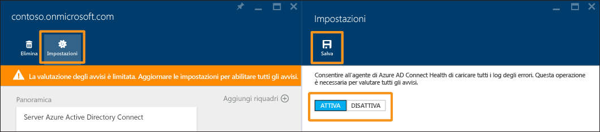

<properties
	pageTitle="Uso di Azure AD Connect Health per la sincronizzazione | Microsoft Azure"
	description="Questa è la pagina di Azure AD Connect Health in cui viene descritto come monitorare il Servizio di sincronizzazione Azure AD Connect."
	services="active-directory"
	documentationCenter=""
	authors="billmath"
	manager="stevenpo"
	editor="curtand"/>



<tags
	ms.service="active-directory"
	ms.workload="identity"
	ms.tgt_pltfrm="na"
	ms.devlang="na"
	ms.topic="get-started-article"
	ms.date="08/08/2016"
	ms.author="billmath"/>



# Uso di Azure AD Connect Health per la sincronizzazione
La documentazione seguente è specifica per il monitoraggio di Azure Active Directory Connect (Sincronizzazione) con Azure AD Connect Health. Per informazioni sul monitoraggio di AD FS con Azure AD Connect Health, vedere [Uso di Azure AD Connect Health con AD FS](active-directory-aadconnect-health-adfs.md). Per informazioni sul monitoraggio di Servizi di dominio Active Directory con Azure AD Connect Health, vedere [Uso di Azure AD Connect Health con Servizi di dominio Active Directory](active-directory-aadconnect-health-adds.md).





## Avvisi per Azure AD Connect Health per la sincronizzazione
La sezione Avvisi di Azure AD Connect Health contiene l'elenco degli avvisi attivi. Ogni avviso include informazioni pertinenti, la procedura di risoluzione e collegamenti alla documentazione correlata. Selezionando un avviso attivo o risolto, verrà visualizzato un nuovo pannello con altre informazioni, oltre ai passaggi che è possibile eseguire per risolvere l'avviso e i collegamenti ad altri documenti. È anche possibile visualizzare dati storici sugli avvisi risolti in passato.

Selezionando un avviso, vengono fornite informazioni aggiuntive, nonché la procedura per risolvere l'avviso e collegamenti ad altra documentazione.





### Valutazione limitata degli avvisi
Se Azure AD Connect NON usa la configurazione predefinita (ad esempio, se il filtro attributi è passato dalla configurazione predefinita a una configurazione personalizzata), l'agente Azure AD Connect Health non caricherà gli eventi di errore correlati ad Azure AD Connect.

La valutazione degli avvisi da parte del servizio è quindi soggetta a limiti. Verrà visualizzato un banner indicante questa condizione nel portale di Azure sotto il servizio.





Per modificare questa condizione, fare clic su "Impostazioni" e consentire all'agente Azure AD Connect Health di caricare tutti i log degli errori.





## Informazioni dettagliate sulla sincronizzazione
Nella versione più recente di Azure AD Connect Health per la sincronizzazione sono state aggiunte le nuove funzionalità seguenti:

- Latenza delle operazioni di sincronizzazione
- Tendenza nelle modifiche agli oggetti

### Latenza della sincronizzazione
Questa funzionalità fornisce una tendenza grafica della latenza delle operazioni di sincronizzazione, importazione, esportazione e così via, per i connettori. È così disponibile un modo rapido e semplice per comprendere non solo la latenza delle operazioni, molto utile specialmente se è in corso un set di modifiche esteso, ma anche per rilevare le anomalie a livello di latenza che potrebbero richiedere altre indagini.





Per impostazione predefinita, viene visualizzata solo la latenza dell'operazione di esportazione per il connettore Azure AD. Per visualizzare altre operazioni sul connettore o le operazioni da altri connettori, fare clic con il pulsante destro del mouse sul grafico e scegliere l'operazione e il connettore specifici.

### Sincronizzazione delle modifiche agli oggetti
Questa funzionalità fornisce una tendenza grafica del numero di modifiche valutate ed esportate in Azure AD. Attualmente, è difficile provare a raccogliere informazioni dai log di sincronizzazione. Il grafico fornisce non solo un modo più semplice per monitorare il numero di modifiche in corso nell'ambiente, ma anche una panoramica visiva degli errori che si sono verificati.





## Collegamenti correlati

* [Azure AD Connect Health](active-directory-aadconnect-health.md)
* [Installazione dell'agente di Azure AD Connect Health](active-directory-aadconnect-health-agent-install.md)
* [Operazioni di Azure AD Connect Health](active-directory-aadconnect-health-operations.md)
* [Uso di Azure AD Connect Health con AD FS](active-directory-aadconnect-health-adfs.md)
* [Uso di Azure AD Connect Health con Servizi di dominio Active Directory](active-directory-aadconnect-health-adds.md)
* [Domande frequenti su Azure AD Connect Health](active-directory-aadconnect-health-faq.md)
* [Cronologia delle versioni di Azure AD Connect Health](active-directory-aadconnect-health-version-history.md)

<!---HONumber=AcomDC_0810_2016-->