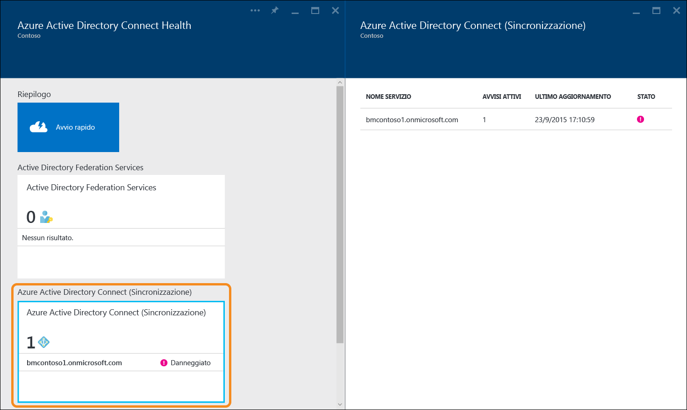

<properties 
	pageTitle="Uso di Azure AD Connect Health per la sincronizzazione | Microsoft Azure" 
	description="Questa è la pagina di Azure AD Connect Health in cui viene descritto come monitorare il Servizio di sincronizzazione Azure AD Connect." 
	services="active-directory" 
	documentationCenter="" 
	authors="billmath" 
	manager="stevenpo" 
	editor="curtand"/>

<tags 
	ms.service="active-directory" 
	ms.workload="identity" 
	ms.tgt_pltfrm="na" 
	ms.devlang="na" 
	ms.topic="get-started-article" 
	ms.date="09/25/2015" 
	ms.author="billmath"/>

# Uso di Azure AD Connect Health per la sincronizzazione
La documentazione seguente è specifica per il monitoraggio del servizio di sincronizzazione Azure AD Connect con Azure AD Connect Health. Per informazioni sul monitoraggio di AD FS con Azure AD Connect Health, vedere [Uso di Azure AD Connect Health con AD FS](active-directory-aadconnect-health-adfs.md).

## Avvisi per Azure AD Connect Health per la sincronizzazione
La sezione Avvisi di Azure AD Connect Health contiene l'elenco degli avvisi attivi. Ogni avviso include informazioni pertinenti, la procedura di risoluzione e collegamenti alla documentazione correlata. Selezionando un avviso attivo o risolto, verrà visualizzato un nuovo pannello con altre informazioni, oltre ai passaggi che è possibile eseguire per risolvere l'avviso e i collegamenti ad altri documenti. È anche possibile visualizzare dati storici sugli avvisi risolti in passato.

Selezionando un avviso, vengono fornite informazioni aggiuntive, nonché la procedura per risolvere l'avviso e collegamenti ad altra documentazione.

## Collegamenti correlati

* [Azure AD Connect Health](active-directory-aadconnect-health.md)
* [Installazione dell'agente di Azure AD Connect Health](active-directory-aadconnect-health-install.md)
* [Operazioni di Azure AD Connect Health](active-directory-aadconnect-health-operations.md)
* [Uso di Azure AD Connect Health con AD FS](active-directory-aadconnect-health-adfs.md)
* [Domande frequenti su Azure AD Connect Health](active-directory-aadconnect-health-faq.md)

<!---HONumber=Nov15_HO2-->