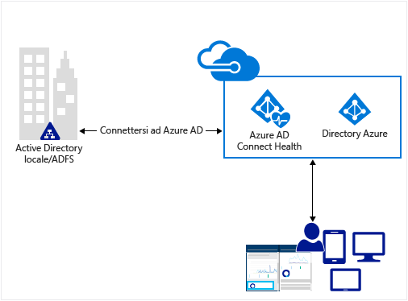
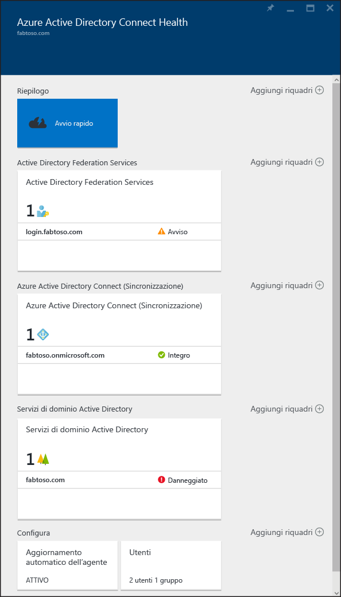

<properties
	pageTitle="Monitorare l’infrastruttura di identità locale nel cloud."
	description="Si tratta della pagina di Azure AD Connect Health in cui viene descritto Azure AD Connect Health e il relativo utilizzo."
	services="active-directory"
	documentationCenter=""
	authors="karavar"
	manager="femila"
	editor="karavar"/>

<tags
	ms.service="active-directory"
	ms.workload="identity"
	ms.tgt_pltfrm="na"
	ms.devlang="na"
	ms.topic="get-started-article"
	ms.date="07/14/2016"
	ms.author="vakarand"/>

# Monitorare l'infrastruttura di gestione delle identità locale e i servizi di sincronizzazione nel cloud

Azure AD Connect Health consente di monitorare e ottenere informazioni dettagliate sull'infrastruttura di gestione delle identità locale e sui servizi di sincronizzazione. Consente di mantenere una connessione affidabile a Office 365 e Microsoft Online Services offrendo capacità di monitoraggio per i componenti chiave relativi all'identità, ad esempio i server AD FS, i server Azure AD Connect (noto anche come motore di sincronizzazione), i controller di dominio di Active Directory e così via. Rende anche facilmente accessibili i punti dati chiave relativi a questi componenti, semplificando il recupero di dati sull'utilizzo e di altre informazioni importanti.

Queste informazioni vengono visualizzate nel [portale di Azure AD Connect Health](https://aka.ms/aadconnecthealth). Il portale di Azure AD Connect Health consente di visualizzare avvisi, informazioni sul monitoraggio delle prestazioni, analisi sull'utilizzo e altro ancora. Azure AD Connect Health abilita il singolo filtro basato sull'integrità per i componenti chiave per l'identità, in un'unica posizione.

Gli aggiornamenti futuri ad Azure AD Connect Health includeranno altre funzionalità di monitoraggio e informazioni dettagliate in altri componenti di identità. In tal modo, viene fornito un dashboard unico dal punto di vista delle identità, consentendo di disporre di un ambiente più affidabile, integro e integrato che gli utenti possono sfruttare per aumentare la capacità di svolgere il proprio lavoro.

<!-- 

 -->

## Perché utilizzare Azure AD Connect Health

L'integrazione delle directory locali con Azure AD rende gli utenti più produttivi in quanto fornisce un'identità comune per accedere alle risorse cloud e locali. Tuttavia, questa integrazione comporta la difficoltà di garantire che questo ambiente sia integro, per consentire agli utenti di accedere in modo affidabile alle risorse locali e cloud da qualsiasi dispositivo. Azure AD Connect Health fornisce un approccio semplice, basato sul cloud, per monitorare e ottenere informazioni dettagliate sull'infrastruttura di identità locale usata per accedere a Office 365 o ad altre applicazioni Azure AD. È semplice come installare un agente in ogni server di identità locale in uso.

## [Azure AD Connect Health per AD FS](active-directory-aadconnect-health-adfs.md)

Azure AD Connect Health per AD FS supporta AD FS 2.0 su Windows Server 2008 R2, AD FS in Windows Server 2012 e Windows Server 2012R2. Include anche server proxy AD FS o server proxy applicazione Web che forniscono supporto per l'autenticazione per l'accesso alla rete Extranet. Grazie a un'installazione molto semplice ed economicamente conveniente dell'agente per l'integrità, Azure AD Connect Health per AD FS offre le funzionalità chiave seguenti:

- Monitoraggio tramite avvisi per segnalare quando i server AD FS e proxy AD FS non sono integri.
- Notifiche tramite posta elettronica per gli avvisi critici
- Visualizzazione delle tendenze nei dati delle prestazioni, utili per la pianificazione delle capacità di AD FS.
- Analisi di utilizzo per gli accessi ad AD FS con diversi pivot (app, utenti, percorso di rete e così via), utili per la comprensione dell'utilizzo di AD FS.
- Report per AD FS, ad esempio il report relativo ai 50 utenti principali con tentativi di nome utente/password non riusciti.

Il video seguente fornirà una panoramica di Azure AD Connect Health per AD FS.

> [AZURE.VIDEO azure-ad-connect-health--monitor-you-identity-bridge]

## [Azure AD Connect Health per la sincronizzazione](active-directory-aadconnect-health-sync.md)

Azure AD Connect Health per la sincronizzazione monitora e fornisce informazioni sulle sincronizzazioni che si verificano tra Active Directory locale e Azure Active Directory. Azure AD Connect Health per la sincronizzazione fornisce il set di funzionalità chiave seguente:

- Monitoraggio degli avvisi per sapere quando i server di Azure AD Connect, ovvero il motore di sincronizzazione, non è integro.
- Notifiche tramite posta elettronica per gli avvisi critici
- Approfondimenti operativi sulla sincronizzazione, inclusi grafici di latenza per le operazioni di sincronizzazione e tendenze per le operazioni di sincronizzazione, ad esempio aggiunte, aggiornamenti ed eliminazioni.
- Riepilogo rapido delle informazioni sulle proprietà di sincronizzazione e sull'ultima esportazione riuscita in Azure AD.

Il video seguente fornirà una panoramica di Azure AD Connect Health per la sincronizzazione.

>[AZURE.VIDEO azure-active-directory-connect-health-monitoring-the-sync-engine]

## [Azure AD Connect Health per Servizi di dominio Active Directory (anteprima)](active-directory-aadconnect-health-adds.md)

Azure AD Connect Health per Servizi di dominio Active Directory consente il monitoraggio dei controller di dominio installati in Windows Server 2008 R2, Windows Server 2012 e Windows Server 2012 R2. Si tratta dell'installazione semplice e a basso costo di un agente di integrità che consente di monitorare l'ambiente locale di Servizi di dominio Active Directory direttamente dal cloud. Azure AD Connect Health per Servizi di dominio Active Directory offre il seguente insieme di funzionalità chiave:

- Avvisi di monitoraggio per rilevare quando i controller di dominio non sono integri, insieme a notifiche di posta elettronica per avvisi critici.
- Dashboard dei controller di dominio, per la visualizzazione rapida dell'integrità e dello stato operativo dei controller di dominio.
- Dashboard Stato replica con le informazioni di replica più recenti, oltre a collegamenti a guide per la risoluzione dei problemi quando vengono rilevati errori.
- Accesso rapido ovunque a grafici di dati dei contatori delle prestazioni più diffusi, per obiettivi di risoluzione dei problemi e monitoraggio.

Il video seguente offre una panoramica di Azure AD Connect Health per Servizi di dominio Active Directory

>[AZURE.VIDEO azure-ad-connect-health-monitors-on-premises-ad-domain-services]

## Introduzione ad Azure AD Connect Health
Le operazioni per iniziare a usare Azure AD Connect Health sono molto semplici. Attenersi ai passaggi indicati di seguito:

1. Vedere l'[Introduzione ad Azure Active Directory Premium](active-directory-get-started-premium.md) o [attivare una versione di valutazione](https://azure.microsoft.com/trial/get-started-active-directory/)

2. [Scaricare e installare gli agenti di Azure AD Connect Health](#download-and-install-azure-ad-connect-health-agent) nei server di identità.

3. Visualizzare il dashboard di Azure AD Connect Health all'indirizzo [https://aka.ms/aadconnecthealth](https://aka.ms/aadconnecthealth)

>[AZURE.NOTE]Tenere presente che, prima di visualizzare i dati nel dashboard di Azure AD Connect Health, è necessario installare gli agenti di Azure AD Connect Health nei server di destinazione.

## Scaricare e installare l'agente di Azure AD Connect Health

- Vedere i [Requisiti](active-directory-aadconnect-health-agent-install.md#Requirements) per Azure AD Connect Health

- Per una guida introduttiva all'uso di Azure AD Connect Health, è possibile scaricare la versione più recente dell'agente qui: [Download dell'agente di Azure AD Connect Health per AD FS.](http://go.microsoft.com/fwlink/?LinkID=518973) 

- Per iniziare a usare Azure AD Connect Health per la sincronizzazione, scaricare e installare la [versione più recente di Azure AD Connect](http://go.microsoft.com/fwlink/?linkid=615771). L'agente per l'integrità verrà installato come parte dell'installazione di Azure AD Connect (versione 1.0.9125.0 o versione successiva). Azure AD Connect supporta un aggiornamento sul posto da versioni precedenti.

- Per una guida introduttiva all'uso di Azure AD Connect Health per Servizi di dominio Active Directory, è possibile scaricare la versione più recente dell'agente qui: [Download dell'agente di Azure AD Connect Health per Servizi di dominio Active Directory.](http://go.microsoft.com/fwlink/?LinkID=820540) 

## Portale di Azure AD Connect Health
Il portale di Azure AD Connect Health consente di visualizzare gli avvisi, il monitoraggio delle prestazioni e le analisi di utilizzo. https://aka.ms/aadconnecthealth visualizza il pannello principale di Azure AD Connect Health. Un pannello è paragonabile a una finestra. Nel pannello principale sono disponibili opzioni per l'Avvio rapido, per i servizi di Azure AD Connect Health e altre opzioni di configurazione. Sotto la schermata è disponibile una breve descrizione di ciascun elemento. Dopo la distribuzione degli agenti, il servizio integrità identifica automaticamente gli identificatori dei servizi monitorati da Azure AD Connect Health.

- **Avvio rapido**: selezionando questa opzione, viene visualizzato il pannello Avvio rapido. in cui è possibile scaricare l'agente di Azure AD Connect Health scegliendo Scarica strumenti, accedere alla documentazione e fornire commenti e suggerimenti.

- **Active Directory Federation Services**: rappresenta tutti i servizi di AD FS attualmente monitorati da Azure AD Connect Health. Selezionando una delle istanze, verrà visualizzato un altro pannello che contiene informazioni su tale istanza del servizio. Queste informazioni includono una panoramica, le proprietà, gli avvisi, informazioni di monitoraggio e analisi di utilizzo. Altre informazioni su queste funzionalità sono disponibili [qui](active-directory-aadconnect-health-adfs.md).

- **Azure Active Directory Connect (Sincronizzazione)**: rappresenta i server di Azure AD Connect attualmente monitorati da Azure AD Connect Health. Se si seleziona questa voce, verrà visualizzato un pannello contenente informazioni sui server di Azure AD Connect. Altre informazioni su queste funzionalità sono disponibili [qui](active-directory-aadconnect-health-sync.md).
 
- **Servizi di dominio Active Directory**: rappresenta tutte le foreste di Servizi di dominio Active Directory attualmente monitorate da Azure AD Connect Health. Selezionando una delle foreste verrà visualizzato un altro pannello con le informazioni sulla foresta. Queste informazioni includono una panoramica dei dati essenziali, il dashboard dei controller di dominio, il dashboard Stato replica, avvisi e monitoraggio. Altre informazioni su queste funzionalità sono disponibili [qui](active-directory-aadconnect-health-adds.md).

- **Configura**: consente di attivare e disattivare le seguenti funzionalità:

	1. Aggiornamento automatico dell'agente di Azure AD Connect Health alla versione più recente: l'agente di Azure AD Connect Health viene aggiornato automaticamente ogni volta che è disponibile una nuova versione. Questa opzione è abilitata per impostazione predefinita.

	2. Accesso ai dati di integrità della directory di Azure AD da parte di Microsoft solo ai fini della risoluzione dei problemi: se questa opzione è abilitata, Microsoft potrà accedere agli stessi dati visualizzati dall'utente. Questa opzione può essere utile per la risoluzione dei problemi e per fornire l'assistenza necessaria. Questa opzione è disabilitata per impostazione predefinita.

## Collegamenti correlati

* [Installazione dell'agente di Azure AD Connect Health](active-directory-aadconnect-health-agent-install.md)
* [Operazioni di Azure AD Connect Health](active-directory-aadconnect-health-operations.md)
* [Uso di Azure AD Connect Health con AD FS](active-directory-aadconnect-health-adfs.md)
* [Uso di Azure AD Connect Health per la sincronizzazione](active-directory-aadconnect-health-sync.md)
* [Uso di Azure AD Connect Health con Servizi di dominio Active Directory](active-directory-aadconnect-health-adds.md)
* [Domande frequenti su Azure AD Connect Health](active-directory-aadconnect-health-faq.md)
* [Cronologia delle versioni di Azure AD Connect Health](active-directory-aadconnect-health-version-history.md)

<!---HONumber=AcomDC_0928_2016-->