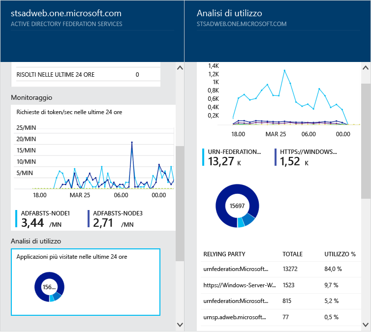
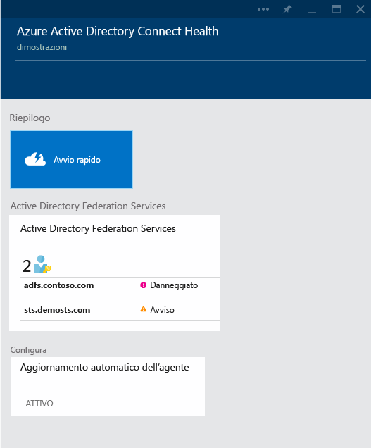

<properties 
	pageTitle="Monitorare l’infrastruttura di identità locale nel cloud." 
	description="Si tratta della pagina di Azure AD Connect Health in cui viene descritto Azure AD Connect Health e il relativo utilizzo." 
	services="active-directory" 
	documentationCenter="" 
	authors="billmath" 
	manager="swadhwa" 
	editor="curtand"/>

<tags 
	ms.service="active-directory" 
	ms.workload="identity" 
	ms.tgt_pltfrm="na" 
	ms.devlang="na" 
	ms.topic="article" 
	ms.date="07/12/2015" 
	ms.author="billmath"/>

# Monitorare l’infrastruttura di identità locale nel cloud

Azure AD Connect Health consente di monitorare e ottenere informazioni dettagliate sull’infrastruttura di identità locale. Lo strumento offre la possibilità di visualizzare gli avvisi, le prestazioni, i modelli di utilizzo, le impostazioni di configurazione, consente di mantenere una connessione affidabile a Office 365 e molto altro ancora. Tutto ciò viene realizzato mediante un agente installato nei server di destinazione. Per informazioni sui requisiti di Azure AD Connect Health e sull'installazione vedere[Requisiti di Azure AD Connect Health](active-directory-aadconnect-health-requirements.md).

Queste informazioni vengono visualizzate tutte nel portale di Azure AD Connect Health. Il portale di Azure AD Connect Health consente di visualizzare gli avvisi, il monitoraggio delle prestazioni e i dati analitici di utilizzo. Queste informazioni vengono visualizzate tutte in un'unica posizione facile da utilizzare, in modo da non sprecare tempo per la ricerca delle informazioni di cui si ha bisogno.

Gli aggiornamenti futuri ad Azure AD Connect Health includeranno ulteriore monitoraggio e informazioni dettagliate su altri componenti di identità e servizi, ad esempio i servizi Azure AD Connect Sync. In tal modo, viene fornito un dashboard unico dal punto di vista delle identità, consentendo di disporre di un ambiente più affidabile, integro e integrato che gli utenti possono sfruttare per aumentare la capacità di svolgere il proprio lavoro.

## Perché utilizzare Azure AD Connect Health

L'integrazione delle directory locali con Azure AD rende gli utenti più produttivi in quanto fornisce un'identità comune per accedere alle risorse cloud e locali. Tuttavia, questa integrazione comporta la difficoltà di garantire che questo ambiente sia integro, per consentire agli utenti di accedere in modo affidabile alle risorse locali e cloud da qualsiasi dispositivo. Azure AD Connect Health fornisce un approccio semplice, basato sul cloud, per monitorare e ottenere informazioni dettagliate sull’infrastruttura di identità locale utilizzata per accedere a Office 365 o ad altre applicazioni Azure AD. È semplice come installare un agente in ogni server di identità locale in uso.

Azure AD Connect Health per ADFS supporta AD FS 2.0 in Windows Server 2008/2008 R2, ADFS in Windows Server 2012/2012R2. È inoltre incluso qualsiasi server Proxy ADFS o Proxy applicazione Web Application che fornisce il supporto per l’autenticazione per l’accesso alla rete Extranet. Azure AD Connect Health per ADFS fornisce il seguente insieme di funzionalità chiave:

- Visualizzazione degli avvisi e intervento per un accesso affidabile alle applicazioni di ADFS protette tra cui Azure AD
- Notifiche tramite posta elettronica per gli avvisi critici
- Visualizzazione dei dati sulle prestazioni per determinare la pianificazione della capacità
- Visualizzazioni dettagliate dei modelli di accesso di ADFS per determinare le anomalie o stabilire linee di base per la pianificazione della capacità

Nel video seguente viene fornita una panoramica di Azure AD Connect Health:

[AZURE.VIDEO azure-ad-connect-health--monitor-you-identity-bridge]

## Uso di Azure Active Directory Connect Health per la prima volta dal portale di Azure
Per iniziare a usare Azure Active Directory Connect Health, attenersi alla procedura seguente. Tenere presente che, prima di visualizzare i dati nell'istanza di Azure AD Connect Health, è necessario installare l'agente di Azure AD Connect Health nei server di destinazione. Per scaricare l'agente di Azure AD Connect Health, nel primo pannello selezionare Avvio rapido e Scarica strumenti. È inoltre possibile scaricare l'agente direttamente con il collegamento riportato di seguito. Per usare Azure Active Directory Connect Health, procedere come segue:

1. Accedere al [portale di Microsoft Azure](https://portal.azure.com/).
2. Per accedere ad Azure Active Directory Connect Health, andare al Marketplace e cercarlo oppure selezionare Marketplace e selezionare Sicurezza e identità.
3. Nel pannello introduttivo (un pannello è una parte della visualizzazione complessiva, paragonabile a una finestra o a un riquadro a comparsa) fare clic su Crea. Verrà aperto un altro pannello con le informazioni sulla directory.
4. Nel pannello della directory fare clic su Crea. Se non si dispone di una licenza di Azure Active Directory Premium, sarà necessario usare Azure AD Connect Health. Per informazioni su Azure AD Premium, vedere Introduzione a Azure AD Premium.

## Portale di Azure Active Directory Connect Health
Il portale di Azure AD Connect Health consente di visualizzare gli avvisi, il monitoraggio delle prestazioni e i dati analitici di utilizzo. Al primo accesso ad Azure AD Connect Health, verrà visualizzato il primo pannello. Un pannello è una parte della visualizzazione complessiva, paragonabile a una finestra. Il primo pannello visualizzato mostra Avvio rapido, Servizi e Configura. Sotto la schermata è disponibile una breve descrizione di ciascun elemento.

- **Avvio rapido**: selezionando questa opzione, viene visualizzato il pannello Avvio rapido, in cui è possibile scaricare l'agente di Azure AD Connect Health scegliendo Scarica strumenti, accedere alla documentazione e fornire commenti e suggerimenti.
- **Active Directory Federation Services**: rappresenta tutti i servizi ADFS che Azure AD Connect Health sta attualmente monitorando. Le opzioni visualizzate in questa sezione verranno descritte di seguito. Vedere Servizi di Azure Active Directory Connect Health.
- Configura: consente di attivare e disattivare i comportamenti seguenti:
<ol>
1. Aggiornamento automatico dell'agente di Azure AD Connect Health alla versione più recente: l'agente di Azure AD Connect Health viene aggiornato automaticamente ogni volta che è disponibile una nuova versione. Questa opzione è abilitata per impostazione predefinita.
2. Accesso ai dati di integrità della directory di Azure AD da parte di Microsoft solo ai fini della risoluzione dei problemi: se questa opzione è abilitata, Microsoft potrà accedere agli stessi dati visualizzati dall'utente. Questa opzione può essere utile per la risoluzione dei problemi e per fornire l'assistenza necessaria. Questa opzione è disabilitata per impostazione predefinita.

## Servizi di Azure Active Directory Connect Health
Questa sezione rappresenta i servizi attivi e le istanze dei servizi monitorate da Azure AD Connect Health. Facendo clic sui puntini di sospensione, verrà visualizzato un pannello contenente tutte le istanze.

Selezionando una delle istanze, verrà visualizzato un altro pannello di Azure AD Connect Health, che contiene informazioni su tale istanza del servizio. In questo pannello sono disponibili innumerevoli informazioni sull'istanza, che includono una panoramica, le proprietà, gli avvisi, informazioni di monitoraggio e analisi di utilizzo. Per informazioni su questi elementi, vedere i collegamenti nelle sezioni successive di questa pagina.

----------------------------------------------------------------------------------------------------------
## Download dell’agente di Azure AD Connect Health

Per una guida introduttiva su Azure AD Connect Health, è possibile scaricare la versione più recente dell’agente da qui: [Download dell’agente di Azure AD Connect Health.](http://go.microsoft.com/fwlink/?LinkID=518973) Assicurarsi di aver aggiunto il servizio da Marketplace prima di installare gli agenti.

----------------------------------------------------------------------------------------------------------

## Avvisi di Azure Active Directory Connect Health
La sezione degli avvisi di Azure AD Connect Health contiene l'elenco degli avvisi attivi. Ogni avviso include informazioni pertinenti, la procedura di risoluzione e collegamenti alla documentazione correlata. Selezionando un avviso attivo o risolto, verrà visualizzato un nuovo pannello con altre informazioni, oltre ai passaggi che è possibile eseguire per risolvere l'avviso e i collegamenti ad altri documenti. È anche possibile visualizzare dati storici sugli avvisi risolti in passato.

Selezionando un avviso, vengono fornite informazioni aggiuntive, nonché la procedura per risolvere l'avviso e collegamenti ad altra documentazione.

## Monitoraggio delle prestazioni di Azure Active Directory Connect Health
Il monitoraggio delle prestazioni di Azure AD Connect Health offre informazioni di monitoraggio sulle metriche. Selezionando la casella Monitoraggio, viene visualizzato un pannello che contiene informazioni dettagliate sulle metriche.

Selezionando l'opzione Filtro nella parte superiore del pannello, è possibile filtrare in base al server per visualizzare le metriche di un singolo server. Per modificare le metriche, è sufficiente fare clic con il pulsante destro del mouse sul grafico di monitoraggio sotto il pannello Monitoraggio e scegliere Modifica grafico. Dal nuovo pannello visualizzato è quindi possibile selezionare altre metriche nell'elenco a discesa e specificare un intervallo di tempo per cui visualizzare i dati delle prestazioni.

## Analisi di utilizzo e report di Azure Active Directory Connect Health
Analisi di utilizzo di Azure AD Connect Health analizza il traffico di autenticazione dei server federativi. Selezionando la casella relativa all'analisi di utilizzo, verrà visualizzato il pannello corrispondente, che contiene le metriche e i raggruppamenti.

>[AZURE.NOTE]Per poter usare l'analisi di utilizzo con ADFS, è necessario verificare che il controllo di ADFS sia abilitato. Per altre informazioni, vedere Requisiti di Azure AD Connect Health.

Per selezionare altre metriche, specificare un intervallo di tempo o modificare il raggruppamento, è sufficiente fare clic con il pulsante destro del mouse sul pannello dell'analisi di utilizzo e scegliere Modifica grafico. È quindi possibile specificare l'intervallo di tempo, modificare o selezionare metriche e cambiare il raggruppamento. È possibile visualizzare la distribuzione del traffico di autenticazione in "metriche" diverse e raggruppare ogni metrica con i parametri di raggruppamento pertinenti descritti di seguito.

| Metrica | Raggruppa per | Cosa significa il raggruppamento e perché è utile? |
| ------ | -------- | -------------------------------------------- |
| Richieste totali: numero totale di richieste elaborate dal servizio federativo | Tutti | Visualizza il conteggio del numero totale di richieste senza raggruppamento. |
| | Applicazione | Questa opzione raggruppa le richieste totali in base alla relying party di destinazione. Questo raggruppamento è utile per conoscere la percentuale del traffico totale ricevuta da ogni applicazione. |
| | Server | Questa opzione raggruppa le richieste totali in base al server che ha elaborato la richiesta. Questo raggruppamento è utile per conoscere la distribuzione del carico del traffico totale. |
| | Aggiunta all'area di lavoro | Questa opzione raggruppa le richieste totali in base al fatto che provengano da dispositivi aggiunti all'area di lavoro (noti). Questo raggruppamento è utile per conoscere se le risorse sono accessibili con dispositivi sconosciuti all'infrastruttura di gestione delle identità. |
| | Metodo di autenticazione | Questa opzione raggruppa le richieste totali in base al metodo di autenticazione usato per l'autenticazione. Questo raggruppamento è utile per conoscere il metodo di autenticazione comune usato per l'autenticazione. Di seguito sono indicati i metodi di autenticazione possibili <ol> <li>Autenticazione integrata di Windows (Windows)</li> <li>Autenticazione basata su moduli (Forms)</li> <li>SSO (Single Sign-On)</li> <li>Autenticazione certificato X509 (certificato)</li>  Si noti che una richiesta viene considerata (Single Sign-On) se i server federativi ricevono la richiesta con un cookie SSO. In questi casi, se il cookie è valido, all'utente non viene chiesto di fornire le credenziali e ottiene l'accesso trasparente all'applicazione. Questo è normale se si dispone di più relying party protette dai server federativi. |
| | Percorso di rete | Questa opzione raggruppa le richieste totali in base al percorso di rete dell'utente. Può essere Intranet o Extranet. Questo raggruppamento è utile per conoscere la percentuale del traffico proveniente dalla Intranet e dalla Extranet. |
| Totale richieste non riuscite: numero totale di richieste non riuscite elaborate dal servizio federativo.   (Questa metrica è disponibile solo in ADFS per Windows Server 2012 R2)| Tipo di errore | Mostra il numero di errori in base ai tipi di errore predefiniti. Questo raggruppamento è utile per conoscere i tipi di errori comuni. <ul><li>Nome utente o password non corretta: errori dovuti a nome utente o password non corretta.</li> <li>"Blocco Extranet": errori causati dalle richieste ricevute da un utente bloccato al di fuori della Extranet </li><li> "Password scaduta": errori causati da utenti che effettuano l'accesso con una password scaduta.</li><li>"Account disabilitato": errori causati da utenti che effettuano l'accesso con un account disabilitato.</li><li>"Autenticazione dispositivo": errori causati da utenti che non riescono ad autenticarsi con Autenticazione dispositivo.</li><li>"Autenticazione certificato utente": errori causati da utenti che non riescono ad autenticarsi a causa di un certificato non valido.</li><li>"MFA": errori causati da utenti che non riescono ad autenticarsi con Multi-Factor Authentication.</li><li>"Altre credenziali": "Autorizzazione rilascio": errori dovuti a errori di autorizzazione.</li><li>"Delega rilascio": errori dovuti a errori di delega rilascio.</li><li>"Accettazione token": errori dovuti al rifiuto da parte di ADFS del token di un provider di identità di terze parti.</li><li>"Protocollo": errore dovuto a errori di protocollo.</li><li>"Sconosciuto": tutti. Eventuali altri errori che non rientrano nelle categorie definite.</li> |
| | Server | Raggruppa gli errori in base al server. È utile per conoscere la distribuzione degli errori nei server. Una distribuzione non uniforme potrebbe indicare che un server è in uno stato difettoso. |
| | Percorso di rete | Raggruppa gli errori in base al percorso di rete delle richieste (Intranet ed Extranet). È utile per conoscere il tipo di richieste che hanno esito negativo. |
| | Applicazione | Raggruppa gli errori in base all'applicazione di destinazione (relying party). È utile per conoscere l'applicazione di destinazione che sta visualizzando il maggior numero di errori. |
| Conteggio utenti: numero medio di utenti univoci attivi nel sistema | Tutti | Fornisce un conteggio del numero medio di utenti che usano il servizio federativo nel periodo di tempo selezionato. Gli utenti non sono raggruppati.  La media dipenderà dal periodo di tempo selezionato. |
| | Applicazione | Raggruppa il numero medio di utenti in base all'applicazione di destinazione (relying party). È utile per conoscere quanti utenti stanno usando una determinata applicazione. |

## Passaggi successivi
Per procedere con Azure AD Connect Health, vedere [Requisiti di Azure AD Connect Health](active-directory-aadconnect-health-requirements.md). Una volta installato l'agente e iniziato a raccogliere i dati, vedere [Operazioni di Azure AD Connect Health](active-directory-aadconnect-health-operations.md) per altre informazioni sulla configurazione di Azure AD Connect Health oppure vedere le [Domande frequenti](active-directory-aadconnect-health-faq.md).

**Risorse aggiuntive**

* [Azure AD Connect Health su MSDN](https://msdn.microsoft.com/library/azure/dn906722.aspx)

 

<!---HONumber=July15_HO3-->