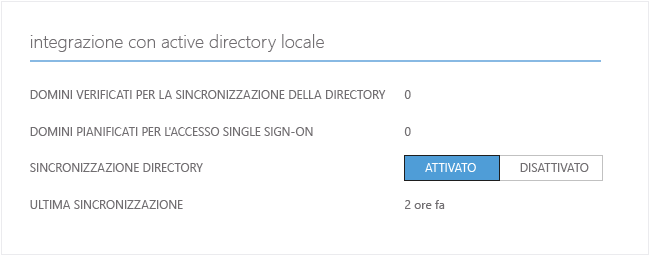
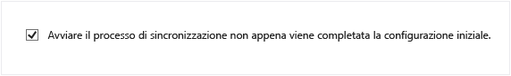
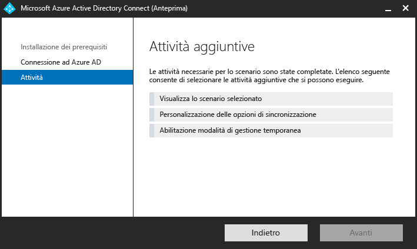

# Passaggi successivi e come gestire Azure AD Connect
Di seguito sono riportati argomenti operativi avanzati che permettono di personalizzare Azure Active Directory Connect per soddisfare le esigenze e i requisiti dell'organizzazione.  

## Aggiungere altri amministratori di sincronizzazione
Per impostazione predefinita, solo l'utente che ha eseguito l'installazione e gli amministratori locali possono gestire il motore di sincronizzazione installato. Per fare in modo che altre persone possano accedere al motore di sincronizzazione e gestirlo, trovare il gruppo denominato ADSyncAdmins nel server locale e aggiungere gli utenti desiderati a questo gruppo.

## Assegnazione delle licenze agli utenti di Azure AD Premium ed Enterprise Mobility
Dopo avere sincronizzato gli utenti nel cloud, occorre assegnare loro una licenza in modo che possano usare le app cloud come Office 365.

### Per assegnare una licenza Azure AD Premium o Enterprise Mobility Suite
- - -
1. Accesso al portale di Azure come amministratore.
2. A sinistra, selezionare **Active Directory**.
3. Nella pagina Active Directory fare doppio clic sulla directory con gli utenti da abilitare.
4. Nella parte superiore della pagina della directory selezionare **Licenses**.
5. Nella pagina Licenze selezionare Active Directory Premium o Enterprise Mobility Suite e quindi fare clic su **Assegna**.
6. Nella finestra di dialogo selezionare gli utenti a cui assegnare le licenze, quindi fare clic sull'icona con il segno di spunta per salvare le modifiche.

## Verificare l'attività di sincronizzazione pianificata
Per controllare lo stato di una sincronizzazione, è possibile accedere al portale di Azure.

### Per verificare l'attività di sincronizzazione pianificata
- - -
1. Accesso al portale di Azure come amministratore.
2. A sinistra, selezionare **Active Directory**.
3. Nella pagina Active Directory fare doppio clic sulla directory con gli utenti da abilitare.
4. Nella parte superiore della pagina della directory selezionare **Integrazione directory**.
5. Nella sezione relativa all'integrazione con Active Directory locale prendere nota dell'ora dell'ultima sincronizzazione.

## Avvio di un'attività di sincronizzazione pianificata
Se è necessario eseguire un'attività di sincronizzazione, è possibile eseguire nuovamente la procedura guidata di Azure AD Connect.  È necessario fornire le credenziali di Azure AD.  Nella procedura guidata selezionare l'attività **Personalizzazione delle opzioni di sincronizzazione** e fare clic su Avanti nella procedura guidata. Al termine, verificare che la casella **Avviare il processo di sincronizzazione non appena viene completata la configurazione iniziale** sia selezionata.

Per altre informazioni sull'utilità di pianificazione del servizio di sincronizzazione Azure AD Connect, vedere [Utilità di pianificazione di Azure AD Connect](active-directory-aadconnectsync-feature-scheduler.md)

## Attività aggiuntive disponibili in Azure AD Connect
Dopo l'installazione iniziale di Azure AD Connect è sempre possibile riavviare la procedura guidata dalla pagina iniziale di Azure AD Connect o dal collegamento sul dekstop.  Si noterà che la riesecuzione della procedura guidata fornisce alcune nuove opzioni sotto forma di Attività aggiuntive.  

La tabella seguente include un riepilogo di tali attività e una breve descrizione di ognuna di esse.

| Attività aggiuntive | Descrizione |
| --- | --- |
| Visualizza lo scenario selezionato |Consente di visualizzare la soluzione di Connect di Azure AD corrente.  Include impostazioni generali, directory sincronizzate, impostazioni di sincronizzazione e così via. |
| Personalizzazione delle opzioni di sincronizzazione |Consente di modificare la configurazione corrente, inclusa l'aggiunta di altre foreste di Active Directory per la configurazione o l'attivazione di opzioni di sincronizzazione, ad esempio writeback di utenti, gruppi, dispositivi o password. |
| Abilitazione modalità di gestione temporanea |Consente di inserire in un'area di gestione temporanea le informazioni che saranno sincronizzate in un secondo momento, senza che avvenga l'esportazione in Azure AD o Active Directory.  Consente di visualizzare in anteprima le sincronizzazioni prima che si verifichino. |

## Passaggi successivi
Altre informazioni su [Integrazione delle identità locali con Azure Active Directory](active-directory-aadconnect.md).

<!--HONumber=Oct16_HO2-->

