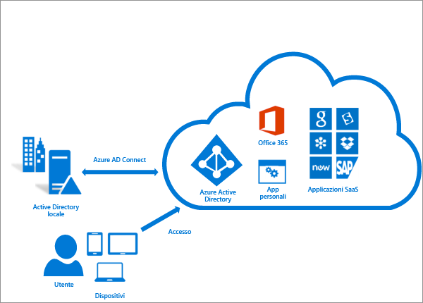

<properties
	pageTitle="Azure AD Connect: Integrazione delle identità locali con Azure Active Directory | Microsoft Azure"
	description="Azure AD Connect integra le directory locali con Azure Active Directory. Consente di fornire un'identità comune per le applicazioni di Office 365, Azure e SaaS integrate con Azure AD."
    keywords="introduzione ad Azure AD Connect, panoramica di Azure AD Connect, che cos'è Azure AD Connect, installare active directory"
	services="active-directory"
	documentationCenter=""
	authors="andkjell"
	manager="stevenpo"
	editor=""/>

<tags
	ms.service="active-directory"
	ms.workload="identity"
	ms.tgt_pltfrm="na"
	ms.devlang="na"
	ms.topic="get-started-article"
	ms.date="05/19/2016"
	ms.author="andkjell;billmath"/>

# Integrazione delle identità locali con Azure Active Directory
Azure AD Connect integra le directory locali con Azure Active Directory. Consente quindi di fornire agli utenti un'identità comune per le applicazioni di Office 365, Azure e SaaS integrate con Azure AD. Questo argomento fornisce una guida dettagliata sulle procedure di pianificazione, distribuzione e funzionamento. Include una raccolta di collegamenti agli argomenti correlati a questa area.

<!-- The hardcoded link is a workaround for campaign ids not working in acom links-->

> [AZURE.IMPORTANT] [Azure AD Connect è il modo migliore per collegare la directory locale con Azure AD e Office 365. Questo è il momento giusto per eseguire l'aggiornamento ad Azure AD Connect dallo strumento di sincronizzazione di Microsoft Azure Active Directory (DirSync) o Azure AD Sync in quanto questi strumenti vengono deprecati e il supporto terminerà il 13 aprile 2017.]( https://azure.microsoft.com/documentation/articles/active-directory-aadconnect-dirsync-deprecated/?WT.mc_id=DirSyncDepACOM)

## Perché usare Azure AD Connect
L'integrazione delle directory locali con Azure AD rende gli utenti più produttivi, in quanto fornisce un'identità comune per accedere alle risorse cloud e locali. Utenti e organizzazioni possono sfruttare i vantaggi seguenti:

- Gli utenti possono usare un'unica identità per accedere alle applicazioni locali e ai servizi cloud, come ad esempio Office 365.

- Un unico strumento che offre un'esperienza di distribuzione semplificata per la sincronizzazione e l'accesso.

- Offre le funzionalità più recenti per gli scenari in uso. Azure AD Connect sostituisce le versioni precedenti degli strumenti di integrazione delle identità, ad esempio DirSync e Azure AD Sync. Per altre informazioni, vedere [Confronto degli strumenti di integrazione directory per la soluzione ibrida di gestione delle identità](active-directory-hybrid-identity-design-considerations-tools-comparison.md).

### Funzionamento di Azure AD Connect
Azure Active Directory Connect è costituito da tre componenti principali: i servizi di sincronizzazione, il componente facoltativo Active Directory Federation Services e il componente di monitoraggio denominato [Azure AD Connect Health](active-directory-aadconnect-health.md).

 

- Sincronizzazione: questo componente è responsabile della creazione di utenti, gruppi e altri oggetti. Deve anche garantire che le informazioni sulle identità per utenti e gruppi locali corrispondano a quelle nel cloud.
- AD FS: la federazione è una parte facoltativa di Azure AD Connect e può essere usata per configurare un ambiente ibrido usando un'infrastruttura AD FS locale. Può essere usata dalle organizzazioni per gestire distribuzioni complesse, ad esempio, l'accesso SSO per l'aggiunta a un dominio, l'applicazione di criteri di accesso di Active Directory e l'autenticazione a più fattori con smart card o di terze parti.
- Monitoraggio dell'integrità: Azure AD Connect Health può offrire un monitoraggio affidabile e una posizione centralizzata nel portale di Azure per visualizzare questa attività. Per altre informazioni, vedere [Azure Active Directory Connect Health](active-directory-aadconnect-health.md).

## Installare Azure AD Connect

Il download per Azure AD Connect è disponibile nell'[Area download Microsoft](http://go.microsoft.com/fwlink/?LinkId=615771).

Soluzione | Scenario
----- | ----- |
Prima di iniziare: [Hardware e prerequisiti](active-directory-aadconnect-prerequisites.md) | <li>Passaggi da completare prima di iniziare a installare Azure AD Connect.</li>
[Impostazioni rapide](active-directory-aadconnect-get-started-express.md) | <li>Se è disponibile una singola foresta di Active Directory, è consigliabile usare questa opzione.</li> <li>Accesso utente con la stessa password tramite la sincronizzazione delle password.</li>
[Impostazioni personalizzate](active-directory-aadconnect-get-started-custom.md) | <li>Da usare quando sono presenti più foreste. Supporta numerose [topologie](active-directory-aadconnect-topologies.md) locali.</li> <li>Personalizzare l'opzione di accesso, ad esempio con AD FS per la federazione o un provider di identità di terze parti.</li> <li>Personalizzare le funzionalità di sincronizzazione, ad esempio filtro e writeback.</li>
[Aggiornamento da DirSync](active-directory-aadconnect-dirsync-upgrade-get-started.md) | <li>Da usare se è presente un server DirSync esistente già in esecuzione.</li>
[Aggiornamento da Azure AD Sync o Azure AD Connect](active-directory-aadconnect-upgrade-previous-version.md)| <li>Sono disponibili diversi metodi.</li>

[Dopo l'installazione](active-directory-aadconnect-whats-next.md) sarà necessario verificare se funziona come previsto e assegnare le licenze agli utenti.

### Installare Azure AD Connect - Passaggi successivi

Argomento |  
--------- | ---------
Scaricare Azure AD Connect | [Scaricare Azure AD Connect](http://go.microsoft.com/fwlink/?LinkId=615771)
Eseguire l'installazione con le Impostazioni rapide | [Installazione rapida di Azure AD Connect](active-directory-aadconnect-get-started-express.md)
Eseguire l'installazione mediante le impostazioni personalizzate | [Installazione personalizzata di Azure AD Connect](active-directory-aadconnect-get-started-custom.md)
Aggiornamento da DirSync | [Aggiornamento dallo strumento di sincronizzazione di Azure AD (DirSync)](active-directory-aadconnect-dirsync-upgrade-get-started.md)
Dopo l'installazione | [Verificare l'installazione e assegnare le licenze ](active-directory-aadconnect-whats-next.md)

### Altre informazioni su come installare Azure AD Connect

Preparazione per la gestione delle attività [operative](active-directory-aadconnectsync-operations.md). È consigliabile avere un server in standby per agevolare il failover in caso di [emergenza](active-directory-aadconnectsync-operations.md#disaster-recovery). Se si prevede di apportare modifiche frequenti alla configurazione, è consigliabile valutare l'uso di un server in [modalità di staging](active-directory-aadconnectsync-operations.md#staging-mode).

Argomento |  
--------- | ---------
Topologie supportate | [Topologie per Azure AD Connect](active-directory-aadconnect-topologies.md)
Concetti relativi alla progettazione | [Concetti relativi alla progettazione per Azure AD Connect](active-directory-aadconnect-design-concepts.md)
Account usati per l'installazione | [Altre informazioni sulle credenziali e le autorizzazioni di Azure AD Connect](active-directory-aadconnect-accounts-permissions.md)
Pianificazione per la gestione delle attività operative | [Servizio di sincronizzazione Azure AD Connect: Attività operative e considerazioni](active-directory-aadconnectsync-operations.md)
Opzioni di accesso utente | [Opzioni di accesso utente di Azure AD Connect](active-directory-aadconnect-user-signin.md)

## Configurare le funzionalità di sincronizzazione
Azure AD Connect include numerose funzionalità che è possibile abilitare o che sono abilitate per impostazione predefinita. Alcune funzionalità possono talvolta richiedere più attività di configurazione in topologie e scenari specifici.

Il [filtro](active-directory-aadconnectsync-configure-filtering.md) consente di limitare gli oggetti da sincronizzare con Azure AD. Per impostazione predefinita, vengono sincronizzati tutti gli utenti, i contatti, i gruppi e i computer Windows 10. È possibile modificare il filtro sulla base di domini, unità organizzative o attributi.

La [sincronizzazione delle password](active-directory-aadconnectsync-implement-password-synchronization.md) consente di sincronizzare l'hash delle password di Active Directory con Azure AD. L'utente può usare la stessa password in locale e nel cloud, ma gestirla da una sola posizione. Poiché usa l'istanza di Active Directory locale come autorità di certificazione, è anche possibile usare i criteri password personali.

Il [writeback delle password](active-directory-passwords-getting-started.md) consente agli utenti di modificare e reimpostare le proprie password nel cloud, applicando i criteri per le password locali.

Il [writeback dei dispositivi](active-directory-aadconnect-feature-device-writeback.md) consente il writeback di un dispositivo registrato in Azure AD nell'istanza di Active Directory locale, affinché possa essere usato per l'accesso condizionale.

La funzionalità di [prevenzione delle eliminazioni accidentali](active-directory-aadconnectsync-feature-prevent-accidental-deletes.md) è attivata per impostazione predefinita e proteggere la directory cloud da numerose eliminazioni contemporanee. Per impostazione predefinita, consente 500 eliminazioni per ogni esecuzione. È possibile modificare questa impostazione in base alle dimensioni dell'organizzazione.

L'[aggiornamento automatico](active-directory-aadconnect-feature-automatic-upgrade.md) è abilitato per impostazione predefinita per le installazioni con impostazioni rapide e assicura che Azure AD Connect sia sempre aggiornato alla versione più recente.

### Configurare le funzionalità di sincronizzazione - Passaggi successivi

Argomento |  
--------- | --------- |
Configurare il filtro | [Servizio di sincronizzazione Azure AD Connect: Configurare il filtro](active-directory-aadconnectsync-configure-filtering.md)
Sincronizzazione delle password | [Servizio di sincronizzazione Azure AD Connect: Implementare la sincronizzazione della password](active-directory-aadconnectsync-implement-password-synchronization.md)
Writeback password | [Introduzione alla gestione delle password](active-directory-passwords-getting-started.md)
Writeback dispositivi | [Abilitazione del writeback dei dispositivi in Azure AD Connect](active-directory-aadconnect-feature-device-writeback.md)
Impedire eliminazioni accidentali | [Servizio di sincronizzazione Azure AD Connect: Impedire eliminazioni accidentali](active-directory-aadconnectsync-feature-prevent-accidental-deletes.md)
Aggiornamento automatico | [Azure AD Connect: aggiornamento automatico](active-directory-aadconnect-feature-automatic-upgrade.md)

## Personalizzare il servizio di sincronizzazione Azure AD Connect
Il servizio di sincronizzazione Azure AD Connect viene fornito con una configurazione predefinita adatta alla maggior parte dei clienti e delle topologie. In alcune situazioni, tuttavia, la configurazione predefinita non funziona e richiede alcune rettifiche. Le modifiche sono supportate, purché in linea con quanto documentato in questa sezione e negli argomenti collegati.

Se è la prima volta che si usa una topologia di sincronizzazione, è consigliabile vedere le nozioni di base e i termini usati nella sezione relativa ai [concetti tecnici](active-directory-aadconnectsync-technical-concepts.md). Azure AD Connect è l'evoluzione di MIIS2003, ILM2007 e FIM2010. Anche se alcuni elementi sono identici, sono state introdotte numerose modifiche.

La [configurazione predefinita](active-directory-aadconnectsync-understanding-default-configuration.md) presuppone che possano essere presenti più foreste. In queste topologie un oggetto utente può essere rappresentato come un contatto in un'altra foresta. L'utente può anche avere una cassetta postale collegata in un'altra foresta di risorse. Il comportamento della configurazione predefinita è descritto in [utenti e contatti](active-directory-aadconnectsync-understanding-users-and-contacts.md).

Il modello di configurazione sincronizzato è chiamato [provisioning dichiarativo](active-directory-aadconnectsync-understanding-declarative-provisioning-expressions.md). I flussi di attributi avanzati usano [funzioni](active-directory-aadconnectsync-functions-reference.md) per esprimere le trasformazioni degli attributi. È possibile visualizzare ed esaminare l'intera configurazione con gli strumenti disponibili in Azure AD Connect. Per apportare modifiche alla configurazione, assicurarsi di seguire le [procedure consigliate](active-directory-aadconnectsync-best-practices-changing-default-configuration.md) per semplificare l'adozione delle nuove versioni.

### Personalizzare il servizio di sincronizzazione Azure AD Connect - Passaggi successivi

Argomento |  
--------- | ---------
Tutti gli articoli sul servizio di sincronizzazione Azure AD Connect | [Servizio di sincronizzazione Azure AD Connect](active-directory-aadconnectsync-whatis.md)
Concetti tecnici | [Servizio di sincronizzazione Azure AD Connect: Concetti tecnici](active-directory-aadconnectsync-technical-concepts.md)
Informazioni sulla configurazione predefinita | [Servizio di sincronizzazione Azure AD Connect: Informazioni sulla configurazione predefinita](active-directory-aadconnectsync-understanding-default-configuration.md)
Informazioni su utenti e contatti | [Servizio di sincronizzazione Azure AD Connect: Informazioni su utenti e contatti](active-directory-aadconnectsync-understanding-users-and-contacts.md)
Provisioning dichiarativo | [Servizio di sincronizzazione Azure AD Connect: Informazioni sulle espressioni di provisioning dichiarativo](active-directory-aadconnectsync-understanding-declarative-provisioning-expressions.md)
Modificare la configurazione predefinita | [Procedure consigliate per modificare la configurazione predefinita](active-directory-aadconnectsync-best-practices-changing-default-configuration.md)

## Configurare le funzionalità di federazione
AD FS può essere configurato per supportare [più domini](active-directory-aadconnect-multiple-domains.md). Ad esempio, possono essere presenti più domini principali da usare per la federazione.

Se il server AD FS non è stato configurato per l'aggiornamento automatico dei certificati da Azure AD o se si usa una soluzione non AD FS, si riceverà una notifica quando è necessario [aggiornare i certificati](active-directory-aadconnect-o365-certs.md).

### Configurare le funzionalità di federazione - Passaggi successivi

Argomento |  
--------- | ---------
Configurare AD FS con sottodomini | [Supporto di più domini per la federazione con Azure AD](active-directory-aadconnect-multiple-domains.md)
Gestire la farm AD FS | [Gestione e personalizzazione di AD FS con Azure AD Connect](active-directory-aadconnect-federation-management.md)
Aggiornare manualmente i certificati di federazione | [Rinnovo dei certificati di federazione per Office 365 e Azure AD](active-directory-aadconnect-o365-certs.md)

## Altri riferimenti e informazioni

Argomento |  
--------- | --------- |
Cronologia delle versioni | [Cronologia delle versioni](active-directory-aadconnect-version-history.md)
Confronto tra DirSync, Azure ADSync e Azure AD Connect | [Confronto degli strumenti di integrazione directory](active-directory-hybrid-identity-design-considerations-tools-comparison.md)
Elenco di compatibilità non AD FS per Azure AD | [Elenco di compatibilità di federazione di Azure AD](active-directory-aadconnect-federation-compatibility.md)
Attributi sincronizzati | [Attributi sincronizzati](active-directory-aadconnectsync-attributes-synchronized.md)
Monitoraggio con Azure AD Connect Health | [Azure AD Connect Health](active-directory-aadconnect-health.md)
Domande frequenti | [Domande frequenti su Azure AD Connect](active-directory-aadconnect-faq.md)

**Risorse aggiuntive**

Presentazione Ignite 2015 su come estendere le directory locali nel cloud.

>[AZURE.VIDEO microsoft-ignite-2015-extending-on-premises-directories-to-the-cloud-made-easy-with-azure-active-directory-connect]

<!---HONumber=AcomDC_0525_2016-->