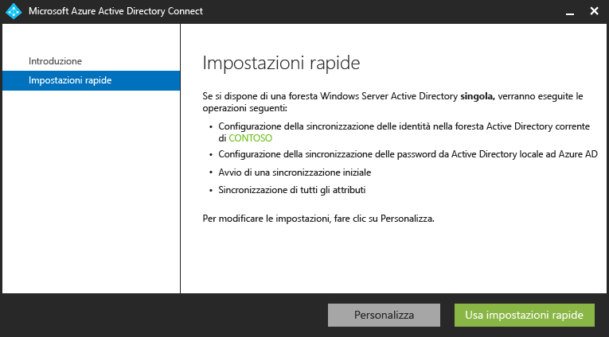
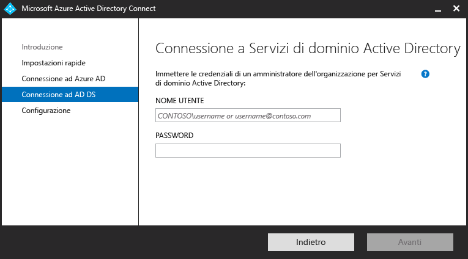
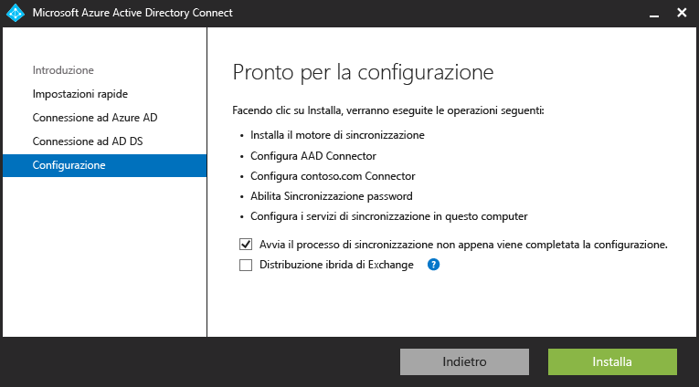
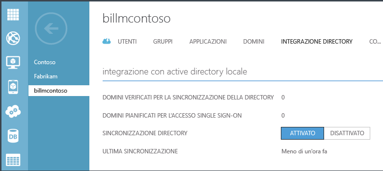

<properties 
	pageTitle="Integrazione delle identità locali con Azure Active Directory." 
	description="Articolo relativo ad Azure AD Connect che ne descrive le funzionalità e spiega perché è consigliabile usarlo." 
	services="active-directory" 
	documentationCenter="" 
	authors="billmath" 
	manager="swadhwa" 
	editor="curtand"/>

<tags 
	ms.service="active-directory" 
	ms.workload="identity" 
	ms.tgt_pltfrm="na" 
	ms.devlang="na" 
	ms.topic="article" 
	ms.date="07/13/2015" 
	ms.author="billmath"/>

# Integrazione delle identità locali con Azure Active Directory

Oggi gli utenti vogliono poter accedere alle applicazioni sia in locale che nel cloud. Desiderano poterlo fare da qualsiasi dispositivo, ad esempio un portatile uno smartphone o un tablet. A questo scopo, è necessario che l'amministratore e l'organizzazione mettano a disposizione degli utenti un modo per accedere a queste app, ma il passaggio totale al cloud non è sempre un'opzione praticabile.

Con l'introduzione di Azure Active Directory Connect, fornire l'accesso a queste app e passare al cloud non sono mai state operazioni così facili. Azure AD Connect offre i vantaggi seguenti:

- Gli utenti possono accedere con un'identità comune sia nel cloud che in locale. Non devono ricordare più password o account e gli amministratori non si devono preoccupare del sovraccarico aggiuntivo che più account possono introdurre.
- Un singolo strumento che offre un'esperienza guidata per la connessione delle directory locali ad Azure Active Directory. Dopo l'installazione, la procedura guidata distribuisce e configura tutti i componenti necessari per l'integrazione delle directory, tra cui i servizi di sincronizzazione, la sincronizzazione delle password o di ADFS e i prerequisiti tra cui il modulo Azure AD PowerShell.

## Perché usare Azure AD Connect 

L'integrazione delle directory locali con Azure AD rende gli utenti più produttivi, in quanto fornisce un'identità comune per accedere alle risorse cloud e locali. Con questa integrazione utenti e organizzazioni possono sfruttare i vantaggi seguenti:
	
* Le organizzazioni possono fornire agli utenti un'identità ibrida comune per i servizi locali e basati sul cloud sfruttando Windows Server Active Directory per connettersi quindi ad Azure Active Directory. 
* Gli amministratori possono fornire l'accesso condizionale in base alla risorsa dell'applicazione, al dispositivo e all'identità utente, al percorso di rete e all'autenticazione a più fattori.
* Gli utenti possono fruttare la propria identità comune degli account in Azure AD per Office 365, Intune, app SaaS e applicazioni di terze parti.  
* Gli sviluppatori possono compilare applicazioni che sfruttano il modello di identità comune, integrando le applicazioni in Active Directory locale o in Azure per le applicazioni basate sul cloud.

Azure AD Connect facilita l'integrazione e semplifica la gestione dell'infrastruttura di identità in locale e nel cloud.

----------------------------------------------------------------------------------------------------------
## Scaricare Azure AD Connect

Per iniziare a usare Azure AD Connect, è possibile scaricare la versione più recente dalla pagina di [download di Azure AD Connect ](http://go.microsoft.com/fwlink/?LinkId=615771).

----------------------------------------------------------------------------------------------------------

## Funzionamento di Azure AD Connect

Azure Active Directory Connect è costituito da tre parti principali, ovvero i servizi di sincronizzazione, il componente facoltativo Active Directory Federation Services e il componente di monitoraggio eseguito tramite [Azure AD Connect Health](https://msdn.microsoft.com/library/azure/dn906722.aspx).

 

- Sincronizzazione: questa parte è costituita dai componenti e le funzionalità resi disponibili in precedenza come DirSync e AAD Sync. Si tratta della parte responsabile della creazione di utenti e gruppi. Questa parte garantisce anche che le informazioni su utenti e gruppi nell'ambiente locale corrispondano a quelle nel cloud.
- ADFS: questa è una parte facoltativa di Azure AD Connect e può essere usata per configurare un ambiente ibrido mediante un'infrastruttura ADFS locale. Può essere usata dalle organizzazioni per gestire distribuzioni complesse che includono, ad esempio, accesso SSO di aggiunta al dominio, applicazione di criteri di accesso di Active Directory e autenticazione a più fattori con smart card o di terze parti. Per altre informazioni sulla configurazione di SSO, vedere [DirSync con Single-Sign On](https://msdn.microsoft.com/library/azure/dn441213.aspx).
- Monitoraggio dell'integrità: per le distribuzioni complesse che usano ADFS, Azure AD Connect Health può offrire monitoraggio affidabile dei server federativi e una posizione centralizzata nel portale di Azure per visualizzare questa attività. Per altre informazioni, vedere [Azure Active Directory Connect Health](https://msdn.microsoft.com/library/azure/dn906722.aspx).

### Componenti di supporto di Azure AD Connect

Di seguito è riportato un elenco di prerequisiti e componenti di supporto che verranno installati da Azure AD Connect nel server su cui è stato impostato Azure AD Connect. L'elenco riguarda un'istallazione di SQL Express di base. Se si sceglie di usare una versione diversa di SQL Server nella pagina Installazione dei servizi di sincronizzazione, i componenti di SQL Server 2012 elencati di seguito non verranno installati.

- Connettore Azure AD di Azure AD Connect
- Utilità della riga di comando di Microsoft SQL Server 2012
- Client nativo di Microsoft SQL Server 2012
- Microsoft SQL Server 2012 Express LocalDB
- Modulo di Azure Active Directory per Windows PowerShell
- Assistente per l'accesso a Microsoft Online Services per professionisti IT
- Microsoft Visual C++ 2013 Redistribution Package

## Introduzione ad Azure AD Connect

La documentazione seguente contiene le informazioni necessarie per iniziare a usare Azure Active Directory Connect. In questa documentazione viene illustrato l'uso dell'installazione rapida di Azure AD Connect. Per informazioni su un'installazione personalizzata vedere [Installazione personalizzata di Azure AD Connect](active-directory-aadconnect-get-started-custom.md). Per informazioni sull'aggiornamento da DirSync ad Azure AD Connect, vedere [Aggiornamento da DirSync ad Azure Active Directory Connect.](active-directory-aadconnect-dirsync-upgrade-get-started.md)

### Prima di installare Azure AD Connect
Prima di installare Azure AD Connect con Impostazioni rapide, sono necessari alcuni elementi.

 
- Sottoscrizione di Azure o [sottoscrizione di una versione di valutazione di Azure](http://azure.microsoft.com/pricing/free-trial/). È necessaria solo per l'accesso al portale di Azure, non per l'uso di Azure AD Connect. Se si usa PowerShell o Office 365 non è necessaria una sottoscrizione di Azure per usare Azure AD Connect.
- Un account amministratore globale di Azure AD per il tenant di Azure AD con cui si vuole eseguire l'integrazione
- Azure AD Connect deve essere installato in Windows Server 2008 o versione successiva. Questo server può essere un controller di dominio o un server membro.
- Il livello della foresta e della versione dello schema di Active Directory deve essere Windows Server 2003 o versione successiva. I controller di dominio possono eseguire qualsiasi versione, purché siano soddisfatti i requisiti del livello dello schema e della foresta.
- Se viene distribuito Active Directory Federation Services, i server in cui verrà installato ADFS devono essere Windows Server 2012 o versione successiva.
- Un account amministratore dell'organizzazione per Active Directory locale
- Facoltativo: un account utente di prova per verificare la sincronizzazione. 

#### Requisiti hardware per Azure AD Connect
Nella tabella seguente vengono indicati i requisiti minimi per il computer Azure AD Connect.

| Numero di oggetti in Active Directory | CPU | Memoria | Dimensioni del disco rigido |
| ------------------------------------- | --- | ------ | --------------- |
| Meno di 10.000 | 1,6 GHz | 4 GB | 70 GB |
| 10\.000-50.000 | 1,6 GHz | 4 GB | 70 GB |
| 50\.000-100.000 | 1,6 GHz | 16 GB | 100 GB |
| Per 100.000 o più oggetti, è necessaria la versione completa di SQL Server| | | |
| 100\.000-300.000 | 1,6 GHz | 32 GB | 300 GB |
| 300\.000-600.000 | 1,6 GHz | 32 GB | 450 GB |
| Più di 600.000 | 1,6 GHz | 32 GB | 500 GB |

Per le opzioni personalizzate, ad esempio più foreste o l'accesso federato, sono disponibili informazioni su requisiti aggiuntivi [qui.](active-directory-aadconnect-get-started-custom.md)

### Installazione rapida di Azure AD Connect
La selezione di Impostazioni rapide rappresenta l'opzione predefinita ed è uno degli scenari più comuni. In questo caso, Azure AD Connect distribuisce la sincronizzazione con l'opzione di sincronizzazione degli hash delle password. Questo scenario è possibile solo per una singola foresta e permette agli utenti di usare la propria password locale per accedere al cloud. Se si usa Impostazioni rapide, viene automaticamente avviata una sincronizzazione al termine dell'installazione (anche se è possibile scegliere di non avviarla). Questa opzione richiede solo pochi clic per estendere la directory locale nel cloud.

#### Per installare Azure AD Connect utilizzando le impostazioni di rapide
--------------------------------------------------------------------------------------------

1. Accedere al server in cui si vuole installare Azure AD Connect come amministratore dell'organizzazione. Deve essere il server da impostare come server di sincronizzazione.
2. Selezionare e fare doppio clic su AzureADConnect.msi.
3. Nella schermata iniziale, selezionare la casella che consente di accettare le condizioni di licenza e fare clic su **Continua**.
4. Nella schermata Impostazioni rapide fare clic su **Usa impostazioni rapide**.

6. Nella schermata Connessione ad Azure AD immettere il nome utente e password di un amministratore globale di Azure per Azure AD. Fare clic su **Next**.
8. Nella schermata Connessione a Servizi di dominio di Active Directory immettere il nome utente e la password di un account amministratore dell'organizzazione. Fare clic su **Next**.

9. Nella schermata Pronto per la configurazione fare clic su **Installa**.
	- Nella pagina Pronto per la configurazione lasciare deselezionata l'opzione "\*\*Avviare il processo di sincronizzazione non appena viene completata la configurazione iniziale\*\*". In tal caso, la procedura guidata configurerà la sincronizzazione ma lascerà disabilitata l'attività in modo che non venga eseguita fino a quando non la si abilita manualmente nell'Utilità di pianificazione. Dopo avere abilitato l'attività, la sincronizzazione verrà eseguita ogni tre ore.
	- È anche possibile scegliere di configurare i servizi di sincronizzazione per **Distribuzione ibrida di Exchange** selezionando la casella di controllo corrispondente. Se non si prevede di avere cassette postali di Exchange nel cloud e in locale, non è necessario selezionare questa opzione.

8. Al termine dell'installazione, fare clic su **Esci**.

   

Per un video sull'uso dell'Installazione rapida, vedere:

[AZURE.VIDEO azure-active-directory-connect-express-settings]

### Verifica dell'installazione

Dopo avere installato Azure AD Connect, è possibile verificare se la sincronizzazione viene eseguita. A questo scopo accedere al portale di Azure e verificare l'ora dell'ultima sincronizzazione.

1.  Accedere al portale di Azure.
2.  A sinistra, selezionare Active Directory.
3.  Fare doppio clic sulla directory appena usata per configurare Azure AD Connect.
4.  Nella parte superiore, selezionare Integrazione directory. Prendere nota dell'ora dell'ultima sincronizzazione.

## Gestione di Azure AD Connect 

Di seguito sono riportati argomenti operativi avanzati che permettono di personalizzare Azure Active Directory Connect per soddisfare le esigenze e i requisiti dell'organizzazione.

### Assegnazione delle licenze agli utenti di Azure AD Premium ed Enterprise Mobility

Dopo avere sincronizzato gli utenti nel cloud, occorre assegnare loro una licenza in modo che possano usare le app cloud come Office 365.

#### Per assegnare una licenza Azure AD Premium o Enterprise Mobility Suite
--------------------------------------------------------------------------------
1. Accesso al portale di Azure come amministratore.
2. A sinistra, selezionare **Active Directory**.
3. Nella pagina Active Directory fare doppio clic sulla directory con gli utenti da abilitare.
4. Nella parte superiore della pagina della directory selezionare **Licenze**.
5. Nella pagina Licenze selezionare Active Directory Premium o Enterprise Mobility Suite, quindi fare clic su **Assegna**.
6. Nella finestra di dialogo selezionare gli utenti a cui assegnare le licenze, quindi fare clic sull'icona con il segno di spunta per salvare le modifiche.

### Verificare l'attività di sincronizzazione pianificata
Per controllare lo stato di una sincronizzazione, è possibile accedere al portale di Azure.

#### Per verificare l'attività di sincronizzazione pianificata
--------------------------------------------------------------------------------

1. Accesso al portale di Azure come amministratore.
2. A sinistra, selezionare **Active Directory**.
3. Nella pagina Active Directory fare doppio clic sulla directory con gli utenti da abilitare.
4. Nella parte superiore della pagina della directory selezionare **Integrazione directory**.
5. Nella sezione relativa all'integrazione con Active Directory locale prendere nota dell'ora dell'ultima sincronizzazione.

### Avvio di un'attività di sincronizzazione pianificata
Se è necessario eseguire un'attività di sincronizzazione, è possibile eseguire nuovamente la procedura guidata di Azure AD Connect. È necessario fornire le credenziali di Azure AD. Nella procedura guidata selezionare l'attività **Personalizzazione delle opzioni di sincronizzazione** e fare clic su Avanti nella procedura guidata. Al termine, verificare che la casella **Avviare il processo di sincronizzazione non appena viene completata la configurazione iniziale** sia selezionata.

### Attività aggiuntive disponibili in Azure AD Connect
Dopo l'installazione iniziale di Azure AD Connect è sempre possibile riavviare la procedura guidata dalla pagina iniziale di Azure AD Connect o dal collegamento sul dekstop. Si noterà che la riesecuzione della procedura guidata fornisce alcune nuove opzioni sotto forma di Attività aggiuntive.

La tabella seguente include un riepilogo di tali attività e una breve descrizione di ognuna di esse.

 

Attività aggiuntive | Descrizione 
------------- | ------------- |
Visualizza lo scenario selezionato |Consente di visualizzare la soluzione di Connect di Azure AD corrente. Include impostazioni generali, directory sincronizzate, impostazioni di sincronizzazione e così via.
Personalizzazione delle opzioni di sincronizzazione | Consente di modificare la configurazione corrente, inclusa l'aggiunta di altre foreste di Active Directory per la configurazione o l'attivazione di opzioni di sincronizzazione, ad esempio writeback di utenti, gruppi, dispositivi o password.
Abilitazione modalità di gestione temporanea | Consente di inserire in un'area di gestione temporanea le informazioni che saranno sincronizzate in un secondo momento, senza che avvenga l'esportazione in Azure AD o Active Directory. Consente di visualizzare in anteprima le sincronizzazioni prima che si verifichino.

 
### Documentazione aggiuntiva
Per altra documentazione sull'uso di Azure AD Connect vedere gli articoli seguenti:

- [Modifica della configurazione predefinita di Azure AD Connect](active-directory-aadconnect-whats-next-change-default-config.md)
- [Uso dell'Editor regole di sincronizzazione di Azure AD Connect](active-directory-aadconnect-whats-next-synch-rules-editor.md)
- [Uso del provisioning dichiarativo](active-directory-aadconnect-whats-next-declarative-prov.md)

Parte della documentazione creata per Azure AD Sync è comunque pertinente e si applica anche ad Azure AD Connect. Benché grande sia l'impegno per aggiungere questa documentazione in Azure.com, una sua parte si trova ancora nella sezione specifica di MSDN Library. Per altra documentazione, vedere [Azure AD Connect in MSDN](https://msdn.microsoft.com/library/azure/dn832695.aspx) e [Azure AD Sync in MSDN](https://msdn.microsoft.com/library/azure/dn790204.aspx).

**Risorse aggiuntive**

Presentazione Ignite 2015 su come estendere le directory locali nel cloud.

[AZURE.VIDEO microsoft-ignite-2015-extending-on-premises-directories-to-the-cloud-made-easy-with-azure-active-directory-connect]

[Sincronizzazione della directory a più foreste con Single Sign-On](https://msdn.microsoft.com/library/azure/dn510976.aspx): informazioni sull'integrazione di più directory con Azure AD.

[Azure AD Connect Health](active-directory-aadconnect-health.md): informazioni sul monitoraggio dell'integrità dell'infrastruttura ADFS locale.

[Domande frequenti su Azure D Connect](active-directory-aadconnect-faq.md) - Domande frequenti relative ad Azure AD Connect.

 

<!---HONumber=July15_HO5-->