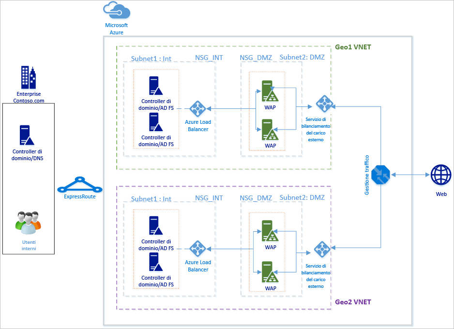
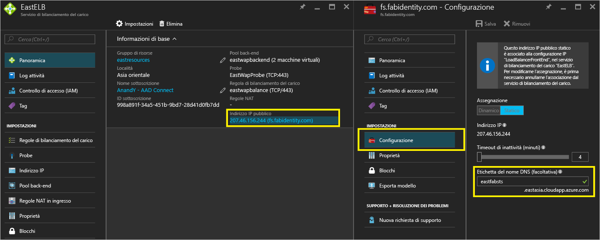
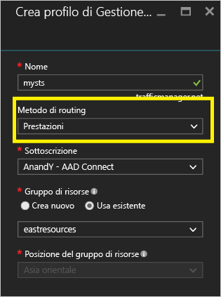
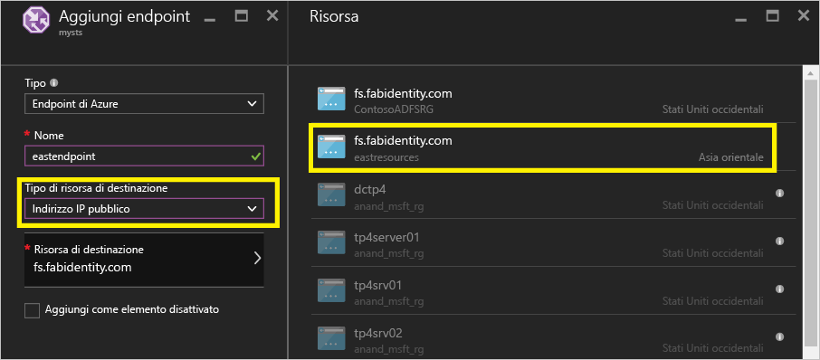
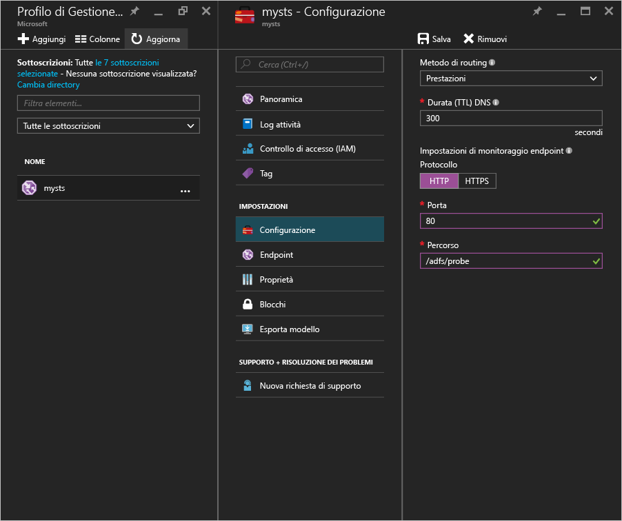
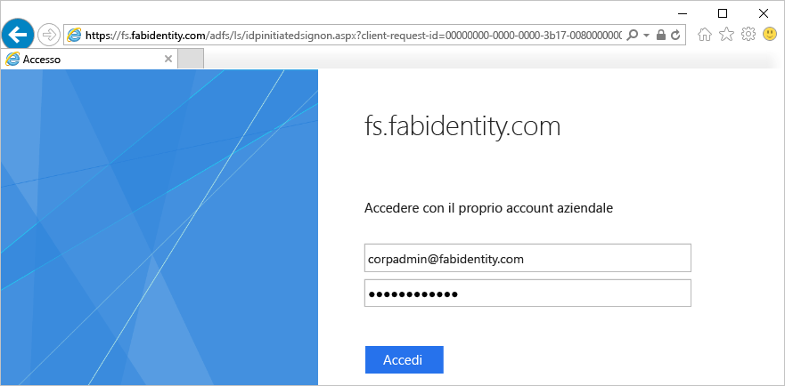
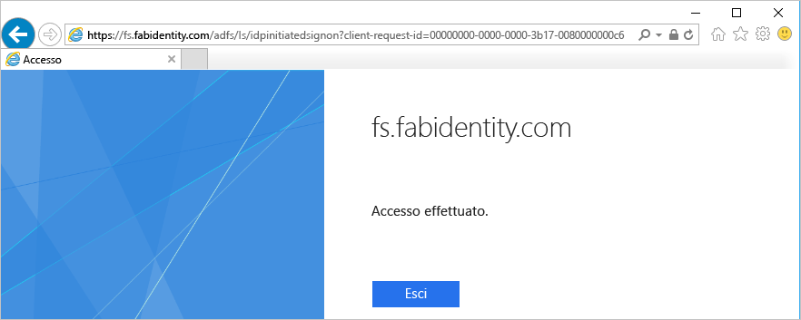

# Distribuzione di AD FS a disponibilità elevata tra aree geografiche in Azure con Gestione traffico di Azure
[Distribuzione di AD FS in Azure](active-directory-aadconnect-azure-adfs.md) offre istruzioni dettagliate sulla distribuzione di una semplice infrastruttura AD FS per l'organizzazione in Azure. Questo articolo illustra i passaggi successivi per creare una distribuzione di AD FS tra aree geografiche in Azure usando [Gestione traffico di Azure](../traffic-manager/traffic-manager-overview.md). Gestione traffico di Azure consente di creare per l'organizzazione un'infrastruttura AD FS geograficamente distribuita e a disponibilità e prestazioni elevate tramite una serie di metodi di routing messi a disposizione per soddisfare diverse esigenze.

Un'infrastruttura AD FS tra aree geografiche a disponibilità elevata offre i vantaggi seguenti:

* **Eliminazione del singolo punto di errore:** con le funzionalità di failover di Gestione traffico di Azure è possibile avere un'infrastruttura AD FS a disponibilità elevata anche in caso di arresto di uno dei data center in una parte qualsiasi del mondo
* **Prestazioni migliorate:** è possibile usare la distribuzione descritta in questo articolo per offrire un'infrastruttura AD FS a prestazioni elevate che consenta agli utenti di eseguire l'autenticazione più velocemente. 

## Principi di progettazione

I principi di progettazione di base sono uguali a quelli elencati nella sezione Principi di progettazione dell'articolo Distribuzione di AD FS in Azure. Il diagramma precedente illustra una semplice estensione della distribuzione di base a un'altra area geografica. Di seguito sono riportati alcuni aspetti da considerare quando si estende la distribuzione a una nuova area geografica

* **Rete virtuale:** è necessario creare una nuova rete virtuale nell'area geografica in cui si vuole distribuire un'infrastruttura AD FS aggiuntiva. Nel diagramma precedente, Geo1 VNET e Geo2 VNET sono le due reti virtuali in ogni area geografica.
* **Controller di dominio e server AD FS nella nuova rete virtuale geografica:** è consigliabile distribuire controller di dominio nella nuova area geografica in modo che i server AD FS della nuova area non debbano contattare un controller di dominio in un'altra rete distante per completare l'autenticazione, migliorando così le prestazioni.
* **Account di archiviazione:** gli account di archiviazione sono associati a un'area. Poiché verranno distribuite macchine nella nuova area geografica, sarà necessario creare nuovi account di archiviazione da usare nell'area.  
* **Gruppi di sicurezza di rete:** come gli account di archiviazione, i gruppi di sicurezza di rete creati in un'area non possono essere usati in un'altra area geografica. Sarà quindi necessario creare nuovi gruppi di sicurezza di rete simili a quelli della prima area geografica per le subnet INT e DMZ nella nuova area geografica.
* **Etichette DNS per indirizzi IP pubblici:** Gestione traffico di Azure può fare riferimento agli endpoint SOLO tramite etichette DNS. È quindi necessario creare etichette DNS per gli indirizzi IP pubblici dei servizi di bilanciamento del carico esterni.
* **Gestione traffico di Azure:** Gestione traffico di Microsoft Azure consente di controllare la distribuzione del traffico degli utenti agli endpoint di servizio in esecuzione in diversi data center in tutto il mondo. Gestione traffico di Azure funziona a livello di DNS. Usa le risposte DNS per indirizzare il traffico degli utenti finali agli endpoint distribuiti a livello globale. I client si connettono quindi direttamente a questi endpoint. Grazie alle diverse opzioni di routing Prestazioni, Ponderato e Priorità, la scelta dell'opzione di routing più adatta alle esigenze dell'organizzazione è un'operazione semplice. 
* **Connettività tra reti virtuali di due aree:** non è necessaria la connettività tra le reti virtuali in sé. Dato che ogni rete virtuale ha accesso ai controller di dominio e contiene un server AD FS e WAP, non è necessaria la connettività tra le reti virtuali di aree diverse. 

## Passaggi per l'integrazione di Gestione traffico di Azure
### Distribuire AD FS nella nuova area geografica
Seguire i passaggi e le istruzioni illustrati in [Distribuzione di AD FS in Azure](active-directory-aadconnect-azure-adfs.md) per distribuire la stessa topologia nella nuova area geografica.

### Etichette DNS per gli indirizzi IP pubblici di servizi di bilanciamento del carico con connessione Internet (pubblici)
Come indicato in precedenza, Gestione traffico di Azure può fare riferimento solo alle etichette DNS come endpoint ed è quindi importante creare le etichette DNS per gli indirizzi IP pubblici dei servizi di bilanciamento del carico esterni. Lo screenshot seguente illustra come configurare l'etichetta DNS per l'indirizzo IP pubblico. 

### Distribuzione di Gestione traffico di Azure
Seguire questa procedura per creare un profilo di Gestione traffico. Per altre informazioni è anche possibile vedere [Gestire un profilo di Gestione traffico di Azure](../traffic-manager/traffic-manager-manage-profiles.md).

1. **Creare un profilo di Gestione traffico:** assegnare un nome univoco al profilo di Gestione traffico. Il nome del profilo fa parte del nome DNS e funge da prefisso per l'etichetta del nome di dominio di Gestione traffico. Il nome/prefisso viene aggiunto a .trafficmanager.net per creare un'etichetta DNS per Gestione traffico. Lo screenshot seguente indica il prefisso DNS di Gestione traffico impostato come mysts. L'etichetta DNS sarà quindi mysts.trafficmanager.net. 
   
    
2. **Metodo di routing del traffico:** in Gestione traffico sono disponibili tre opzioni di routing del traffico:
   
   * Priorità 
   * Prestazioni
   * Ponderato
     
     **Prestazioni** è l'opzione consigliata per ottenere un'infrastruttura AD FS altamente reattiva. È tuttavia possibile scegliere il metodo di routing più adatto alle proprie esigenze di distribuzione. L'opzione di routing selezionata non influenza la funzionalità di AD FS. Per altre informazioni, vedere [Metodi di routing del traffico di Gestione traffico](../traffic-manager/traffic-manager-routing-methods.md) . Nell'esempio di screenshot precedente è visibile il metodo **Prestazioni** selezionato.
3. **Configurare gli endpoint:** nella pagina di Gestione traffico, fare clic sugli endpoint e selezionare Aggiungi. Verrà aperta una pagina Aggiungi endpoint simile allo screenshot seguente
   
   
   
   Seguire queste linee guida per i diversi input:
   
   **Tipo:** selezionare Endpoint Azure perché la destinazione è un indirizzo IP pubblico di Azure.
   
   **Nome:** specificare un nome da associare all'endpoint. Non si tratta del nome DNS e non ha alcun effetto sui record DNS.
   
   **Tipo di risorsa di destinazione:** selezionare Indirizzo IP pubblico come valore di questa proprietà. 
   
   **Risorsa di destinazione:** è possibile scegliere tra le varie etichette DNS disponibili nella sottoscrizione. Scegliere l'etichetta DNS.
   
   Aggiungere l'endpoint per ogni area geografica cui Gestione traffico di Azure dovrà instradare il traffico.
   Per altre informazioni e procedure dettagliate sull'aggiunta e la configurazione di endpoint in Gestione traffico, vedere [Aggiungere, disabilitare, abilitare o eliminare gli endpoint](../traffic-manager/traffic-manager-endpoints.md)
4. **Configurare il probe:** nella pagina di Gestione traffico fare clic su Configurazione. Nella pagina di configurazione è necessario modificare le impostazioni di monitoraggio per il probe sulla porta HTTP 80 e il percorso relativo /adfs/probe
   
     
   
   > [!NOTE]
   > **Assicurarsi che lo stato degli endpoint sia ONLINE dopo aver completato la configurazione**. Se tutti gli endpoint sono in stato 'Danneggiato', Gestione traffico di Azure proverà a instradare il traffico supponendo che i dati di diagnostica non siano corretti e che tutti gli endpoint siano raggiungibili.
   > 
   > 
5. **Modifica di record DNS per Gestione di traffico di Azure:** il servizio federativo deve essere un CNAME per il nome DNS di Gestione traffico di Azure. Creare un CNAME nei record DNS pubblici in modo che chiunque provi a raggiungere il servizio federativo raggiunga in realtà Gestione traffico di Azure.
   
    Ad esempio, per far sì che il servizio federativo fs.fabidentity.com punti a Gestione traffico sarà necessario aggiornare il record di risorsa DNS nel modo seguente:
   
    <code>fs.fabidentity.com IN CNAME mysts.trafficmanager.net</code>

## Testare il routing e l'accesso ad AD FS
### Test di routing
Un test molto semplice per il routing consiste nel provare a effettuare il ping del nome DNS del servizio federativo da un computer in ogni area geografica. A seconda del metodo di routing scelto, l'endpoint effettivamente raggiunto dal ping verrà indicato nella visualizzazione del ping. Se ad esempio si seleziona il routing Prestazioni, verrà raggiunto l'endpoint più vicino all'area del client. Di seguito è riportato lo snapshot di due ping da due computer client di aree diverse, uno in Asia orientale e l'altro negli Stati Uniti occidentali. 

### Test dell'accesso ad AD FS
Il modo più semplice per testare AD FS consiste nell'usare la pagina IdpInitiatedSignon.aspx. A tale scopo, è necessario abilitare IdpInitiatedSignOn nelle proprietà di AD FS. Per verificare l'installazione di AD FS, seguire questa procedura.

1. Eseguire con PowerShell il cmdlet di seguito nel server AD FS per impostare l'abilitazione: 
   Set-AdfsProperties -EnableIdPInitiatedSignonPage $true
2. Da qualsiasi computer esterno accedere a https://<yourfederationservicedns>/adfs/ls/IdpInitiatedSignon.aspx
3. La pagina di AD FS dovrebbe essere visualizzata come segue:
   
    
   
    Dopo l'accesso verrà visualizzato un messaggio di completamento dell'operazione come il seguente:
   
    

## Collegamenti correlati
* [Distribuzione di AD FS in Azure](active-directory-aadconnect-azure-adfs.md)
* [Gestione traffico di Azure](../traffic-manager/traffic-manager-overview.md)
* [Metodi di routing di Gestione traffico+](../traffic-manager/traffic-manager-routing-methods.md)

## Passaggi successivi
* [Gestire un profilo di Gestione traffico di Azure](../traffic-manager/traffic-manager-manage-profiles.md)
* [Aggiungere, disabilitare, abilitare o eliminare gli endpoint](../traffic-manager/traffic-manager-endpoints.md) 

<!--HONumber=Nov16_HO2-->

