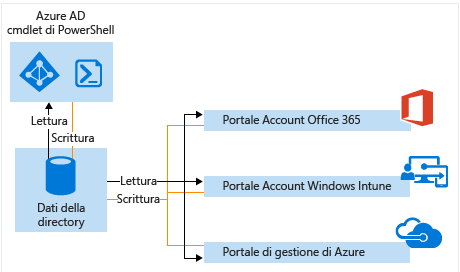

# Gestire la directory di Azure AD

## Che cos'è un tenant di Azure AD?
In Azure Active Directory (Azure AD), un tenant è un'istanza dedicata di Azure Active Directory che l'organizzazione riceve quando effettua l'iscrizione a un servizio cloud Microsoft, ad esempio Azure oppure Office 365. Ogni directory di Azure AD è distinta e separata dalle altre directory di Azure AD. Proprio come un edificio di uffici è un asset sicuro specifico solo dell'organizzazione che vi ha sede, anche una directory di Azure AD è stata progettata per essere un asset sicuro usato solo dall'organizzazione proprietaria. L'architettura di Azure AD isola le informazioni relative all'identità e i dati dei clienti in modo che gli utenti e gli amministratori di una directory di Azure AD non possano accedere intenzionalmente o accidentalmente ai dati presenti in un'altra directory.

## Come è possibile ottenere una directory di Azure AD?
Azure AD fornisce le principali funzionalità di gestione delle identità e di directory alla base della maggior parte dei servizi cloud Microsoft, tra cui:

* Azure
* Microsoft Office 365
* Microsoft Dynamics CRM Online
* Microsoft Intune

Quando si effettua l'iscrizione a uno di questi servizi cloud Microsoft, si ottiene una directory di Azure AD. È possibile creare altre directory, se necessario. Ad esempio, è possibile usare la prima directory come directory di produzione e quindi crearne un'altra per le attività di testing o di gestione temporanea.

### Uso della directory di Azure AD associata una nuova sottoscrizione di Azure

Quando si effettua l'iscrizione ad altri servizi Microsoft è consigliabile usare l'account amministratore usato per il primo servizio. Le informazioni specificate durante la prima iscrizione a un servizio Microsoft vengono usate per creare una nuova istanza di directory di Azure AD per l'organizzazione. Se si usa tale directory per autenticare i tentativi di accesso quando si effettua la sottoscrizione ad altri servizi Microsoft, questi possono usare l'integrazione di directory locali, le impostazioni, gli account utente e i criteri esistenti che si configurano nella directory predefinita.

Se ad esempio si effettua l'iscrizione per ottenere una sottoscrizione di Microsoft Intune e quindi si sincronizza anche l'istanza locale di Active Directory con la directory di Azure AD, è possibile iscriversi a un altro servizio Microsoft come Office 365 usufruendo facilmente degli stessi vantaggi dell'integrazione di directory disponibili con Microsoft Intune.

Per altre informazioni sull'integrazione della directory locale con Azure AD, vedere l'articolo relativo all'[integrazione di directory con Azure AD Connect](active-directory-aadconnect.md).

### Associare una directory di Azure AD esistente a una nuova sottoscrizione di Azure
È possibile associare una nuova sottoscrizione di Azure alla stessa directory che autentica l'accesso per una sottoscrizione esistente di Office 365 o Microsoft Intune. Per altre informazioni su tale scenario, vedere [Trasferimento della proprietà di una sottoscrizione di Azure a un altro account](../billing/billing-subscription-transfer.md).

### Creare una directory di Azure AD effettuando l'iscrizione a un servizio cloud Microsoft come organizzazione
Se non si ha ancora una sottoscrizione a un servizio cloud Microsoft, è possibile usare uno dei collegamenti seguenti per iscriversi. Con l'iscrizione al primo servizio verrà creata automaticamente una directory di Azure AD.

* [Microsoft Azure](https://account.azure.com/organization)
* [Office 365](http://products.office.com/business/compare-office-365-for-business-plans/)
* [Microsoft Intune](https://portal.office.com/Signup/Signup.aspx?OfferId=40BE278A-DFD1-470a-9EF7-9F2596EA7FF9&dl=INTUNE_A&ali=1#0%20)

### Come modificare la directory predefinita per una sottoscrizione

1. Accedere al [Centro account di Azure](https://account.azure.com/Subscriptions) con un account amministratore della sottoscrizione per trasferirne la proprietà.
2. Assicurarsi che l'utente che si vuole impostare come proprietario della sottoscrizione sia incluso nella directory di destinazione.
3. Fare clic su **Trasferisci sottoscrizione**.
4. Specificare il destinatario. Il destinatario riceve automaticamente un messaggio e-mail con un link per l'accettazione.
5. Il destinatario deve fare clic sul link e seguire le istruzioni, inclusa l'immissione delle informazioni sul pagamento. Quando il destinatario ha esito positivo, la sottoscrizione viene trasferita. 
6. In caso di esito positivo del trasferimento di proprietà, la directory predefinita della sottoscrizione viene modificata alla directory in cui si trova l'utente.

Per altre informazioni, vedere [Trasferimento della proprietà di una sottoscrizione di Azure a un altro account](../billing/billing-subscription-transfer.md)

### Gestire la directory predefinita in Azure
Quando si effettua l'iscrizione ad Azure, alla sottoscrizione viene associata una directory di Azure AD predefinita. L'uso di Azure AD non comporta alcun costo e le directory sono una risorsa gratuita. Sono disponibili servizi di Azure AD a pagamento, concessi in licenza separatamente, che offrono funzionalità aggiuntive come le informazioni personalizzate distintive dell'azienda all'accesso e la reimpostazione password self-service. È anche possibile creare un dominio personalizzato usando un nome DNS di cui si è proprietari invece del dominio *.onmicrosoft.com predefinito.

## Come gestire i dati della directory
Per amministrare una o più sottoscrizioni di servizi cloud Microsoft, è possibile usare l'[interfaccia di amministrazione di Azure AD](https://aad.portal.azure.com), il portale per gli account di Microsoft Intune o l'[interfaccia di amministrazione di Office 365](https://portal.office.com/) per gestire i dati della directory dell'organizzazione. È anche possibile usare i [cmdlet di Azure Active Directory PowerShell](https://docs.microsoft.com/powershell/azure/active-directory) per gestire i dati archiviati in Azure AD.

Da uno qualsiasi di questi portali o cmdlet è possibile:

* Creare e gestire account di gruppi e utenti
* Gestire i servizi cloud correlati per le sottoscrizioni dell'organizzazione
* Configurare l'integrazione locale con i servizi di autenticazione e di gestione delle identità di Azure AD

L'interfaccia di amministrazione di Azure AD, l'interfaccia di amministrazione di Office 365, il portale per gli account di Microsoft Intune e i cmdlet di Azure AD eseguono tutti la lettura e la scrittura in una singola istanza condivisa di Azure AD associata alla directory dell'organizzazione. Ognuno di questi strumenti funge da interfaccia front-end che esegue il pull o la modifica dei dati della directory.

Quando si modificano i dati dell'organizzazione con uno qualsiasi dei portali o dei cmdlet dopo aver eseguito l'accesso nel contesto di uno di questi servizi, le modifiche verranno visualizzate anche negli altri portali all'accesso successivo. Questi dati vengono condivisi tra i servizi cloud Microsoft a cui si effettua la sottoscrizione.

Se ad esempio si usa l'interfaccia di amministrazione di Office 365 per impedire a un utente di eseguire l'accesso, tale azione impedirà l'accesso dell'utente a qualsiasi altro servizio attualmente sottoscritto dall'organizzazione. Se si visualizza lo stesso account utente nel portale per gli account di Microsoft Intune, l'utente risulterà bloccato.

## Come è possibile aggiungere e gestire più directory?
È possibile [aggiungere una directory di Azure AD nel portale di Azure AD](https://portal.azure.com/#create/Microsoft.AzureActiveDirectory). Inserire le informazioni e selezionare **Crea**.

È possibile gestire ogni directory come una risorsa completamente indipendente. Ogni directory è infatti un peer con funzionalità complete, indipendente dal punto di vista logico dalle altre directory gestite. Non esiste alcuna relazione padre-figlio tra le directory. Questa indipendenza tra le directory include l'indipendenza delle risorse, l'indipendenza amministrativa e l'indipendenza della sincronizzazione.

* **Indipendenza delle risorse**. Se si crea o si elimina una risorsa in una directory, ciò non influisce sulle risorse presenti in un'altra directory, con la parziale eccezione degli utenti esterni. Se si usa un dominio personalizzato "contoso.com" con una directory, non è possibile usarlo con altre directory.
* **Indipendenza amministrativa**.  Se un utente non amministratore della directory "Contoso" crea una directory di test denominata "Test":
  
  * Gli amministratori della directory "Contoso" non hanno privilegi amministrativi diretti per la directory "Test" se tali privilegi non vengono loro concessi specificamente da un amministratore di "Test". Gli amministratori di "Contoso" possono controllare l'accesso alla directory "Test" in virtù del proprio controllo sull'account utente che ha creato "Test".
    
  * Se si assegna o si rimuove un ruolo di amministratore per un utente in una directory, la modifica non influisce sul ruolo di amministratore che l'utente potrebbe avere in un'altra directory.
* **Indipendenza della sincronizzazione**. È possibile configurare ogni tenant di Azure AD in modo indipendente per ottenere la sincronizzazione dei dati da una singola istanza con lo strumento di sincronizzazione directory Azure AD Connect.

A differenza di altre risorse di Azure, le proprie directory non sono risorse figlio di una sottoscrizione di Azure. Se pertanto si annulla o si lascia scadere la propria sottoscrizione di Azure, sarà comunque possibile accedere ai dati delle directory mediante Azure AD PowerShell, l'API Graph di Azure o altre interfacce come l'interfaccia di amministrazione di Office 365. È anche possibile associare un'altra sottoscrizione alla directory.

## Come prepararsi a eliminare una directory di Azure AD
Un amministratore globale può eliminare una directory di Azure AD dal portale. Quando viene eliminata una directory, vengono eliminate anche tutte le risorse in essa contenute. Prima di eliminare la directory, verificare che non sia necessaria.

> [!NOTE]
> Se l'utente ha eseguito l'accesso con un account aziendale o dell'istituto di istruzione, non deve tentare di eliminarne la home directory. Ad esempio, se l'utente ha eseguito l'accesso come joe@contoso.onmicrosoft.com, non può eliminare la directory che ha contoso.onmicrosoft.com come dominio predefinito.

Azure AD richiede che vengano soddisfatte determinate condizioni per eliminare una directory. In questo modo riduce il rischio che l'eliminazione di una directory possa incidere negativamente sugli utenti o sulle applicazioni, ad esempio sulla possibilità per gli utenti di accedere a Office 365 o alle risorse in Azure. Se una directory di una sottoscrizione viene eliminata accidentalmente, ad esempio, gli utenti non potranno accedere alle risorse di Azure per tale sottoscrizione.

Viene verificato che siano soddisfatte le condizioni seguenti:

* L'unico utente presente nella directory deve essere l'amministratore globale che eliminerà la directory. Tutti gli altri utenti devono essere eliminati prima che possa essere eliminata la directory. Se gli utenti vengono sincronizzati dall'ambiente locale, è necessario disattivare la sincronizzazione ed eliminare gli utenti nella directory cloud con il portale di Azure o i cmdlet di Azure PowerShell. Non è necessario eliminare gruppi o contatti, ad esempio i contatti aggiunti dall'interfaccia di amministrazione di Office 365.
* La directory non può contenere applicazioni. Tutte le applicazioni devono essere eliminate prima che possa essere eliminata la directory.
* Alla directory non possono essere collegati provider di Multi-Factor Authentication.
* Alla directory non possono essere associate sottoscrizioni per i Microsoft Online Services, ad esempio Microsoft Azure, Office 365 o Azure AD Premium. Se, ad esempio, in Azure è stata creata una directory predefinita, non è possibile eliminare la directory se la propria sottoscrizione di Azure si basa ancora su di essa per l'autenticazione. Analogamente, non è possibile eliminare una directory se la sottoscrizione di un altro utente è associata a tale directory. 

## Passaggi successivi
* [Forum di Azure AD](https://social.msdn.microsoft.com/Forums/home?forum=WindowsAzureAD)
* [Forum di Azure Multi-Factor Authentication](https://social.msdn.microsoft.com/Forums/home?forum=windowsazureactiveauthentication)
* [Domande per Azure in Stack Overflow](http://stackoverflow.com/questions/tagged/azure)
* [Azure Active Directory PowerShell](https://docs.microsoft.com/powershell/azure/active-directory)
* [Assegnazione dei ruoli di amministratore in Azure AD](active-directory-assign-admin-roles.md)
