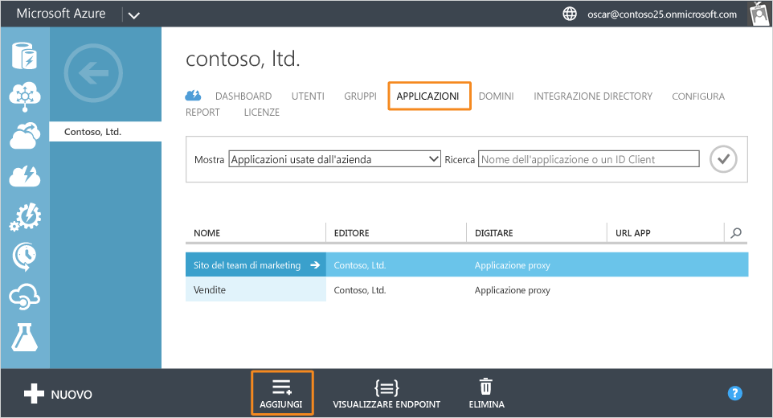
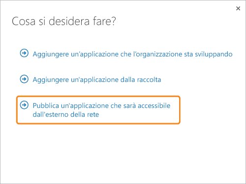
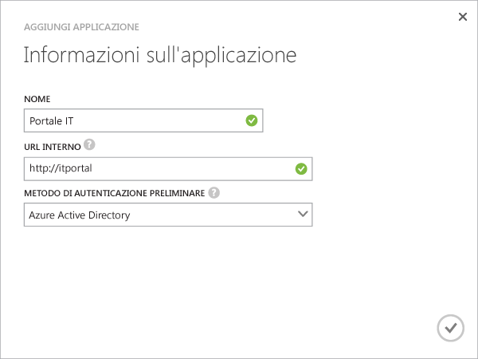
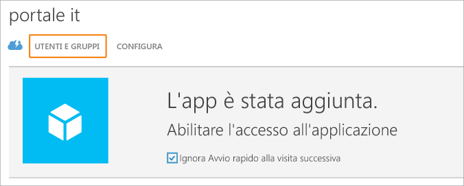
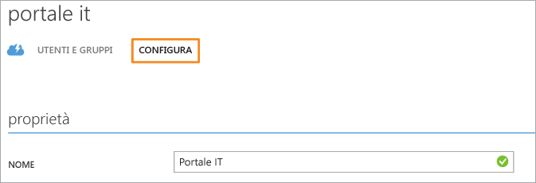

<properties
	pageTitle="Pubblicare app con il proxy di applicazione di Azure AD | Microsoft Azure"
	description="Pubblicare applicazioni locali nel cloud con il proxy di applicazione di Azure AD."
	services="active-directory"
	documentationCenter=""
	authors="kgremban"
	manager="stevenpo"
	editor=""/>

<tags
	ms.service="active-directory"
	ms.workload="identity"
	ms.tgt_pltfrm="na"
	ms.devlang="na"
	ms.topic="get-started-article"
	ms.date="06/01/2016"
	ms.author="kgremban"/>

# Pubblicare applicazioni mediante il proxy di applicazione AD Azure

Dopo aver abilitato il proxy di applicazione di Microsoft Azure Active Directory (AD), è possibile pubblicare le applicazioni locali in modo in modo da renderle accessibili a utenti remoti all'esterno della rete privata.

Questo articolo illustra i passaggi per pubblicare le applicazioni in esecuzione nella rete locale e fornire un accesso remoto sicuro dall'esterno della rete. Se non è stato configurato il proxy di applicazione o non sono stati installati connettori, prima di continuare seguire la procedura descritta in [Abilitare il proxy di applicazione nel portale di Azure](active-directory-application-proxy-enable.md).

Se si usa il proxy di applicazione di Azure AD per la prima volta, prima di pubblicare applicazioni è consigliabile testare il connettore pubblicando un sito Web dalla rete privata.

> [AZURE.NOTE] Il proxy di applicazione di Azure AD è una funzionalità disponibile solo se è stato eseguito l'aggiornamento all'edizione Premium o Basic di Azure Active Directory. Per altre informazioni, vedere [Edizioni di Azure Active Directory](active-directory-editions.md).

## Pubblicare un'applicazione utilizzando la procedura guidata

1. Accedere come amministratore al [portale di Azure classico](https://manage.windowsazure.com/).
2. Passare ad Active Directory e selezionare la directory in cui è stato abilitato il proxy di applicazione.

	

3. Fare clic sulla scheda **Applicazioni** e quindi sul pulsante **Aggiungi** nella parte inferiore della schermata.

	

4. Selezionare **Pubblica un'applicazione che sarà accessibile dall'esterno della rete**.

	

5. Specificare le informazioni relative all'applicazione elencate di seguito.

	- **Nome**: nome descrittivo dell'applicazione. Deve essere univoco all'interno della directory.
	- **URL interno**: indirizzo usato dal connettore proxy di applicazione per accedere all'applicazione dall'interno della rete privata. È possibile indicare un percorso specifico nel server back-end per la pubblicazione, mentre il resto del server non è pubblicato. In questo modo si possono pubblicare siti diversi nello stesso server assegnando a ognuno un nome e regole di accesso specifici.
	- **Metodo di autenticazione preliminare**: modo in cui il proxy di applicazione verificherà gli utenti prima di concedere loro l'accesso all'applicazione. Scegliere una delle opzioni nel menu a discesa.

		- Azure Active Directory: il proxy di applicazione reindirizzerà gli utenti in modo che eseguano l'accesso con Azure AD, che ne autentica le autorizzazioni per la directory e l'applicazione.
		- Passthrough: gli utenti non devono eseguire l'autenticazione per accedere all'applicazione.

	

6. Per completare la procedura guidata, fare clic sul segno di spunta nella parte inferiore della schermata. L'applicazione ora è definita in Azure AD.

## Assegnazione di utenti e gruppi all'applicazione

Per l'accesso degli utenti all'applicazione pubblicata, è necessario eseguirne l'assegnazione singolarmente o in gruppi. Per le app che richiedono l'autenticazione preliminare, in questo modo vengono concesse le autorizzazioni per usare l'app. Per le app che non richiedono l'autenticazione preliminare, gli utenti non necessitano di autorizzazioni ma devono comunque essere assegnati all'app in modo che venga visualizzata nel loro elenco applicazioni.

1. Al termine della procedura guidata Aggiungi app, verrà visualizzata la pagina Avvio rapido dell'applicazione. Per gestire gli utenti che avranno accesso all'app, selezionare **Utenti e gruppi**.

	

2. Cercare gruppi specifici nella propria directory oppure visualizzare tutti gli utenti. Fare clic sul segno di spunta per visualizzare i risultati.

  	

2. Selezionare ogni utente o gruppo che si desidera assegnare a questa app e fare clic su **Assegna**. Verrà richiesto di confermare l'azione.

> [AZURE.NOTE] Per le app con autenticazione integrata di Windows, è possibile assegnare solo utenti e gruppi sincronizzati da Active Directory locale. Non è possibile assegnare utenti che accedono con account Microsoft e guest per le app pubblicate con il proxy di applicazione di Azure Active Directory. Verificare che gli utenti accedano con credenziali che fanno parte dello stesso dominio dell'app che viene pubblicata.

## Configurazione avanzata

Nella pagina Configura è possibile modificare le app pubblicate o configurare opzioni avanzate. In questa pagina si può personalizzare l'app modificando il nome o caricando un logo. È anche possibile gestire regole di accesso come il metodo di autenticazione preliminare o l'autenticazione a più fattori.

Dopo la pubblicazione di applicazioni mediante il proxy dell’applicazione di Azure Active Directory, queste vengono visualizzate nell'elenco delle applicazioni in Azure AD ed è possibile gestirle.

Se si disabilitano i servizi proxy dell'applicazione dopo la pubblicazione delle applicazioni, queste non verranno eliminate, ma non saranno più accessibili dall'esterno della rete privata.

Per visualizzare un'applicazione e assicurarsi che sia accessibile, fare doppio clic sul nome dell'applicazione. Se il servizio proxy dell’applicazione è disabilitato e l'applicazione non è disponibile, viene visualizzato un messaggio di avviso nella parte superiore della schermata.

Per eliminare un'applicazione, selezionare un'applicazione nell'elenco e fare clic su **Elimina**.

## Passaggi successivi

- [Pubblicare applicazioni mediante il proprio nome di dominio](active-directory-application-proxy-custom-domains.md)
- [Abilitare l'accesso Single Sign-On](active-directory-application-proxy-sso-using-kcd.md)
- [Abilitare l'accesso condizionale](active-directory-application-proxy-conditional-access.md)
- [Lavorare con applicazioni grado di riconoscere attestazioni](active-directory-application-proxy-claims-aware-apps.md)

Per le notizie e gli aggiornamenti più recenti, vedere [Application Proxy blog](http://blogs.technet.com/b/applicationproxyblog/) (Blog sul proxy di applicazione).

<!---HONumber=AcomDC_0608_2016-->