<properties
   pageTitle="Procedura dettagliata di utilizzo dell'anteprima di Azure Active Directory B2B Collaboration| Microsoft Azure"
   description="La collaborazione B2B di Azure Active Directory supporta le relazioni tra società abilitando i partner commerciali ad accedere in modo selettivo alle applicazioni aziendali"
   services="active-directory"
   documentationCenter=""
   authors="viv-liu"
   manager="cliffdi"
   editor=""
   tags=""/>

<tags
   ms.service="active-directory"
   ms.devlang="NA"
   ms.topic="get-started-article"
   ms.tgt_pltfrm="NA"
   ms.workload="identity"
   ms.date="05/09/2016"
   ms.author="viviali"/>

# Anteprima di Collaborazione B2B di Azure AD: procedura dettagliata

In questa procedura dettagliata viene descritto come utilizzare Azure AD B2B Collaboration. In qualità di amministratore IT di Contoso, si desidera condividere le applicazioni con i dipendenti da tre società partner. Per nessuna delle società partner è necessario disporre di Azure AD.

- Alice dall'organizzazione Simple Partner
- Bob, dall'organizzazione Medium Partner, deve accedere a un set di applicazioni
- Carol, dall'organizzazione Complex Partner, deve accedere a un set di applicazioni, e ha bisogno di fare parte dei gruppi di Contoso

Dopo aver inviato gli inviti agli utenti dell’azienda partner, è possibile configurarli in Azure AD per garantire l'accesso alle app e l'appartenenza ai gruppi tramite il portale di Azure. Si inizia aggiungendo Alice.

## Aggiunta di Alice alla directory Contoso
1. Creare un file .cvs con le intestazioni come illustrato, compilando solo le voci che indicano l’**Email**, il **DisplayName**, e **InviteContactUsUrl** di Alice. **DisplayName** è il nome che viene visualizzato nell'invito, nonché il nome che viene visualizzato nella directory di Azure AD Contoso. **InviteContactUsUrl** è un modo che ha Alice di contattare Contoso. Nell'esempio seguente InviteContactUsUrl specifica il profilo LinkedIn di Contoso. È importante scrivere le etichette nella prima riga del file CSV esattamente come specificato nella [guida di riferimento sul formato di file CSV](active-directory-b2b-references-csv-file-format.md). 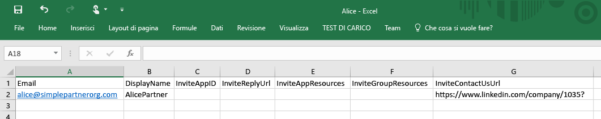

2. Nel portale di Azure, aggiungere un utente alla directory di Contoso (Active Directory > Contoso > Utenti > Aggiungi utente). Nell’elenco a discesa "Tipo di utente", selezionare "Utenti nelle aziende partner". Caricare il file con estensione .csv. Verificare che il file con estensione csv venga chiuso prima di caricarlo. 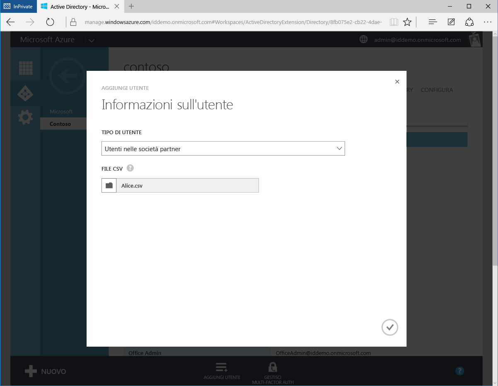

3. Alice viene ora rappresentata come un utente esterno nella directory di Azure AD Contoso. 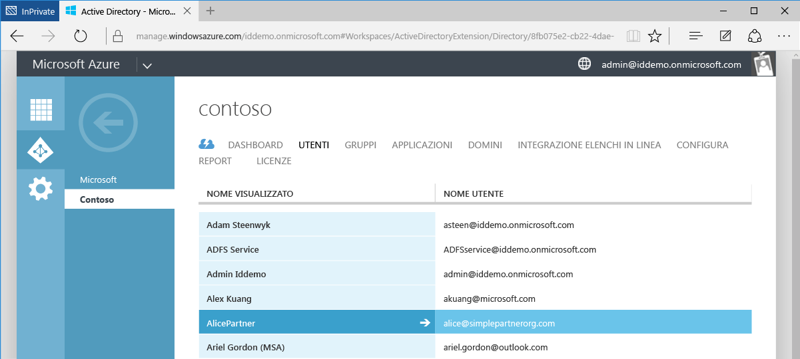

4. Alice riceve il messaggio di posta elettronica seguente. 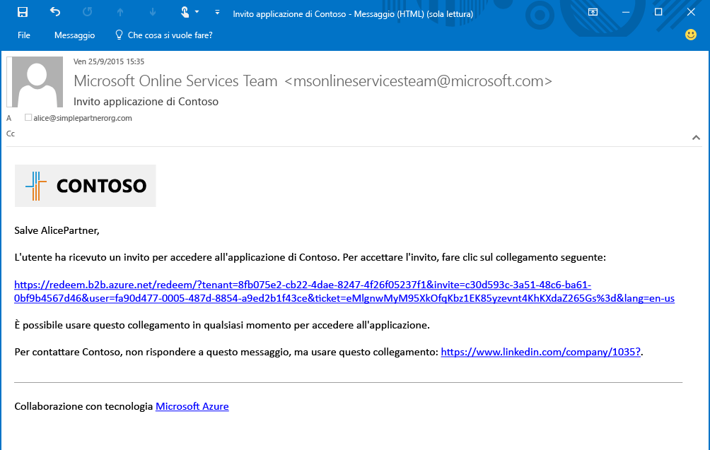

5. Alice fa clic sul link e le viene richiesto di accettare l'invito e di accedere utilizzando le credenziali di lavoro. Se Alice non è presente nella directory di Azure AD, deve effettuare l'iscrizione. 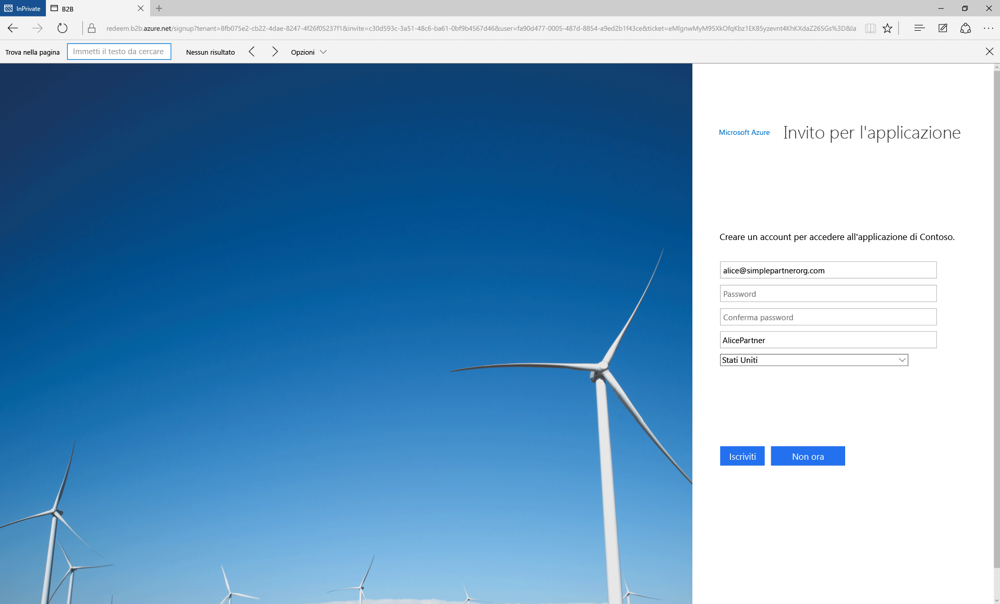

6. Alice viene reindirizzata al pannello di accesso dell’App, che resta vuoto fino a quando all'utente viene concesso l'accesso alle app. 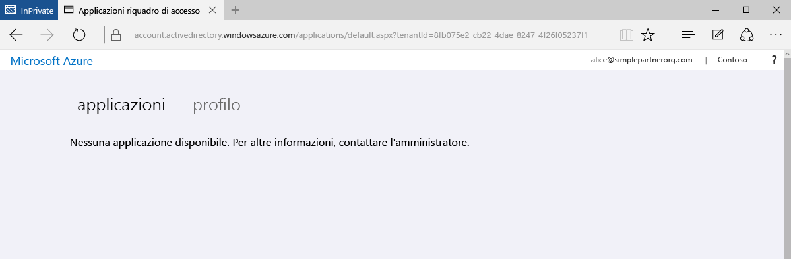

Questa procedura consente la forma più semplice di collaborazione B2B. In qualità di utente nella directory di Azure AD Contoso, ad Alice può essere concesso l'accesso alle applicazioni e ai gruppi con il portale di Azure. Ora aggiungiamo Bob, che deve accedere alle applicazioni Moodle e Salesforce.

## Aggiunta di Bob alla directory Contoso e concessione dell'accesso alle app
1. Utilizzare Windows PowerShell con il modulo di Azure AD installato per trovare le ID dell’applicazione di Moodle e Salesforce. Gli ID possono essere recuperati tramite il cmdlet: `Get-MsolServicePrincipal | fl DisplayName, AppPrincipalId` Verrà visualizzato un elenco di tutte le applicazioni disponibili in Contoso e nei relativi AppPrincialIds. 

2. Creare un file con estensione csv contenente Email e DisplayName, **InviteAppID**, **InviteAppResources** e InviteContactUsUrl di Bob. Popolare **InviteAppResources** con AppPrincipalId di Moodle e Salesforce da PowerShell, separati da uno spazio. Popolare **InviteAppId** con lo stesso AppPrincipalId di Moodle per personalizzare il messaggio di posta elettronica e le pagine di accesso con un logo Moodle. 

3. Caricare il file con estensione .csv tramite il portale di Azure esattamente come è stato fatto per Alice. Bob è ora un utente esterno nella directory di Azure AD Contoso.

4. Bob riceve il messaggio di posta elettronica seguente. 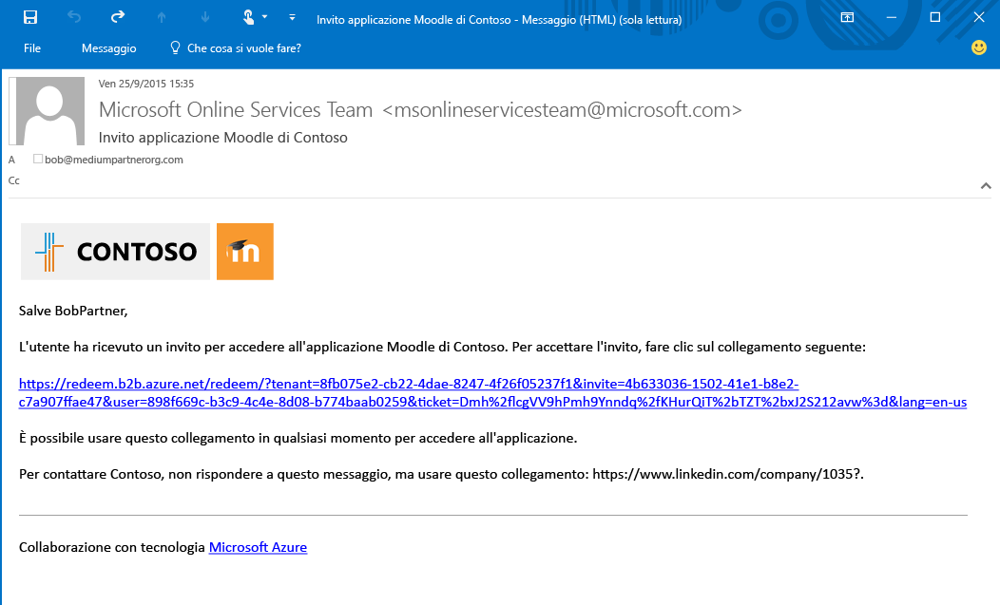

5. Bob fa clic sul collegamento e gli viene richiesto di accettare l'invito. Dopo aver effettuato l’accesso, viene indirizzato al pannello di accesso e può già utilizzare Moodle e Salesforce. 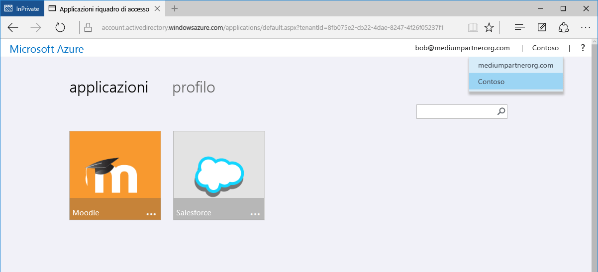

Si aggiungerà poi Carol, che deve accedere alle applicazioni e ha anche bisogno dell'appartenenza ai gruppi nella directory Contoso.

## Aggiunta di Carol alla directory Contoso, concessione dell'accesso alle app e assegnazione dell'appartenenza ai gruppi

1. Utilizzare Windows PowerShell con il modulo di Azure AD installato per trovare le ID dell’applicazione e le ID del gruppo all’interno di Contoso.
 - Recuperare AppPrincipalId mediante il cmdlet `Get-MsolServicePrincipal | fl DisplayName, AppPrincipalId`, così come è avvenuto con Bob.
 - Recuperare ObjectId per i gruppi usando il cmdlet `Get-MsolGroup | fl DisplayName, ObjectId` per poter visualizzare un elenco di tutti i gruppi in Contoso e i relativi ObjectId. Le ID del gruppo possono essere recuperate anche come ID oggetto, nella scheda delle proprietà del gruppo nel portale di Azure. 

2. Creare file con estensione .csv, compilare con l’email, il DisplayName, l’InviteAppID, l’InviteAppResources, l’**InviteGroupResources**e l’InviteContactUsUrl di Carol. **InviteGroupResources** è popolato da ObjectID dei gruppi MyGroup1 ed Externals, separati da uno spazio. 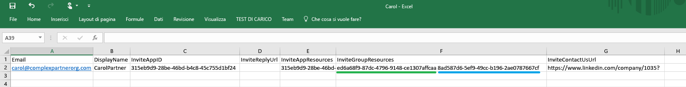

3. Caricare il file con estensione .csv tramite il portale di Azure.

4. Carol è un utente nella directory Contoso ed è anche un membro dei gruppi MyGroup1 e Externals, come si può osservare nel portale di Azure. 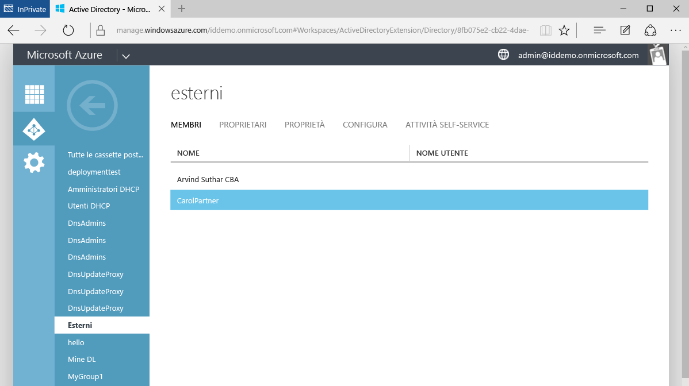

5. Carol riceve un messaggio di posta elettronica contenente un collegamento per accettare l'invito. Dopo avere effettuato l'accesso, viene reindirizzata al pannello di accesso app per accedere a Moodle e Salesforce.

Questo è tutto ciò che bisogna fare per aggiungere utenti da aziende partner in AD B2B Azure Collaboration. Questa procedura dettagliata ha illustrato come aggiungere gli utenti Alice, Bob e Carol alla directory Contoso usando tre file CSV distinti. Per semplificare questo processo, è possibile concentrare i file CSV separati in un unico file. 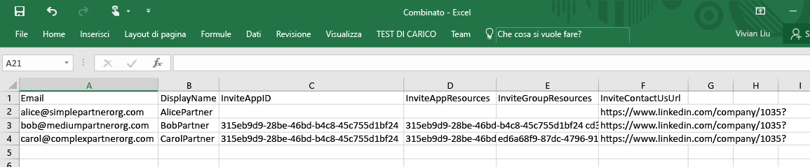

## Articoli correlati
Vedere gli altri articoli su Azure AD B2B Collaboration.

- [Che cos'è Azure AD B2B Collaboration?](active-directory-b2b-what-is-azure-ad-b2b.md)
- [Funzionamento](active-directory-b2b-how-it-works.md)
- [Riferimento sul formato di file CSV](active-directory-b2b-references-csv-file-format.md)
- [Formato del token per l'utente esterno](active-directory-b2b-references-external-user-token-format.md)
- [Modifiche agli attributi dell'oggetto utente esterno](active-directory-b2b-references-external-user-object-attribute-changes.md)
- [Limitazioni correnti della versione di anteprima](active-directory-b2b-current-preview-limitations.md)
- [Indice di articoli per la gestione di applicazioni in Azure Active Directory](active-directory-apps-index.md)

<!---HONumber=AcomDC_0511_2016-->