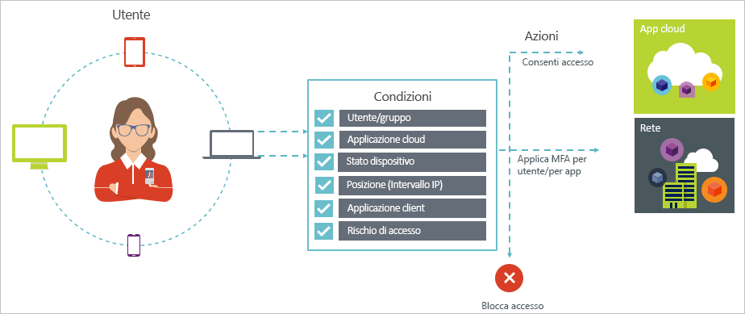

# Accesso condizionale in Azure Active Directory

La sicurezza è una priorità assoluta per le organizzazioni che usano il cloud. Identità e accesso rappresentano aspetti chiave della sicurezza cloud in ambito di gestione delle risorse cloud. In un mondo dominato dai dispositivi mobili e basato sul cloud, gli utenti possono accedere alle risorse dell'organizzazione con una serie di dispositivi e app ovunque si trovino. Di conseguenza, non è più sufficiente concentrarsi solo su chi può accedere a una risorsa. Per ottenere un equilibrio ideale tra produttività e sicurezza, nelle valutazioni in merito a un controllo di accesso i professionisti IT devono anche considerare il modo in cui si accede a una risorsa. Con l'accesso condizionale di Azure AD è possibile soddisfare questo requisito. L'accesso condizionale è una funzionalità di Azure Active Directory che consente di applicare controlli sull'accesso alle app nel proprio ambiente in base a specifiche condizioni da una posizione centrale. 

Questo articolo offre una panoramica concettuale dell'accesso condizionale in Azure AD.

## Scenari comuni

In un mondo in cui i dispositivi mobili e il cloud hanno sempre più importanza, Azure Active Directory consente ovunque l'accesso Single Sign-On a dispositivi, app e servizi. Con il proliferare di dispositivi (inclusi i dispositivi BYOD), del lavoro al di fuori delle reti aziendali e delle app SaaS di terze parti, i professionisti IT hanno due obiettivi opposti:

- Fare in modo che gli utenti siano produttivi sempre e ovunque
- Proteggere gli asset aziendali in qualsiasi momento

Grazie ai criteri di accesso condizionale è possibile applicare i controlli di accesso idonei nelle condizioni richieste. L'accesso condizionale di Azure AD offre maggiore sicurezza quando è necessario e non interferisce con le attività dell'utente quando non lo è. 

Di seguito sono indicate alcune problematiche di accesso comuni per cui l'accesso condizionale può risultare utile:

- **[Rischio di accesso](active-directory-conditional-access-conditions.md#sign-in-risk)**: Azure AD Identity Protection rileva i rischi di accesso. Come limitare l'accesso se un rischio di accesso rilevato indica un attore malintenzionato? Cosa accade se si intende essere maggiormente certi del fatto che è stato eseguito un accesso dall'utente legittimo o se sussistono dubbi sufficienti a impedire addirittura a utenti specifici di accedere a un'app?

- **[Percorso di rete](active-directory-conditional-access-locations.md)**: Azure AD è accessibile da qualsiasi posizione. Cosa accade se si esegue un tentativo di accesso da un percorso di rete al di fuori del controllo del reparto IT? L'uso di una combinazione di nome utente e password potrebbe essere sufficiente come identificazione per i tentativi di accesso alle risorse dalla rete aziendale. Cosa accade se è necessario un livello superiore di identificazione per i tentativi di accesso avviati da altri paesi o regioni non previsti del mondo? Cosa accade se si intende addirittura bloccare i tentativi di accesso da alcune posizioni?  

- **[Gestione dei dispositivi](active-directory-conditional-access-conditions.md#device-platforms)**: in Azure AD gli utenti possono accedere alle app cloud da una vasta gamma di dispositivi, inclusi i dispositivi mobili e i dispositivi personali. Cosa accade se si richiede che il tentativo di accesso venga eseguito solo da un utente che usa i dispositivi gestiti dal reparto IT? Cosa accade se si intende addirittura impedire a determinati tipi di dispositivi l'accesso alle applicazioni cloud nell'ambiente in uso? 

- **[Applicazione client](active-directory-conditional-access-conditions.md#client-apps)**: oggi è possibile accedere a molte app cloud con tipi di app diversi, ad esempio app basate sul Web, app per dispositivi mobili o app desktop. Cosa accade se un tentativo di accesso viene eseguito usando un tipo di app client che causa problemi noti? Cosa accade se è necessario un dispositivo gestito dal reparto IT per determinati tipi di app? 

Queste domande e le relative risposte rappresentano scenari comuni per l'accesso condizionale di Azure AD. L'accesso condizionale è una funzionalità di Azure Active Directory che consente di gestire gli scenari di accesso con un approccio basato su criteri.

## Criteri di accesso condizionale

I criteri di accesso condizionale rappresentano una definizione di uno scenario di accesso con il criterio seguente:

**Fare questo** definisce la risposta dei criteri. È importante notare che l'obiettivo dei criteri di accesso condizionale è quello di non concedere l'accesso a un'app cloud. In Azure AD la concessione dell'accesso alle app cloud è soggetta alle assegnazioni utente. Con i criteri di accesso condizionale l'utente controlla il modo in cui gli utenti autorizzati (che hanno ottenuto l'accesso a un'app cloud) possono accedere alle app cloud in condizioni specifiche. Nella risposta l'utente applica altri requisiti, ad esempio l'autenticazione a più fattori o un dispositivo gestito. Nel contesto dell'accesso condizionale di Azure AD, i requisiti applicati dai criteri vengono chiamati controlli di accesso. Nella forma più restrittiva, i criteri possono bloccare l'accesso. Per altre informazioni, vedere [Controlli di accesso nell'accesso condizionale di Azure Active Directory](active-directory-conditional-access-controls.md).
     

**Quando accade questo** definisce il motivo per attivare i criteri. Questo motivo è caratterizzato da un gruppo di condizioni soddisfatte. Nell'accesso condizionale di Azure AD le due condizioni di assegnazione svolgono un ruolo particolare:

- **[Utenti](active-directory-conditional-access-conditions.md#users-and-groups)**: gli utenti che eseguono un tentativo di accesso (**Chi**). 

- **[App cloud](active-directory-conditional-access-conditions.md#cloud-apps)**: le destinazioni di un tentativo di accesso (**Cosa**).    

Queste due condizioni sono obbligatorie nei criteri di accesso condizionale. Oltre alle due condizioni obbligatorie, è anche possibile includere altre condizioni che descrivono il modo in cui viene eseguito il tentativo di accesso. Esempi comuni sono l'uso di dispositivi mobili o posizioni all'esterno della rete aziendale. Per altre informazioni, vedere [Condizioni nell'accesso condizionale di Azure Active Directory](active-directory-conditional-access-conditions.md).   

La combinazione delle condizioni con i controlli di accesso rappresenta un tipo di criteri di accesso condizionale. 

Con l'accesso condizionale di Azure AD è possibile controllare il modo in cui gli utenti autorizzati possono accedere alle app cloud. L'obiettivo dei criteri di accesso condizionale è quello di applicare altri controlli di accesso a un tentativo di accesso a un'app cloud basato sulla modalità di esecuzione di un tentativo di accesso.

Un vantaggio relativo all'uso di un approccio basato su criteri per proteggere l'accesso alle app cloud è dato dal fatto che è possibile iniziare a elaborare i requisiti dei criteri per l'ambiente usando la struttura descritta in questo articolo, senza doversi preoccupare dell'implementazione tecnica. 

## Informazioni importanti

### Requisiti generali per l'uso dell'accesso condizionale

È possibile usare l'accesso condizionale di Azure AD per proteggere le app cloud quando un tentativo di autenticazione proviene da:

- Un Web browser

- Un'app client che usa l'autenticazione moderna

- Exchange ActiveSync

Per altre informazioni, vedere la sezione relativa alle [app client](active-directory-conditional-access-conditions.md#client-apps).

Alcune [app cloud](active-directory-conditional-access-conditions.md#cloud-apps) supportano anche i protocolli di autenticazione legacy. Questo vale, ad esempio, per SharePoint Online ed Exchange Online. Quando un'app client può usare un protocollo di autenticazione legacy per accedere a un'app cloud, Azure AD non è in grado di applicare criteri di accesso condizionale a questo tentativo di accesso. Per impedire a un'app client di ignorare l'applicazione di criteri, è necessario controllare se è possibile abilitare solo l'autenticazione moderna nelle app cloud interessate.

Tra le app client a cui non è applicabile l'accesso condizionale sono incluse le seguenti:

- Office 2010 e versioni precedenti

- Office 2013 quando l'autenticazione moderna non è abilitata

Per altre informazioni, vedere [Configurare SharePoint Online ed Exchange Online per l'accesso condizionale di Azure Active Directory](active-directory-conditional-access-no-modern-authentication.md).

### Requisiti di licenza per l'uso dell'accesso condizionale

L'uso dell'accesso condizionale richiede una licenza Azure AD Premium/Enterprise Mobility + Security. Per individuare la licenza adatta ai propri requisiti, vedere [Opzioni di prezzo di Enterprise Mobility + Security](https://www.microsoft.com/cloud-platform/enterprise-mobility-security-pricing).

## Passaggi successivi

- Per saperne di più su:
    - Condizioni, vedere [Condizioni nell'accesso condizionale di Azure Active Directory](active-directory-conditional-access-conditions.md).

    - Controlli di accesso, vedere [Controlli di accesso nell'accesso condizionale di Azure Active Directory](active-directory-conditional-access-controls.md).

- Per acquisire familiarità con la configurazione dei criteri di accesso condizionale, vedere [Introduzione all'accesso condizionale in Azure Active Directory](active-directory-conditional-access-azure-portal-get-started.md).

- Se si è pronti per configurare i criteri di accesso condizionale per l'ambiente in uso, vedere il [Procedure consigliate per l'accesso condizionale in Azure Active Directory](active-directory-conditional-access-best-practices.md). 
