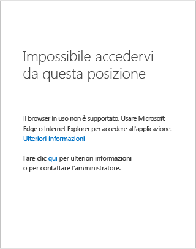
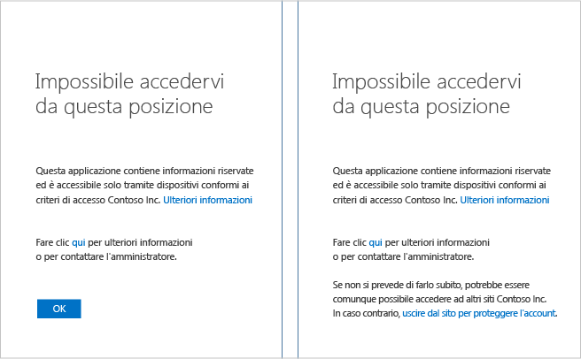

# Messaggio "Non è possibile accedervi da qui" in un dispositivo Windows

Durante un tentativo di accedere ad esempio alla Intranet SharePoint Online dell'organizzazione può essere visualizzata una pagina con il messaggio *Non è possibile accedervi da qui*. Questa pagina viene visualizzata perché l'amministratore ha configurato un criterio di accesso condizionale che impedisce l'accesso alle risorse dell'organizzazione in determinate condizioni. Anche se potrebbe essere necessario contattare il supporto tecnico o l'amministratore per risolvere questo problema, è prima possibile effettuare personalmente alcuni tentativi.

Se si usa un dispositivo **Windows** è necessario controllare quanto segue:

- Il browser usato è supportato?

- Viene eseguita una versione supportata di Windows nel dispositivo?

- Il dispositivo è conforme?

## Browser supportati

Se l'amministratore ha configurato un criterio di accesso condizionale, è possibile accedere alle risorse dell'organizzazione solo usando un browser supportato. In un dispositivo Windows sono supportati solo **Internet Explorer** ed **Microsoft Edge**.

È possibile verificare facilmente se è impossibile accedere a una risorsa a causa di un browser non supportato esaminando la sezione dei dettagli della pagina di errore:

L'unica correzione consiste nell'usare un browser supportato dall'applicazione per la piattaforma del dispositivo in uso. Per un elenco completo dei browser supportati, vedere [Browser supportati](active-directory-conditional-access-supported-apps.md).  

## Versioni di Windows supportate

È necessario soddisfare le condizioni seguenti per il sistema operativo Windows in esecuzione nel dispositivo: 

- Se si esegue un sistema operativo desktop di Windows nel dispositivo, deve trattarsi di Windows 7 o versioni successive.
- Se si esegue un sistema operativo Windows server nel dispositivo, deve trattarsi di Windows Server 2008 R2 o versioni successive. 

## Dispositivo conforme

L'amministratore può aver configurato un criterio di accesso condizionale che consente di accedere alle risorse dell'organizzazione solo da dispositivi conformi. Per essere conforme, il dispositivo deve essere aggiunto all'istanza locale di Active Directory oppure ad Azure Active Directory.

È possibile verificare facilmente se è impossibile accedere a una risorsa a causa di un dispositivo non conforme esaminando la sezione dei dettagli della pagina di errore:
 

### Il dispositivo è stato aggiunto a un'istanza di Active Directory locale?

**Se il dispositivo è stato aggiunto a un'istanza di Active Directory locale dell'organizzazione:**

1. Assicurarsi di accedere a Windows con il proprio account aziendale (account Active Directory).
2. Connettersi alla rete aziendale tramite una rete privata virtuale (VPN) o DirectAccess.
3. Dopo aver stabilito la connessione, premere il tasto WINDOWS+L per bloccare la sessione di Windows.
4. Sbloccare la sessione di Windows immettendo le credenziali dell'account aziendale.
5. Attendere un minuto e quindi provare di nuovo ad accedere all'applicazione o al servizio.
6. Se viene visualizzata la stessa pagina, fare clic sul collegamento **Altri dettagli** e quindi riferire i dettagli all'amministratore.

### Il dispositivo non è stato aggiunto a un'istanza di Active Directory locale?

Se il dispositivo non è stato aggiunto a un'istanza di Active Directory locale ed esegue Windows 10 sono disponibili due opzioni:

* Eseguire l'aggiunta ad Azure AD
* Aggiungere l'account aziendale o dell'istituto di istruzione a Windows

Per informazioni sulle differenze tra queste opzioni, vedere [Uso di dispositivi Windows 10 in azienda](active-directory-azureadjoin-windows10-devices.md).  
Se il dispositivo:

- Appartiene all'organizzazione è necessario eseguire l'aggiunta ad Azure AD.
- È un dispositivo personale o un telefono Windows, è necessario aggiungere l'account aziendale o dell'istituto di istruzione a Windows 

#### Aggiunta ad Azure AD in Windows 10

I passaggi per aggiungere il dispositivo ad Azure AD dipendono dalla versione di Windows 10 in esecuzione sul dispositivo. Per determinare la versione del sistema operativo Windows 10, eseguire il comando **winver**: 

**Windows 10 Anniversary Update (versione 1607):**

1. Aprire l'app **Impostazioni** .
2. Fare clic su **Account** > **Accedi all'azienda o all'istituto di istruzione**.
3. Fare clic su **Connetti**.
4. Fare clic su **Aggiungi il dispositivo ad Azure Active Directory**.
5. Eseguire l'autenticazione nell'organizzazione, fornire l'autenticazione a più fattori, se richiesta, e quindi seguire la procedura visualizzata.
6. Disconnettersi e quindi eseguire l'accesso con l'account aziendale.
7. Provare ad accedere di nuovo all'applicazione.

**Aggiornamento di novembre 2015 di Windows 10 (versione 1511):**

1. Aprire l'app **Impostazioni** .
2. Fare clic su **Sistema** > **Informazioni**.
3. Fare clic su **Aggiungi ad Azure AD**.
4. Eseguire l'autenticazione nell'organizzazione, fornire l'autenticazione a più fattori, se richiesta, e quindi seguire la procedura visualizzata.
5. Disconnettersi e quindi eseguire l'accesso con l'account aziendale (l'account Azure AD).
6. Provare ad accedere di nuovo all'applicazione.

#### Workplace Join in Windows 8.1

Se il dispositivo non è aggiunto al dominio ed esegue Windows 8.1, per eseguire l'aggiunta all'area di lavoro e la registrazione in Microsoft Intune, seguire questa procedura:

1. Aprire **Impostazioni PC**.
2. Fare clic su **Rete** > **Rete aziendale**.
3. Fare clic su **Accedi**.
4. Eseguire l'autenticazione nell'organizzazione, fornire l'autenticazione a più fattori, se richiesta, e quindi seguire la procedura visualizzata.
5. Fare clic su **Attiva**.
6. Provare ad accedere di nuovo all'applicazione.

#### Aggiungere l'account aziendale o dell'istituto di istruzione a Windows 

**Windows 10 Anniversary Update (versione 1607):**

1. Aprire l'app **Impostazioni** .
2. Fare clic su **Account** > **Accedi all'azienda o all'istituto di istruzione**.
3. Fare clic su **Connetti**.
4. Eseguire l'autenticazione nell'organizzazione, fornire l'autenticazione a più fattori, se richiesta, e quindi seguire la procedura visualizzata.
5. Provare ad accedere di nuovo all'applicazione.

**Aggiornamento di novembre 2015 di Windows 10 (versione 1511):**

1. Aprire l'app **Impostazioni** .
2. Fare clic su **Account** > **Your accounts** (Account personali).
3. Fare clic su **Aggiungi account aziendale o dell'istituto di istruzione**.
4. Eseguire l'autenticazione nell'organizzazione, fornire l'autenticazione a più fattori, se richiesta, e quindi seguire la procedura visualizzata.
5. Provare ad accedere di nuovo all'applicazione.

## Passaggi successivi
[Accesso condizionale di Azure Active Directory](active-directory-conditional-access-azure-portal.md)

