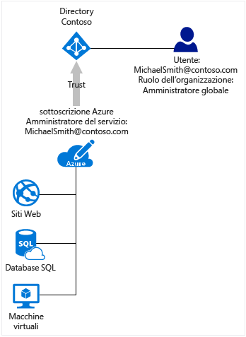

# Associare le sottoscrizioni di Azure ad Azure Active Directory
Questo articolo contiene informazioni sulla relazione tra una sottoscrizione di Azure e Azure Active Directory (Azure AD) e su come aggiungere una sottoscrizione esistente alla directory di Azure AD.

## Relazione della sottoscrizione di Azure con Azure AD
La sottoscrizione di Azure ha una relazione di trust con Azure AD, ovvero considera attendibile la directory per autenticare gli utenti, i servizi e i dispositivi. Più sottoscrizioni possono considerare attendibile la stessa directory, ma ogni sottoscrizione considera attendibile una sola directory. 

La relazione di trust tra la sottoscrizione e la directory è diversa dalla relazione con le altre risorse in Azure, ad esempio siti Web, database e così via. Se la sottoscrizione scade, non sarà più possibile accedere alle altre risorse associate alla sottoscrizione. La directory di Azure AD rimane però in Azure, sarà quindi possibile associarla a una sottoscrizione diversa e continuare a gestire la directory con la nuova sottoscrizione.

Tutti gli utenti dispongono di una singola home directory che li autentica, ma poi possono essere utenti guest in altre directory. In Azure AD è possibile visualizzare solo le directory di cui l'account utente è membro o guest.

## Azure AD e sottoscrizioni di servizi cloud
Azure AD fornisce le principali funzionalità di gestione delle identità e di directory alla base della maggior parte dei servizi cloud Microsoft, tra cui:

* Azure
* Microsoft Office 365
* Microsoft Dynamics CRM Online
* Microsoft Intune

Quando si effettua l'iscrizione a uno di questi servizi cloud Microsoft, si ottiene gratuitamente il servizio Azure AD. Per aggiungere un'altra sottoscrizione di Azure a una directory di Azure AD, è necessario eseguire l'accesso con un account Microsoft. Se si esegue l'accesso ad Azure con un account aziendale o dell'istituto di istruzione, non è possibile aggiungere una sottoscrizione di Azure a una directory esistente perché tale account non può essere autenticato direttamente da Azure. 

## Per aggiungere una sottoscrizione esistente alla directory di Azure AD
È necessario eseguire l'accesso con un account che esiste sia nella directory corrente a cui è associata la sottoscrizione che nella directory a cui la si vuole aggiungere. 

1. Accedere al [Centro account di Azure](https://account.windowsazure.com/Home/Index) con un account amministratore della sottoscrizione di cui si vuole trasferire la proprietà.
2. Assicurarsi che l'utente che si vuole impostare come proprietario della sottoscrizione sia incluso nella directory di destinazione.
3. Fare clic su **Trasferisci sottoscrizione**.
4. Specificare il destinatario. Il destinatario riceve automaticamente un messaggio e-mail con un link per l'accettazione.
5. Il destinatario deve fare clic sul link e seguire le istruzioni, inclusa l'immissione delle informazioni sul pagamento. Quando il destinatario ha esito positivo, la sottoscrizione viene trasferita. 
6. La directory predefinita della sottoscrizione viene modificata nella directory in cui si trova l'utente.

## Suggerimenti per gestire sia una sottoscrizione che una directory
Le risorse associate a una sottoscrizione di Azure vengono gestite dai ruoli amministrativi della sottoscrizione stessa. Questa sezione illustra le differenze tra gli amministratori di una sottoscrizione di Azure e gli amministratori di una directory di Azure AD. I ruoli amministrativi e gli altri suggerimenti su come usarli per gestire la sottoscrizione sono descritti in [Assegnazione dei ruoli di amministratore in Azure Active Directory](active-directory-assign-admin-roles.md).

Per impostazione predefinita, al momento dell'iscrizione all'utente viene assegnato il ruolo di amministratore del servizio. Se altri utenti devono accedere ai servizi con la stessa sottoscrizione, è possibile aggiungerli come coamministratori. 

In Azure AD è invece disponibile un set di ruoli amministrativi diverso per gestire la directory e le funzionalità relative alle identità. Ad esempio, l'amministratore globale di una directory può aggiungere utenti e gruppi alla directory o richiedere l'autenticazione a più fattori per gli utenti. All'utente che crea una directory viene assegnato il ruolo di amministratore globale, che, a sua volta, potrà assegnare ruoli amministrativi ad altri utenti. I ruoli amministrativi di Azure AD vengono anche usati da altri servizi, ad esempio Office 365 e Microsoft Intune. 

Gli amministratori della sottoscrizione di Azure e gli amministratori della directory di Azure AD sono due ruoli distinti. 
* Gli amministratori della sottoscrizione di Azure possono gestire le risorse in Azure e usare Azure AD nel portale di Azure, perché il portale di Azure stesso è una risorsa di Azure. 
* Gli amministratori della directory possono gestire le proprietà solo nella directory di Azure AD.

Una persona può rivestire entrambi i ruoli, ma non è obbligatorio. Non è possibile assegnare a un amministratore globale della directory un ruolo di amministratore del servizio o di coamministratore di una sottoscrizione di Azure e viceversa. Senza essere un amministratore della sottoscrizione, l'utente può accedere al portale di Azure, ma non può gestire le directory per tale sottoscrizione nel portale. Tuttavia, l'utente può gestire le directory con altri strumenti, ad esempio Azure AD PowerShell o l'interfaccia di amministrazione di Office 365.

## Passaggi successivi
* Per altre informazioni su come cambiare gli amministratori per una sottoscrizione di Azure, vedere [Trasferire la proprietà di una sottoscrizione di Azure a un altro account](../billing/billing-subscription-transfer.md)
* Per altre informazioni sul modo in cui l'accesso alle risorse viene controllato in Microsoft Azure, vedere [Informazioni sull'accesso alle risorse in Azure](active-directory-understanding-resource-access.md)
* Per altre informazioni su come assegnare i ruoli in Azure AD, vedere [Assegnazione dei ruoli di amministratore in Azure Active Directory](active-directory-assign-admin-roles-azure-portal.md)

<!--Image references-->
[1]: ./media/active-directory-how-subscriptions-associated-directory/WAAD_PassThruAuth.png
[2]: ./media/active-directory-how-subscriptions-associated-directory/WAAD_OrgAccountSubscription.png
[3]: ./media/active-directory-how-subscriptions-associated-directory/WAAD_SignInDisambiguation.PNG

