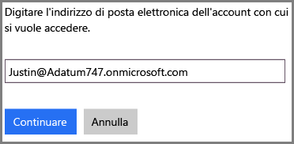
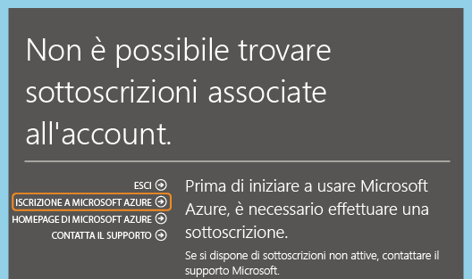
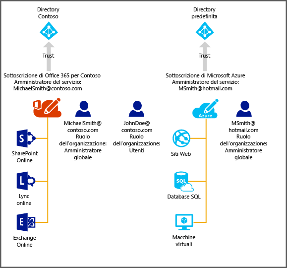

<properties
   pageTitle="Gestire la directory per la sottoscrizione di Office 365 in Azure | Microsoft Azure"
   description="Informazioni su come gestire la directory dell'account di una sottoscrizione di Office 365 con Azure Active Directory e il portale di Azure classico"
   services="active-directory"
   documentationCenter=""
   authors="curtand"
   manager="stevenpo"
   editor=""/>

<tags
   ms.service="active-directory"
   ms.devlang="na"
   ms.topic="get-started-article"
   ms.tgt_pltfrm="na"
   ms.workload="identity"
   ms.date="02/10/2016"
   ms.author="curtand"/>

#Gestire la directory per la sottoscrizione di Office 365 in Azure

Questo articolo descrive come gestire una directory creata per una sottoscrizione di Office 365 nel portale di Azure classico. La procedura da eseguire è diversa a seconda che si disponga o meno di una sottoscrizione per Azure. Per eseguire l'accesso al portale di Azure classico, è necessario essere l'amministratore del servizio oppure un coamministratore di una sottoscrizione di Azure.

Se non si dispone già di una sottoscrizione di Azure, è sufficiente iscriversi usando l'account aziendale o dell'istituto di istruzione usato per accedere a Office 365.

Non verrà trovata una sottoscrizione corrispondente per Azure, ma facendo clic su **Iscrizione ad Azure** le informazioni pertinenti dell'account di Office 365 verranno inserite automaticamente nel modulo di iscrizione. Per impostazione predefinita, allo stesso account verrà assegnato il ruolo di amministratore del servizio.

Dopo aver completato la sottoscrizione, è possibile effettuare l'accesso al portale di Azure classico e accedere ai servizi Azure. Fare clic sull'estensione Active Directory per gestire la stessa directory usata per autenticare gli utenti di Office 365.

Se si ha già una sottoscrizione di Azure, il processo per gestire un'ulteriore directory è piuttosto semplice. Il diagramma seguente illustra meglio il processo.

In questo esempio Michael Smith dispone di una sottoscrizione di Office 365 per Contoso.com e di una sottoscrizione di Azure che ha ottenuto usando l'account Microsoft msmith@hotmail.com. In questo caso Michael gestisce due directory.

| Sottoscrizione | Office 365 | Azure |
|  -------------- | ------------- | ------------------------------- |
| Nome visualizzato | Contoso | Directory predefinita |
| Nome di dominio | contoso.com | msmithhotmail.onmicrosoft.com |

Michael vuole gestire le identità utente nella directory Contoso mentre è connesso a Azure tramite il suo account Microsoft in modo da poter abilitare le funzionalità di Azure AD, come l'autenticazione a più fattori.

In questo caso, le due directory sono indipendenti tra loro.

##Per gestire due directory indipendenti
Per poter gestire entrambe le directory mentre è connesso a Azure come msmith@hotmail.com, Michael Smith deve eseguire le operazioni seguenti:

> [AZURE.NOTE]
Questa procedura può essere eseguita solo se l'utente ha eseguito l'accesso con un account Microsoft. Se l'utente ha eseguito l'accesso con un account aziendale o dell'istituto di istruzione, l'opzione **Utilizza directory esistente** non è disponibile, in quanto gli account aziendali o dell'istituto di istruzione possono essere autenticati solo dalla relativa home directory, ovvero la directory in cui tale account è archiviato e che è di proprietà dell'azienda o dell'istituto di istruzione.

1.	Accedere al portale di Azure classico come msmith@hotmail.com.
2.	Fare clic su **Nuovo** > **Servizi app** > **Active Directory** > **Directory** > **Creazione personalizzata**.
3.	Fare clic su Utilizza directory esistente e selezionare la casella di controllo **È possibile uscire ora**.
4.	Accedere al portale di Azure classico come amministratore globale di Contoso.onmicrosoft.com (ad esempio, msmith@contoso.com).
5.	Quando viene visualizzata la richiesta **Usare la directory Contoso con Azure?**, fare clic su **Continua**.
6.	Fare clic su **Esci ora**.
7.	Accedere al portale di Azure classico come msmith@hotmail.com. Entrambe le directory, quella Contoso e quella predefinita, verranno visualizzate nell'estensione Active Directory.

Dopo aver completato questa procedura, msmith@hotmail.com è diventato amministratore globale della directory Contoso.

##Per amministrare le risorse come amministratore globale
Ora si supponga che John Doe debba eseguire l'accesso al portale di Azure classico e amministrare le risorse di database e di siti Web associate alla sottoscrizione di Azure di msmith@hotmail.com. A tale scopo, Michael Smith deve effettuare i passaggi aggiuntivi seguenti:

1.	Accedere al portale di Azure classico con l'account dell'amministratore del servizio della sottoscrizione di Azure (in questo esempio, msmith@hotmail.com).
2.	Trasferire la sottoscrizione alla directory Contoso: fare clic su **Impostazioni** > **Sottoscrizioni** > selezionare la sottoscrizione > **Modifica directory** > selezionare **Contoso (Contoso.com)**. Durante il trasferimento, eventuali account aziendali o dell'istituto di istruzione di coamministratori della sottoscrizione verranno rimossi.
3.	Aggiungere John Doe come coamministratore della sottoscrizione: fare clic su **Impostazioni** > **Amministratori** > selezionare la sottoscrizione > **Aggiungi ** > digitare ****JohnDoe@Contoso.com**.

##Passaggi successivi
Per altre informazioni sulla relazione tra sottoscrizioni e directory, vedere [Come vengono associate le sottoscrizioni Azure ad Azure AD](active-directory-how-subscriptions-associated-directory.md).

<!---HONumber=AcomDC_0218_2016-->