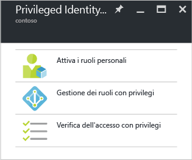

# Iniziare ad usare Azure AD Privileged Identity Management
Con Azure Active Directory (AD) Privileged Identity Management è possibile gestire, il controllo e monitorare l'accesso all'interno dell'organizzazione. È incluso l'accesso alle risorse in Azure AD e altri Microsoft Online Services, ad esempio Office 365 o Microsoft Intune.

Questo articolo descrive come aggiungere l'app Azure AD PIM al dashboard del portale di Azure.

## Aggiungere l'applicazione Privileged Identity Management
Prima di usare Azure AD Privileged Identity Management è necessario aggiungere l'applicazione al dashboard del portale di Azure.

1. Accedere al [portale di Azure](https://portal.azure.com/) come amministratore globale della directory.
2. Se l'organizzazione ha più directory, selezionare il proprio nome utente nell'angolo superiore destro del portale di Azure. Selezionare la directory in cui si userà PIM.
3. Selezionare **More services** (Altri servizi) e usare la casella di testo Filtro per cercare **Azure AD Privileged Identity Management**.
4. Selezionare **Aggiungi al dashboard** e quindi fare clic su **Crea**. Verrà aperta l'applicazione Privileged Identity Management.

Se si è la prima persona che usa Azure AD Privileged Identity Management nella directory, la [procedura guidata relativa alla sicurezza](active-directory-privileged-identity-management-security-wizard.md) illustrerà in dettaglio l'esperienza di assegnazione iniziale. Al termine della procedura guidata si diventa automaticamente il primo **amministratore della sicurezza** e **amministratore dei ruoli con privilegi** della directory. Solo un amministratore del ruolo con privilegi può accedere a questa applicazione per gestire l'accesso per gli altri amministratori.  

## Accedere alle attività
Dopo la configurazione di Azure AD Privileged Identity Management, a ogni apertura dell'applicazione verrà visualizzato il pannello di navigazione. Usare questo pannello per eseguire le attività di gestione delle identità.

* **Attiva i ruoli personali** consente di accedere all'elenco dei ruoli assegnati all'utente. In questa posizione si attiveranno i ruoli per cui si è idonei.
* **Gestione dei ruoli con privilegi** è il dashboard in cui gli amministratori dei ruoli con privilegi possono gestire le assegnazioni di ruoli, modificare le impostazioni di attivazione dei ruoli, avviare le verifiche di accesso e altro ancora. Per gli utenti che non sono amministratori dei ruoli con privilegi, le opzioni nel dashboard sono disabilitate.
* **Verifica dell'accesso con privilegi** consente di accedere alle eventuali verifiche di accesso in sospeso, sia per se stessi che per altri utenti, che devono essere completate. 

## Passaggi successivi
La [panoramica di Azure AD Privileged Identity Management](active-directory-privileged-identity-management-configure.md) include altri dettagli su come gestire l'accesso amministrativo nell'organizzazione.

[!INCLUDE [active-directory-privileged-identity-management-toc](../../includes/active-directory-privileged-identity-management-toc.md)]

<!--Image references-->

[1]: ./media/active-directory-privileged-identity-management-configure/PIM_EnablePim.png

