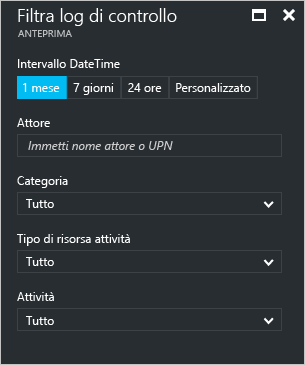
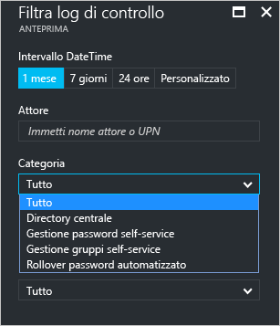
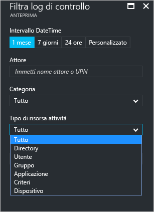
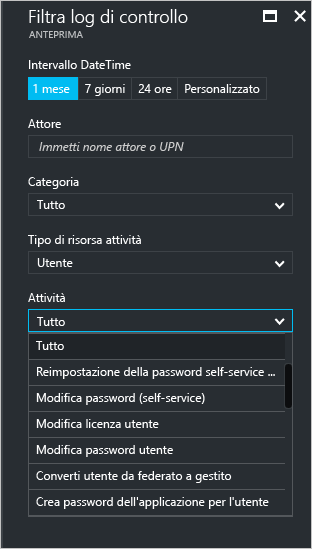
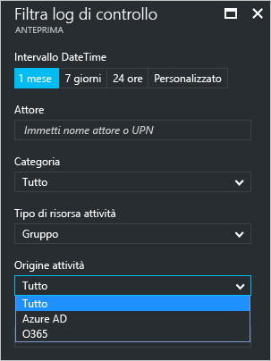

# Report delle attività di controllo nel portale di Azure Active Directory, anteprima

I report nell'[anteprima](active-directory-preview-explainer.md) di Azure Active Directory offrono tutte le informazioni necessarie per determinare come lo stato dell'ambiente.

L'architettura di reporting in Azure Active Directory include i componenti seguenti:

- **Attività** 
    - **Attività di accesso** : informazioni sull'utilizzo delle applicazioni gestite e sulle attività di accesso utente
    - **Log di controllo**: informazioni relative alle attività di sistema sulla gestione di utenti e gruppi, sulle applicazioni gestite e sulle attività di directory.
- **Sicurezza** 
    - **Accessi a rischio**. Un accesso rischioso è indicativo di un tentativo di accesso che potrebbe essere stato eseguito da qualcuno che non è il legittimo proprietario di un account utente. Per informazioni dettagliate, vedere Accessi a rischio.
    - **Utenti contrassegnati per il rischio**. Un utente rischioso è indicativo di un account utente che potrebbe essere stato compromesso. Per informazioni dettagliate, vedere Utenti contrassegnati per il rischio.

In questo argomento viene offerta una panoramica delle attività di controllo.
 
## Log di controllo

I log di controllo in Azure Active Directory forniscono i record delle attività di sistema per la conformità.

Nel portale di Azure le categorie principali delle attività correlate al controllo sono tre:

- Utenti e gruppi   

- applicazioni

- Directory   

Per un elenco completo delle attività dei report di controllo, vedere l' [elenco di eventi dei report di controllo](active-directory-reporting-audit-events.md#list-of-audit-report-events).

Il punto di ingresso a tutti i dati di controllo è **Log di controllo** nella sezione **Attività** di **Azure Active Directory**.

Un log di controllo ha una visualizzazione elenco che mostra gli attori (*chi*), le attività (*cosa*) e le destinazioni.

Facendo clic su un elemento nella visualizzazione elenco, è possibile ottenere altri dettagli sull'elemento.

## Log di controllo di utenti e gruppi

Con i report di controllo basati su utenti e gruppi, è possibile ottenere risposte a domande come:

- Quali tipi di aggiornamenti sono stati applicati agli utenti?

- Quanti utenti sono stati modificati?

- Quante password sono state modificate?

- Quali operazioni ha eseguito un amministratore in una directory?

- Quali sono i gruppi che sono stati aggiunti?

- Sono presenti gruppi con modifiche all'appartenenza?

- I proprietari dei gruppi sono stati modificati?

- Quali licenze sono state assegnate a un gruppo o a un utente?

Per esaminare semplicemente i dati di controllo relativi a utenti e gruppi, è disponibile una visualizzazione filtrata in **Log di controllo** nella sezione **Attività** di **Utenti e gruppi**.

## Log di controllo delle applicazioni
Con i report di controllo basati sulle applicazioni, è possibile ottenere risposte a domande come:

* Quali sono le applicazioni che sono state aggiunte o aggiornate?
* Quali sono le applicazioni che sono state rimosse?
* È stata modificata un'entità servizio per un'applicazione?
* I nomi delle applicazioni sono stati modificati?
* Chi ha dato il consenso a un'applicazione?

Per esaminare semplicemente i dati di controllo relativi alle applicazioni, è disponibile una visualizzazione filtrata in **Log di controllo** nella sezione **Attività** di **Applicazioni aziendali**.

## Filtro dei log di controllo
È possibile utilizzare i seguenti campi per filtrare gli accessi in modo da limitare la quantità di dati visualizzati.

- Data e ora

- Nome dell'entità utente (attore)

- Categoria

- Activity resource type (Tipo di risorsa dell'attività)

- Attività

Il filtro **Categoria** consente di restringere l'ambito del report di controllo in base alle categorie seguenti:

- Directory principale

- Gestione delle password self-service

- Gestione gruppi self-service

- Automated Password Rollover (Rollover automatizzato delle password) 

Il contenuto dell'elenco **Activity resource type** (Tipo di risorsa dell'attività) è correlato al punto di ingresso in questo pannello.  
Se il punto di ingresso è Azure Active Directory, l'elenco contiene tutti i tipi di attività possibili:

- Directory

- Utente

- Gruppo 

- Applicazione 

- Criteri

- Dispositivo

Le attività nell'elenco sono organizzate per tipo.
Ad esempio, se si seleziona **Utente** come **Tipo di attività**, l'elenco **Attività** contiene solo le attività relative ai gruppi.   

Se si seleziona **Gruppo** in **Tipo di risorsa attività**, si ottiene un'opzione di filtro aggiuntiva che consente anche di filtrare in base alle **origini attività** seguenti:

- Azure AD

- O365

Un altro metodo per filtrare le voci di un log di controllo consiste nel cercare voci specifiche.

## Passaggi successivi
Vedere [Guida alla creazione di report in Azure Active Directory](active-directory-reporting-guide.md).

