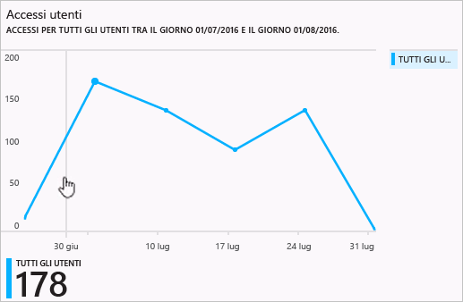
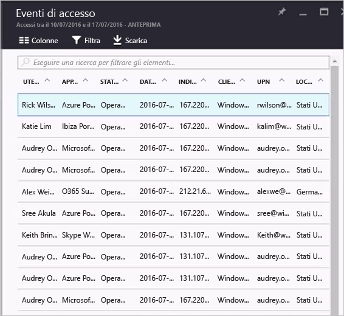

# Report delle attività di accesso nel portale di Azure Active Directory, anteprima

I report nell'[anteprima](active-directory-preview-explainer.md) di Azure Active Directory offrono tutte le informazioni necessarie per determinare il funzionamento dell'ambiente.

L'architettura di reporting in Azure Active Directory include i componenti seguenti:

- **Attività** 
    - **Attività di accesso** : informazioni sull'utilizzo delle applicazioni gestite e sulle attività di accesso utente
    - **Log di controllo**: informazioni relative alle attività di sistema sulla gestione di utenti e gruppi, sulle applicazioni gestite e sulle attività di directory.
- **Sicurezza** 
    - **Accessi a rischio**. Un accesso rischioso è indicativo di un tentativo di accesso che potrebbe essere stato eseguito da qualcuno che non è il legittimo proprietario di un account utente. Per informazioni dettagliate, vedere Accessi a rischio.
    - **Utenti contrassegnati per il rischio**. Un utente rischioso è indicativo di un account utente che potrebbe essere stato compromesso. Per informazioni dettagliate, vedere Utenti contrassegnati per il rischio.

In questo argomento viene offerta una panoramica delle attività di accesso.

## Attività di accesso

Le informazioni contenute nel report relativo all'accesso utente consentono di rispondere a domande come le seguenti:

* Qual è il modello di accesso di un utente?
* Quanti utenti hanno effettuato l'accesso nell'arco di una settimana?
* Qual è lo stato di questi accessi?

Il punto di ingresso a questi dati è il grafico relativo agli accessi utente della sezione **Panoramica** in **Utenti e gruppi**.

 

Il grafico degli accessi utente visualizza le aggregazioni settimanali degli accessi per tutti gli utenti in un determinato periodo di tempo. Il periodo di tempo predefinito è di 30 giorni.

Quando si fa clic su un giorno nel grafico degli accessi, si ottiene un elenco dettagliato delle attività di accesso.

Ogni riga nell'elenco di attività di accesso offre informazioni dettagliate sull'accesso selezionato, ad esempio:

* Chi ha effettuato l'accesso?
* Qual era il nome UPN correlato?
* Qual era l'applicazione di destinazione dell'accesso?
* Qual è l'indirizzo IP dell'accesso?
* Qual era lo stato dell'accesso?

## Utilizzo di applicazioni gestite

Con una visualizzazione dei dati di accesso basata sulle applicazioni, è possibile rispondere a domande come:

* Chi sta usando le applicazioni?
* Quali sono le prime 3 applicazioni nell'organizzazione?
* Di recente è stata implementata un'applicazione. Come sta andando?

Il punto di ingresso a questi dati sono le prime 3 applicazioni nell'organizzazione nel report sugli ultimi 30 giorni della sezione **Panoramica** in **Applicazioni aziendali**.

 

Il grafico sull'utilizzo delle app visualizza le aggregazioni settimanali degli accessi per le prime 3 applicazioni in un determinato periodo di tempo. Il periodo di tempo predefinito è di 30 giorni.

Se si preferisce, è possibile mettere in evidenza un'applicazione specifica.

Quando si fa clic su un giorno nel grafico dell'utilizzo dell'app, si ottiene un elenco dettagliato delle attività di accesso.

L'opzione **Accessi** offre una panoramica completa di tutti gli eventi di accesso nell'applicazione.

Usando la selezione colonne, è possibile selezionare i campi dati che si vuole visualizzare.

## Filtro degli accessi
È possibile utilizzare i seguenti campi per filtrare gli accessi in modo da limitare la quantità di dati visualizzati.

* Data e ora 
* Nome dell'entità utente (utente)
* Nome dell'applicazione
* Nome del client
* Stato accesso

Un altro metodo per filtrare le voci nelle attività di accesso consiste nel cercare voci specifiche.
Il metodo della ricerca consente di definire l'ambito degli accessi in base a **utenti**, **gruppi** or **applicazioni** specifiche.

## Passaggi successivi
Vedere [Guida alla creazione di report in Azure Active Directory](active-directory-reporting-guide.md).

