# Report di Azure Active Directory: anteprima

*Questo documento fa parte della [guida alla creazione di report in Azure Active Directory](active-directory-reporting-guide.md).*

I report nell'anteprima di Azure Active Directory forniscono tutte le informazioni necessarie per determinare come sta funzionando l'ambiente. [Cosa c'è nell'anteprima?](active-directory-preview-explainer.md)

Le aree principali dei report sono due:

* **Attività di accesso** : informazioni sull'utilizzo delle applicazioni gestite e sulle attività di accesso utente
* **Log di controllo** : informazioni relative alle attività di sistema sulla gestione di utenti e gruppi, sulle applicazioni gestite e sulle attività di directory

A seconda dell'ambito dei dati cercati, è possibile accedere a questi report facendo clic su **Utenti e gruppi** o su **Applicazioni aziendali** nell'elenco di servizi nel [Portale di Azure](https://portal.azure.com).

## Attività di accesso
### Attività di accesso utente
Le informazioni contenute nel report relativo all'accesso utente consentono di rispondere a domande come le seguenti:

* Qual è il modello di accesso di un utente?
* Quanti utenti hanno effettuato l'accesso nell'arco di una settimana?
* Qual è lo stato di questi accessi?

Il punto di ingresso a questi dati è il grafico relativo agli accessi utente della sezione **Panoramica** in **Utenti e gruppi**.

 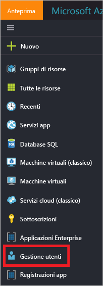

Il grafico degli accessi utente visualizza le aggregazioni settimanali degli accessi per tutti gli utenti in un determinato periodo di tempo. Il periodo di tempo predefinito è di 30 giorni.

Quando si fa clic su un giorno nel grafico degli accessi, si ottiene un elenco dettagliato delle attività di accesso.

Ogni riga nell'elenco di attività di accesso offre informazioni dettagliate sull'accesso selezionato, ad esempio:

* Chi ha effettuato l'accesso?
* Qual era il nome UPN correlato?
* Qual era l'applicazione di destinazione dell'accesso?
* Qual è l'indirizzo IP dell'accesso?
* Qual era lo stato dell'accesso?

### Utilizzo di applicazioni gestite
Con una visualizzazione dei dati di accesso basata sulle applicazioni, è possibile rispondere a domande come:

* Chi sta usando le applicazioni?
* Quali sono le prime 3 applicazioni nell'organizzazione?
* Di recente è stata implementata un'applicazione. Come sta andando?

Il punto di ingresso a questi dati sono le prime 3 applicazioni nell'organizzazione nel report sugli ultimi 30 giorni della sezione **Panoramica** in **Applicazioni aziendali**.

 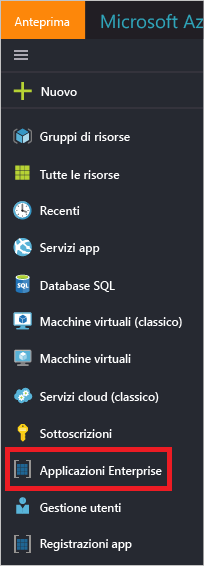

Il grafico sull'utilizzo delle app visualizza le aggregazioni settimanali degli accessi per le prime 3 applicazioni in un determinato periodo di tempo. Il periodo di tempo predefinito è di 30 giorni.

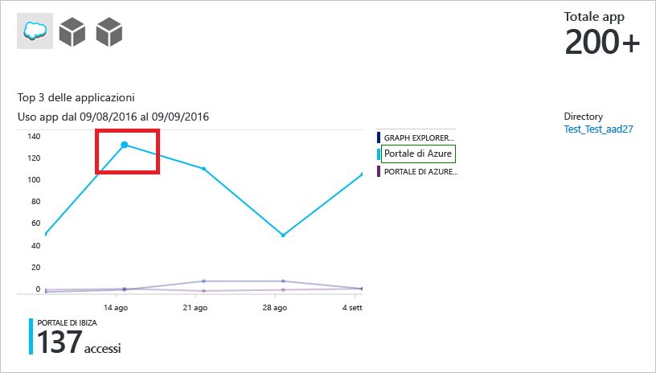

Se si preferisce, è possibile mettere in evidenza un'applicazione specifica.

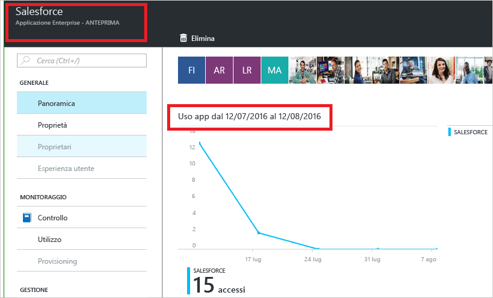

Quando si fa clic su un giorno nel grafico dell'utilizzo dell'app, si ottiene un elenco dettagliato delle attività di accesso.

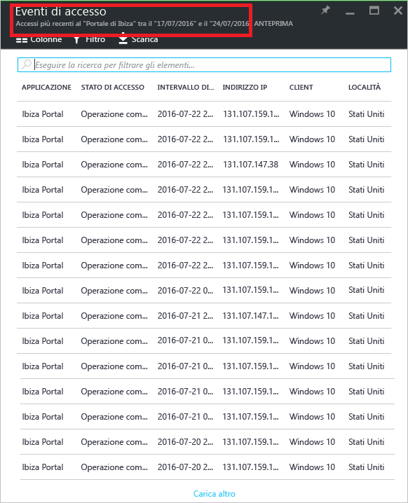

L'opzione **Accessi** offre una panoramica completa di tutti gli eventi di accesso nell'applicazione.

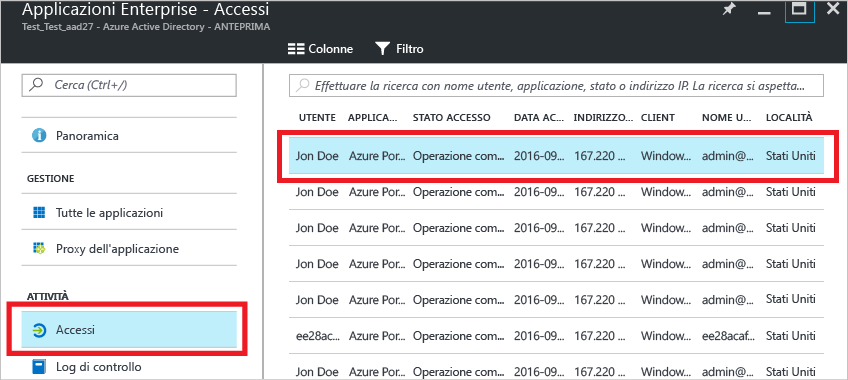

Usando la selezione colonne, è possibile selezionare i campi dati che si vuole visualizzare.

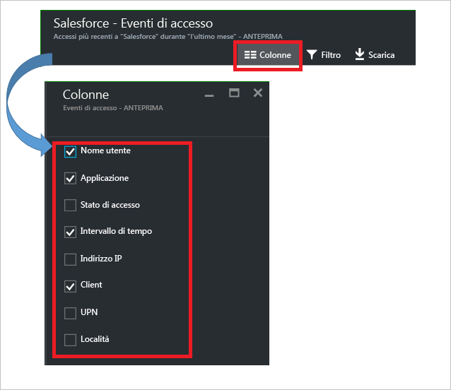

### Filtro degli accessi
È possibile utilizzare i seguenti campi per filtrare gli accessi in modo da limitare la quantità di dati visualizzati.

* Data e ora 
* Nome dell'entità utente (utente)
* Nome dell'applicazione
* Nome del client
* Stato accesso

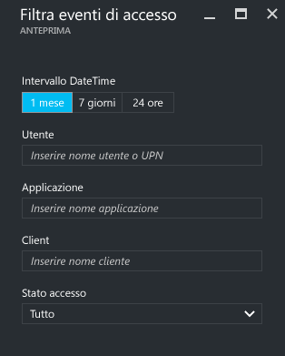

Un altro metodo per filtrare le voci nelle attività di accesso consiste nel cercare voci specifiche.
Il metodo della ricerca consente di definire l'ambito degli accessi in base a **utenti**, **gruppi** or **applicazioni** specifiche.

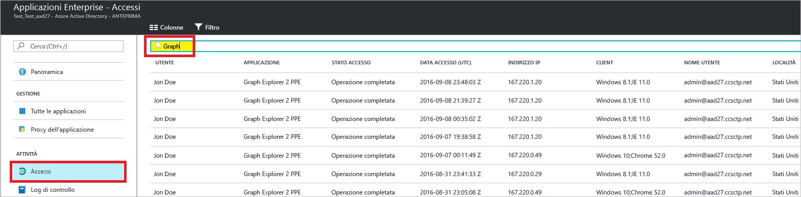

## Log di controllo
I log di controllo in Azure Active Directory forniscono i record delle attività di sistema per la conformità.

Nel portale di Azure le categorie principali delle attività correlate al controllo sono tre:

* Utenti e gruppi   
* applicazioni
* Directory   

Per un elenco completo delle attività dei report di controllo, vedere l' [elenco di eventi dei report di controllo](active-directory-reporting-audit-events.md#list-of-audit-report-events).

Il punto di ingresso a tutti i dati di controllo è **Log di controllo** nella sezione **Attività** di **Azure Active Directory**.

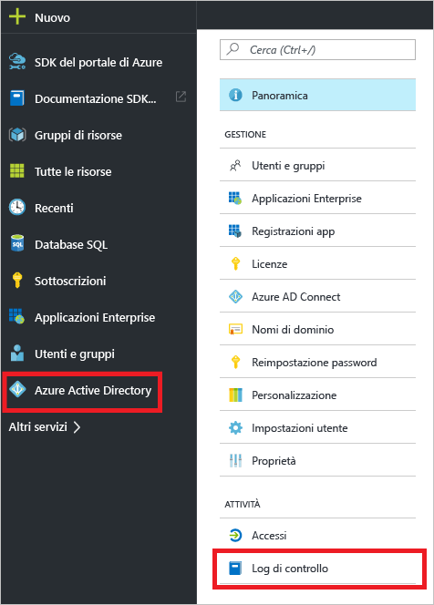

Un log di controllo ha una visualizzazione elenco che indica gli attori (chi), le attività (cosa) e le destinazioni.

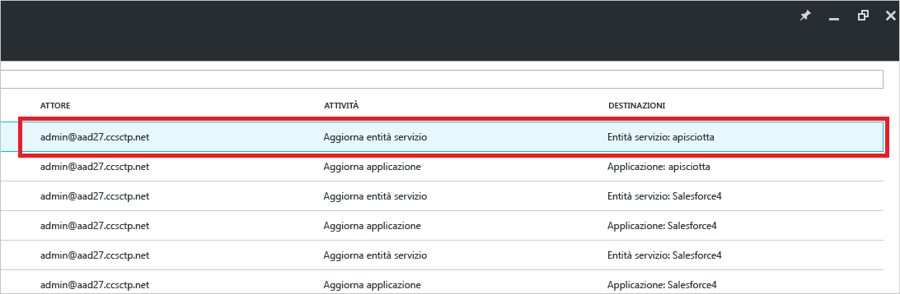

Facendo clic su un elemento nella visualizzazione elenco, è possibile ottenere altri dettagli sull'elemento.

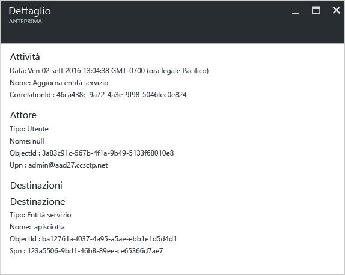

### Log di controllo di utenti e gruppi
Con i report di controllo basati su utenti e gruppi, è possibile ottenere risposte a domande come:

* Quali tipi di aggiornamenti sono stati applicati agli utenti?
* Quanti utenti sono stati modificati?
* Quante password sono state modificate?
* Quali operazioni ha eseguito un amministratore in una directory?
* Quali sono i gruppi che sono stati aggiunti?
* Sono presenti gruppi con modifiche all'appartenenza?
* I proprietari dei gruppi sono stati modificati?
* Quali licenze sono state assegnate a un gruppo o a un utente?

Per esaminare semplicemente i dati di controllo relativi a utenti e gruppi, è disponibile una visualizzazione filtrata in **Log di controllo** nella sezione **Attività** di **Utenti e gruppi**.

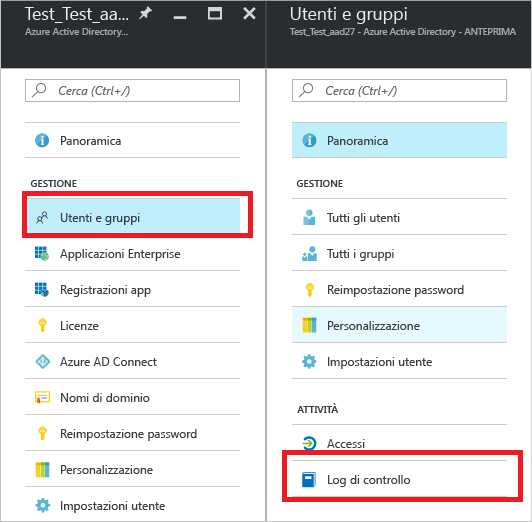

### Log di controllo delle applicazioni
Con i report di controllo basati sulle applicazioni, è possibile ottenere risposte a domande come:

* Quali sono le applicazioni che sono state aggiunte o aggiornate?
* Quali sono le applicazioni che sono state rimosse?
* È stata modificata un'entità servizio per un'applicazione?
* I nomi delle applicazioni sono stati modificati?
* Chi ha dato il consenso a un'applicazione?

Per esaminare semplicemente i dati di controllo relativi alle applicazioni, è disponibile una visualizzazione filtrata in **Log di controllo** nella sezione **Attività** di **Applicazioni aziendali**.

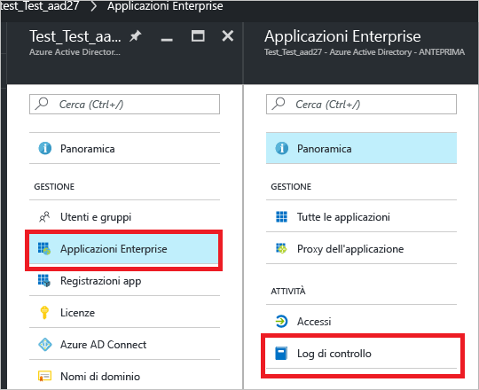

### Filtro dei log di controllo
È possibile utilizzare i seguenti campi per filtrare gli accessi in modo da limitare la quantità di dati visualizzati.

* Data e ora
* Nome dell'entità utente (attore)
* Tipo di attività
* Attività

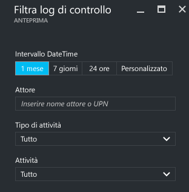

Il contenuto dell'elenco **Tipo di attività** è correlato al punto di ingresso in questo pannello.  
Se il punto di ingresso è Azure Active Directory, l'elenco contiene tutti i tipi di attività possibili:

* Applicazione 
* Gruppo 
* Utente
* Dispositivo
* Directory
* Criteri
* Altri

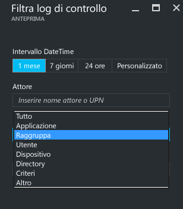

Le attività nell'elenco sono organizzate per tipo.
Ad esempio, se si seleziona **Group** (Gruppo) come **Activity Type** (Tipo di attività), l'elenco **Activity** (Attività) contiene solo le attività relative ai gruppi.   

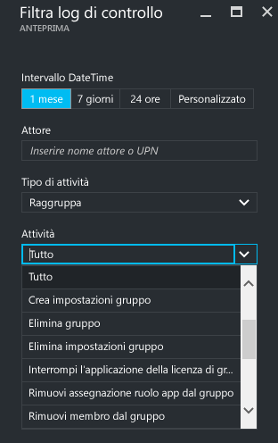

Un altro metodo per filtrare le voci di un log di controllo consiste nel cercare voci specifiche.

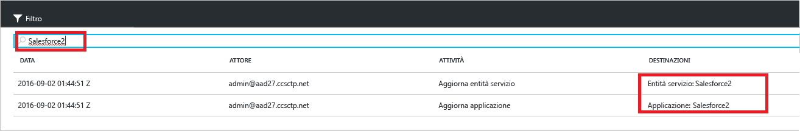

## Passaggi successivi
Vedere [Guida alla creazione di report in Azure Active Directory](active-directory-reporting-guide.md).

<!--HONumber=Jan17_HO3-->

