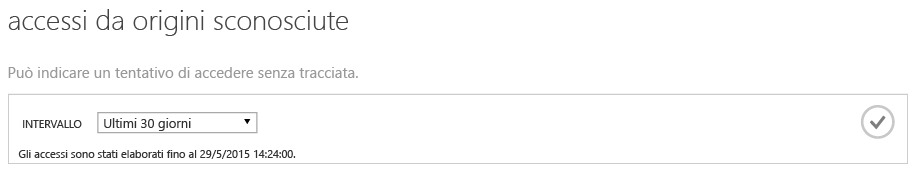
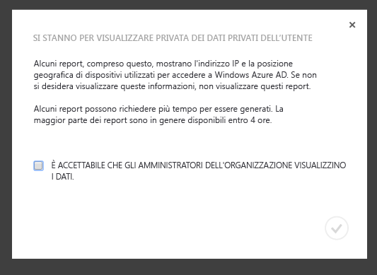
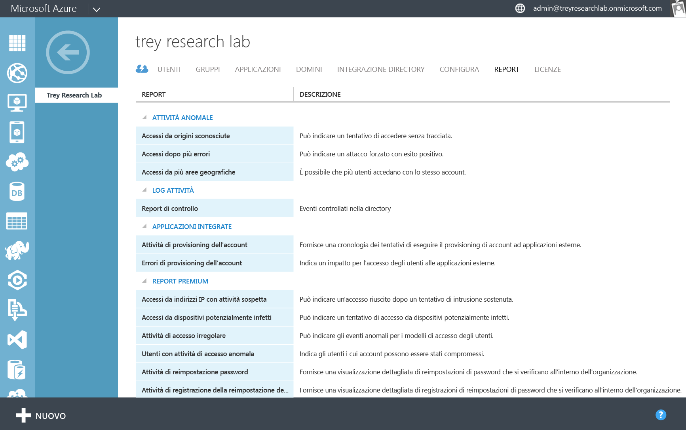
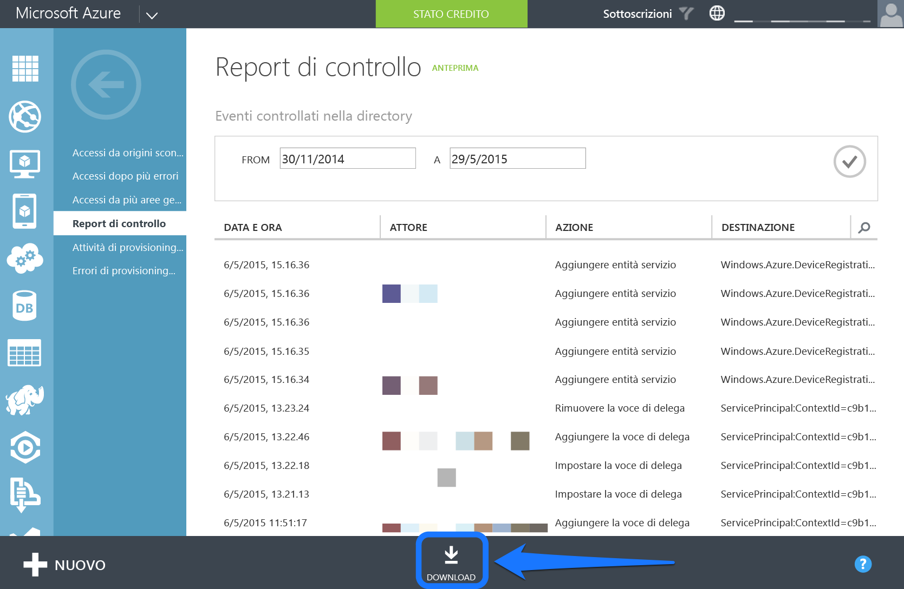
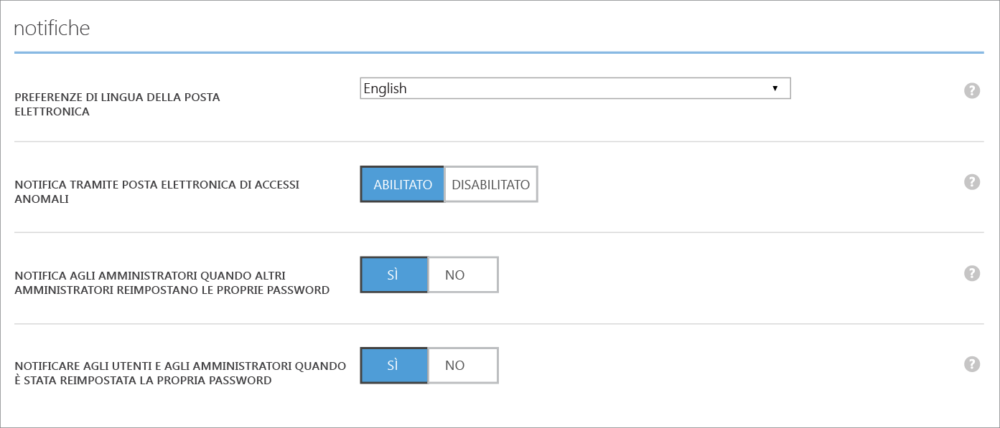
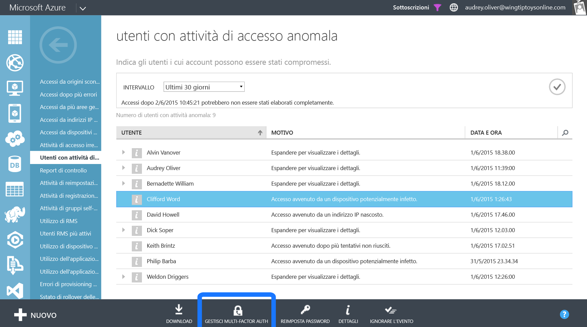

<properties
   pageTitle="Azure Active Directory Reporting: Introduzione | Microsoft Azure"
   description="Elenca i vari report disponibili nei report di Azure Active Directory"
   services="active-directory"
   documentationCenter=""
   authors="dhanyahk"
   manager="stevenpo"
   editor=""/>

<tags
   ms.service="active-directory"
   ms.devlang="na"
   ms.topic="get-started-article"
   ms.tgt_pltfrm="na"
   ms.workload="identity"
   ms.date="03/07/2016"
   ms.author="dhanyahk"/>

# Introduzione ad Azure Active Directory Reporting

## Che cos'è

Azure Active Directory (Azure AD) include la sicurezza, l’attività e i report di controllo per la directory. Di seguito è riportato un elenco dei report compresi:

### Report sulla sicurezza

- Accessi da origini sconosciute
- Accessi dopo più errori
- Accessi da più aree geografiche
- Accessi da indirizzi IP con attività sospette
- Attività di accesso irregolare
- Accessi da dispositivi potenzialmente infetti
- Utenti con anomalie dell'attività di accesso

### Report sull’attività

- Utilizzo dell'applicazione: riepilogo
- Utilizzo dell'applicazione: dettagliato
- Dashboard dell'applicazione
- Errori di provisioning dell'account
- Dispositivi dell’utente singolo
- Attività dell’utente singolo
- Report attività dei gruppi
- Report attività di registrazione per la reimpostazione password
- Attività di reimpostazione password

### Report di controllo

- Report di controllo della Directory

> [AZURE.TIP] Per ulteriori informazioni sul Report di AD Azure, consultare [Visualizzare i report di accesso e utilizzo](active-directory-view-access-usage-reports.md).

## Funzionamento

### Report sulla pipeline

La pipeline di report è costituita da tre passaggi principali. Ogni volta che un utente accede o si effettua l'autenticazione, si verifica quanto segue:

- In primo luogo, l'utente viene autenticato (con esito positivo o negativo) e il risultato viene archiviato nei database del servizio Azure Active Directory.
- A intervalli regolari, tutti gli accessi recenti vengono elaborati. A questo punto, la sicurezza e gli algoritmi relativi ad attività anomale eseguono la ricerca di attività sospette in tutti gli accessi recenti.
- Dopo l'elaborazione, i report vengono scritti, memorizzati nella cache e gestiti nel portale di Azure classico.

### Tempi per la generazione di report

A causa della grande quantità di autenticazioni e accessi elaborati dalla piattaforma di Azure AD, gli accessi più recenti elaborati sono, in media, di un'ora prima. In rari casi, ci potrebbero volere fino a 8 ore per elaborare gli accessi più recenti.

È possibile trovare l’accesso più recente elaborato esaminando il testo della Guida nella parte superiore di ogni report.

> [AZURE.TIP] Per ulteriori informazioni sul Report di Azure AD, consultare [Visualizzare i report di accesso e utilizzo](active-directory-view-access-usage-reports.md).

## Introduzione

### Accedere al portale di Azure classico.

Innanzitutto, è necessario accedere al [portale di Azure classico](https://manage.windowsazure.com).come amministratore globale o di conformità. Si deve anche essere un amministratore del servizio di sottoscrizione di Azure o CO-amministratore, o disporre della sottoscrizione Azure di "Accesso ad Azure AD"

### Passare al report

Per visualizzare i report, passare alla scheda report nella parte superiore della directory.

Se questa è la prima volta in cui vengono visualizzati i report, è necessario accettare una finestra di dialogo prima di poter visualizzare i report. Questo serve a verificare che agli amministratori dell'azienda sia consentito visualizzare i dati, che possono essere considerati informazioni riservate in alcuni paesi.

### Esplorare ogni report

Passare a ogni report per visualizzare i dati che raccolti e gli accessi elaborati. È possibile trovare un [elenco di tutti i report qui](active-directory-reporting-guide.md).

### Scaricare i report in formato CSV

Ogni report può essere scaricato come file CSV (valori delimitati da virgole). È possibile utilizzare questi file in Excel, PowerBI o programmi di analisi di terze parti per un'ulteriore analisi dei dati

Per scaricare tutti i report in un formato CSV, passare al report e fare clic su "Download" nella parte inferiore.

> [AZURE.TIP] Per ulteriori informazioni sul Report di AD Azure, consultare [Visualizzare i report di accesso e utilizzo](active-directory-view-access-usage-reports.md).

## Passaggi successivi

### Personalizzare gli avvisi per attività di accesso anomala.

Passare alla scheda "Configurazione" della directory.

Scorrere fino alla sezione "Notifiche".

Abilitare o disabilitare la sezione "Notifiche tramite posta elettronica di Accessi anomali".

### Integrazione con l'API di creazione report di Azure AD

Vedere la pagina relativa all'[Introduzione all'API di creazione report](active-directory-reporting-api-getting-started.md).

### Assegnare la Multi-Factor Authentication agli utenti.

Selezionare un utente in un report.

Fare clic sul pulsante "Abilita autenticazione a più fattori" nella parte inferiore della schermata.

> [AZURE.TIP] Per ulteriori informazioni sul Reporting AD Azure, consultare [Visualizzare i report di accesso e utilizzo](active-directory-view-access-usage-reports.md).

## Altre informazioni

### Eventi di controllo

Informazioni su quali eventi vengono controllati nella directory in [Eventi di controllo per il report di Azure Active Directory](active-directory-reporting-audit-events.md).

### Integrazione di API

Vedere [Introduzione all'API di Report](active-directory-reporting-api-getting-started.md) e [documentazione di riferimento API](https://msdn.microsoft.com/library/azure/mt126081.aspx).

### Ottenere un contatto

Inviare un messaggio di posta elettronica all'indirizzo [aadreportinghelp@microsoft.com](mailto:aadreportinghelp@microsoft.com) per commenti, richieste di assistenza o eventuali domande.

> [AZURE.TIP] Per ulteriori informazioni sul Report di AD Azure, consultare [Visualizzare i report di accesso e utilizzo](active-directory-view-access-usage-reports.md).

<!-----HONumber=AcomDC_0309_2016-->