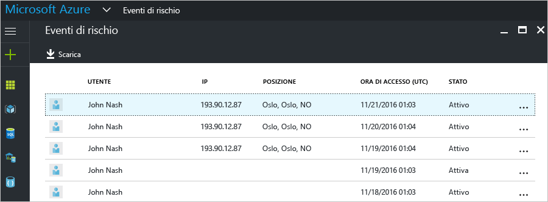
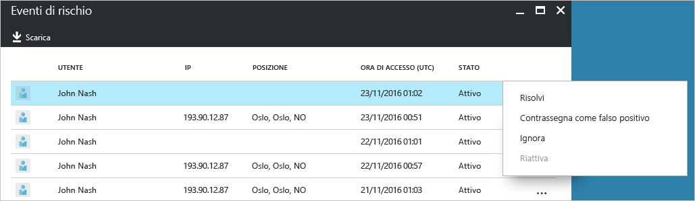
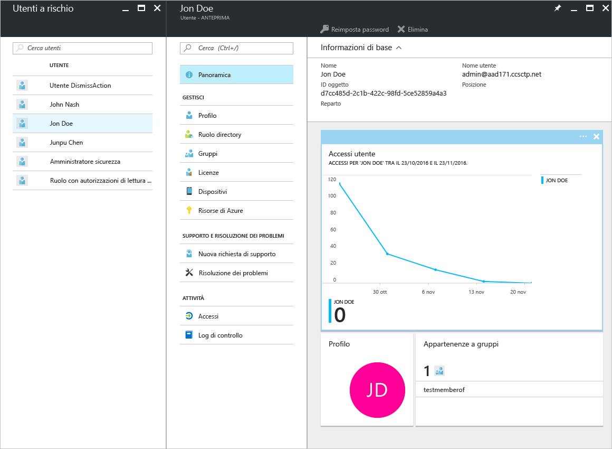

# Report di sicurezza in Azure Active Directory Gratuito e Azure Active Directory Basic (anteprima)

I report di sicurezza nell'[anteprima](active-directory-preview-explainer.md) di Azure Active Directory permettono di ottenere informazioni approfondite sulla probabile presenza di account utente compromessi nell'ambiente. 

Azure Active Directory rileva le azioni sospette correlate agli account utente. Per ogni azione rilevati viene creato un record denominato *evento di rischio*. Per altre informazioni, vedere [Azure Active Directory risk events](active-directory-identity-protection-risk-events.md) (Eventi di rischio di Azure Active Directory). 

Gli eventi di rischio rilevati vengono usati per calcolare:

- **Accessi a rischio**. Un accesso rischioso è indicativo di un tentativo di accesso che potrebbe essere stato eseguito da qualcuno che non è il legittimo proprietario di un account utente. Per informazioni dettagliate, vedere [Accessi a rischio](active-directory-identityprotection.md#risky-sign-ins). 

- **Utenti contrassegnati per il rischio**. Un utente rischioso è indicativo di un account utente che potrebbe essere stato compromesso. Per informazioni dettagliate, vedere [Utenti contrassegnati per il rischio](active-directory-identityprotection.md#users-flagged-for-risk).  

## Report sugli accessi a rischio

Azure Active Directory Gratuito e Basic includono un elenco di accessi a rischio rilevati e segnalati per gli utenti. Il report sugli eventi di rischio include le informazioni seguenti:

- **Utente**: nome dell'utente usato durante l'operazione di accesso.
- **IP**: indirizzo IP del dispositivo usato per connettersi ad Azure Active Directory.
- **Località**: località usata per connettersi ad Azure Active Directory.
- **Ora di accesso**: ora in cui è stato eseguito l'accesso.
- **Stato**: stato dell'accesso.

Il report offre la possibilità di scaricare i dati del report.

In base all'analisi dell'accesso a rischio è possibile inviare feedback ad Azure Active Directory eseguendo queste azioni:

- Risolvi
- Contrassegna come falso positivo
- Ignora
- Riattiva

Per informazioni dettagliate, vedere [Chiusura manuale degli eventi di rischio](active-directory-identityprotection.md#closing-risk-events-manually).

## Report sugli utenti a rischio

Azure Active Directory Gratuito include un elenco degli account utente che potrebbero essere stati compromessi. 

Facendo clic su un utente nell'elenco verrà aperto il pannello dei dati utente correlato.
Analizzare la cronologia di accesso degli utenti a rischio e reimpostare la password, se necessario.

## Passaggi successivi

- Per altre informazioni sulla creazione di report di Azure Active Directory, vedere [Guida alla creazione di report in Azure Active Directory](active-directory-reporting-guide.md).
- Per altre informazioni in merito, vedere [Azure Active Directory Identity Protection](active-directory-identityprotection.md).

<!--HONumber=Jan17_HO3-->

