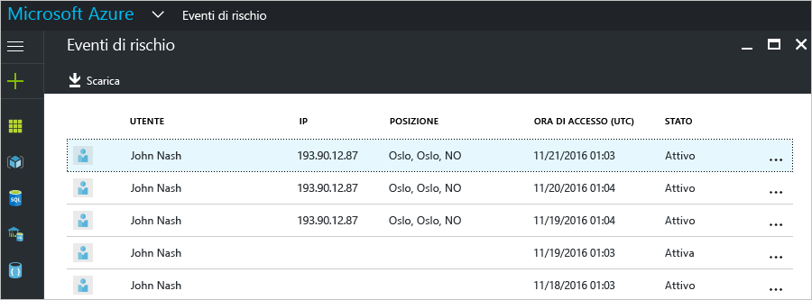
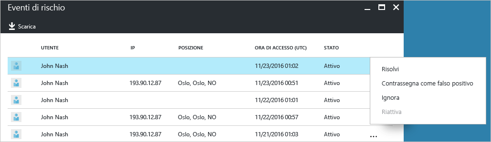
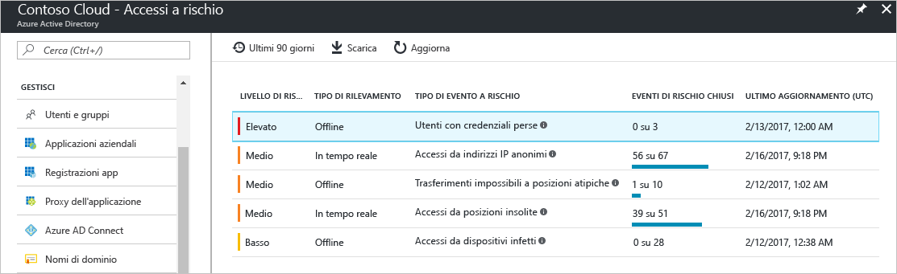
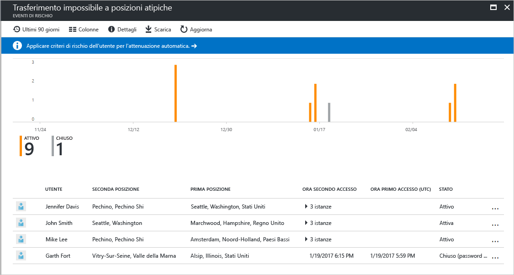
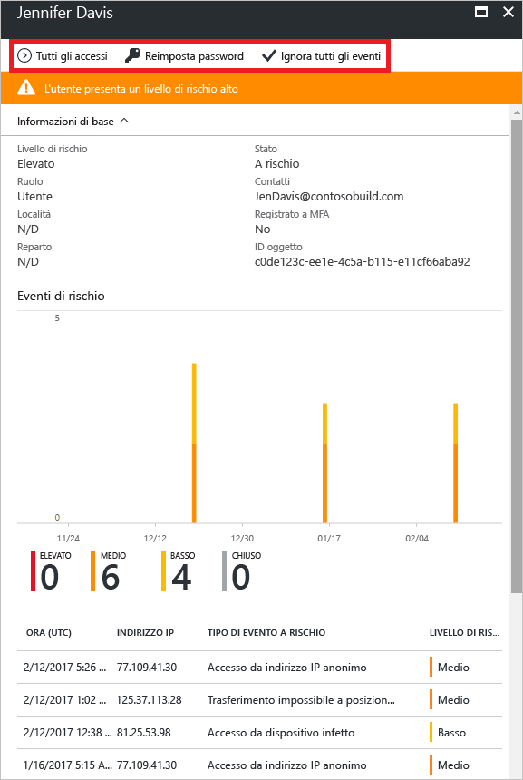
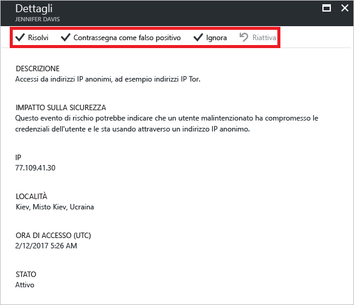

# Report degli accessi a rischio nel portale di Azure Active Directory, anteprima

I report di sicurezza nell'[anteprima](active-directory-preview-explainer.md) di Azure Active Directory permettono di ottenere informazioni approfondite sulla probabile presenza di account utente compromessi nell'ambiente. 

Azure Active Directory rileva le azioni sospette correlate agli account utente. Per ogni azione rilevati viene creato un record denominato *evento di rischio*. Per altre informazioni, vedere [Azure Active Directory risk events](active-directory-identity-protection-risk-events.md) (Eventi di rischio di Azure Active Directory). 

Gli eventi di rischio rilevati vengono usati per calcolare:

- **Accessi a rischio**. Un accesso rischioso è indicativo di un tentativo di accesso che potrebbe essere stato eseguito da qualcuno che non è il legittimo proprietario di un account utente. Per informazioni dettagliate, vedere [Accessi a rischio](active-directory-identityprotection.md#risky-sign-ins). 

- **Utenti contrassegnati per il rischio**. Un utente rischioso è indicativo di un account utente che potrebbe essere stato compromesso. Per informazioni dettagliate, vedere [Utenti contrassegnati per il rischio](active-directory-identityprotection.md#users-flagged-for-risk).  

Nel Portale di Azure, è possibile trovare i report di sicurezza nel pannello di **Azure Active Directory** nella sezione **Sicurezza**. 

## Versione gratuita e di base di Azure Active Directory

La versione gratuita e di base di Azure Active Directory offre un elenco di accessi a rischio rilevati per gli utenti. Il report sugli eventi di rischio include le informazioni seguenti:

- **Utente**: nome dell'utente usato durante l'operazione di accesso.
- **IP**: indirizzo IP del dispositivo usato per connettersi ad Azure Active Directory.
- **Località**: località usata per connettersi ad Azure Active Directory.
- **Ora di accesso**: ora in cui è stato eseguito l'accesso.
- **Stato**: stato dell'accesso.

Il report offre la possibilità di scaricare i dati del report.

In base all'analisi dell'accesso a rischio è possibile inviare feedback ad Azure Active Directory eseguendo queste azioni:

- Risolvi
- Contrassegna come falso positivo
- Ignora
- Riattiva

Per informazioni dettagliate, vedere [Chiusura manuale degli eventi di rischio](active-directory-identityprotection.md#closing-risk-events-manually).

## Versione Premium di Azure Active Directory

Il report degli accessi a rischio della versione Premium di Azure Active Directory offre:

- informazioni aggregate sui [tipi di evento di rischio](active-directory-identity-protection-risk-events.md) che sono stati rilevati

- un'opzione per scaricare il report

Quando si seleziona un evento di rischio, si ottiene la visualizzazione di un report dettagliato per questo evento di rischio che consente di:

- avere un'opzione per configurare i [criteri per la correzione del rischio per gli utenti](active-directory-identityprotection.md#user-risk-security-policy)  

- esaminare la cronologia di rilevamento per l'evento di rischio  

- esaminare l'elenco di utenti per cui è stato rilevato l'evento di rischio

- [chiudere manualmente gli eventi di rischio](active-directory-identityprotection.md#closing-risk-events-manually) o riattivare un evento di rischio chiuso manualmente. 

Quando si seleziona un utente, si ottiene la visualizzazione di un report dettagliato per questo utente che consente di:

- aprire le visualizzazioni di tutti gli accessi

- Reimpostare la password dell'utente

- eliminare tutti gli eventi

- ricercare la causa degli eventi a rischio segnalati per l'utente. 

Per ricercare la causa di un evento di rischio, selezionarlo dall'elenco.  
Verrà visualizzato il pannello **Dettagli** per questo evento di rischio. Nel pannello **Dettagli**, è possibile [chiudere manualmente un evento di rischio](active-directory-identityprotection.md#closing-risk-events-manually) o riattivare un evento di rischio chiuso manualmente. 

## Passaggi successivi

- Per altre informazioni in merito, vedere [Azure Active Directory Identity Protection](active-directory-identityprotection.md).

