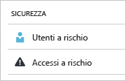
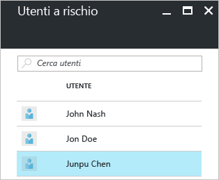
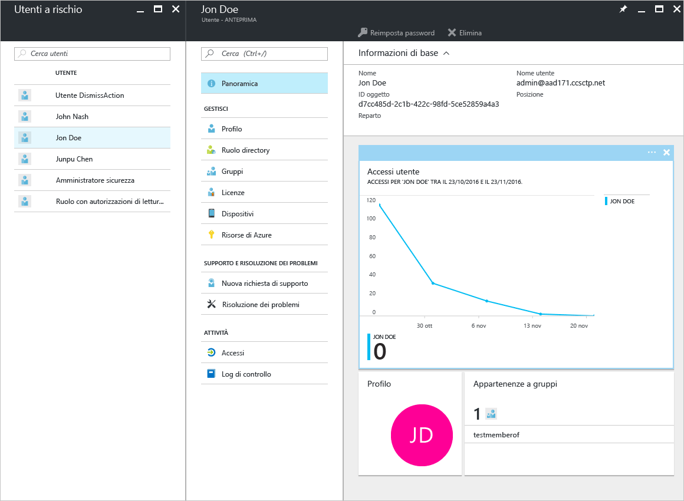
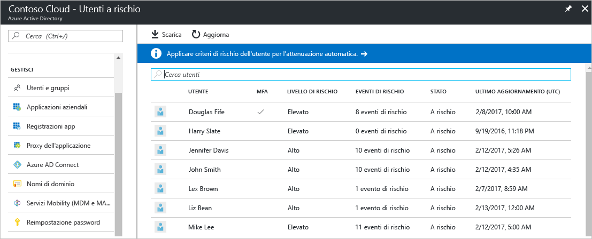
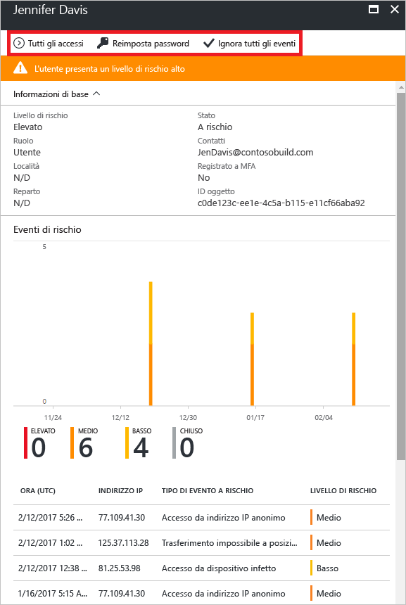
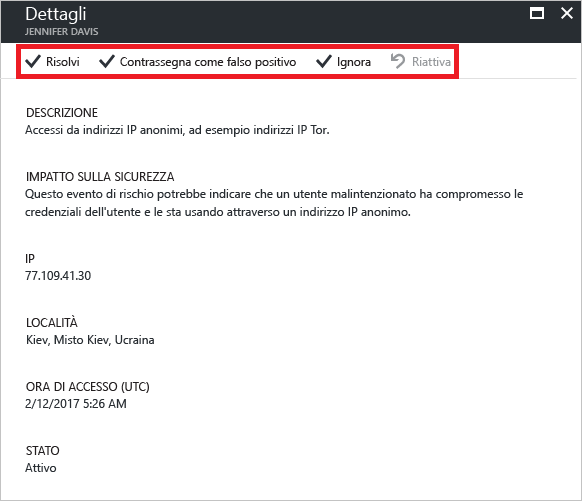

# Report di sicurezza Utenti contrassegnati per il rischio nel portale di Azure Active Directory

I report di sicurezza in Azure Active Directory (Azure AD) permettono di ottenere informazioni approfondite sulla probabile presenza di account utente compromessi nell'ambiente. 

Azure Active Directory rileva le azioni sospette correlate agli account utente. Per ogni azione rilevati viene creato un record denominato *evento di rischio*. Per altre informazioni, vedere [Eventi di rischio di Azure Active Directory](active-directory-identity-protection-risk-events.md). 

Gli eventi di rischio rilevati vengono usati per calcolare:

- **Accessi a rischio**. Un accesso rischioso è indicativo di un tentativo di accesso che potrebbe essere stato eseguito da qualcuno che non è il legittimo proprietario di un account utente. Per altre informazioni, vedere [Accessi a rischio](active-directory-identityprotection.md#risky-sign-ins). 

- **Utenti contrassegnati per il rischio**. Un utente rischioso è indicativo di un account utente che potrebbe essere stato compromesso. Per altre informazioni, vedere [Utenti contrassegnati per il rischio](active-directory-identityprotection.md#users-flagged-for-risk).  

Nel Portale di Azure, è possibile trovare i report di sicurezza nel pannello di **Azure Active Directory** nella sezione **Sicurezza**.  

## Licenza di Azure AD necessaria per accedere a un report sulla sicurezza  

Tutte le edizioni di Azure Active Directory offrono report sugli utenti contrassegnati per il rischio.  
Tuttavia, il livello di granularità dei report varia a seconda delle edizioni: 

- Nelle edizioni **Azure Active Directory Free e Basic**  è già incluso un elenco degli utenti contrassegnati per il rischio. 

- Nell'edizione **Azure Active Directory Premium 1** questo modello consente anche di esaminare alcuni degli eventi di rischio sottostanti che sono stati rilevati per ogni report. 

- L'edizione **Azure Active Directory Premium 2** offre informazioni più dettagliate su tutti gli eventi di rischio sottostanti e permette di configurare criteri di sicurezza che rispondono automaticamente a livelli di rischio configurati.

## Versione gratuita e di base di Azure Active Directory

Il report Utenti contrassegnati per il rischio nella versione gratuita e di base di Azure Active Directory offre un elenco degli account utente che potrebbero essere stati compromessi. 

Selezionando un utente verrà aperto il pannello dei dati utente correlati.
Analizzare la cronologia di accesso degli utenti a rischio e reimpostare la password, se necessario.

Questa finestra di dialogo offre la possibilità di:

- Scaricare il report

- Cercare gli utenti

## Versione Premium di Azure Active Directory

Il report Utenti contrassegnati per il rischio della versione Premium di Azure Active Directory offre:

- Un [elenco di account di utenti](active-directory-identityprotection.md#users-flagged-for-risk) che potrebbero essere stati compromessi 

- informazioni aggregate sui [tipi di evento di rischio](active-directory-identity-protection-risk-events.md) che sono stati rilevati

- Un'opzione per scaricare il report

- avere un'opzione per configurare i [criteri per la correzione del rischio per gli utenti](active-directory-identityprotection.md#user-risk-security-policy)  

Quando si seleziona un utente, si ottiene la visualizzazione di un report dettagliato per questo utente che consente di:

- aprire le visualizzazioni di tutti gli accessi

- Reimpostare la password dell'utente

- eliminare tutti gli eventi

- ricercare la causa degli eventi a rischio segnalati per l'utente. 

Per analizzare un evento di rischio, selezionarne uno nell'elenco per aprire il pannello **Dettagli** dell'evento di rischio. Nel pannello **Dettagli**, è possibile [chiudere manualmente un evento di rischio](active-directory-identityprotection.md#closing-risk-events-manually) o riattivare un evento di rischio chiuso manualmente. 

## Passaggi successivi

- Per altre informazioni in merito, vedere [Azure Active Directory Identity Protection](active-directory-identityprotection.md).

