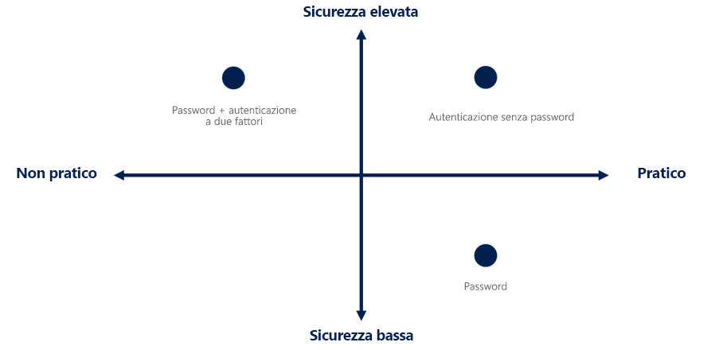

# Opzioni di autenticazione con password

Multi-factor authentication è un ottimo modo per proteggere l'organizzazione, ma gli utenti si sentono frustrati con il livello aggiuntivo oltre a dover ricordare le password. I metodi di autenticazione senza password sono più convenienti perché la password viene rimossa e sostituita da un elemento che si ha più o da un elemento che si conosce.

|   | Un elemento | Un elemento o una conoscenza |
| --- | --- | --- |
| Accesso senza password | Dispositivo Windows 10, telefono o chiave di sicurezza | Biometrico o PIN |

Ogni organizzazione ha esigenze diverse per quanto riguarda l'autenticazione. Microsoft offre tre opzioni di autenticazione con password:

- Windows Hello for Business
- App Microsoft Authenticator
- Chiavi di sicurezza FIDO2

## Windows Hello for Business

Windows Hello for business è ideale per gli Information Worker che dispongono di un proprio PC Windows designato. La biometria e il PIN sono direttamente collegati al PC dell'utente, che impedisce l'accesso da parte di utenti diversi dal proprietario. Con l'integrazione con l'infrastruttura a chiave pubblica e il supporto integrato per Single Sign-On (SSO), Windows Hello for business offre un metodo semplice e pratico per accedere facilmente alle risorse aziendali in locale e nel cloud.

La [Guida alla pianificazione](https://docs.microsoft.com/windows/security/identity-protection/hello-for-business/hello-planning-guide) di Windows Hello for business può essere usata per prendere decisioni sul tipo di distribuzione di Windows Hello for business e sulle opzioni che è necessario prendere in considerazione.

## App Microsoft Authenticator

Consentire al telefono del dipendente di diventare un metodo di autenticazione con password. È possibile che si stia già usando l'app Microsoft Authenticator come comoda opzione di autenticazione a più fattori, oltre a una password. Ma ora è disponibile come opzione senza password.

Ogni telefono iOS o Android viene trasformato in una credenziale complessa e senza password, consentendo agli utenti di accedere a qualsiasi piattaforma o browser ricevendo una notifica al telefono, abbinando un numero visualizzato sullo schermo a quello sul telefono e quindi usando la relativa biometrica ( touch o faccia) o PIN da confermare.

## Chiavi di sicurezza FIDO2

Le chiavi di sicurezza di FIDO2 sono un metodo di autenticazione senza password basato su standard unphishable che può provenire da qualsiasi fattore di forma. Fast Identity online (FIDO) è uno standard aperto per l'autenticazione con password. Consente a utenti e organizzazioni di sfruttare lo standard per accedere alle risorse senza nome utente o password usando una chiave di sicurezza esterna o una chiave della piattaforma incorporata in un dispositivo.

Per la versione di anteprima pubblica, i dipendenti possono usare le chiavi di sicurezza per accedere ai dispositivi Windows 10 aggiunti a Azure AD e ottenere l'accesso Single Sign-on alle risorse cloud e locali. Possono anche accedere ai browser supportati.

Sebbene esistano molte chiavi FIDO2 certificate dall'alleanza di FIDO, Microsoft richiede l'implementazione da parte del fornitore di alcune estensioni facoltative della specifica del protocollo client-to-Authenticator (CTAP) di FIDO2 per garantire la massima sicurezza e la migliore esperienza.

Una chiave di sicurezza **deve** implementare le seguenti funzionalità ed estensioni dal protocollo CTAP di FIDO2 per essere compatibile con Microsoft:

| # | Funzionalità/attendibilità dell'estensione | Perché questa funzionalità o estensione è necessaria? |
| --- | --- | --- |
| 1 | Chiave residente | Questa funzionalità consente la portabilità della chiave di sicurezza, in cui le credenziali sono archiviate nella chiave di sicurezza. |
| 2 | PIN client | Questa funzionalità consente di proteggere le credenziali con un secondo fattore e si applica alle chiavi di sicurezza che non dispongono di un'interfaccia utente. |
| 3 | HMAC-segreto | Questa estensione garantisce che sia possibile accedere al dispositivo quando è offline o in modalità aereo. |
| 4 | Più account per RP | Questa funzionalità garantisce la possibilità di usare la stessa chiave di sicurezza tra più servizi, ad esempio l'account Microsoft e Azure Active Directory. |

I provider seguenti offrono chiavi di sicurezza FIDO2 di diversi fattori di forma che sono noti come compatibili con l'esperienza senza password. Microsoft consiglia ai clienti di valutare le proprietà di sicurezza di queste chiavi contattando il fornitore e l'Alleanza FIDO.

| Provider | Contatto |
| --- | --- |
| Yubico | [https://www.yubico.com/support/contact/](https://www.yubico.com/support/contact/) |
| Feitian | [https://www.ftsafe.com/about/Contact_Us](https://www.ftsafe.com/about/Contact_Us) |
| HID | [https://www.hidglobal.com/contact-us](https://www.hidglobal.com/contact-us) |
| Ensurity | [https://www.ensurity.com/contact](https://www.ensurity.com/contact) |
| eWBM | [https://www.ewbm.com/support](https://www.ewbm.com/support) |
| AuthenTrend | [https://authentrend.com/about-us/#pg-35-3](https://authentrend.com/about-us/#pg-35-3) |

> [!NOTE]
> Se si acquista e si prevede di usare le chiavi di sicurezza basate su NFC, sarà necessario un lettore NFC supportato.

Se si è un fornitore e si desidera ottenere il dispositivo in questo elenco, contattare [Fido2Request@Microsoft.com](mailto:Fido2Request@Microsoft.com).

Le chiavi di sicurezza di FIDO2 sono un'ottima opzione per le aziende che hanno una sicurezza molto sensibile o hanno scenari o dipendenti che non sono disposti o in grado di usare il telefono come secondo fattore.

## Quali scenari funzionano con l'anteprima?

- Gli amministratori possono abilitare i metodi di autenticazione con password per il tenant
- Gli amministratori possono fare riferimento a tutti gli utenti o selezionare utenti/gruppi nel tenant per ogni metodo
- Gli utenti finali possono registrare e gestire questi metodi di autenticazione con password nel portale per gli account
- Gli utenti finali possono accedere con questi metodi di autenticazione senza password
   - Microsoft Authenticator app: funzionerà in scenari in cui viene usata l'autenticazione Azure AD, inclusi tutti i browser, durante l'installazione di Windows 10 fuori programma (OOBE) e con app per dispositivi mobili integrate in qualsiasi sistema operativo.
   - Chiavi di sicurezza: funzionerà sulla schermata di blocco per Windows 10 e il Web in browser supportati come Microsoft Edge.

## Passaggi successivi

[Abilitare le opzioni di passwordlesss della chiave di sicurezza FIDO2 nell'organizzazione](howto-authentication-passwordless-security-key.md)

[Abilita le opzioni per le password basate su telefono nell'organizzazione](howto-authentication-passwordless-phone.md)

### Collegamenti esterni

[FIDO Alliance](https://fidoalliance.org/)

[Specifica FIDO2 CTAP](https://fidoalliance.org/specs/fido-v2.0-id-20180227/fido-client-to-authenticator-protocol-v2.0-id-20180227.html)
