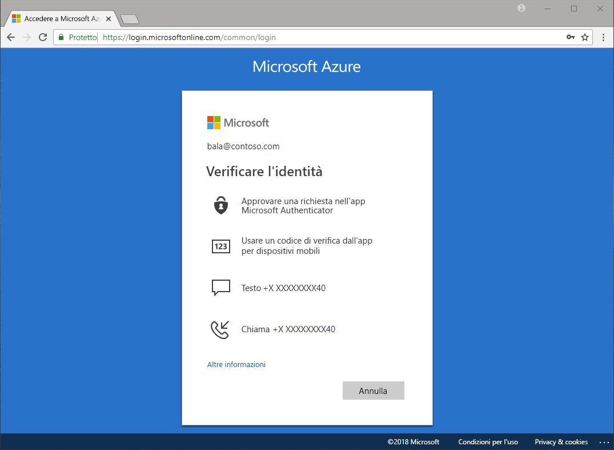

# Quali metodi sono disponibili per l'autenticazione?

Spesso i mezzi di informazione riportano casi di furti di password e identità compromesse. Richiedere un secondo fattore in aggiunta a una password aumenta immediatamente la sicurezza dell'organizzazione. Microsoft Azure Active Directory (Azure AD) include funzionalità, come Azure Multi-Factor Authentication (Azure MFA) e la reimpostazione della password self-service di Azure AD, per consentire agli amministratori di proteggere le organizzazioni e gli utenti con metodi di autenticazione aggiuntivi.

Quando un utente deve accedere a un'applicazione sensibile, reimpostare la password o abilitare Windows Hello, potrebbe essere richiesto di fornire un'ulteriore conferma per verificarne l'identità.

La verifica aggiuntiva può avvenire tramite metodi di autenticazione quali:

* Un codice fornito in un messaggio di posta elettronica o SMS
* Una chiamata telefonica
* Una notifica o un codice sul telefono
* Risposte alle domande di sicurezza

Azure Multi-Factor Authentication e la reimpostazione della password self-service di Azure AD consentono agli amministratori di controllare la configurazione, i criteri, il monitoraggio e i report tramite Azure AD e portale di Azure per proteggere le organizzazioni.

## Reimpostazione della password self-service

La reimpostazione della password self-service offre agli utenti la possibilità di reimpostare la propria password, senza alcun intervento da parte dell'amministratore, quando e dove necessario.

> [!VIDEO https://www.youtube.com/embed/hc97Yx5PJiM]

La reimpostazione della password self-service include:

* **Modifica della password:**: l'utente conosce la password, vuole modificarla.
* **Reimpostazione della password:** l'utente non riesce a eseguire l'accesso e vuole reimpostare la password usando uno o più metodi di autenticazione approvati.
* **Sblocco dell'account:** l'utente non può eseguire l'accesso perché l'account è bloccato e vuole sbloccarlo usando uno o più metodi di autenticazione approvati.

## Multi-Factor Authentication

Azure Multi-Factor Authentication (MFA) è una soluzione di verifica in due passaggi di Microsoft. Usando metodi di autenticazione approvati dell'amministratore, Azure MFA contribuisce a salvaguardare l'accesso a dati e applicazioni rispondendo alla richiesta degli utenti di poter usare un processo di accesso semplice.

## Passaggi successivi

Il passaggio successivo consiste nella configurazione della reimpostazione della password self-service e di Azure Multi-Factor Authentication.

Per iniziare a usare la reimpostazione della password self-service, vedere l'[articolo introduttivo su come abilitare la reimpostazione della password self-service](quickstart-sspr.md).

Per altre informazioni sulla reimpostazione della password self-service, vedere l'articolo [Approfondimenti sulla reimpostazione della password self-service in Azure AD](concept-sspr-howitworks.md)

Per altre informazioni su Azure Multi-Factor Authentication, vedere l'articolo [Funzionamento di Azure Multi-Factor Authentication](concept-mfa-howitworks.md)