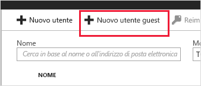
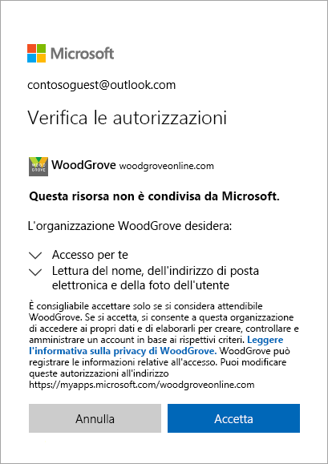

# Guida introduttiva: Aggiungere utenti guest alla directory nel portale di Azure

È possibile invitare chiunque a collaborare con l'organizzazione aggiungendolo alla directory come utente guest. È quindi possibile inviare un messaggio di posta elettronica di invito contenente un collegamento di riscatto oppure inviare un collegamento diretto a un'app che si vuole condividere. Gli utenti guest possono accedere con la propria identità aziendale, dell'istituto di istruzione o di social networking.

In questa guida introduttiva si aggiungerà un nuovo utente guest ad Azure AD, si invierà un invito e si illustrerà il processo di riscatto dell'invito da parte dell'utente guest.

Se non si ha una sottoscrizione di Azure, creare un [account gratuito](https://azure.microsoft.com/free/?WT.mc_id=A261C142F) prima di iniziare.

## Prerequisiti

Per completare lo scenario in questa esercitazione, sono necessari gli elementi seguenti:

 - Un ruolo che consenta di creare utenti nella directory del tenant, ad esempio il ruolo Amministratore globale o uno dei ruoli della directory di amministratore con autorizzazioni limitate.
 - Un account di posta elettronica valido che sia possibile aggiungere alla directory del tenant e usare per ricevere il messaggio di invito di test.

## Aggiungere un nuovo utente guest in Azure AD

1. Accedere al [portale di Azure](https://portal.azure.com/) come amministratore di Azure AD.
2. Nel riquadro sinistro selezionare **Azure Active Directory**.
3.  In **Gestisci** selezionare **Utenti**.

    

4.  Selezionare **Nuovo utente guest**.

    

5.  In **Nome utente** immettere l'indirizzo di posta elettronica dell'utente esterno. In **Includi un messaggio personale con l'invito** digitare un messaggio di benvenuto. 

    

6. Selezionare **Invita** per inviare automaticamente l'invito all'utente guest. Viene visualizzata una notifica in alto a destra con il messaggio **L'utente è stato invitato**. 
7.  Dopo aver inviato l'invito, l'account utente viene automaticamente aggiunto alla directory come guest.

## Assegnare un'app all'utente guest
Aggiungere l'app Salesforce nel tenant di test e assegnare all'app l'utente guest di test.
1.  Accedere al portale di Azure come amministratore di Azure AD.
2.  Nel riquadro sinistro selezionare **Applicazioni aziendali**.
3.  Selezionare **Nuova applicazione**.
4. In **Aggiungi dalla raccolta** cercare **Salesforce** e selezionarla.

    
5. Selezionare **Aggiungi**.
6. In **Gestisci** selezionare **Single Sign-On** e in **Modalità Single Sign-On** selezionare **Accesso basato su password** e fare clic su **Salva**.
7. In **Gestisci** selezionare **Utenti e gruppi** > **Aggiungi utente** > **Utenti e gruppi**.
8. Usare la casella di ricerca per cercare l'utente di test (se necessario) e selezionare l'utente di test nell'elenco. Quindi fare clic su **Seleziona**.
9. Selezionare **Assegna**. 

## Accettare l'invito
Accedere ora come utente guest per visualizzare l'invito.
1.  Accedere all'account di posta elettronica dell'utente guest di test.
2.  Nella cartella Posta in arrivo cercare il messaggio "You're invited" ("Sei invitato").

    

3.  Nel corpo del messaggio di posta elettronica selezionare **Get Started** (Inizia). Nel browser viene aperta la pagina **Verifica le autorizzazioni**. 

    

4. Selezionare **Accetto**. Viene visualizzato il pannello di accesso, in cui sono elencate le applicazioni a cui può accedere l'utente guest.

## Pulire le risorse
Quando non sono più necessari, eliminare l'utente guest di test e l'app di test.
1.  Accedere al portale di Azure come amministratore di Azure AD.
2.  Nel riquadro sinistro selezionare **Azure Active Directory**.
3.  In **Gestisci** selezionare **Applicazioni aziendali**.
4.  Aprire l'applicazione **Salesforce** e quindi selezionare **Elimina**.
5.  Nel riquadro sinistro selezionare **Azure Active Directory**.
6.  In **Gestisci** selezionare **Utenti**.
7.  Selezionare l'utente di test e quindi selezionare **Elimina utente**.

## Passaggi successivi
In questa esercitazione è stato creato un utente guest nel portale di Azure ed è stato inviato un invito a condividere un'app. È stato quindi illustrato il processo di riscatto dal punto di vista dell'utente guest ed è stato verificato che l'app fosse presente nel pannello di accesso dell'utente guest. Per altre informazioni sull'aggiunta di utenti guest per la collaborazione, vedere [Aggiungere utenti di Collaborazione B2B di Azure Active Directory nel portale di Azure](add-users-administrator.md).