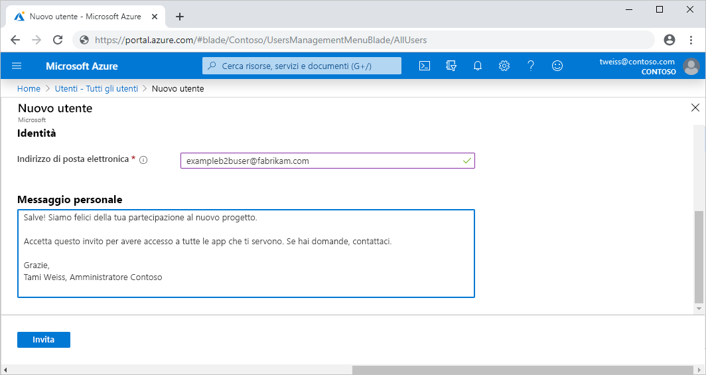

# Che cos'è l'accesso utente guest in Azure Active Directory B2B?

Collaborazione B2B (Business-to-Business) di Azure Active Directory consente di condividere in modo sicuro le applicazioni e i servizi della propria azienda con utenti guest di altre organizzazioni, senza perdere il controllo sui dati aziendali. Permette inoltre di lavorare in modo sicuro e protetto con partner esterni, di piccole o grandi dimensioni, che abbiano o meno Azure AD o un reparto IT. Un semplice processo di invito e riscatto consente infatti ai partner di accedere alle risorse aziendali usando le credenziali personali. Gli sviluppatori possono inoltre usare le API B2B di Azure AD per personalizzare il processo di invito o scrivere applicazioni come i portali per l'iscrizione self-service.

Guardare il video per scoprire come collaborare in modo sicuro con utenti guest invitandoli ad accedere alle app e ai servizi aziendali usando le identità personali.

Il video seguente fornisce un'utile panoramica.

>[!VIDEO https://www.youtube.com/embed/AhwrweCBdsc]

   > [!IMPORTANT]
   > **A partire dal 31 marzo 2021** Microsoft non supporterà più il riscatto degli inviti tramite la creazione di account e tenant di Azure AD non gestiti per gli scenari di collaborazione B2B. Nel frattempo, i clienti sono invitati ad acconsentire esplicitamente all'[autenticazione con passcode monouso tramite posta elettronica](one-time-passcode.md). Saremo lieti di ricevere feedback su questa funzionalità di anteprima pubblica e di creare ancora altri modi per collaborare.

## Collaborare con i partner usando le relative identità

Con Azure AD B2B il partner usa la propria soluzione di gestione delle identità e l'organizzazione, quindi, non ha alcun sovraccarico amministrativo esterno.

- Il partner usa le proprie identità e credenziali: Azure AD non è obbligatorio.
- Non è necessario gestire password o account esterni.
- Non è necessario sincronizzare gli account o gestire i cicli di vita degli account.  

## Invitare utenti guest con un semplice processo di invito e riscatto

Gli utenti guest accedono alle app e ai servizi dell'organizzazione con le proprie identità aziendali, dell'istituto di istruzione o di social networking. Se l'utente guest non dispone di un account Microsoft o di un account Azure AD, ne viene creato uno al momento del riscatto dell'invito. 

- Invitare gli utenti guest usando l'identità di posta elettronica che hanno scelto.
- Inviare un collegamento diretto a un'app o inviare un invito al pannello di accesso dell'utente guest.
- Gli utenti guest accedono seguendo una semplice procedura di riscatto.

## Usare criteri per condividere in modo sicuro app e servizi

È possibile usare criteri di autorizzazione per proteggere i contenuti aziendali. Possono essere applicati criteri di accesso condizionale, ad esempio l'autenticazione a più fattori:

- A livello di tenant.
- A livello di applicazione.
- Per utenti guest specifici per proteggere dati e applicazioni aziendali.

## Aggiungere facilmente utenti guest nel portale di Azure AD

Gli amministratori possono aggiungere facilmente utenti guest all'organizzazione nel portale di Azure.

- Creare un nuovo utente guest in Azure AD, analogamente a come è stato aggiunto un nuovo utente.
- L'utente guest riceve immediatamente un invito personalizzabile che gli consente di accedere al proprio pannello di accesso.
- Gli utenti guest nella directory possono essere assegnati ad app o gruppi.  

## Consentire ai proprietari di un'applicazione e di un gruppo di gestire i relativi utenti guest

È possibile delegare la gestione degli utenti guest ai proprietari delle applicazioni in modo che possano aggiungere direttamente utenti guest a qualsiasi applicazione vogliano condividere, anche se non è un'applicazione Microsoft.

- Gli amministratori configurano la gestione self-service dell'app e del gruppo.
- Gli utenti non amministratori usano il proprio [pannello di accesso](https://myapps.microsoft.com) per aggiungere utenti guest ad applicazioni o gruppi.

## Personalizzare l'esperienza di onboarding per gli utenti guest B2B

È possibile personalizzare il caricamento di partner esterni in base alle esigenze dell'organizzazione.

- Usare [Gestione entitlement di Azure AD](https://docs.microsoft.com/azure/active-directory/governance/entitlement-management-overview) per configurare i criteri che [gestiscono l'accesso per gli utenti esterni](https://docs.microsoft.com/azure/active-directory/governance/entitlement-management-external-users#how-access-works-for-external-users).
- È possibile usare le [API di invito di Collaborazione B2B](https://developer.microsoft.com/graph/docs/api-reference/v1.0/resources/invitation) per personalizzare le esperienze di onboarding.

## Passaggi successivi

- [Linee guida sulla Collaborazione B2B di Azure AD](licensing-guidance.md)
- [Aggiungere utenti guest di Collaborazione B2B nel portale](add-users-administrator.md)
- [Panoramica sul processo di riscatto di un invito](redemption-experience.md)
- È sempre possibile mettersi in contatto con il team di prodotto per eventuali commenti, confronti e suggerimenti tramite [Microsoft Tech Community](https://techcommunity.microsoft.com/t5/Azure-Active-Directory-B2B/bd-p/AzureAD_B2b).
