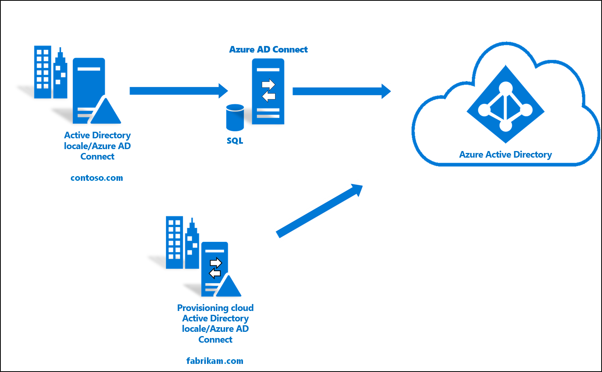

# Integrare una foresta esistente e una nuova con un singolo tenant di Azure AD

Questa esercitazione illustra come aggiungere il provisioning cloud in un ambiente ibrido di gestione delle identità esistenti. 

È possibile usare l'ambiente creato in questa esercitazione a scopo di test per acquisire una maggiore familiarità con il funzionamento di una soluzione ibrida di gestione delle identità. 

In questo scenario una foresta esistente viene sincronizzata con un tenant di Azure AD tramite il servizio di sincronizzazione di Azure AD Connect. Ed è presente una nuova foresta che si vuole sincronizzare con lo stesso tenant di Azure AD. Per la nuova foresta verrà configurato il provisioning cloud. 

## Prerequisiti
### Nell'interfaccia di amministrazione di Azure Active Directory

1. Creare un account amministratore globale di tipo solo cloud nel tenant di Azure AD. In questo modo è possibile gestire la configurazione del tenant in caso di errore o mancata disponibilità dei servizi locali. Informazioni su come [aggiungere un account amministratore globale di tipo solo cloud](../active-directory-users-create-azure-portal.md). Il completamento di questo passaggio è fondamentale ed evita di rimanere bloccati fuori dal tenant.
2. Aggiungere uno o più [nomi di dominio personalizzati](../active-directory-domains-add-azure-portal.md) al tenant di Azure AD. Gli utenti possono accedere usando uno di questi nomi di dominio.

### Nell'ambiente locale

1. Identificare un server host aggiunto al dominio che esegue Windows Server 2012 R2 o versione successiva con almeno 4 GB di RAM e il runtime di .NET 4.7.1 o versione successiva 

2. Se è presente un firewall tra i server e Azure AD, è necessario configurare gli elementi seguenti:
   - Assicurarsi che gli agenti possano effettuare richieste *in uscita* ad Azure AD sulle porte seguenti:

     | Numero della porta | Uso |
     | --- | --- |
     | **80** | Scarica gli elenchi di revoche di certificati (CRL) durante la convalida del certificato SSL |
     | **443** | Gestisce tutte le comunicazioni in uscita con il servizio |
     | **8080** (facoltativo) | Se la porta 443 non è disponibile, gli agenti di autenticazione segnalano il proprio stato ogni dieci minuti attraverso la porta 8080. Lo stato viene visualizzato nel portale di Azure AD. La porta 8080 _non_ viene usata per l'accesso degli utenti. |
     
     Se il firewall applica regole in base agli utenti di origine, aprire queste porte per il traffico proveniente da servizi di Windows in esecuzione come servizi di rete.
   - Se il firewall o il proxy consente di specificare suffissi sicuri, aggiungere connessioni a **\*.msappproxy.net** e **\*.servicebus.windows.net**. In caso contrario, è necessario consentire l'accesso agli [intervalli IP del data center di Azure](https://www.microsoft.com/download/details.aspx?id=41653), che vengono aggiornati ogni settimana.
   - Gli agenti devono poter accedere a **login.windows.net** e **login.microsoftonline.net** per la registrazione iniziale. Aprire il firewall anche per questi URL.
   - Per la convalida del certificato, sbloccare questi URL: **mscrl.microsoft.com:80**, **crl.microsoft.com:80**, **ocsp.msocsp.com:80** e **www\.microsoft.com:80**. Poiché vengono usati per la convalida del certificato con altri prodotti Microsoft, questi URL potrebbero essere già sbloccati.

## Installare l'agente di provisioning cloud di Azure AD Connect
1. Accedere al server aggiunto al dominio.  Se si usa l'esercitazione [Ambiente di AD e Azure di base](tutorial-basic-ad-azure.md), sarà DC1.
2. Accedere al portale di Azure con le credenziali di amministratore globale solo cloud.
3. A sinistra selezionare **Azure Active Directory**, fare clic su **Azure AD Connect** e al centro selezionare **Gestione del provisioning (anteprima)** . 
 
4. Fare clic su "Scarica l'agente"
5. Eseguire l'agente di provisioning cloud di Azure AD Connect
6. Nella schermata iniziale **accettare** le condizioni di licenza e fare clic su **Installa**. 
 

7. Al termine dell'operazione verrà avviata la configurazione guidata.  Accedere con l'account amministratore globale di Azure AD.  Si noti che se è abilitata la sicurezza avanzata di Internet Explorer, l'accesso verrà bloccato.  In tal caso, chiudere l'installazione, disabilitare la sicurezza avanzata di Internet Explorer in Server Manager e fare clic su **AAD Connect Provisioning Agent Wizard** (Configurazione guidata dell'agente di provisioning AAD Connect) per riavviare l'installazione.
8. Nella schermata **Connect Active Directory** (Connetti Active Directory) fare clic su **Aggiungi directory** quindi accedere con l'account amministratore di dominio di Active Directory.  NOTA:  L'account amministratore di dominio non dovrebbe avere requisiti per la modifica della password. Se la password scade o viene cambiata, sarà necessario riconfigurare l'agente con le nuove credenziali. Questa operazione aggiungerà la directory locale.  Fare clic su **Avanti**. 
 

9. Nella schermata **Configurazione completata** fare clic su **Conferma**.  Questa operazione registrerà e riavvierà l'agente. 
 

10. Al termine dell'operazione verrà visualizzato un avviso: **Your agent configuration was successfully verified** (La configurazione dell'agente è stata verificata).  È possibile fare clic su **Esci**. 
 
11. Se è ancora visualizzata la schermata iniziale, fare clic su **Chiudi**.

## Verificare l'installazione dell'agente
La verifica dell'agente si esegue nel portale di Azure e nel server locale che esegue l'agente.

### Verifica dell'agente nel portale di Azure
Per verificare se l'agente viene visto da Azure, seguire questa procedura:

1. Accedere al portale di Azure.
2. A sinistra selezionare **Azure Active Directory**, fare clic su **Azure AD Connect** e al centro selezionare **Gestione del provisioning (anteprima)** . 
 

3.  Nella schermata **Provisioning di Azure AD (anteprima)** fare clic su **Verifica tutti gli agenti**.
 
 
4. Nella **schermata degli agenti di provisioning locali** verranno visualizzati gli agenti installati.  Verificare che l'agente in questione sia presente e contrassegnato come **attivo**.
 

### Nel server locale
Per verificare se l'agente è in esecuzione, seguire questa procedura:

1.  Accedere al server con un account amministratore
2.  Aprire **Servizi** passando all'opzione oppure tramite Start/Esegui/Services.msc.
3.  In **Servizi** assicurarsi che siano presenti i servizi **Microsoft Azure AD Connect Agent Updater** e **Microsoft Azure AD Connect Provisioning Agent** e che il relativo stato sia **In esecuzione**.

## Configurare il provisioning cloud di Azure AD Connect
 Per configurare il provisioning, seguire questa procedura

1.  Accedere al portale di Azure AD.
2.  Fare clic su **Azure Active Directory**
3.  Fare clic su **Azure AD Connect**
4.  Selezionare **Gestione del provisioning (anteprima)** 

5.  Fare clic su **Nuova configurazione**

7.  Nella schermata di configurazione, immettere un valore per **Messaggio di posta elettronica di notifica**, spostare il selettore su **Abilita** e fare clic su **Salva**.

1.  Lo stato della configurazione dovrebbe ora essere **Integro**.

## Verificare che gli utenti siano stati creati e che la sincronizzazione sia in esecuzione
A questo punto verificare che gli utenti presenti nella directory locale siano stati sincronizzati e che ora siano inclusi nel tenant di Azure AD.  Per essere completata, questa operazione può richiedere alcune ore.  Per verificare che gli utenti siano sincronizzati, eseguire le operazioni seguenti.

1. Selezionare il [portale di Azure](https://portal.azure.com) e accedere con un account che dispone di una sottoscrizione di Azure.
2. A sinistra selezionare **Azure Active Directory**
3. In **Gestisci** selezionare **Utenti**.
4. Verificare che i nuovi utenti siano visualizzati nel tenant 
 

## Testare l'accesso con uno degli utenti

1. Passare a [https://myapps.microsoft.com](https://myapps.microsoft.com)
2. Accedere con uno degli account utente creati nel nuovo tenant.  Per accedere, sarà necessario usare il formato seguente: (user@domain.onmicrosoft.com). Usare la stessa password che l'utente usa per accedere in locale. 
    

La configurazione di un ambiente ibrido di gestione delle identità è stata completata. A questo punto è possibile usare questo ambiente a scopo di test o per acquisire familiarità con le funzionalità di Azure.

## Passaggi successivi 

- [Cos'è il provisioning?](what-is-provisioning.md)
- [Che cos'è il provisioning cloud di Azure AD Connect?](what-is-cloud-provisioning.md)
