# Esercitazione: integrare una singola foresta con un singolo tenant di Azure AD

Questa esercitazione illustra la creazione di un ambiente di identità ibrido usando Azure Active Directory (Azure AD) connettere il provisioning cloud.

È possibile usare l'ambiente creato in questa esercitazione per i test o per acquisire familiarità con il provisioning cloud.

## Prerequisiti
### Nell'interfaccia di amministrazione di Azure Active Directory

1. Creare un account amministratore globale di tipo solo cloud nel tenant di Azure AD. In questo modo è possibile gestire la configurazione del tenant in caso di errore o mancata disponibilità dei servizi locali. Informazioni su come [aggiungere un account amministratore globale di tipo solo cloud](../active-directory-users-create-azure-portal.md). Il completamento di questo passaggio è fondamentale ed evita di rimanere bloccati fuori dal tenant.
2. Aggiungere uno o più [nomi di dominio personalizzati](../active-directory-domains-add-azure-portal.md) al tenant di Azure AD. Gli utenti possono accedere usando uno di questi nomi di dominio.

### Nell'ambiente locale

1. Identità un server host aggiunto al dominio che esegue Windows Server 2012 R2 o versione successiva con almeno 4 GB di RAM e .NET 4.7.1 + Runtime 

2. Se è presente un firewall tra i server e Azure AD, è necessario configurare gli elementi seguenti:
   - Verificare che gli agenti possano effettuare richieste in *uscita* per Azure ad sulle seguenti porte:

     | Numero della porta | Uso |
     | --- | --- |
     | **80** | Scarica gli elenchi di revoche di certificati (CRL) durante la convalida del certificato SSL |
     | **443** | Gestisce tutte le comunicazioni in uscita con il servizio |
     | **8080** (facoltativo) | Gli agenti segnalano il proprio stato ogni 10 minuti sulla porta 8080, se la porta 443 non è disponibile. Lo stato viene visualizzato nel portale di Azure AD. La porta 8080 _non_ viene usata per l'accesso degli utenti. |
     
     Se il firewall applica regole in base agli utenti di origine, aprire queste porte per il traffico proveniente da servizi di Windows in esecuzione come servizi di rete.
   - Se il firewall o il proxy consente di specificare suffissi sicuri, aggiungere connessioni t a **\*. msappproxy.NET** e **\*. ServiceBus.Windows.NET**. In caso contrario, è necessario consentire l'accesso agli [intervalli IP del data center di Azure](https://www.microsoft.com/download/details.aspx?id=41653), che vengono aggiornati ogni settimana.
   - Gli agenti devono accedere a **login.Windows.NET** e **login.microsoftonline.com** per la registrazione iniziale. Aprire il firewall anche per questi URL.
   - Per la convalida del certificato, sbloccare gli URL seguenti: **mscrl.Microsoft.com:80**, **CRL.Microsoft.com:80**, **OCSP.msocsp.com:80**e **www\.Microsoft.com:80**. Poiché vengono usati per la convalida del certificato con altri prodotti Microsoft, questi URL potrebbero essere già sbloccati.

## Installare l'agente di provisioning Azure AD Connect
1. Accedere al server aggiunto al dominio.  Se si usa l'esercitazione di [base di Active Directory e dell'ambiente Azure](tutorial-basic-ad-azure.md) , sarà DC1.
2. Accedere al portale di Azure usando le credenziali di amministratore globale solo cloud.
3. A sinistra selezionare **Azure Active Directory**, fare clic su **Azure ad Connect**e al centro selezionare **Gestisci provisioning (anteprima)** .

   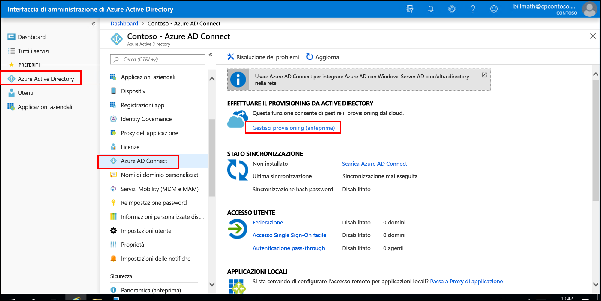

4. Fare clic su **Scarica agente**.
5. Eseguire l'agente di provisioning di Azure AD Connect.
6. Nella schermata iniziale **accettare** le condizioni di licenza e fare clic su **Installa**.

   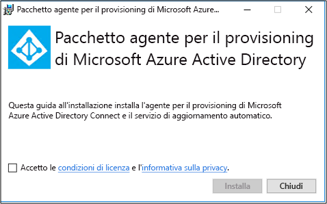

7. Al termine dell'operazione verrà avviata la configurazione guidata.  Accedere con l'account amministratore globale Azure AD.  Si noti che se è abilitata la sicurezza avanzata di IE, l'accesso verrà bloccato.  In tal caso, chiudere l'installazione, disabilitare la sicurezza avanzata di IE in Server Manager e fare clic sulla **creazione guidata dell'agente di provisioning di AAD Connect** per riavviare l'installazione.
8. Nella schermata **connetti Active Directory** fare clic su **Aggiungi directory** , quindi accedere con l'account amministratore di dominio Active Directory.  Nota: l'account amministratore di dominio non deve avere requisiti per la modifica della password. Se la password scade o viene modificata, sarà necessario riconfigurare l'agente con le nuove credenziali. Questa operazione aggiungerà la directory locale.  Fare clic su **Next** (Avanti).

   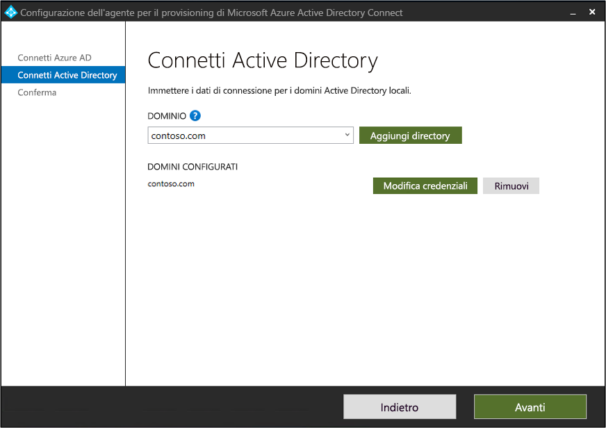

9. Nella schermata **Configurazione completata** fare clic su **conferma**.  Questa operazione registrerà e riavvierà l'agente.

   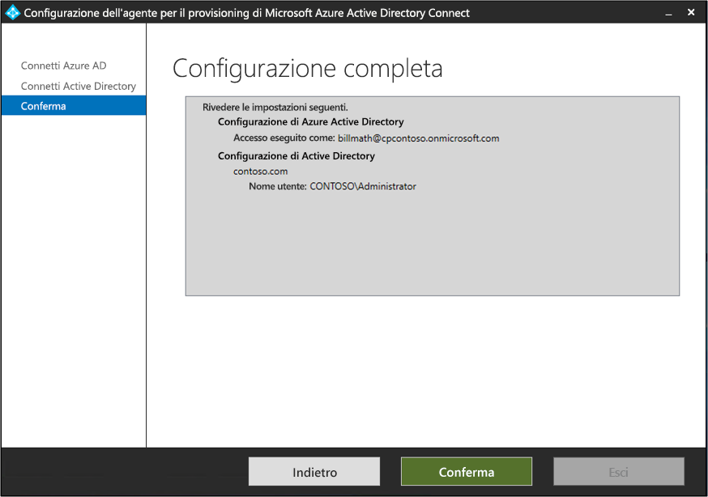

10. Al termine dell'operazione verrà visualizzato un avviso: **la configurazione dell'agente è stata verificata correttamente.**  È possibile fare clic su **Esci**. 
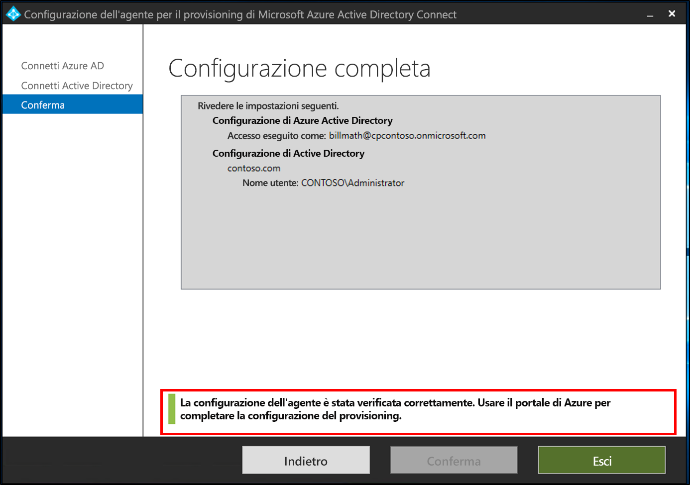 
11. Se viene ancora visualizzata la schermata iniziale iniziale, fare clic su **Chiudi**.

## Verificare l'installazione dell'agente
La verifica dell'agente viene eseguita nel portale di Azure e nel server locale in cui è in esecuzione l'agente.

### Verifica dell'agente portale di Azure
Per verificare che l'agente sia visualizzato da Azure, attenersi alla procedura seguente:

1. Accedere al portale di Azure.
2. A sinistra selezionare **Azure Active Directory**, fare clic su **Azure ad Connect** e al centro selezionare **Gestisci provisioning (anteprima)** . 
 

3.  Nella schermata **Azure ad provisioning (anteprima)** fare clic su **Controlla tutti gli agenti**.
provisioning di 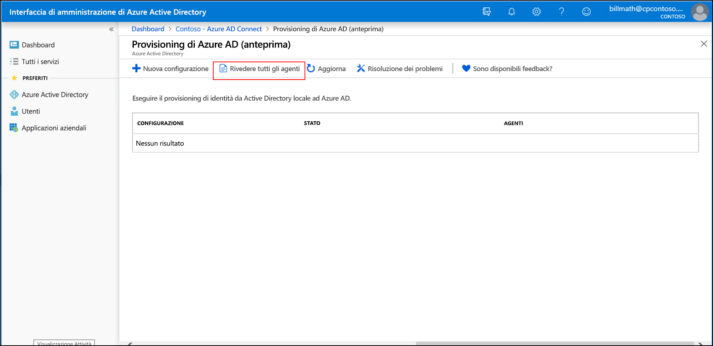 
 
4. Nella **schermata agenti di provisioning locali** vengono visualizzati gli agenti installati.  Verificare che l'agente in questione sia presente ed è contrassegnato come **attivo**.
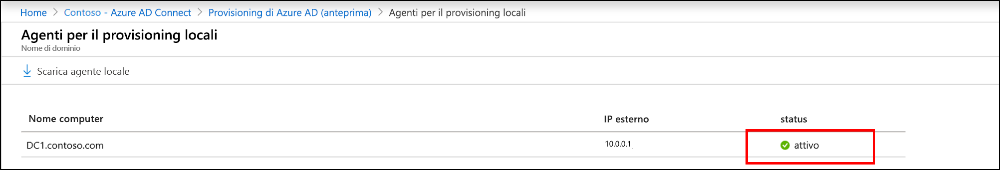 

### Sul server locale
Per verificare che l'agente sia in esecuzione, attenersi alla seguente procedura:

1.  Accedere al server con un account amministratore
2.  Aprire i **Servizi** passando a Start/Run/Services. msc.
3.  In **Servizi**verificare che **Microsoft Azure ad Connect agent Updater** e **Microsoft Azure ad Connect provisioning Agent** siano presenti e che lo stato sia **in esecuzione**.
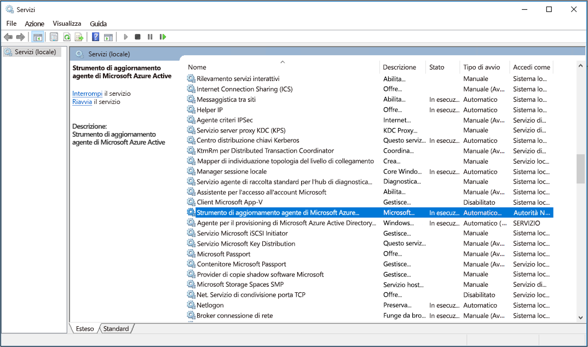

## Configurare Azure AD Connect il provisioning cloud
 Per configurare il provisioning, attenersi alla procedura seguente:

1.  Accedere al portale di Azure AD.
2.  Fare clic su **Azure Active Directory**
3.  Fare clic su **Azure ad Connect**
4.  Selezionare **gestione del provisioning (anteprima)** 

5.  Fare clic su **nuova configurazione**
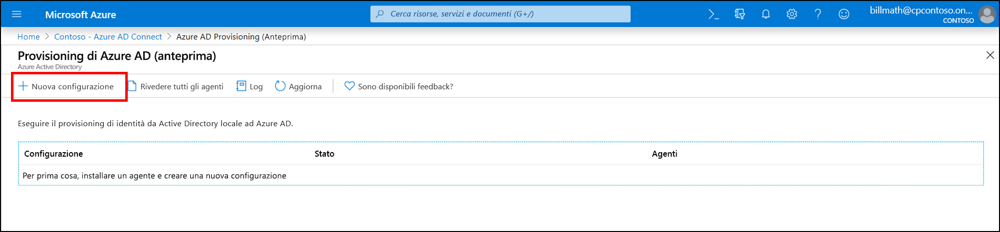
7.  Nella schermata di configurazione immettere un **messaggio di posta elettronica di notifica**, spostare il selettore in **Abilita** e fare clic su **Salva**.
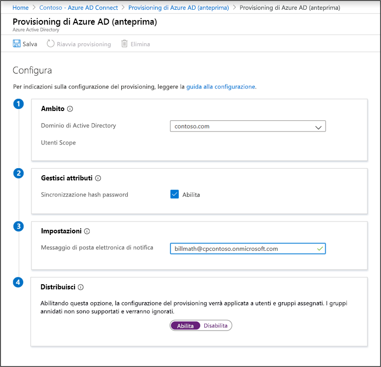
1.  Lo stato di configurazione ora è **integro**.
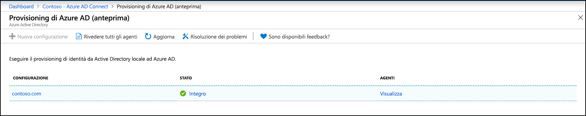

## Verificare che gli utenti siano stati creati e che la sincronizzazione sia in esecuzione
A questo punto, si verificherà che gli utenti presenti nella directory locale siano stati sincronizzati e che ora esistano nel tenant Azure AD.  Per essere completata, questa operazione può richiedere alcune ore.  Per verificare che gli utenti siano sincronizzati, eseguire le operazioni seguenti.

1. Selezionare il [portale di Azure](https://portal.azure.com) e accedere con un account che dispone di una sottoscrizione di Azure.
2. A sinistra selezionare **Azure Active Directory**
3. In **Gestisci** selezionare **Utenti**.
4. Verificare che i nuovi utenti siano visualizzati nel tenant 
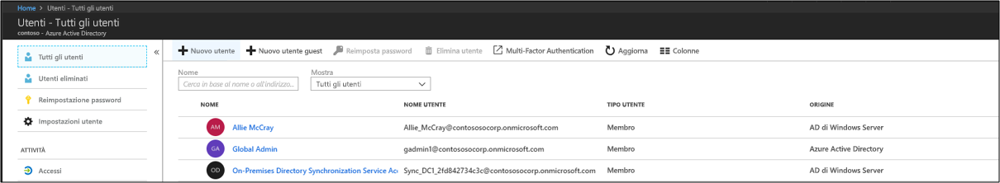 

## Testare l'accesso con uno degli utenti

1. Passare a [https://myapps.microsoft.com](https://myapps.microsoft.com)
2. Accedere con uno degli account utente creati nel nuovo tenant.  Per accedere, sarà necessario usare il formato seguente: (user@domain.onmicrosoft.com). Usare la stessa password che l'utente usa per accedere in locale. 
   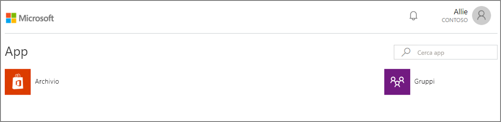 

La configurazione di un ambiente ibrido di gestione delle identità è stata completata. A questo punto è possibile usare questo ambiente a scopo di test o per acquisire familiarità con le funzionalità di Azure.

## Passaggi successivi 

- [Che cos'è il provisioning?](what-is-provisioning.md)
- [Che cos'è Azure AD Connect provisioning cloud?](what-is-cloud-provisioning.md)
